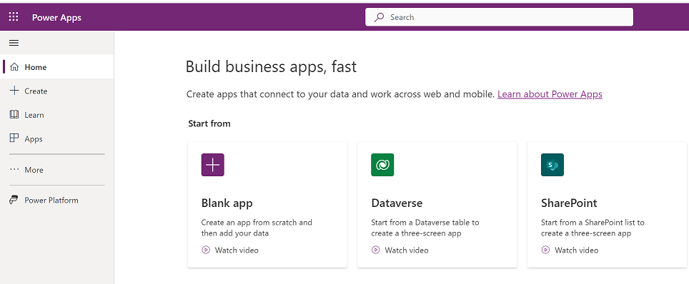

# How to navigate in Power Apps (preview)

Find what you need in the [Power Apps home page](https://make.powerapps.com) with the new navigation experience. By default, the left navigation pane includes Home, Create, Learn, Apps, More, and Power Platform menau items. 

> [!div class="mx-imgBorder"] 
>  
