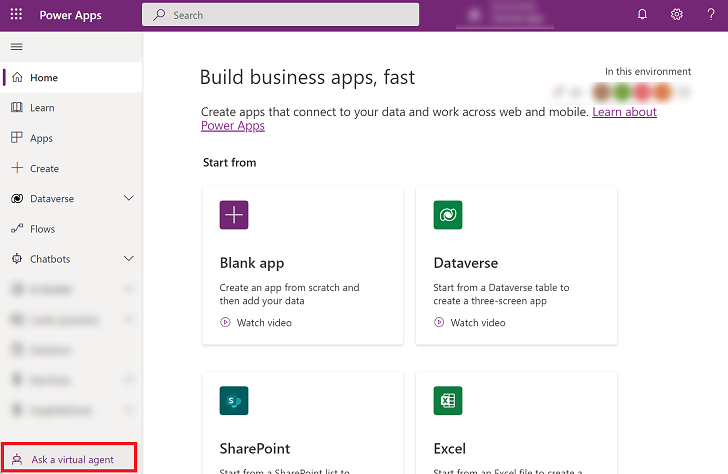
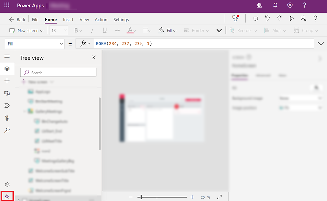
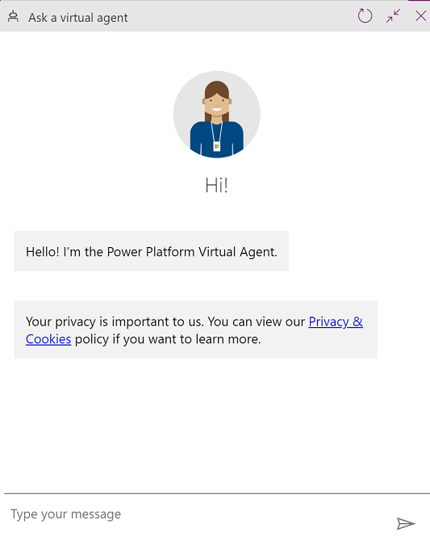
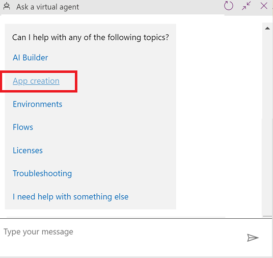
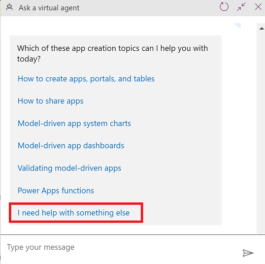
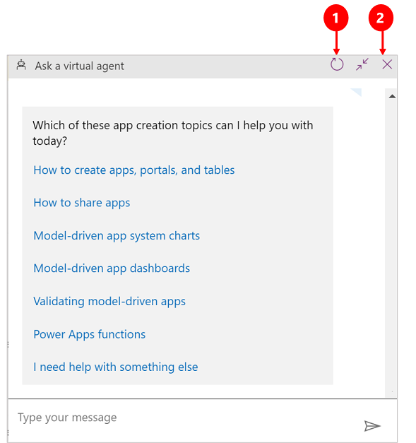

# Get help building your app from a virtual agent

> [!IMPORTANT]
> Effective March 11, 2025, the **Ask a virtual agent** feature in Power Apps is deprecated and no longer supported. We recommend using [Copilot in Power Apps](../canvas-apps/ai-overview.md) for assistance when creating an app. For general help in Power Apps, select **Help** (question mark icon in the upper right) > **Support** > **Problem**. For more information, see [Deprecation of Ask a virtual agent](/power-platform/important-changes-coming#deprecation-of-ask-a-virtual-agent).

Get contextual help while building your app using the Power Platform virtual agent. The virtual agent is available to answer questions about common scenarios when you're building an app. The virtual agent helps you by providing access to help content from documentation, the community, and blogs.

You can connect to a virtual agent from the following areas:

- [Power Apps](https://make.preview.powerapps.com/) home page

- [Model-driven app designer](../model-driven-apps/app-designer-overview.md)

- [Power Apps Studio](../canvas-apps/power-apps-studio.md)

When you expand the left navigation menu, the **Ask a virtual agent** button looks like this: 

When you hide the left navigation menu, the **Ask a virtual agent** button looks like this: 

## Access the virtual agent

To access the virtual agent on the [Power Apps](https://make.preview.powerapps.com/) home page, select **Ask a virtual agent**.

> [!div class="mx-imgBorder"]
> 

From the [model-driven app designer](../model-driven-apps/app-designer-overview.md), select **Ask a virtual agent**.

> [!div class="mx-imgBorder"]
> 

In [Power Apps Studio](../canvas-apps/power-apps-studio.md), select **Ask a virtual agent**.

> [!div class="mx-imgBorder"]
> 

## Get help using the virtual agent

1. From Power Apps, select **Ask a virtual agent** to open the virtual assistant.

   > [!div class="mx-imgBorder"]
   >

2. Select **App creation** to get help with Power Apps.

   > [!div class="mx-imgBorder"]
   > 

   > [!NOTE] 
   > You can also ask questions about other parts of the Power Platform by selecting a different topic.

3. Select the area that you need help in or select **I need help with something else** to ask the bot a question.

   > [!div class="mx-imgBorder"]
   > 

If you still need help, select **No** when you see **Did this solve your problem?** The virtual agent will search for answers in the community and blogs to enhance your search.

## Restart or close a session

Your conversation with the virtual agent is open until you restart the conversation or until you end the session.

1. To start a new session, select **Restart virtual agent**.

2. To end a session, select **Close virtual agent**.

   > [!div class="mx-imgBorder"]
   > 
