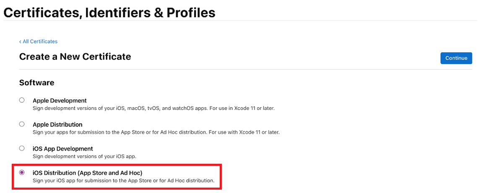

# Code sign for iOS

In this article, you'll learn about how to code sign for iOS. You need to sign your app for iOS if you selected iOS as one of the [platforms](overview.md#app-platforms) while creating and building your [wrap project](wrap-how-to.md#create-native-mobile-apps-for-ios-and-android-using-the-wizard).

 > [!Important]
 > Using Xcode to digitally sign your wrapped mobile apps for iOS is not supported. Follow the instructions below to sign your wrapped mobile app packages for iOS correctly.

## Prerequisites

You need the following information to get started:

- App ID
- Device UDIDs (only for testing and development purpose)

You also need a macOS device to code sign for iOS.

## Prepare your Mac

Set up your Mac with the following configuration.

1. Install **Xcode**. More information: [Xcode](https://developer.apple.com/support/xcode/)
1. Install PowerShell for macOS. More information: [Installing PowerShell on macOS](/powershell/scripting/install/installing-powershell-on-macos)
1. Enroll in [Apple Developer Program](https://developer.apple.com/programs/)
1. To distribute your apps within the organization, you need to sign up for [Apple Enterprise Developer Program](https://developer.apple.com/programs/enterprise/).

## Create App ID

1. Sign in to your developer account by going to <https://developer.apple.com> and selecting the **Account** tab.

    :::image type="content" source="media/code-sign-ios/account-tab.png" alt-text="Account tab.":::

1. Go to [**Certificates, IDs & Profiles &gt; Identifiers**](https://developer.apple.com/account/resources/identifiers/list).

1. Select **+** to create a new identifier.

    :::image type="content" source="media/code-sign-ios/identifier.png" alt-text="Create new identifier.":::

1. Select **App IDs**, and then select **Continue**.

    :::image type="content" source="media/code-sign-ios/register-identifier.png" alt-text="Register a new identifier.":::

1. Select the type as **App**, and then select **Continue**.

1. Register an **App ID**:

    :::image type="content" source="media/code-sign-ios/register-appid.png" alt-text="Register an App ID.":::

    1. **Description** - Name of your app.
    1. **Bundle ID** - select **Explicit Bundle ID**.
    1. Enter the bundle ID that you used while [creating the wrap project](wrap-how-to.md#step-2-target-platform). More information: [Bundle ID](overview.md#bundle-id)
    1. Enable the following capabilities:
        - Associated Domains
        - iCloud
        - NFC Tag Reading
        - Push Notifications
    1. Select **Continue**.

1. Review, and register the App ID.

## Create a distribution certificate

To create a distribution certificate, create a new certificate signing request first.

### Create Certificate Signing Request (CSR)

1. On your Mac, go to the **Applications** folder > **Utilities** > open **Keychain Access**.

1. Select **Keychain Access** > **Certificate Assistant** > **Request a Certificate from a Certificate Authority**.

    :::image type="content" source="media/code-sign-ios/cert-req.png" alt-text="Request a certificate from a CA.":::

1. Fill out the **Certificate Information** as explained below, and then select **Continue**.
    1. In the **User Email Address** field, enter your Apple ID email address to identify with this certificate.
    1. In the **Common Name** field, enter your name.
    1. In the **Request** group, select **Saved to disk**.
    1. Save the file to your Mac.

## Create the distribution certificate

1. Sign in to your developer account at <https://developer.apple.com> by selecting the **Account** tab.

1. Go to [Certificates, IDs & Profiles &gt; Certificates](https://developer.apple.com/account/resources/certificates/list).

    1. Select **+** to create a new certificate.
    1. Select **App Store and Ad Hoc** > **Continue**.

        

        > [!NOTE]
        > If you have an Enterprise Developer Account then you'll have the option to create an Enterprise Distribution certificate.

1. Upload the Certificate Signing Request (CSR) file that was generated in the previous steps.

    :::image type="content" source="media/code-sign-ios/upload-cert.png" alt-text="Upload the certificate.":::

1. Select **Continue**, and download the certificate to your Mac.

1. Double-click the downloaded .cer file to install to Keychain Access.

1. Take a note of the **Name** of the certificate (usually like **iPhone Distribution: Name (Team ID)**). This value is the code signing identity that needs to be provided for signing.

## Add all the devices where the iPA needs to be installed

 > [!NOTE]
 > This step is only necessary if you distributing to app to external users. It's not required if the app is only for internal users. 

1. Sign in to your developer account at <https://developer.apple.com> by selecting the **Account** tab.

1. Go to [Certificates, IDs & Profiles &gt; Devices](https://developer.apple.com/account/resources/devices/list).

1. Select **+** to register one or more devices.

1. Enter the **Device Name** and **Device ID (UDID)**.

    :::image type="content" source="media/code-sign-ios/register-device.png" alt-text="Register a device.":::

1. Select **Save**.

    > [!TIP]
    > You can also register multiple devices together by uploading a list of UDID's.

## Create an iOS Provisioning Profile

1. Sign in to your developer account by going to <https://developer.apple.com> and selecting the **Account** tab.

1. Go to [**Certificates, IDs & Profiles &gt; Profiles**](https://developer.apple.com/account/resources/profiles/list).

1. Select **+** to create a new profile.

1. Select **Ad Hoc** > **Continue**.

    :::image type="content" source="media/code-sign-ios/ad-hoc.png" alt-text="Ad Hoc.":::

    > [!NOTE]
    > For production testing and development purpose, use **App Store** distribution method.

1. Select App ID that you created earlier, and then select **Continue**.

    :::image type="content" source="media/code-sign-ios/app-id.png" alt-text="App ID.":::

1. Select the certificate that you created earlier, and then select **Continue**.

    :::image type="content" source="media/code-sign-ios/select-cert.png" alt-text="Select certificate.":::

1. Select all the test devices where you want to install your app, and then select **Continue**.

    :::image type="content" source="media/code-sign-ios/add-devices.png" alt-text="Add devices.":::

1. Review and name the provisioning profile. Note down the name of the provisioning profile.

1. Generate and download the profile to your Mac.

1. Double-click to open the downloaded file (\*.mobileprovision) to register it with Xcode.

## Sign the iOS Archive

1. Download and unzip the **iOS-Archive.zip** file from App Center. This creates a folder named after the [Bundle ID](wrap-how-to.md#step-2-target-platform). In the example below, the Bundle ID is **com.single.wrap**.

1. If signing with enterprise certificate, open the **Distribution-exportOptions.plist** file. Open the folder with Xcode and change the value for the **method** field inside the file to **enterprise**.

  > [!NOTE]
  > Enterprise signing is not supported with Keyvault signing.

1. Open terminal, and change directory to the unzipped folder.

1. Enter `pwsh` to start PowerShell in the terminal.

1. Run `./SignAndGenerateIPA.ps1` with the values for the "CodeSigningIdentity" and "ProvisioningProfilePath" parameters.

   > [!NOTE]
   >  'CodeSigningIdentity' is the name of the certificate that was created at the Apple developer website. To look up the vaule for 'CodeSigningIdentity', right-click on the **.mobileprovision** file (this is the provisioning profile), then select **More Info**. Scroll down and select **Preview**. Your 'CodeSigningIdentity' value is stored in the **Name** field under **Certificates** in the **.mobileprovision** file.

 > [!TIP]
> 'ProvisioningProfilePath' is the path to the provisioning profile file that you have downloaded from the Apple developer website in the previous step [**Create an iOS Provisioning Profile**](code-sign-ios.md#create-an-ios-provisioning-profile). For example, it could be located at /Users/username/Downloads/MyProvisioningProfile.mobileprovision on your computer.

   :::image type="content" source="media/code-sign-ios/powershell.png" alt-text="Run PowerShell script.":::

1. After the script finishes, you'll see an .ipa  file created. In this example, **com.single.wrap.ipa**.

    :::image type="content" source="media/code-sign-ios/folder-structure.png" alt-text="IPA package.":::

1. Install the .ipa file in the registered devices using the **Finder** app. You can also host it on a distribution service such as [App Center](wrap-how-to.md#test-and-distribute-mobile-app-package). To distribute using Microsoft Intune, see [Add an iOS/iPadOS line-of-business app to Microsoft Intune](/mem/intune/apps/lob-apps-ios). To learn about giving an app access to the Intune app protection service, see [Give your app access to the Intune app protection service](/mem/intune/developer/app-sdk-get-started#give-your-app-access-to-the-intune-app-protection-service-optional).

### See also

- [Wrap overview](overview.md)
- [Code sign on Android](code-sign-android.md)
