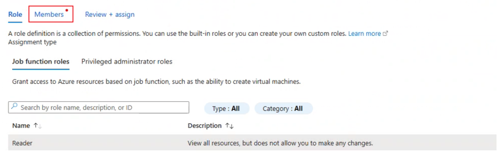
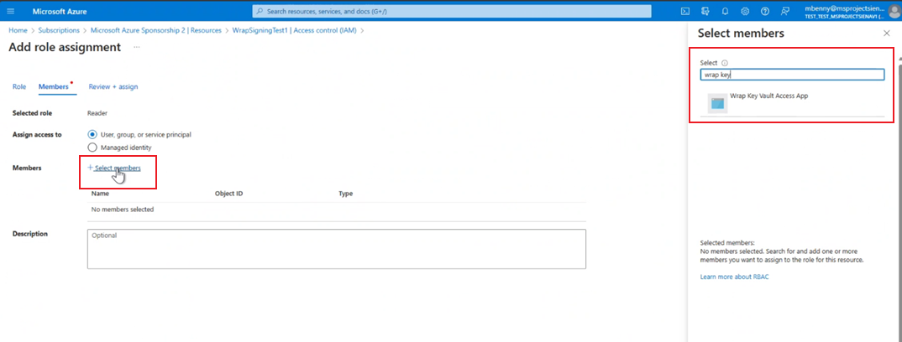
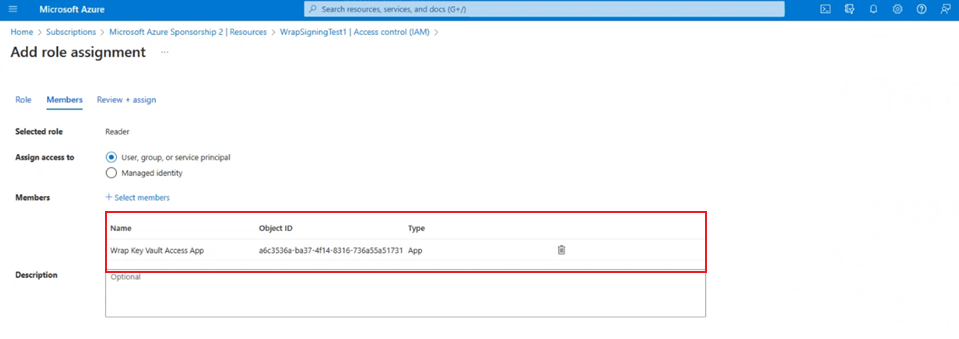

# Create Azure key vault for wrap in Power Apps

In order to automatically, sign your Android or iOS mobile app package during  [Step 2](wrap-how-to.md#step-2-target-platform) of the wrap wizard, it's necessary to have Azure Key Vault configured. Azure Key Vault is a cloud-based service designed to provide a secure storage solution for secrets, which can include certificates, passwords, keys, and other sensitive information. To learn more about Azure Key Vault, see [Introduction to Azure key vault](/azure/key-vault/general/overview).

In this article, you will learn how to use an existing Azure key vault or create a new [Azure portal](https://portal.azure.com).

## Prerequisites
  
- Azure Active Directory subscription to [create Key Vault](/azure/key-vault/general/quick-create-portal).
- Admin access for your tenant.
- You need to have a [Apple account](https://developer.apple.com) enrolled in Apple developer Program or Apple enterprise developer program.
- Create a [distribution certificate](code-sign-ios.md#create-the-distribution-certificate) or [ad-hoc Provisioning Profile](code-sign-ios.md#create-an-ios-provisioning-profile) or enterprise provisioning profile.

   
## Create Azure key vault and configure KeyVault URI

1. To create a new Azure service principal for the 1P AAD application **4e1f8dc5-5a42-45ce-a096-700fa485ba20 (WrapKeyVaultAccessApp)**, sign in to your tenant as an admin. Then, run the following script in PowerShell:

    `Connect-AzureAD -TenantId <your tenant ID>` 
   `New-AzureADServicePrincipal -AppId 4e1f8dc5-5a42-45ce-a096-700fa485ba20 -DisplayName "Wrap KeyVault Access App"`

2. Follow these steps to ensure that the Service Principal representing your app, such as Wrap KeyVault Access App, has the necessary access permissions, add a **Reader** role assignment to it in the **Access Control (IAM)** of your default subscription. This should also be present in the IAM of both the subscription and the Keyvault.

   1. On the left select **Access control (IAM)** tab and then select **Add** > **Add role assignment**.
  
   2. Select the **Members** tab and then select **Job function roles**. Make sure the  **Reader** role is selected.
   
       > [!div class="mx-imgBorder"] 
       > 

   4. On **Members** tab, select **Select member** and in the text box on the right enter **Wrap KeyVault Access App** and search for it.
   
       > [!div class="mx-imgBorder"] 
       > 

   5. Select **Wrap KeyVault Access App** and then select **Review + assign** to assign the **Reader** role.
      
       > [!div class="mx-imgBorder"] 
       > 

3. Create or access existing key vault. Make sure this key vault is located in the default subscription for your tenant. More information: [Create a key vault using the Azure portal](/azure/key-vault/general/quick-create-portal).
   
4. Add access policies for the key vault.
  
5. Choose one of the following options based on your device:
   
     - **Android**

       Generate the .pfx file and then proceed to upload it to the certificate section of the keyvault. More information: [Generate keys](code-sign-android.md#generate-keys) 
  
       :::image type="content" source="media/wrap-canvas-app/wrap-1.png" alt-text="Create a cert for Android.":::
  
        > [!NOTE]
        > Ensure that the certificate name is included in the tag step and that the password matches the one entered for the store pass parameter used in creating the .pfx file during step 2.
  
     - **iOS** 
       1. Select the .cer into Keychain Access app to install it. For more information, see [Create the distribution certificate](code-sign-ios.md#create-the-distribution-certificate).
       2. Right-click your certificate file to export the file as a .p12 file, select **Export**, and then select the file format .p12. 
       
         > [!NOTE]
         > When you upload to the keyvault, you'll need to provide the password that you set in previous step for the .p12 file.
        
       3. [Create the provisioning profile](code-sign-ios.md#create-an-ios-provisioning-profile) and run this command to encode it to base64:
          - Mac: base64 `-i example.mobileprovision`
          - Windows:  `certutil -encode data.txt tmp.b64`
     
       4. Upload the `base64` string obtained from the previous step to the Keyvault secret. Next, upload the .p12 file to Keyvault Certificate.
    
  
          :::image type="content" source="media/wrap-canvas-app/wrap-2.png" alt-text="Create a cert for iOS.":::

6. Once iOS or Android certificates are created and uploaded, add three tags with the name as the bundle ID, and the value corresponding to the name of the uploaded certificate(s).
  
     :::image type="content" source="media/wrap-canvas-app/wrap-3.png" alt-text="Add tags.":::
  
## Troubleshoot 

For Troubleshooting issues, see [Troubleshoot issues with the wrap feature in Power Apps](/troubleshoot/power-platform/power-apps/manage-apps-and-solutions/wrap-issues).

### See also

- [Wrap overview](overview.md)
- [Code sign for iOS](code-sign-ios.md)
- [Code sign for Android](code-sign-android.md)
- [Code sign for Google Play Store](https://developer.android.com/studio/publish/app-signing)
- [Frequently asked questions for wrap](faq.yml)
