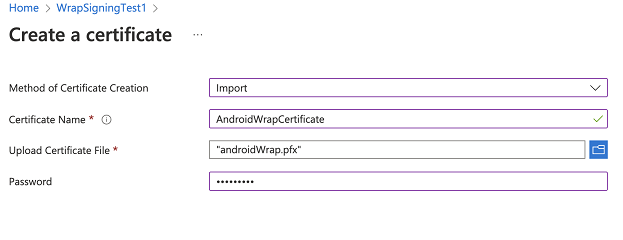
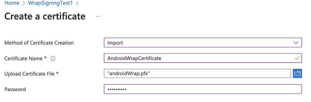
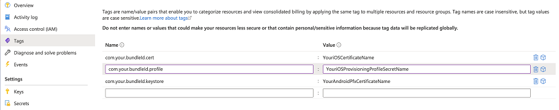

# Set up Azure Key Vault for Wrap Wizard code signing

Azure Key Vault is a cloud service that helps you securely store secrets such as certificates, passwords, encryption keys, and other sensitive data. You’ll use Key Vault to manage certificates and secrets for automated code signing in Wrap Wizard. For more background, see [Introduction to Azure Key Vault](/azure/key-vault/general/overview).

This guide helps new users create and configure an Azure Key Vault step by step.

## Prerequisites

Before you begin, make sure you have the following:

- A Microsoft Entra subscription to [create a key vault](/azure/key-vault/general/quick-create-portal).
- Admin access to your Azure tenant.
- An [Apple Developer account](https://developer.apple.com) enrolled in the Apple Developer Program or Apple Enterprise Developer Program.
- An [Apple distribution certificate](code-sign-ios.md#create-distribution-certificate) and either an [ad-hoc provisioning profile](code-sign-ios.md#create-ios-provisioning-profile) or enterprise provisioning profile.

## Step 1: Create an Azure Key Vault

If you do not already have a Key Vault, follow the steps in [Create a vault](/azure/key-vault/general/quick-create-portal#create-a-vault) using the Azure portal.

## Step 2: Create a Service Principal for Wrap Key Vault Access

A service principal is needed so Wrap Wizard can access your Key Vault.

1. Sign in to your tenant as an admin.
2. Open PowerShell and run:
   ```
   Connect-AzureAD -TenantId <your tenant ID>
   New-AzureADServicePrincipal -AppId 4e1f8dc5-5a42-45ce-a096-700fa485ba20 -DisplayName "Wrap KeyVault Access App"
   ```

## Step 3: Assign Reader Role to the Service Principal

Give the service principal permission to read your Key Vault.

1. In the Azure portal, navigate to your Key Vault.
2. Select **Access control (IAM)**.
3. Click **Add** > **Add role assignment**.
4. In the **Members** tab, select **Job function roles** and choose **Reader**.
5. Click **Select member**, search for "Wrap KeyVault Access App", and select it.
6. Click **Review + assign**.


Repeat these steps to add user access permissions for your own account as well.

## Step 4: Configure Access Policies for Key Vault

1. Go to your Key Vault settings.
2. In **Access configuration**, select **Vault access policies**.
3. Add a policy for the service principal and your user account.
    - For **Secret permissions** and **Certificate permissions**, select **Get** and **List**.


## Step 5: Upload Certificates and Secrets

You’ll need platform-specific certificates and secrets for Android and iOS apps.

### For Android

- Generate a `.pfx` certificate file.
- Upload it to the **Certificates** section of your Key Vault.
- For guidance, see [Generate keys](code-sign-android.md#generate-key-and-signature-hash).



> [!NOTE]
> Make sure the certificate name is included in the tag step and its password matches the store pass parameter you set when creating the `.pfx` file.

### For iOS

1. Install your `.cer` file using Keychain Access (see [Create the distribution certificate](code-sign-ios.md#create-distribution-certificate)).
2. Export the certificate as a `.p12` file, then rename its extension to `.pfx` (required by Key Vault).
3. Upload the `.pfx` file to your Key Vault and provide the password you set for the `.p12` file.
4. Create a provisioning profile (see [Create the provisioning profile](code-sign-ios.md#create-ios-provisioning-profile)).
5. Encode the provisioning profile to base64:
   - On Mac: `base64 -i example.mobileprovision`
   - On Windows: `certutil -encode data.txt tmp.b64`
6. Upload the base64 string as a secret in Key Vault, and the `.pfx` file as a certificate.



## Step 6: Add Certificate Tags

After uploading your iOS or Android certificates, add three tags:

- Tag name: Use your app’s bundle ID.
- Tag value: Use the name of the uploaded certificate.

Use the same bundle ID that you’ll use in the [Wrap Wizard](wrap-how-to.md#3-choose-target-platform).



## Reference Video

Watch a walkthrough video: [How to configure access to key vault](https://www.youtube.com/watch?v=QV5xAUoJDcA&t=7s)

## Troubleshooting

If you run into issues, see [Troubleshoot issues with the wrap feature in Power Apps](/troubleshoot/power-platform/power-apps/manage-apps-and-solutions/wrap-issues).

## See Also

- [Wrap overview](overview.md)
- [Code sign for iOS](code-sign-ios.md)
- [Code sign for Android](code-sign-android.md)
- [Code sign for Google Play Store](https://developer.android.com/studio/publish/app-signing)
- [Frequently asked questions for wrap](faq.yml)
- [Troubleshoot issues with the wrap feature in Power Apps](/troubleshoot/power-platform/power-apps/manage-apps/wrap-issues)
