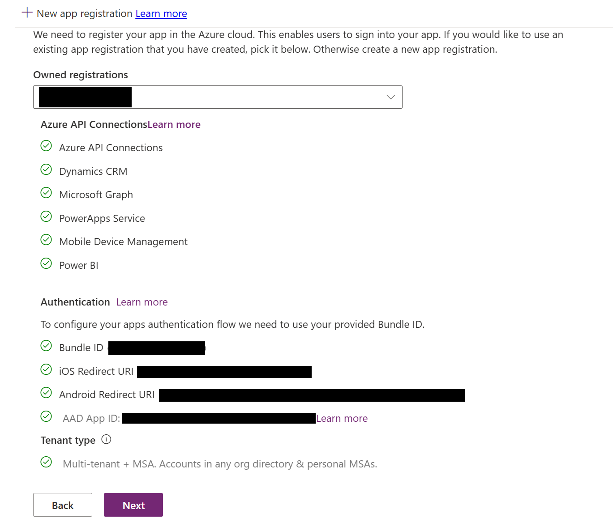
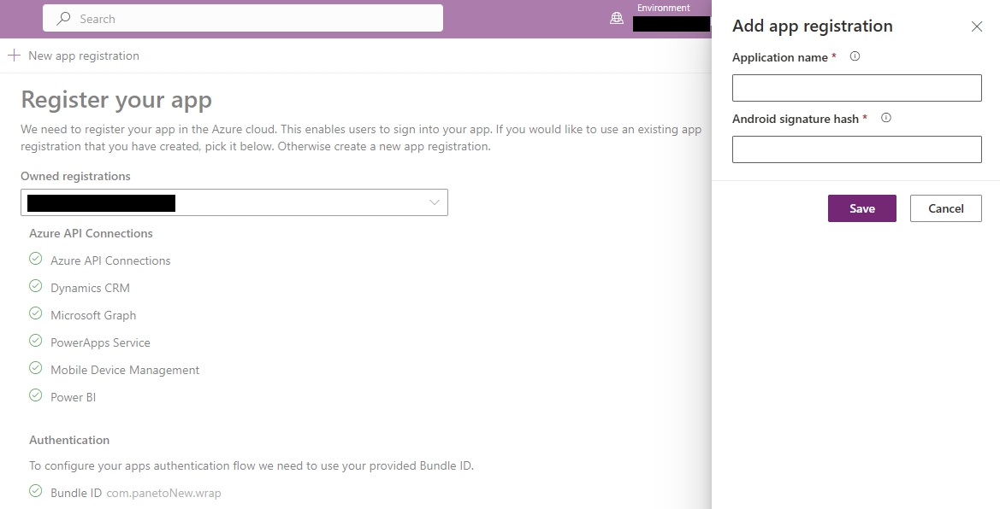
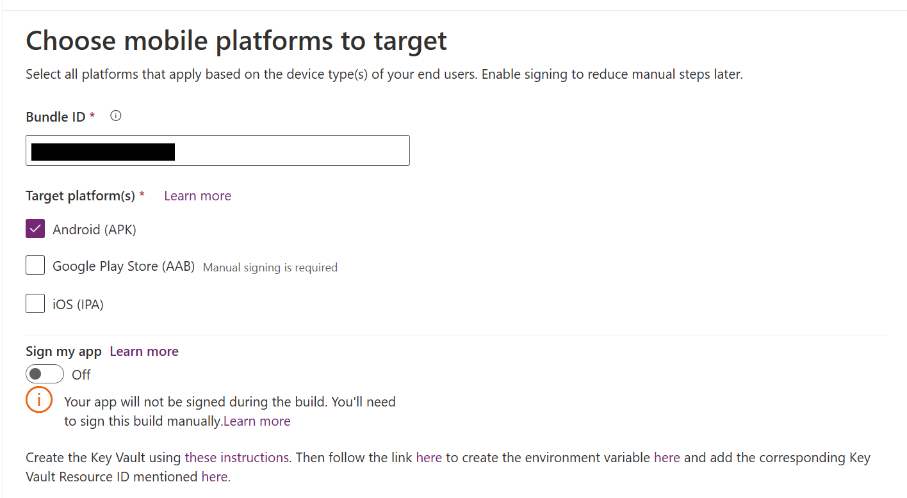

# Use the wrap wizard to build your mobile app

Use the wrap feature to package one or more canvas apps as a single native mobile app package using the step-by-step wizard.

The wrap feature in Power Apps lets you create native mobile versions of your [canvas apps](../../canvas-apps/getting-started.md) as custom-branded Android and iOS mobile apps. 
You can distribute such *wrapped* native mobile apps to the end users through [Microsoft app center](https://visualstudio.microsoft.com/app-center/), [Google Play](https://support.google.com/googleplay/work/answer/6138458) or [Apple Business Manager](https://developer.apple.com/custom-apps/) or other native distribution methods.

Wrap feature allows you to create mobile apps for iOS, Android or Google Play Store:

- iOS (IPA package)
- Android (APK package)
- For Google Play Store distribution (AAB package)

The wrap feature wraps your canvas apps in a native mobile app shell that you can digitally sign and distribute. When you update your app and republish it, the app is automatically updated.

## Create native mobile apps for iOS and Android using the wizard

1. Sign in to [Power Apps](https://make.powerapps.com).

2. Select **Wrap**, from the left navigation pane. [!INCLUDE [left-navigation-pane](../../../includes/left-navigation-pane.md)]

3. Select the app that you want to wrap, and then select **Wrap** on the command bar.

### Step 1: Select apps 

1. On the **Select the app(s) to wrap** screen, select your primary and secondary app.

   - **Primary app**: Select the app your end users see when the mobile app is launched.
   - **Secondary app(s)**: Optional other apps that you can bundle the same build for mobile app package along with the Primary app.

     > [!div class="mx-imgBorder"] 
     > 
  
     > [!NOTE]
     > - You can use the same Primary app in multiple wrap projects.
     > - In the wrap wizard, if the **Primary app** name appears incorrect, proceed to the next step and then return to see the correct name.

2.  Select **Next**.

### Step 2: Register app

On the **Register your app** screen, register your application manually in Azure to establish a trust relationship between your app and the Microsoft identity platform. More information: [Registering your app on Azure portal manually](wrap-how-to.md#register-your-app-on-azure-portal-manually-optional).

Your app must be registered in Microsoft Entra so that your app users can sign in. If you have already registered, find your registration in the owned registration field.

   > [!div class="mx-imgBorder"] 
   > 

If you don't see your registered app name in the **Owned registrations** dropdown, follow these steps.

- Select **New app registration** to create a new registration for your app automatically.
- You'll need to provide **Application name** and **Android signature hash**, as they're mandatory fields. **Application name** is required because it's the customer-facing name of the application. **Android signature hash** is necessary if you have selected Android as one of your platforms while creating and building your wrap project.

    > [!NOTE]
    > The format of the Android hash key is 28-digit alphanumeric hash number such as  –ga0RGNYHvNM5d0SLGQfpQWAPGJ8=.
    > If the signature hash key already exists, there's no need to create a new one. You can reuse the previously generated signature hash key when creating a new app registration.

   > [!div class="mx-imgBorder"]
   > 

#### Configure admin allowed third-party apps

The wrap wizard configures all the required API permissions for your app automatically. You can also configure the API permissions manually if your need to troubleshoot this step. More information: [Configure the API permissions for your app manually](wrap-how-to.md#configure-the-api-permissions-for-your-app-manually-optional).

When you register the app, Azure admin needs to provide access to continue. Follow these steps to grant access:
- Open Windows PowerShell and run it as an administrator.
- Execute the command- `Install-Module -Name Microsoft.PowerApps.Administration.PowerShell -AllowClobber -Force`.
- Set the execution policy with: `Set-ExecutionPolicy -ExecutionPolicy RemoteSigned`.
- Import the module using: `Import-Module -Name Microsoft.PowerApps.Administration.PowerShell`.
- Run `Add-AdminAllowedThirdPartyApps` and provide the App ID for which admin access is needed.
- Run `Get-AdminAllowedThirdPartyApps` to verify if your app name appears in the list.

Once you complete the preceding steps the registration screen look like the following screenshot.

 :::image type="content" source="media/how-to-v2/register-screen.png" alt-text="Screenshot that shows registration screen with green ticks for steps completed" lightbox="media/how-to-v2/register-screen.png":::

#### API permissions

When you register the app, Azure admin also needs to grant access to API permissions for the app. Refer to the following screenshot for instructions on granting access and the reasons why API permissions are required.

 :::image type="content" source="media/how-to-v2/api-permissions-2.png" alt-text="Screenshot that shows the API permissions for the app." lightbox="media/how-to-v2/api-permissions-2.png":::

> [!NOTE]
> In this step, sometimes for the new customers, only the **Application name** field is visible. The field to add the **Android signature hash** isn't displayed. To resolve this, continue to the next steps and select the **Target platform(s)** as **Android** in the **Target Platforms Step**.

### Step 3: Configure branding

1. On the **Configure Branding Step**, set the following look and feel options for your app:

     > [!NOTE]
     > All the images must be in .png format. A default image will be used if no custom images are selected.
   
   - **App icons**: Upload icons to use for your app. Recommended size for iOS: 1024 px by 1024 px .png image or larger. Recommended image size for Android: 432 px by 432 px .png image or larger. 
   - **Splash screen image**: Image that's used on the splash screen of your mobile app, while it loads. Default image used when not provided.
   - **Welcome screen image**: Image that's used on the welcome (sign in) screen of your mobile app, while it loads. Default image used when not provided.
   - **Background fill color**: Hexadecimal color code used for the background of the welcome screen.
   - **Button fill color**: Hexadecimal color code used to fill the button color.
   - **Status bar text theme**: Color for the status bar text at the top of the app.
   
3.  Select **Next**.

### Step 4: Target platform 

1.  On the **Choose mobile platform to target** screen, enter a **Bundle ID** of our choice. 

    > [!NOTE]
    > The **Bundle ID** is a unique identifier that you create for your app. A bundle ID must contain one period (.) and no spaces. 

2. Under **Target platforms(s)**, select all the mobile platforms that your end users use on their mobile devices.

3. Set the **Sign my app** toggle to **ON** to automatically code sign your mobile app, then select the **Azure Key Vault URI** from the list and select **Next**. 
If you don't have any entries in **Azure Key Vault URI** list, you need to create **Azure Key Vault** first. More information: [Create Azure Key Vault for wrap for Power Apps](create-key-vault-for-code-signing.md).

     > [!div class="mx-imgBorder"] 
     > 

You can also code sign your mobile app package manually instead of using automatic code signing available in wrap wizard. For more information on how to code sign your app manually, see:
  
   - [Manual code sign for iOS](code-sign-ios.md)
   - [Manual code sign for Android](code-sign-android.md) 
   - [Code sign for Google Play Store](https://developer.android.com/studio/publish/app-signing)

> [!NOTE]
> The Wrap wizard provides an automatic sign-in process. However, developers familiar with mobile processes can manually sign in for their Android or iOS applications using different mechanisms for each platform. If you sign in through the manual process, you don't need to create an Azure key vault.

4.  Select **Next**.

### Step 5: Azure blob storage

1. Create an Azure key vault if you haven't already. More infomation: [Create Azure Key Vault for wrap using default subscription](create-key-vault-for-code-signing.md)
1. Create an Azure blob storage account and container name. More infomation: [Create an Azure storage account](/azure/storage/common/storage-account-create?tabs=azure-portal)
1. Add the Azure key vault URI by clicking on the drop-down list.
1. Add the Azure blob storage account name and the container name created during Azure blob storage account creation step.
1. Download the built APK/IPA from the Azure blob storage location created above after the build steps are completed.

### Step 6: Manage output

On the **Manage output** screen, create or select an existing **app center location** to send your mobile app once the build is complete. To automatically create a new location in wrap wizard, select **New location** on top of the screen, and then select **Android** or **iOS**.

> [!div class="mx-imgBorder"] 
> 

- **Android**: Choose an existing location or create a new location.

- **iOS**: Choose an existing location or create a new location.

You can also choose to create your **app center location** manually at [App Center](https://appcenter.ms/). More information: [Create an app center location for your mobile app manually](wrap-how-to.md#create-an-app-center-location-for-your-mobile-app-manually-optional).

### Step 7: Wrap up

On the **Wrap up** screen, review the app details and then select **Build**.
After a successful build, you'll see your mobile app in the **azure blob storage location** that you have selected in the previous step.

## Test and distribute mobile app package

Test and distribute your application. If you face any issue while testing, [check troubleshoot page.](/troubleshoot/power-platform/power-apps/manage-apps/wrap-issues)


  
## Register your app on Azure portal manually (optional)
You can automatically create your app registration in the wrap wizard as mentioned in [step 4](wrap-how-to.md#step-2-register-app). Or, you can manually create a new registration for your app on Azure portal. More information: [Quickstart: Register an application with the Microsoft identity platform](/azure/active-directory/develop/quickstart-register-app).

> [!NOTE]
> Both single tenant and multitenant customers can use wrap to create native mobile apps based on their Power Apps canvas apps.

Whether you're a single or multitenant maker, you must select any of the options containing **Any Microsoft Entra directory - Multitenant** when choosing the supported account type for your app to enable it for wrap. Choose one of the following account types:
 - Accounts in any organizational directory (Any Microsoft Entra directory - Multitenant)
 - Accounts in any organizational directory (Any Microsoft Entra directory - Multitenant) and personal Microsoft accounts such as Skype or Xbox.

:::image type="content" source="media/wrap-intro/AppResgistration_AccountTypes.png" alt-text="App registration - supported account types for wrap.":::


> [!IMPORTANT]
> - Wrap only supports **Multitenant** account types currently. **Single tenant** account type isn't yet supported. More information on the account types: [Account types in Microsoft identity platform](/azure/active-directory/develop/v2-supported-account-types).
> - You must create a separate **Redirect URI** for each platform (iOS, Android) that you want to target.

## Configure the API permissions for your app manually (optional)

When you complete [step 4](wrap-how-to.md#step-2-register-app) the wrap wizard will automatically configure all the required API permissions for your app. 

If you get errors in wrap wizard, you can manually configure API permissions. More information: [Add and configure](/azure/active-directory/develop/v2-permissions-and-consent#request-the-permissions-in-the-app-registration-portal)

The following API permissions are required when manually configure API permissions:

- **Microsoft APIs**
    - *Dynamics CRM*
- **APIs my organization uses**
    - *Azure API Connections*
    - *PowerApps Service*
    - *Power BI* (only required if your canvas app(s) use Power BI data)
    - *Microsoft Mobile Application Management* (only required if you want to use [Microsoft Intune](/mem/intune/fundamentals/what-is-intune) for mobile app distribution)

> [!NOTE]
> If you don't find the permissions under **APIs my organization uses**, run the following PowerShell commands as appropriate, and try again:
> - Ensure the module [Microsoft Graph](https://www.powershellgallery.com/packages/Microsoft.Graph/) is available or install it using the following command:
>     ```powershell
>     Install-Module -Name Microsoft.Graph
>     ```
> - Missing *Azure API Connections* permission: 
>     ```powershell
>     Connect-MgGraph -TenantId <your tenant ID>
>     New-MgServicePrincipal -AppId fe053c5f-3692-4f14-aef2-ee34fc081cae -DisplayName "Azure API Connections"
>     ```
> - Missing *PowerApps Service* permission:
>     ```powershell
>     Connect-MgGraph -TenantId <your tenant ID>
>     New-MgServicePrincipal -AppId 475226c6-020e-4fb2-8a90-7a972cbfc1d4 -DisplayName "PowerApps Service"
>     ```

For detailed steps, refer to [Request the permissions in the app registration portal](/azure/active-directory/develop/v2-permissions-and-consent#request-the-permissions-in-the-app-registration-portal).
  
## Create an app center location for your mobile app manually (optional)

You have an option to automatically create a new **app center location** to store your mobile app as mentioned in [step 5](wrap-how-to.md#step-6-manage-output) in wrap wizard, but you can also manually create it directly in app center. More information: [App center location](overview.md#app-center-location)

> [!TIP]
> For more information about app center, go to [Visual Studio app center documentation](/appcenter/).

1. Go to [app center](https://appcenter.ms/).
1. Sign in with your work or school account.
1. If you don't have any existing organization, select **Add new** &gt; **Add new organization** to create a new organization.
1. Select the organization from the list on the left-pane.
1. Select **Apps** &gt; **Add app**.
1. Enter app name.
1. Select app release type.
1. Select **Custom** OS for iOS apps, or **Android** OS for Android apps.

    > [!NOTE]
    > You must create separate app center containers for each platform.

1. For **Android** OS, select **Platform** as **React Native**.

    > [!NOTE]
    > **Platform** must be **React Native** for all apps in app center.

    :::image type="content" source="media/wrap-canvas-app/app-center-app.png" alt-text="App center app configuration.":::

1. Select **Add new app**.

1. Copy the app's app center URL. You'll need it later, to configure the wrap project in Power Apps.

    For example, `https://appcenter.ms/orgs/Contoso-sales/apps/Sample-canvas-app-for-Android-OS/`

    :::image type="content" source="media/wrap-canvas-app/app-center-url.png" alt-text="App center URL.":::

 

## Sign your mobile app package manually (optional)
You can automatically sign your mobile app package during wrap process in **Step 2**, but you can also do so manually after the mobile app package is build. [Code signing](overview.md#code-signing) process is different for Android and iOS devices.

- [Manual code sign for iOS](code-sign-ios.md)
- [Manual code sign for Android](code-sign-android.md)
- [Code signing for Google Play Store](https://developer.android.com/studio/publish/app-signing)


## See also
- [Troubleshoot issues with the wrap feature in Power Apps](/troubleshoot/power-platform/power-apps/manage-apps-and-solutions/wrap-issues)
- [Wrap overview](overview.md)
- [Manual code sign for iOS](code-sign-ios.md)
- [Manual code sign for Android](code-sign-android.md)
- [Code sign for Google Play Store](https://developer.android.com/studio/publish/app-signing)
- [Create your Azure Key Vault for automated code signing](create-Key-Vault-for-code-signing.md)
- [Frequently asked questions for wrap](faq.yml)  
- [Troubleshoot issues with the wrap feature in Power Apps](/troubleshoot/power-platform/power-apps/manage-apps/wrap-issues)  

