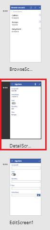
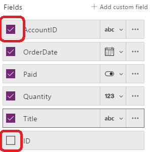

# Customize forms in PowerApps
Customize a **Display form** control and an **Edit form** control so that they show the data that matters most, in the most intuitive order, and in the controls that help users easily understand and update the data.

Each form comprises one or more cards, each of which shows data from a particular column in the data source. By following the steps in this topic, you can specify which cards appear in a form, move cards up and down within a form, and configure how data from each column appears within a card.

If you're unfamiliar with PowerApps, see [Introduction to PowerApps](getting-started.md).

## Prerequisites
You can review this tutorial for general concepts only, or you can follow it exactly if you complete these steps.

1. [Create a connection](../connect-to-sharepoint.md) from PowerApps to SharePoint.

2. Create the SharePoint list that [Customize a layout](customize-layout-sharepoint.md) describes.

3. [Generate an app automatically](app-from-sharepoint.md) based on that list.

4. In the left navigation bar, click or tap an icon in the upper-right corner to switch to the thumbnail view.

    

## Show and hide cards
1. In the left navigation bar, click or tap the middle thumbnail to select **DetailsScreen1**.

    

2. Click or tap any card to select it and show the form-customization options in the right-hand pane.

    

3. In the right-hand pane, click or tap the checkbox for the **AccountID** card to hide it, and click or tap the checkbox for the **ID** column to show it.

    

## Reorder the cards
* Click or tap the **Title** card to select it, and then drag its title bar up until the **OrderDate** card is highlighted.

    

    The card that you're moving will appear just above the card that's highlighted when you release the mouse button.

    

## Run the app
1. In the left navigation bar, click or tap the top thumbnail to select **BrowseScreen1**.

    

2. Open Preview mode by pressing F5 (or by selecting the **Preview** icon near the upper-right corner).  

    

3. In the upper-right corner, click or tap the plus icon to add a record in **EditScreen1**.

    

4. Add whatever data you want, and then click or tap the checkmark icon in the upper-right corner to save your new record in the SharePoint list and return to **BrowseScreen1**.

    

5. Click or tap the arrow for the item that you just created to show details about that item in **DetailScreen1**.  

    

6. In the upper-right corner, click or tap the edit icon to update the record in **EditScreen1**.

    

7. Change the information in one or more fields, and then click or tap the check mark in the upper-right corner to save your changes in the SharePoint list and return to **DetailScreen1**.  

    

8. Near the upper-right corner, click or tap the trash-can icon to delete the record that you just updated and to return to **BrowseScreen1**.

    

9. Close Preview mode by pressing Esc (or by clicking or tapping the close icon near the upper-left corner, *under* the title bar for PowerApps).

    

## Next steps
* Press Ctrl-S to save your app so that you can run it from other devices.
* [Share the app](share-app.md) so that other people can run it.
