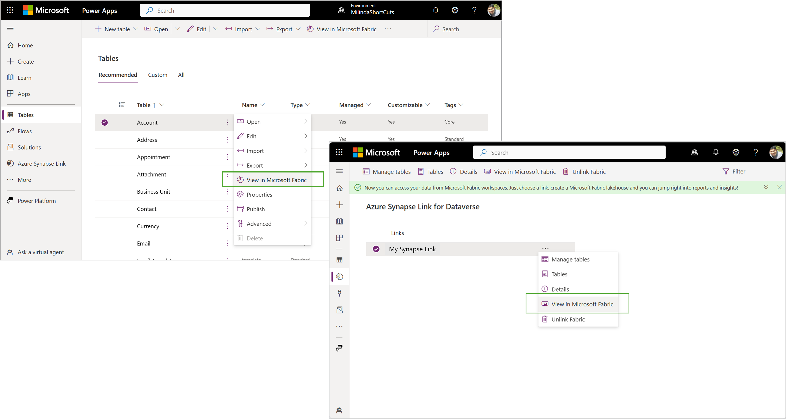
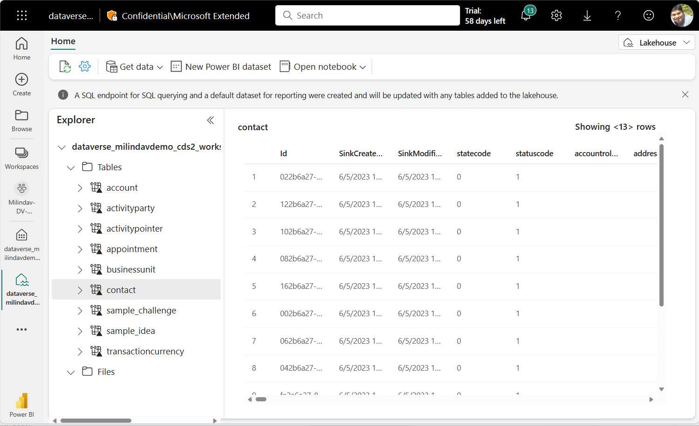
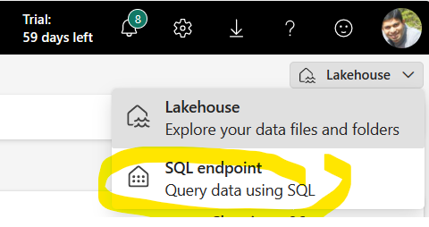
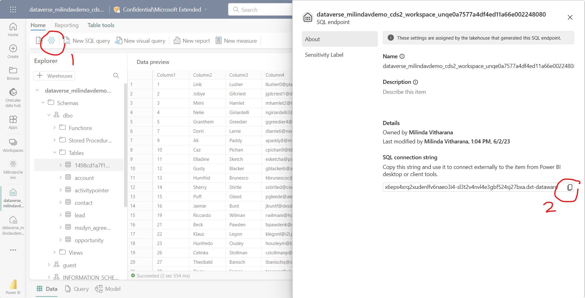
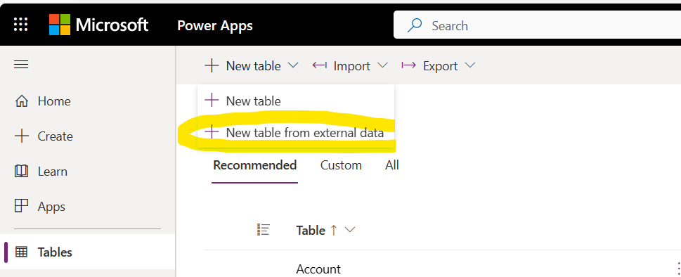

# View in Microsoft Fabric

Dataverse direct integration with Microsoft Fabric enables organizations to extend their Dynamics 365 enterprise applications and business processes into Fabric. **View in Microsoft Fabric** feature built into PowerApps maker portal makes all your Dynamics 365 data available for analysis in Microsoft Fabric.

-   No need to copy data, build ETL pipelines, or use third-party integration tools.
-   You can use Dataverse provisioned storage, ie. the data lake build into Dataverse, no need to bring your own storage or Synapse compute
-   You can integrate existing Synapse Links or new links created with your own Azure storage

With just one click, you’ll get more insights from your business data stored in Dataverse. 

As data gets updated, changes are reflected in Microsoft Fabric automatically. Dataverse also generates an enterprise-ready Synapse Lakehouse and SQL endpoint for your Dynamics 365 data. This makes it easier for data engineers and DB admins to combine data from multiple sources and build custom analytics with Spark, Python, or SQL.

Microsoft Fabric’s lake-centric approach helps to eliminate data silos. Combine data from your applications and devices—web sites, mobile apps, sensors, and signals from your warehouse and factories—with data from your business processes in Dynamics 365—sales, cases, inventory, and orders—to predict potential delays or shortages that affect keeping your promises to customers.

Makers can build low-code apps and automations to orchestrate business processes and react to insights found in Microsoft Fabric using connectors to over 1,000 apps. Add those insights back to Dataverse as external or virtual tables through the SQL endpoint and makers can turn them into low-code apps with Power Apps, Power Pages, or Power Automate using skills they already have.

Dataverse integration with Microsoft Fabric is currently in private preview. To join the preview, visit [https://aka.ms/DataverseExtendsToFabric](https://aka.ms/DataverseExtendsToFabric  ).

# View in Microsoft Fabric in PowerApps maker portal

Low code makers can use PowerApps maker portal to work with their data and build new Apps and automations using PowerApps, Power Automate and other tools already available in the Power platform. 

Now, makers can choose one or more tables from Dataverse and launch Microsoft Fabric with the “View in Microsoft Fabric” option. First time, System creates a workspace in your Power BI subscription and creates shortcuts in Fabric to Dataverse tables. System also creates a Synapse Lake house and a default data warehouse, enabling makers to explore data with SQL or work with Spark and other Fabric tools.

Makers can continue to add more data and launch Microsoft Fabric from the maker portal. Default Synapse Lakehouse and the Data warehouse gets updated with new data as changes happen in Dataverse.

# Build Apps and automations with data from Microsoft Fabric and One Lake

Makers can build Apps and automations with enterprise-wide data available in One Lake – the data store behind Microsoft Fabric. They can define external tables using the SQL endpoint available for Microsoft Fabric data and work with the data as if they were native Dataverse tables.

# IT admins can direct link to Microsoft Fabric

Synapse Link feature in Dataverse is used by IT admins to integrate Dynamics and PowerApps data with Azure Synapse. Synapse Link helped with configuring and provisioning Azure resources in the past. IT admins had to work with Synapse query and integrate Power BI for reporting (or Azure data factory to integrate data).

Now Synapse Link enables IT admins to direct link to Microsoft Fabric and work with SQL and other workloads without provisioning Synapse and other services.

**NOTES:**

1.  If you would like to use Dataverse provisioned storage, you can use the “Managed Store” link already available and add tables.
2.  If you are using your own storage, you need to create a Synapse Link profile and enable Delta/ parquet conversion for this option to be available. This option is not available for Synapse Link profiles that use the CSV output format.
3.  Dataverse environment life cycle operations (ELO) such as environment move operations may impact reports built using this feature. See Known limitations section for more information.

# Configure your environment

1.  You can use an existing PowerApps environment or create a new developer environment using the link here: [Create a developer environment - Power Platform \| Microsoft Learn](https://learn.microsoft.com/en-us/power-platform/developer/create-developer-environment)
2.  Launch Power apps maker portal with the URL (notice additional parameters switches you need to include to enable the new experiences)

    **https://make.preview.Powerapps.com?athena.shortcuts=true&athena.mdl=true&athena.cds2=true**

3.  This feature is only available in Power BI premium workspaces. If you don’t have Power BI premium capacity, you can sign-up for a Free Fabric trial capacity by visiting here: [Fabric (preview) trial - Microsoft Fabric \| Microsoft Learn](https://learn.microsoft.com/en-us/fabric/get-started/fabric-trial)
4.  It is highly recommended that you create a new Power BI workspace to direct link to Dataverse. You can use this workspace to validate Synapse Link scenario.
5.  To confirm that you can create a premium workspace. Choose **workspace settings \> premium** and ensure that you have **Trial** or **Premium capacity** selected.

1.  Launch Power BI with Microsoft Fabric with the URL to work with Microsoft Fabric

    **https://app.powerbi.com?trident=1**

## Create a connection to your PowerApps environment

1.  This is a onetime operation for your Power BI tenant for your Power Apps environment – this pre-requisite is temporary and may go away in the future.
2.  Choose Power BI settings (**Gear icon** on top right of Power BI window) and select **Manage connections and gateways**

1.  In the Data (preview) window, choose **+ New** option to create a new connection.
2.  Choose **Cloud** and choose Connection type as **dataverse**
3.  Provide **Connection name** and the **Data source path**. You can obtain the connection name from the power platform Admin center. You must enter the **Environment URL** you get from admin center into both the fields. Remember to remove https:// and the trailing /

    

4.  Choose **OAth2** as the Authentical model
5.  Choose the Edit credentials link and confirm your credentials.
6.  Review the connection information and choose **Create**.

# View in Microsoft Fabric experience from PowerApps

As discussed in the overview section, you can view your data in Microsoft Fabric with several gestures.

## Choose tables and view in Microsoft Fabric

1.  Launch Power apps maker portal with the URL and the feature flags shown below

    **https://make.preview.Powerapps.com?athena.shortcuts=true&athena.mdl=true&athena.cds2=true**

2.  Choose **Tables** on the left navigation and choose **Account** table.
3.  Click on “**…”** and choose **view in Microsoft Fabric**. You can also choose view in Microsoft Fabric option in the top menu
4.  For the first time, you will see a dialog box confirming the name of the Power BI workspace. Select OK
5.  Synapse Lake house should launch in a separate browser window

    **NOTE**: The system may take \~15 mins to update data in managed lake including conversion to Delta-parquet format. If you have selected a larger table, the initial load time make take a little longer.

## Launch Microsoft Fabric from the Synapse Link UI

1.  Launch Power apps maker portal with the URL and the feature flags shown below

    **https://make.preview.Powerapps.com?athena.shortcuts=true&athena.mdl=true&athena.cds2=true**

2.  You will notice a default Synapse link profile called **Managed Store**. All tables chosen in the maker experience (ie. previous step) will be included in the Managed Store. You can choose **view in Microsoft Fabric** by selecting **Managed store.**

    **NOTE**: “Managed store” is a temporary name. The name may change in the future.

3.  If you launched maker portal and selected tables first, system should launch Power BI workspace in a new browser window, otherwise, system will ask you to choose a Power BI workspace. You can provide the workspace you created earlier.
4.  Choose a Power BI workspace and select OK
5.  Synapse Lakehouse will launch in a separate window

    **NOTE**: Depending on the size of data, the initial copy may take longer to complete. For subsequent updates, system may take \~15 mins to update data in managed lake including conversion to Delta-parquet format.

## Create a new Synapse Link or use an existing Synapse Link

1.  If you created a Synapse Link with a “bring your own” Data Lake, you can enable choose the link and select **view in Microsoft Fabric**

    **NOTES:**

    1.  You need to choose the “Enable Parquet/ Delta lake option” to enable view in Microsoft Fabric.
    2.  Existing Synapse profiles (even where you have chosen “enable Parquet/ Delta lake option”) may not be enabled for this feature. We are working to enable existing Synapse Link profiles.
2.  System will create a lake house and launch Microsoft Fabric

# Working with Dataverse data in Microsoft Fabric

You can view the Synapse Lakehouse, SQL endpoint and the default dataset generated by Dataverse in the Microsoft Fabric workspace you have chosen earlier.

When you choose view in Microsoft Fabric I PowerApps maker portal or in Synapse Link, Synapse lake house will be launched. You can navigate into other Fabric features yourself and work with Fabric and Power BI.

## Explore Synapse Lakehouse

You will notice the tables you have selected being added to the Synapse Lakehouse as shown below

**NOTE**: During preview, the system make take \~15minute or more to reflect the tables. You may see table names as **undefined** during that time.

## Explore data with SQL endpoint

You can launch SQL endpoint and query Dataverse data with SQL and generate views in Microsoft Fabric.

Select SQL endpoint from the top right context menu and the same data will be shown in a SQL friendly experience where you can create SQL queries and views.

## Auto create a Power BI report

You can choose the default dataset generated by Dataverse and choose Auto create a report. The system generates a PowerBI report with the data you have selected as shown below.

# Build Apps and automations with Fabric data in Maker portal

By now, you may have explored Dataverse data with the Synapse Lakehouse, SQL endpoint as well as Power BI. You can also bring your own data into the Synapse Lakehouse.

Using all the data, you can create tables and views in Microsoft fabric using SQL, Spark as well as Data flows. With the insights you have uncovered, you can build PowerApps and automations to take action.

You can define Dataverse external tables using Fabric data such that you can work with the insights in PowerApps maker portal.

1.  You can work with tables from One Lake in the maker portal. For this, choose SQL endpoint for the Synapse Lakehouse.
    1.  Select the gear icon on top left as shown in (1)
    2.  Copy the SQL connection string in the properties Windows as shown by (2)

 
2.  Launch PowerApps maker portal and select Tables. Choose **New table from external data**

1.  Select **SQL server** as the connection.
2.  Paste the SQL connection string you copied in step (1) above.

**NOTE**: You will also need to enter the name of the SQL database.

1.  You can choose tables from the SQL endpoint you want to activate.

# Known limitations.

1.  This feature is in preview. Preview features are not ready for production use and are provided to validate and to provide feedback to product team
2.  Depending on the size of data, initial sync may take 15min or more. In case of very large tables, initial sync may take much longer before you can consume data in Microsoft Fabric.
3.  After the initial sync, data changes in Dataverse will be reflected in Microsoft Fabric upto 15mins later.
