# View Dataverse data in Microsoft Fabric (preview)

[!INCLUDE [cc-beta-prerelease-disclaimer](../../includes/cc-beta-prerelease-disclaimer.md)]

Microsoft Dataverse direct integration with Microsoft Fabric enables organizations to extend their Dynamics 365 enterprise applications and business processes into Fabric. The **View in Microsoft Fabric** feature built into Power Apps makes all your Dynamics 365 data available for analysis in Fabric. <!-- Why limit this to D365? This could also include any Dataverse data independent of D365 apps right? -->

- No need to export data, build ETL pipelines, or use third-party integration tools.
- Link data from Dataverse directly into Fabric, no need to bring your own storage.
- Link existing Azure Synapse Link for Dataverse links or new links created with your own Azure storage.

> [!IMPORTANT]
> This is a preview feature.
>
> [!INCLUDE [cc-preview-features-definition](../../includes/cc-preview-features-definition.md)]

With just one click, you’ll get more insights from your business data stored in Dataverse. :::image type="content" source="media/fabric/azure-synapse-link-two-experiences.png" alt-text="Azure Synapse link with Dataverse data in Microsoft Fabric" lightbox="media/fabric/azure-synapse-link-two-experiences.png":::

As data gets updated, changes are reflected in Fabric automatically. Dataverse also generates an enterprise-ready Azure Synapse Analytics lakehouse and SQL endpoint for your Dynamics 365 data. This makes it easier for data engineers and database admins to combine data from multiple sources and build custom analytics with Spark, Python, or SQL.

Fabric’s lake-centric approach helps to eliminate data silos. Combine data from your applications and devices—web sites, mobile apps, sensors, and signals from your warehouse and factories—with data from your business processes in Dynamics 365—sales, cases, inventory, and orders—to predict potential delays or shortages that affect keeping your promises to customers.

Makers can build low-code apps and automations to orchestrate business processes and react to insights found in Fabric using connectors to over 1,000 apps. Add those insights back to Dataverse as virtual tables connected to the external source <!-- Since virtual tables always connect via an external source I've revised --> through the SQL endpoint. Makers can turn them into low-code apps with Power Apps, Power Pages, or Power Automate using the design tools already available.

## Open Fabric from Power Apps

Low code makers can use make.powerapps.com to work with their data and build new apps and automations using Power Apps, Power Automate and other tools already available in the Power platform. 

<!-- Removing this since it should be easily discoverable from the maker portal for users so no need to image it
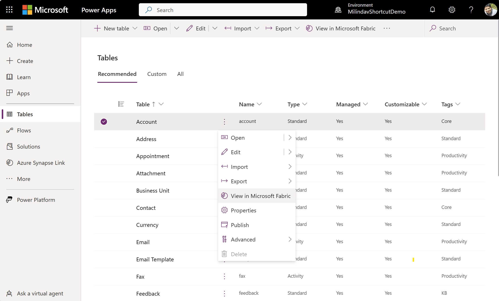 -->

Makers choose one or more tables from Dataverse and open Fabric by selecting **View in Microsoft Fabric**. When selecting for the first time, the system creates a workspace in your Power BI subscription and creates shortcuts in Fabric to Dataverse tables. An Azure Synapse Analytics lakehouse and a default data warehouse are also created, enabling makers to explore data with SQL, Spark, or other Fabric tools.

Makers can continue to add more data and open Fabric from the make.powerapps.com. The default Azure Synapse Analytics lakehouse and the data warehouse are updated with new data as changes occur in Dataverse.

## Add more data and manage your link

When makers choose to view in Fabric from Power Apps, optimized replicas of your data in Dataverse storage are created such that your operational workloads aren't impacted. This replica is governed and secured by Dataverse while enabling Fabric workloads to operate on this data.

IT admins manage this replica from the Synapse Link for Dataverse page shown as **Managed Store** or **Microsoft OneLake**. IT admins can view tables added by makers, add or remove tables, and migrate the link to other environments. Admins can also see storage consumption in the Power platform admin center.

> [!NOTE]
>
> - Currently, you can’t add Dynamics finance and operations tables into the managed store. <!-- Can we replace "the managed store" with Fabric? -->
> - Dataverse environment life cycle operations (ELO) such as environment move operations may impact reports built using this feature. More information: [Troubleshooting common issues](#troubleshooting-common-issues)

## Link existing Azure Synapse Link for Dataverse profiles to Fabric

Azure Synapse Link for Dataverse enables IT admins to simplify their data integrations by provisioning and configuring Azure resources such as Azure datalake storage and Azure Synapse. Now, you can enable Fabric links for your existing Azure Synapse Link for Dataverse links and benefit from the innovations in Fabric without any additional efforts or copying data. Fabric integration further simplifies data integration efforts with features like Power BI Direct Lake mode reports as well as query engine improvements in next generation Azure Synapse data warehouse.

<!-- Removing this since it should be easily discoverable from the maker portal for users so no need to image it
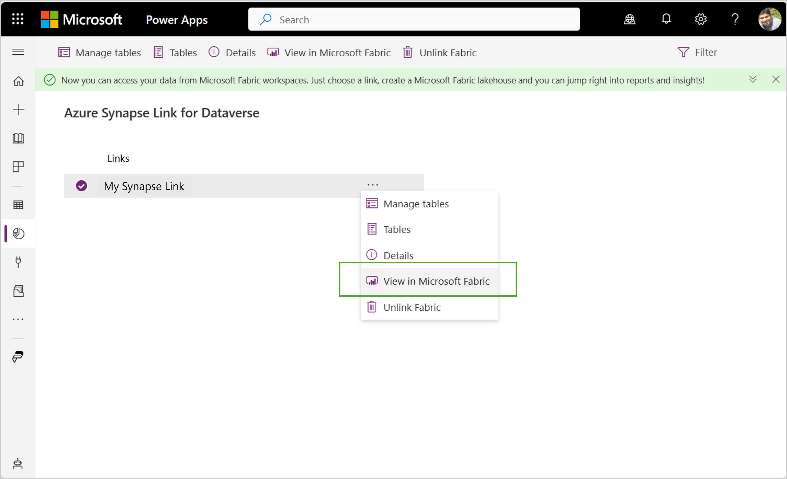 -->

You can add or removing tables from existing Azure Synapse Link for Dataverse links and/or create new Fabric links within a single experience. You can also use Azure Synapse Link for Dataverse to choose tables and entities from Dynamics 365 Finance and Operations (F&O). <!-- Is there a link to more information for this??? --> See <…>>

> [!NOTE]
> You need to create a Azure Synapse Link for Dataverse profile and enable the **Delta parquet conversion for Fabric link** option. This option isn't available for  Azure Synapse Link for Dataverse profiles that use the CSV output format.

Makers can build Apps and automations with enterprise-wide data available in One Lake – the data store behind Microsoft Fabric. Makers define external tables <!-- Do you mean virtual tables here? -->using the SQL endpoint available for Fabric data and work with the data as if they were native Dataverse tables.

## Configure your environment

You can use an existing PowerApps environment or create a new developer environment. More information: [Create a developer environment](/power-platform/developer/create-developer-environment)

## Create a connection to your PowerApps environment

> [!IMPORTANT]
> You need the system administrator security role for your environment to complete this task.

You need to perform this one time operation in your Power BI environment for each Power Apps environment. This connection is used by Fabric to connect to the Dataverse environment to access data.

1. Sign in to [Power BI](https://app.powerbi.com).
1. Select Power BI settings (**Gear icon** on top right), and then select **Manage connections and gateways**.

<!-- common UI not necessary to have a screenshot 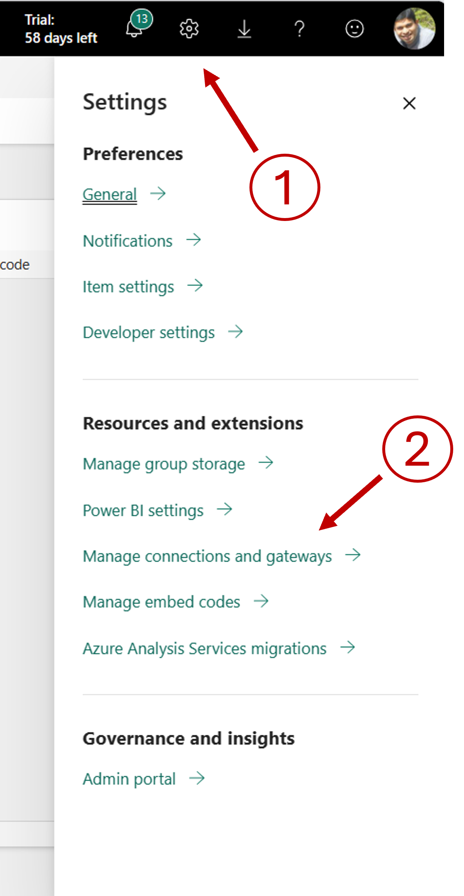 -->
1. On the **Data (preview)** page, select **+ New** to create a new connection.
1. Select **Cloud**, and then select **Connection type** as **Dataverse**
1. Provide the following information: 
   - **Connection name**. Enter environment URL value that is to be provided in the **Environment domain** value below.
   - **Environment domain**. Enter the environment domain, such as *contoso.crm.dynamics.com*. You can find the environment domain (URL) from the Power Platform admin center. Go to **Environments** > open the environment you want, and then copy the **Environment URL**.
   > [!IMPORTANT]
   > You must enter the **Environment URL** you get from admin center into both the **Connection name** and **Environment domain** fields. Remember to remove https:// and the trailing /
   > 
   > 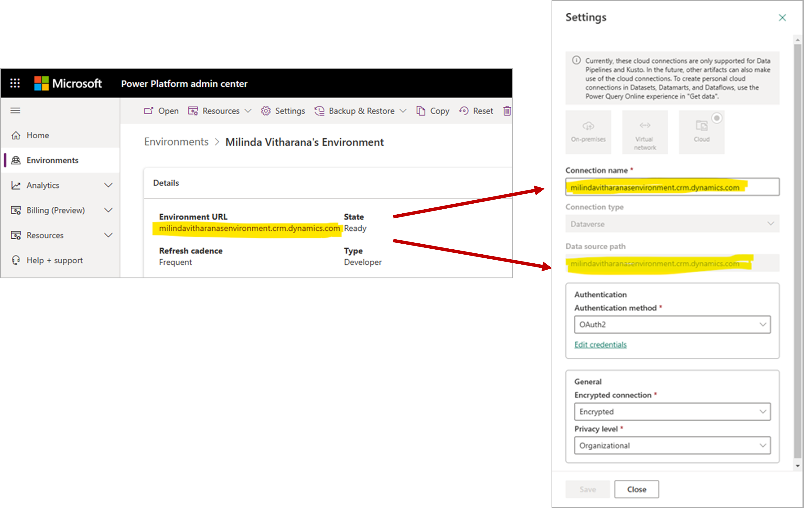
   - Select **OAth2** as the **Authentication method**.
   - Select Edit credentials, and then confirm your credentials.
1. Review the connection information, and then select **Create**.

## Open Fabric 

After configuration, you can open Fabric from Power Apps in two ways.

- **Tables** area: Power Platform creates a Power BI workspace and lakehouse with default settings. This is the quickest approach to get started.
- **Azure Synapse Link for Dataverse** area: This option lets you choose your own Power BI workspace and provides granular control. the Azure Synapse Link for Dataverse area also enables monitoring and managing options.

Alternatively, you can create a link by choosing tables from Power Apps. System creates a Power BI workspace, a link and launches Microsoft Fabric with default settings. You can add more tables to this link later from Tables menu in PowerApps maker portal. 

1.  Launch Power apps maker portal with the URL and the feature flags shown below

    **https://make.preview.Powerapps.com?athena.shortcuts=true&athena.mdl=true&athena.cds2=true**

2.  In case you have multiple environments, choose the environment you configured  
3.  Choose **Tables** on the left navigation and choose **Account** table.
4.  Click on “**…”** and choose **view in Microsoft Fabric**. You can also choose view in Microsoft Fabric option in the top menu
5.  For the first time, you will see a dialog box confirming the name of the Power BI workspace. Select OK to continue. Subsequent table selections will be added to the same workspace. You will not be asked to confirm.
6.  Synapse Lake house should launch in a separate browser window

>  **NOTE**:
>
>  The system may take \~15 mins to update data in managed lake including conversion to Delta-parquet format. If you have selected a larger table, the initial load time make take a little longer. When you launch Fabric lake house, you will see the links as “unidentified” until the initial sync is completed. See known limitation section to trouble-shoot any issues you may see on screen.
>
> 

## Manage Microsoft Fabric links 
You can add/remove tables in the default Fabric link or create new links using the Synapse Link menu. You can also link existing Synapse Link profiles with Microsoft Fabric using this option. You need to be a system administrator in the PowerApps environment to manage Fabric links.

### Manage the default link (aka. Managed store or Microsoft OneLake)
If you or someone else launched maker portal and linked tables earlier, you will notice a default Fabric link called **Managed Store** or **Microsoft OneLake**. All tables chosen in the maker experience (ie. previous step) will be included in the Managed Store. 

You can add more tables or remove tables included in the Default link. 

Managed store uses Dataverse provisioned file storage. When you purchase PowerApps or Dynamics licenses, you will receive a storage quota for your organization. When you add more tables to Managed store, this quota is consumed depending on the size of table. You can purchase additional storage as required to expand the quota. You can see storage consumption in the PowerApps admin portal.

1.  Launch Power apps maker portal with the URL and the feature flags shown below

    **https://make.preview.Powerapps.com?athena.shortcuts=true&athena.mdl=true&athena.cds2=true**

2. Select **Azure Synapse Link** option from the left navigation in PowerApps maker portal.
3.  You will notice the default Synapse link profile called **Managed Store** or **Microsoft OneLake**. You can choose **view in Microsoft Fabric** by selecting Managed store.
4.  If you or a user in this environment launched maker portal and linked tables earlier, you will notice all tables chosen in the maker experience (ie. previous step).
5.  You can add, remove tables linked to Fabric by choosing the **Manage Tables** option. You can select one or more tables from this option.
6.  When you add a table, the system will perform an initial sync and replicate data in Dataverse storage. When the initial sync is completed, system will create a Dataverse shortcut to Fabric. You can see the status of tables added via Tables menu in maker portal as well as tables added using Manage tables option here.
7.  When the Sync status is **Active**, as data gets updated, your data changes are shown in reports created in Microsoft Fabric.
8.  If you or someone added a new column to a table that’s already added to Managed Lake (also known as a metadata change), you can use the **Refresh Fabric tables** option to update the change in Fabric. You may need to review the report and downstream data flows to see that they are not impacted by the change.
9.  You can launch Fabric by selecting **view in Microsoft Fabric** option
10.  You can also **Unlink**, ie. remove Fabric Links created by the system. When ulinking, the system does not remove the Fabric workspace or the lakehouse created since you may have added your own tables and links. You do need to visit Microsoft Fabric and remove the lakehouse and/or workspace yourself.

>
> **NOTE**:
> Depending on the size of data, the initial copy may take longer to complete. For subsequent updates, system may take \~15 mins to update data in managed lake including conversion to Delta-parquet format. When you launch Fabric lake house you will see the links as “unidentified” until the initial sync is completed.
>
> See known limitation section to trouble-shoot any issues you may see on screen.
>

## Link existing Synapse Links with Microsoft Fabric

You can link your existing Synapse Link profiles with Microsoft Fabric from the Synapse Link menu. You need to choose the “Enable Parquet/ Delta lake option” to enable view in Microsoft Fabric feature for Synapse Link profiles. 

To enable an existing Synapse link, 

1.	Launch Power apps maker portal with the URL and the feature flags shown below
**https://make.preview.Powerapps.com?athena.shortcuts=true&athena.mdl=true&athena.cds2=true**

2. Select **Azure Synapse Link** option from the left navigation in PowerApps maker portal.
3. Choose your existing Synapse Link profile and select **Link to Microsoft Fabric**.
4. You will be asked to choose a Power BI premium workspace to continue. System will show a list of worspaces in the same region as your environment. See the next section if you don’t see a workspace shown in the drop down list. You may need to create a workspace and revisit this step.
5. Select OK. System will perform validations and create the required artifacts in Fabric.  
6.	You can click the **View in Microsoft Fabric** option to launch Fabric Lakehouse. 
7.	You can add or remove tables using the **Manage tables** option. When you add a table, the system will perform an initial sync. When the initial sync is completed, select the **Refresh Fabric tables** option to refresh Dataverse shortcut already added to your Fabric Lakehouse.

>
> **NOTES:**
> You need to choose the “Enable Parquet/ Delta lake option” to enable view in Microsoft Fabric.
> Existing Synapse Link profiles where the data is saved as CSV files can't be linked to Microsoft Fabric.
>

## Create a Fabric workspace 
You need to create a new Fabric workspace or choose an existing workspace to link with an existing Synapse Link. It is recommended that you create a new workspace to direct link to Dataverse. 

This feature is only available in Fabric (or Power BI) premium workspaces. If you don’t have Power BI premium or Fabric capacity, you can sign-up for a Free Fabric trial capacity by visiting here: [Fabric (preview) trial - Microsoft Fabric \| Microsoft Learn](https://learn.microsoft.com/en-us/fabric/get-started/fabric-trial)

To confirm that you can create a premium workspace. Choose **workspace settings \> premium** and ensure that you have **Trial** or **Premium capacity** selected. The workspace you choose to link with Dataverse must be assigned to a Premium capacity in the same region as your Dataverse. 

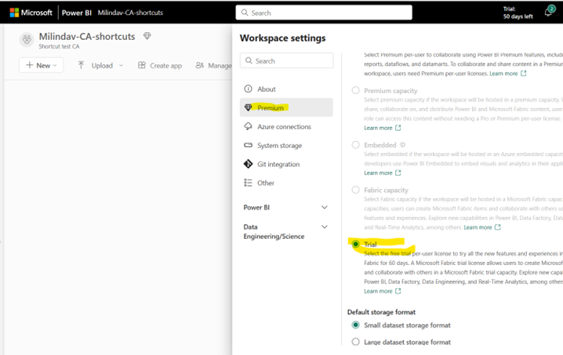

Launch Microsoft Fabric with the URL shown below (notice the new URL, you can also get to preview by launching PowerBI.com)
https://fabric.microsoft.com

Contact your Power BI administrator if you don't have permissions to create workspaces. 

# Working with Dataverse data in Fabric

You can view the Synapse Lakehouse, SQL endpoint and the default dataset generated by Dataverse in the Microsoft Fabric workspace you have chosen earlier.

When you choose **view in Microsoft Fabric** option PowerApps maker portal or in Synapse Link, Dataverse generated Synapse lake house will be launched. You can navigate into other Fabric features yourself and work with Fabric and Power BI.

## Explore Dataverse generated Synapse Lakehouse

You will notice the tables you have selected being added to the Synapse Lakehouse as shown below. These tables are linked to your PowerApps environment using **Dataverse shortcuts**. As data changes in Dataverse, the Dataverse shortcuts in Fabric will reflect the latest data. 
Also note that Dataverse manages these shortcuts. You should not delete or remove these shortcuts in Microsoft fabric. If you delete them inadvertently, you can revisit the Synapse Link menu in PowerApps and choose **Refresh Fabric Links** option to recreate the links.

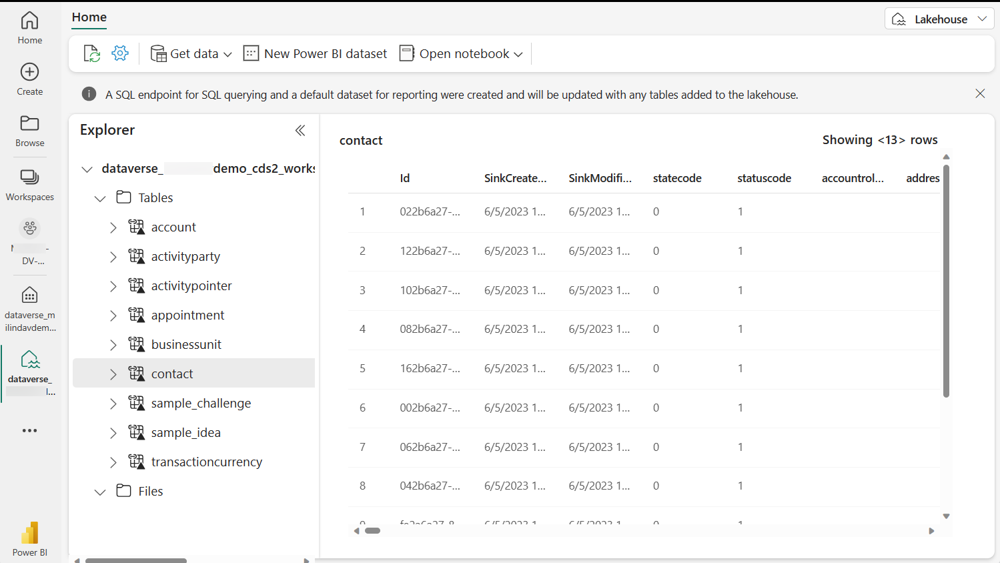

**NOTE**: During preview, the system make take \~15minute or more to reflect the tables. You may see table names as **undefined** during that time.

## Explore data with SQL endpoint
You can launch SQL endpoint and query Dataverse data with SQL and generate views in Microsoft Fabric

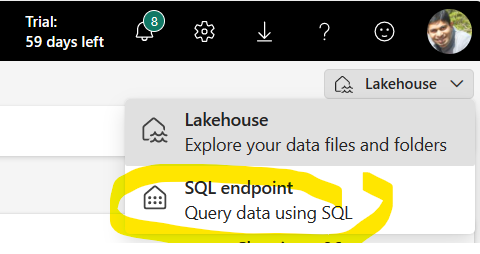

Select SQL endpoint from the top right context menu and the same data will be shown in a SQL friendly experience where you can create SQL queries and views.

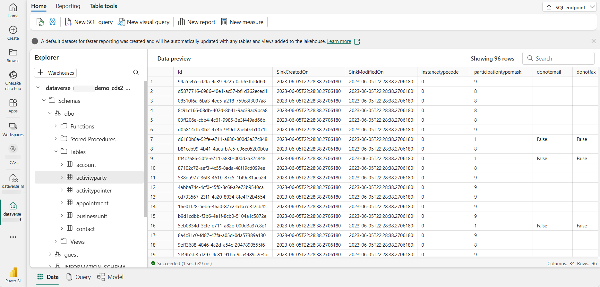

## Auto create a Power BI report

You can choose the default dataset generated by Dataverse and choose Auto create a report. The system generates a PowerBI report with the data you have selected as shown below.

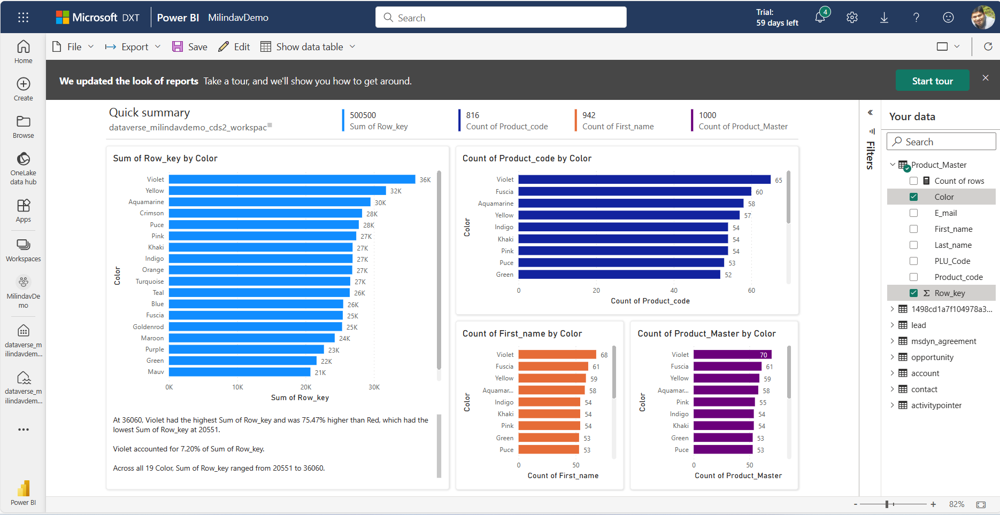

## Secure data in the workspace 
You have linked PowerApps and Fabric workspaces as a system administrator. You need to secure the data in this workspace before you share this data with others. 
>
> **NOTE:**
>
> In the future, you will be able to apply security definitions in PowerApps to data in the workspace.
>

# Build Apps and automations with Fabric data in Maker portal

By now, you may have explored Dataverse data with the Synapse Lakehouse, SQL endpoint as well as Power BI. You can also bring your own data into Microsoft Fabric and combine, re-shape and aggregate data with data from Dataverse. You can use Fabric tools such as SQL, Spark, Data flows to work with your data within Microsoft Fabric. For an example;

-	Combine financial data from Dynamics 365 with financial data from other systems to derive consolidated insights
-	Merge historical data (ingested into OneLake from legacy systems) with current business data from Dynamics and PowerApps
-	Combine weblogs and telemetry data from your web site with product and order details from Dynamics 
-	Apply machine learning and detect anomalies and exceptions within your data.
  
Insights are not complete unless you can drive action and business processes. You can bring data in OneLake into Dataverse as external tables and use that data to build PowerApps or create business automations.

## Choose data from Microsoft Fabric
1.	You can bring data in a Lakehouse into Dataverse by choosing the corresponding SQL endpoint. Choose the SQL endpoint corresponding to the Lakehouse
2.	You can also bring data from a data warehouse into Dataverse.
3.	In either the SQL endpoint or the data warehouse, Select the gear icon on top left to launch the properties window.
4.	Copy the (1) SQL connection string and the (2) name from the properties window

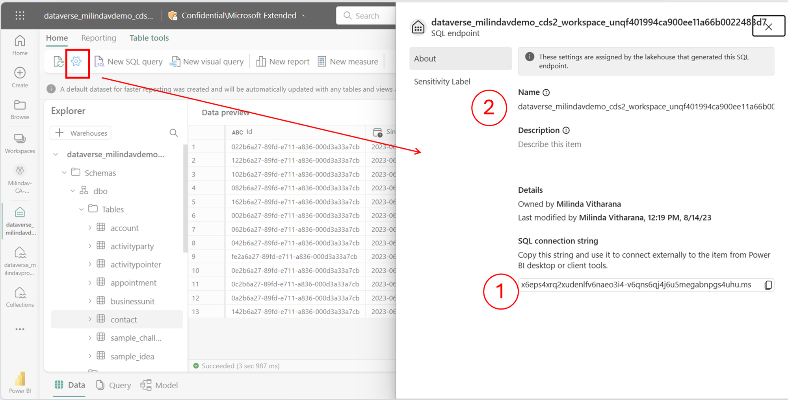

## Define Dataverse external tables
5.	Launch PowerApps maker portal and select Tables menu. Choose **Create a virtual table** 

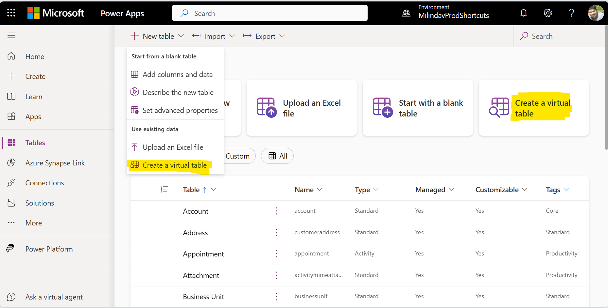

6.	Select SQL server as the connection. 
7.	Paste the SQL connection string you copied in step (1) above. 
8.	Enter the name of the data warehouse or SQL endpoint you copied (2) above. 
9.	Choose tables from the Fabric. When complete, you can continue to work with the tables and build Apps.

## Troubleshooting common issues

> NOTE
> - This feature is in preview. Preview features are not ready for production use and are provided to validate and to provide feedback to product team. You can join the preview yammer group [https://aka.ms/SynapseLinkforDynamics](https://aka.ms/SynapseLinkforDynamics) to provide feedback and stay in touch with product team
>  - You need to have a Power BI premium capacity, Fabric premium capacity or Trial capacity in the same region as your Dataverse environment. Power BI premium per user capacity will not be sufficient. You can get a free trial capacity by visiting the link here: [Fabric (preview) trial - Microsoft Fabric \| Microsoft Learn](https://learn.microsoft.com/en-us/fabric/get-started/fabric-trial)
>  - Depending on the size of data, initial sync may take 15min or more. In case of very large tables, initial sync may take much longer before you can consume data in Microsoft Fabric. 
> 	- After the initial sync, data changes in Dataverse will be reflected in Microsoft Fabric upto 60 mins later.
>

If you are seeing an error message. see suggestions to resolve below 

| Error message                      | How to resolve                | 
|:-----------------------------------|:------------------------------|
| You need to create a Dataverse connection in Fabric with the connection name < your domain URL>. | See configure data connection section  | 
| You need to get a Power BI premium of Fabric capacity. You can also get a Fabric trial | You need a Power BI premium of a Fabric capacity. Power BI premium per user capacity will not be sufficient. You can get a free trial capacity by visiting the link here: [Fabric (preview) trial - Microsoft Fabric \| Microsoft Learn](https://learn.microsoft.com/en-us/fabric/get-started/fabric-trial)  | 
| Creation of Fabric workspace failed. Consider creating a Fabric workspace first and linking using Synapse Link menu | See Manage Microsoft Fabric Links section for details |
| Creation of Fabric workspace failed. You can try again, If this issue persists contact support with corelation ID | Ensure that you have admin permissions to your Power BI workspace. If the issue is not resolved after several retrys, you may contact support with the provided reference ID |
| Creation of Fabric Lakehouse failed. You can try again, If this issue persists contact support with corelation ID | Ensure that you have admin permissions to your Power BI workspace. If the issue is not resolved after several retrys, you may contact support with the provided reference ID |
| You need to add one or more tables before linking to Microsoft Fabric. | If you are using Managed store (ie. the default link), you can add one or more tables using the Manage tables option in Synapse Link menu and try to Link to the Fabric again |
| Your organization does not appear to have Microsoft Fabric. You can get a Trial | You can contact your administrator or get a Trial version of Microsoft Fabric |
|You need to get a Trial version of Fabric to get stated | You need a Power BI premium of a Fabric capacity. Power BI premium per user capacity will not be sufficient. You can get a free trial capacity by visiting the link here: [Fabric (preview) trial - Microsoft Fabric \| Microsoft Learn](https://learn.microsoft.com/en-us/fabric/get-started/fabric-trial) |
| You need to be a System administrator to link to Fabric | You need system administrator permissions in PowerApps to perform this operation |

