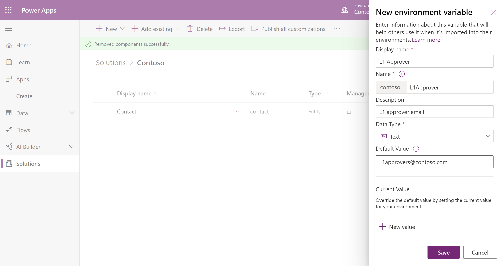

# Environment variables overview 

[!INCLUDE[cc-data-platform-banner](../../includes/cc-data-platform-banner.md)]

Applications often require different configuration settings or input parameters when deployed to different environments. Environment variables store the parameter keys and values, which then serve as input to various other application objects. Separating the parameters from the consuming objects allows you to change the values within the same environment or when you migrate solutions to other environments. The alternative is leaving hard-coded parameter values within the components that use them. This is often problematic; especially when the values need to be changed during application lifecycle management (ALM) operations. Because environment variables are solution components, you can transport the references (keys) and change the values when solutions are migrated to other environments.

> [!NOTE]
> New capabilities for data sources are just now being deployed and may not be available yet in your region.

Benefits of using environment variables:
- Provide new parameter values while **importing solutions** to other environments.
- Store configuration for the **data sources** used in canvas apps and flows. For example, SharePoint Online site and list parameters can be stored as environment variables; therefore allowing you to connect to different sites and lists in different environments without needing to modify the apps and flows.
- Package and transport your customization and configuration together and manage them in a single location.
- One environment variable can be used across many different solution components - whether they're the same type of component or different. For example, a canvas app and a flow can use the same environment variable. When the value of the environment variable needs to change, you only need to change one value. 
- Additionally, if you need to retire a data source in production environments, you can simply update the environment variable values with information for the new data source. The apps and flows do not require modification and will start using the new data source.
- Supported by [SolutionPackager](/power-platform/alm/solution-packager-tool) and [DevOps](/power-platform/alm/devops-build-tools) tools enable continuous integration and continuous delivery (CI/CD).
- The environment variables can be unpacked and stored in source control. You may also store different environment variables values files for the separate configuration needed in different environments. Solution Packager can then accept the file corresponding to the environment the solution will be imported to.

## How do they work?

Environment variables can be created and modified within the modern solution interface, automatically created when connecting to certain data sources in canvas apps, or by [using code](/powerapps/developer/data-platform/work-with-data). They can also be imported to an environment via solutions. Once environment variables are present in an environment, they can be used as inputs when authoring canvas apps, Power Automate flows, when developing plug-ins, as well as many other places such as adding a Power BI dashboard to a model-driven app. When these types of objects use environment variables, the values are then derived from the environment variables and can be changed when solutions are imported to other environments. 

### Create an environment variable in a solution

1. Sign in to Power Apps, and then on the left pane select **Solutions**.
1. Open the solution you want or create a new one.
1. On the command bar, select **New** and then select **Environment variable**. 
1. On the right pane, complete the following columns, and then select **Save**:  
   - **Display name**. Enter a name for the environment variable. 
   - **Name**. The unique name is automatically generated from the **Display name**, but you can change it. 
   - **Data Type**. Select from **Decimal number**, **Text**, **JSON**, **Two options**, or **Data source**. 
     >[!NOTE]
     >If **Data source** is the selected type, you'll also need to select the **connector**, a valid **connection** for the selected connector, and the **parameter type**. For certain parameters such as SharePoint lists, you'll also need to select a parent data source environment variable such as the SharePoint site. Once saved, these will be related in the database. 
   - **Current Value**. Also known as the value. This property is optional and is a part of the environment variable value table. When a value is present it will be used, even if a default value is also present. Remove the value from your solution if you don't want to use it in the next environment. The values are also separated into separate JSON files within the exported solution.zip file and can be edited offline. More information: [How do I remove a value from an environment variable?](#how-do-i-remove-a-value-from-an-environment-variable)
   - **Default Value**. This column is part of the environment variable definition table and is not required. The default value is used if there is no current value. 
  

      Separation of default value and current value allows you to service the definition and the default value separately from the value. For example, an application publisher may list their offer on AppSource with a default value. Then optionally, the customer can provide a new value. When the application publisher publishes updates to the application, the value set by the customer will not be overwritten. 

      > [!div class="mx-imgBorder"] 
      > 

      >[!NOTE]
      > A value can't exist without a definition. The interface only allows creation of one value per definition.

## Use data source environment variables in canvas apps
### Use pre-existing data source environment variables

Environment variables can be reused across other apps and even different types of resources like cloud flows. You may wish to first create them within your solution and later use them while authoring canvas apps and cloud flows.
1. Follow the steps above to [Create an environment variable in a solution](#create-an-environment-variable-in-a-solution).
1. Edit or create a canvas app from your solution.
1. Add a **new** data source for SharePoint online.
1. Select the **Advanced** tab. You'll see a filtered list of environment variables that you have access to and that match the parameter being set. For example, when you select the SharePoint site, you'll see a list of all data source environment variables with **Connector** = **SharePoint** and **Parameter type** = **Site**. The same is true when selecting SharePoint lists for a given site. 
2. Select the desired environment variable(s), and then select **Connect.**

>[!IMPORTANT]
>If an environment variable from a different solution is selected, a dependency will exist on the solution containing the environment variable. Therefore, be sure to either: 
> - Add the environment variable to your current solution prior to exporting. 
> - Ensure the solution containing the environment variable is imported to the destination environment before your current solution is imported.

### Automatically create data source environment variables when connecting to data

This option provides simplicity and ensures environment variables will always be used for data sources, such as SharePoint Online. However, some customers prefer to provide their own schema names and therefore should create them from solutions.

1. Edit or create a canvas app from your solution.
1. Select **File** > **Settings** > **Advanced settings** and enable the setting to **Automatically create environment variables when adding data sources**.
1. Add a **New** data source for SharePoint online.
1. Select a SharePoint **site**, one or more **lists**, and then **Connect**.
   >[!NOTE]
   >To prevent creation of duplicate environment variables, you'll be prompted to use the existing environment variable when duplicates are identified. You can clear the option to use the existing environment variable if creation of a duplicate is desired. 
1. Select **Save**. 

>[!NOTE]
>Pre-existing canvas apps will not automatically use data source environment variables. Remove the data source from the app and add them back using the above steps to upgrade these apps to use environment variables. 

## Use environment variables in Power Automate solution cloud flows

Environment variables can be used in solution cloud flows since they are available in the dynamic content selector. All types of environment variables can be used in triggers and actions.
To use an environment variable in a solution cloud flow:
1. Edit or create a cloud flow in a solution.
1. In an action or a trigger, determine the parameter that you want to use for the environment variable:
    
    a. If the parameter takes a simple value, such as a string or number, enter the parameter.
    
    b. If the parameter is a lookup, scroll to the bottom of the lookup, and then select **Enter custom value**. Environment variables that you have access to are listed in the dynamic content selector with other dynamic content.
       :::image type="content" source="media/select-environment-variable.png" alt-text="Select an environment variable to add to a cloud flow trigger or action.":::
1. Select the desired environment variable.

## Enter new values while importing solutions

The modern solution import interface includes the ability to enter values for environment variables. This sets the value property on the `environmentvariablevalue` table.

   >[!NOTE]
   > You may remove the value from your solution before exporting the solution. This ensures the existing value will remain in your development environment, but will not get exported in the solution. This approach allows a new value to be provided while importing the solution into other environments. You will **not** be prompted for new values during solution import if the environment variables already have either a default value or value present; whether values are part of your solution or are already present in the target environment. More information: [How do I remove a value from an environment variable?](#how-do-i-remove-a-value-from-an-environment-variable)

## Notifications

A notification is displayed when the environment variables do not have any values. This is a reminder to set the values so that components dependent on environment variables do not fail. 

## Security

The `environmentvariabledefinition` table is [user or team owned](/powerapps/maker/common-data-service/types-of-tables). When you create an application that uses environment variables, be sure to assign users the appropriate level of privilege to this table. Permission to the `environmentvariablevalue` table is inherited from the parent `environmentvariabledefinition` table and therefore does not require separate privileges. More information: [Security in Dataverse](/power-platform/admin/wp-security).

## Current limitations

- SharePoint Online is currently the only data source supported for environment variables of type "data source" within canvas apps. However, the Dataverse connector will be updated soon for when connectivity is required to Dataverse environments other than the current environment. Other types of environment variables may be used within canvas apps by retrieving them as you would record data via a Dataverse connection.
- If you’re using environment variables for storing SharePoint data source parameters in canvas apps, ensure you use **Display Name** (instead of logical name, or ID) when using "Lookup" or "Person or group" column types.
- Using environment variables within triggers in Power Automate is currently only supported for a limited set of connectors. Supported connecters for triggers are SharePoint, Dataverse, and SQL server.
- When environment variable values are changed directly within an environment instead of through an ALM operation like solution import, flows will continue using the previous value until the flow is either saved or turned off and turned on again.  
- Validation of environment variable values happens within the user interfaces and within the components that use them, but not within Dataverse. Therefore ensure proper values are set if they're being modified through code. 
- [Power Platform Build Tools tasks](/power-platform/alm/devops-build-tool-tasks) are not yet available for managing data source environment variables. However, this does not block their usage within Microsoft provided tooling and within source control systems.
- Interacting with environment variables via custom code requires an API call to fetch the values; there is not a cache exposed for 3rd party code to leverage. 
<!--  Azure Key Vault integration for secret management. While on our roadmap, currently environment variables shouldn't be used to store secure data such as passwords and keys.
 -->
- When editing a cloud flow, the environment variables are shown in the dynamic content selector under a heading of **Parameters** but will be under a heading of **Environment Variables** in the near future. 
- When editing a cloud flow, the environment variables shown in the dynamic content selector are unfiltered, but will be filtered by data type in the future. 
- When editing a cloud flow, if an environment variable is added in another browser tab, the flow needs to be reopened in the flow designer to refresh the dynamic content selector.
- When editing a cloud flow, an environment variable with a label of **$authentication** might show up that was not defined in the environment. 

## Frequently asked questions

### How can I view where environment variables are being used?

Either through selecting **Show dependencies** in the solution interface, while authoring components, or in source control and in the solution file by viewing the app or flow metadata. 

### Are data source environment variables the same as connections?

No. Although they're related. A connection represents a credential or authentication required to interact with the connector. Data source environment variables store parameters that are required by one or more actions in the connector and these parameters often vary depending on the action. For example, a SharePoint Online connection does not store any information about sites, lists, or document libraries. Therefore calling the connector requires both a valid connection as well as some additional parameters. 

### Can data source environment variables be used with shared connections such as SQL Server with SQL authentication?

Generally no. Shared connections such as SQL Server with SQL authentication store the parameters required to connect to data within the connection. For example, the Server and Database name are provided when creating the connection and therefore are always derived from the connection.

Data source environment variables are used for connectors that rely on user based authentication such as Azure Active Directory because the parameters cannot be derived from the connection. For these reasons SQL Server with SQL authentication, which is a shared connection, will not use data source environment variables but SQL Server with Azure Active Directory (AAD) authentication, which is a personal connection will. 

### Can my automated ALM pipeline use different values files for different environments?

Yes. Solution packager accepts file name as input parameters so your pipeline can pack a different values file into the solution depending on the environment type it’s executing against.

### What if someone inadvertently deletes a value?

If not already prevented by dependency system, runtime will use the last known value as a fallback.

### If a value is changed, when does the new value get used in canvas apps and cloud flows?

For canvas apps, the new value will be used during the next session. For example, closing the app and then playing it again. 

With cloud flows, the flows must currently be de-activated and re-activated in order to use the updated value. 

### Are premium licenses required?

No. While ALM requires Dataverse (or Dynamics 365 for Customer Engagement), use of premium connectors is not required. The one caveat is if you're using the Dataverse connector to interact with environment variables as you would with other data records like accounts or contacts. Previously this was the only way to use environment variables in canvas apps and flows.  

### Is there a limit to the number of environment variables I can have?

No. However, the max size of a solution is 29 MB.

### Can environment variable display names and descriptions be localized?

Yes.

### Should I use environment variables instead of storing configuration data in custom tables?

Yes if your configuration data is not relational. Environment variables should be used for key : value pairs and when the value likely needs to different in other environments. Other tools such as the Configuration migration utility are better suited for migration of relational configuration data stored within custom tables. Unlike other configuration data, environment variables are migrated within solutions and therefore much simpler to manage and more performant to import. 

### How do I remove a value from an environment variable?

You might want to remove the value of an environment variable from your solution before exporting the solution. Then, the existing value will remain in your development environment, but will not be exported in the solution. This approach allows a new value to be provided while importing the solution into another environment.

To remove the value, follow these steps:

1. In the solution where the environment variable is located select the environment variable to display the properties.
1. Under **Current Value**, select **...** > **Remove from this solution**.
   :::image type="content" source="media/remove-value-env-var.png" alt-text="Remove the value from an environment variable":::

### See also
[Power Apps Blog: Environment variables available in preview!](https://powerapps.microsoft.com/blog/environment-variables-available-in-preview/)  
[EnvironmentVariableDefinition table/entity reference](/powerapps/developer/data-platform/reference/entities/environmentvariabledefinition)  
[Web API samples](/powerapps/developer/data-platform/webapi/web-api-samples)  

[Create Canvas app from scratch using Dataverse.](/powerapps/maker/canvas-apps/data-platform-create-app-scratch)  
[Create a flow with Dataverse](/flow/connection-cds)

[!INCLUDE[footer-include](../../includes/footer-banner.md)] 

