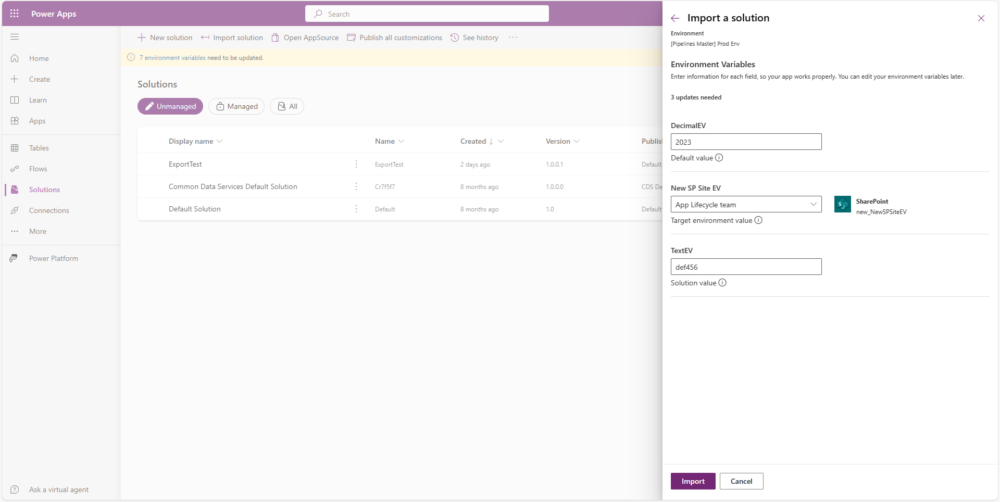

# Environment variables for Power Platform overview

Environment variables enable the basic application lifecycle management (ALM) scenario of moving an application between Power Platform environments. In this scenario, the application stays exactly the same except for a few key external application references (such as tables, connections, and keys) that are different between the source environment and the destination environment. The application requires the structure of the tables or connections to be exactly the same between the source and the destination environments, with some differences. Environment variables allow you to specify which of these different external references should be updated as the application is moved across environments.

Environment variables store the parameter keys and values, which then serve as input to various other application objects. Separating the parameters from the consuming objects allows you to change the values within the same environment or when you migrate solutions to other environments. The alternative is leaving hard-coded parameter values within the components that use them. This approach is often problematic; especially when the values need to be changed during ALM operations. Because environment variables are solution components, you can transport the references (keys) and change the values when solutions are migrated to other environments.

Benefits of using environment variables:

- Provide new parameter values while **importing solutions** to other environments.
- Store configuration for the **data sources** used in canvas apps and flows. For example, SharePoint Online site and list parameters can be stored as environment variables. This approach allows you to connect to different sites and lists in different environments without needing to modify the apps and flows.
- Package and transport your customization and configuration together and manage them in a single location.
- Package and transport secrets, such as credentials used by different components, separately from the components that use them.
- One environment variable can be used across many different solution components - whether they're the same type of component or different. For example, a canvas app and a flow can use the same environment variable. When the value of the environment variable needs to change, you only need to change one value. 
- Additionally, if you need to retire a data source in production environments, you can update the environment variable values with information for the new data source. The apps and flows don't require modification and start using the new data source.
- Supported by [SolutionPackager](/power-platform/alm/solution-packager-tool) and [DevOps](/power-platform/alm/devops-build-tools) tools enable continuous integration and continuous delivery (CI/CD).
- The environment variables can be unpacked and stored in source control. You might also store different environment variables values files for the separate configuration needed in different environments. Solution Packager can then accept the file corresponding to the environment the solution is imported to.

## How do environment variables work?

Environment variables can be created and modified within the modern solution interface. They can also be automatically created when connecting to certain data sources in canvas apps or [with code](/powerapps/developer/data-platform/work-with-data). They can also be imported to an environment via solutions. Environment variables can be used as inputs when authoring canvas apps, Power Automate flows, plug-ins, and adding Power BI dashboards to model-driven apps. When you use environment variables, the values are then derived from the environment variables, and can be changed when solutions are imported to other environments.

### Manually create an environment variable in a solution

1. Sign in to Power Apps (make.powerapps.com), and then on the left pane select **Solutions**. [!INCLUDE [left-navigation-pane](../../includes/left-navigation-pane.md)]
1. Open the solution you want or create a new one.
1. On the command bar, select **New** > **More**, and then select **Environment variable**. 
1. On the right pane, complete the following columns, and then select **Save**:  
   - **Display name**. Enter a name for the environment variable. 
   - **Name**. The unique name is automatically generated from the **Display name**, but you can change it. 
   - **Data Type**. Select from **Decimal number**, **Text**, **JSON**, **Two options**, **Data source**, or **Secret**.

     > [!NOTE]
     > If **Data source** is the selected type, you need to select the **connector**, a valid **connection** for the selected connector, and the **parameter type**. The connection isn't stored as part of the environment variable. The environment variable stores information not in the connection that is necessary to connect Power Apps to the right server and table. The connection is only used for retrieving available parameter values such as the SharePoint sites you have access to, or the lists associated with a site.
   - If **Secret** is the selected type, additional information to set up and configure Azure Key Vault is needed to allow Power Platform to access the secret.
   - **Current Value**. Also known as the value. This property is optional and is a part of the environment variable value table. A defined value is used even if a default value is also present. Remove the value from your solution if you don't want to use it in the next environment. The values are also separated into separate JSON files within the exported solution.zip file and can be edited offline. More information: [How do I remove a value from an environment variable?](#how-do-i-remove-a-value-from-an-environment-variable)
   - **Default Value**. This column is part of the environment variable definition table and isn't required. The default value is used if there's no current value. 
  

      Separation of default value and current value allows you to service the definition and the default value separately from the value. For example, an application publisher might list their offer on Marketplace with a default value. Then optionally, the customer can provide a new value. When the application publisher publishes updates to the application, the value set by the customer isn't overwritten.

      > [!div class="mx-imgBorder"] 
      > 

      >[!NOTE]
      > A value can't exist without a definition. The interface only allows creation of one value per definition.

### Power Apps can automatically create environment variables

On the **General** tab of Power Apps settings:

- Enable the **Automatically create environment variables when adding data sources** option.
Now, when you add a new data source to your app, it adds an environment variable for you.

  > [!div class="mx-imgBorder"] 
  > 

### Different data sources

Different data sources enable different types of environment variables.

#### Microsoft Dataverse

Power Apps connects natively to Dataverse. You don't need an environment variable for tables in your current environment. When you connect to Dataverse, your application automatically looks for exactly the same table name in any environment you port it. As long as your table name structure is the same in the target environment as it is in the original environment, it works.

If you use an external table from a different environment (via Change Environment), then Power Apps assumes you want to always refer to the exact same table. You need an environment variable if you need that external table to be a different external table when you move from dev to test or to prod. It's easiest to allow Power Apps to automatically create the environment variable for you. (If you previously added the table to your app, then turn on the settings switch, drop the external table, and then add it back.) 

When you add the external table to your app, choose the **Advanced** tab to select the environment variable.  

> [!div class="mx-imgBorder"] 
> 

#### SharePoint

SharePoint supports only Microsoft Entra connections. So, for SharePoint, in addition to a valid connection, a separate environment variable is required for Site and List.

To successfully use environment variables with SharePoint lists:

- The display name and the logical name for each corresponding column in the source and target environments must match.
- Environment variables for SharePoint must have matching metadata. SharePoint has internal identifiers that might not match between target environments. For example, if you create a list with the same name and columns in a target environment, the internal names won't match. The metadata always matches if you duplicate a SharePoint site and copy it to your target environment.

#### SQL Server

SQL Server supports many different types of authentication and connections. Use environment variables for Microsoft Entra connections. A separate environment variable is required for the server and the database. The application is bound to specific table names so they're assumed to be the same between environments.

Don't use environment variables for shared connections such as basic SQL authentication with SQL Server. Use connection references for information that is traditionally passed as part of the connection string. Basic SQL auth parameters are all part of the connection string. For example, the Server and Database name are provided when creating the connection and therefore are always derived from the connection.

Data source environment variables are used for connectors with authentication like Microsoft Entra. In these types of connections, Power Apps only has an identified user. Power Apps can't derive what service or table you intend to work with from the connection.

## Enter new values while importing solutions

The modern solution import interface includes the ability to enter values for environment variables. This sets the value property on the `environmentvariablevalue` table.

Environment variable values are visible when importing solutions or when [using Pipelines to deploy](/power-platform/alm/run-pipeline). Environment variables without a default value or value prompt for a value, but those otherwise are prefilled with a label beneath the text area denoting the value's source: solution value, target environment value, or default value.

> [!div class="mx-imgBorder"] 
> 

> [!NOTE]
>
> - In some cases, for specific data source environment variable values, an **Access denied** warning might appear if the importing maker doesn't have access to the connection or source used for the environment variable. This is a nonblocking warning, but something to take note of depending on how you plan to use the environment variable in the target environment.  
> - You can remove the value from your solution before exporting the solution. This ensures the existing value remains in your development environment, but won't get exported in the solution. This approach allows a new value to be provided while importing the solution into other environments. More information: [How do I remove a value from an environment variable?](#how-do-i-remove-a-value-from-an-environment-variable)

## Notifications

A notification is displayed when the environment variables don't have any values. Set the values so that components dependent on environment variables don't fail.

## Security

The `environmentvariabledefinition` table is [user or team owned](/powerapps/maker/data-platform/types-of-entities). When you create an application that uses environment variables, be sure to assign users the appropriate level of privilege to this table. Permission to the `environmentvariablevalue` table is inherited from the parent `environmentvariabledefinition` table and therefore doesn't require separate privileges. Privileges for `environmentvariabledefinition` tables are included in Environment Maker and Basic User security roles by default. More information: [Security in Dataverse](/power-platform/admin/wp-security).

## Naming

Ensure environment variable names are unique so they can be referenced accurately. Duplicate environment variable display names make environment variables difficult to differentiate and use. Ensure environment variable names are unique so they can be referenced accurately.
The names **$authentication** and **$connection** are specially reserved parameters for flows and should be avoided. Flow save is blocked if environment variables with those names are used.
If an environment variable is used in a flow and the display name of the environment variable is changed, then the designer shows both the old and new display name tokens to help with identification. When updating the flow, we recommend you remove the environment variable reference and add it again.

## Current limitations

- Validation of environment variable values happens within the user interfaces and within the components that use them, but not within Dataverse. Therefore ensure proper values are set if they're being modified through code. 
- [Power Platform Build Tools tasks](/power-platform/alm/devops-build-tool-tasks) aren't yet available for managing data source environment variables. However, this doesn't block their usage within Microsoft provided tooling and within source control systems.
- Interacting with environment variables via custom code requires an API call to fetch the values; there isn't a cache exposed for non-Microsoft code to use.
- Environment variables are limited to a maximum of 2,000 characters.

## Frequently asked questions

### Why can't I see the value for my environment variable?

If the environment variable is in a managed solution, you won't be able to see the value unless you look inside of the **Default solution**. This behavior is by design, since the environment variable value is an unmanaged customization.

### How can I view where environment variables are being used?

Either through selecting **Show dependencies** in the solution interface, while authoring components, or in source control and in the solution file by viewing the app or flow metadata. 

### Are data source environment variables the same as connections?

No. Although they're related, a connection represents a credential or authentication required to interact with the connector. Data source environment variables store parameters that are required by one or more actions in the connector and these parameters often vary depending on the action. For example, a SharePoint Online connection doesn't store any information about sites, lists, or document libraries. Therefore calling the connector requires both a valid connection and some more parameters.

### Can my automated ALM pipeline use different values files for different environments?

Yes. Solution packager accepts file name as input parameters so your pipeline can pack a different values file into the solution depending on the environment type it’s executing against.

### Should I include the value in my solution?

No. Environment variables are intended to be used by applications that need to have different values in different environments where the solution is deployed. Environment variable definitions should be included in your solution but the values should be provided for the target environment during deployment. This behavior results in the environment variable definition being a managed solution object in the target environment while the environment variable is an unmanaged record.

### Why can't I delete a value in my environment?

If the value was included in a managed solution, the only way to delete the value is to update the solution in the source environment to exclude the value, then export a new version of the solution. This new version then can be imported into the environment using an upgrade operation (not an update), resulting in the value record being deleted.

### What if someone inadvertently deletes a value?

If not already prevented by dependency system, runtime uses the last known value as a fallback.

### If a value is changed, when does the new value get used in canvas apps and cloud flows?

It might take up to an hour to fully publish updated environment variables because the value is pushed into the apps and flows asynchronously.

### Are premium licenses required?

No. While ALM requires Dataverse (or Dynamics 365 apps), use of premium connectors isn't required. The one caveat is if you're using the Dataverse connector to interact with environment variables as you would with other data records like accounts or contacts. Previously this was the only way to use environment variables in canvas apps and flows.  

### Is there a limit to the number of environment variables I can have?

No. However, the max size of a solution is 95 MB. More information: [Create a solution](/power-apps/maker/data-platform/create-solution)

### Can environment variable display names and descriptions be localized?

Yes.

### Should I use environment variables instead of storing configuration data in custom tables?

Yes if your configuration data isn't relational. Environment variables should be used for key: value pairs and when the value likely needs to different in other environments. Other tools such as the Configuration migration utility are better suited for migration of relational configuration data stored within custom tables. Unlike other configuration data, environment variables are migrated within solutions and therefore much simpler to manage and more performant to import. 

### Why isn't my connection saved for data source environment variables?

Connections are only used to generate the user interface. For example, to retrieve friendly names for SharePoint lists associated with a site. When editing a data source environment variable, be sure to select a connection with access to the data source. If you no longer have access to the connection, you can manually enter a value. For example, enter the SharePoint site URL or unique identifier (GUID) for a list.

When there are multiple connections available for a single (data source-type) environment variable, there's a by-design implementation to select the first connection in the list of connections. Because there's usually only one connection associated with an environment variable, this isn't something that usually needs to be validated. Additionally, with recent changes to environment variable value visibility, this is easier to validate upon import.

### How do I remove a value from an environment variable?

You might want to remove the value of an environment variable from your solution before exporting the solution. Then, the existing value remains in your development environment, but isn't exported in the solution. This approach allows a new value to be provided while importing the solution into another environment.

To remove the value, follow these steps:

1. In the solution where the environment variable is located select the environment variable to display the properties.
1. Under **Current Value**, select **...** > **Remove from this solution**.

    :::image type="content" source="media/remove-value-env-var.png" alt-text="Remove the value from an environment variable":::

### Can I use environment variables in custom connectors?

Yes. [Environment variable support in custom connectors](/connectors/custom-connectors/environment-variables)

### See also

[Use data source environment variables in canvas apps](environmentvariables-data-source-canvas-apps.md)  
[Use environment variables in Power Automate solution cloud flows](environmentvariables-power-automate.md)  
[EnvironmentVariableDefinition table/entity reference](/powerapps/developer/data-platform/reference/entities/environmentvariabledefinition)  
[Web API samples](/powerapps/developer/data-platform/webapi/web-api-samples)  
[Use data source environment variables in Canvas apps](EnvironmentVariables-data-source-canvas-apps.md) 
[Use environment variables in Power Automate solution cloud flows](EnvironmentVariables-power-automate.md) 
[Use Azure Key Vault secrets](EnvironmentVariables-azure-key-vault-secrets.md) 
[Environment variable support in custom connectors](/connectors/custom-connectors/environment-variables) 
[Power Apps Blog: Environment variables available in preview!](https://powerapps.microsoft.com/blog/environment-variables-available-in-preview/) 

[!INCLUDE[footer-include](../../includes/footer-banner.md)]
