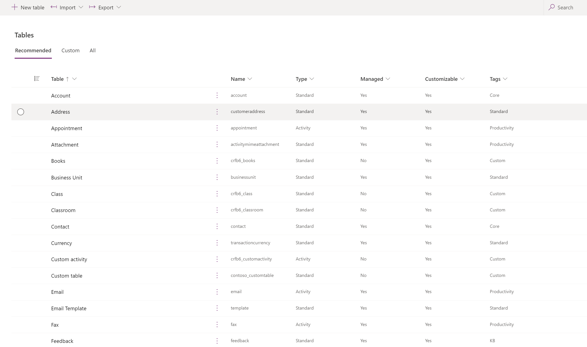
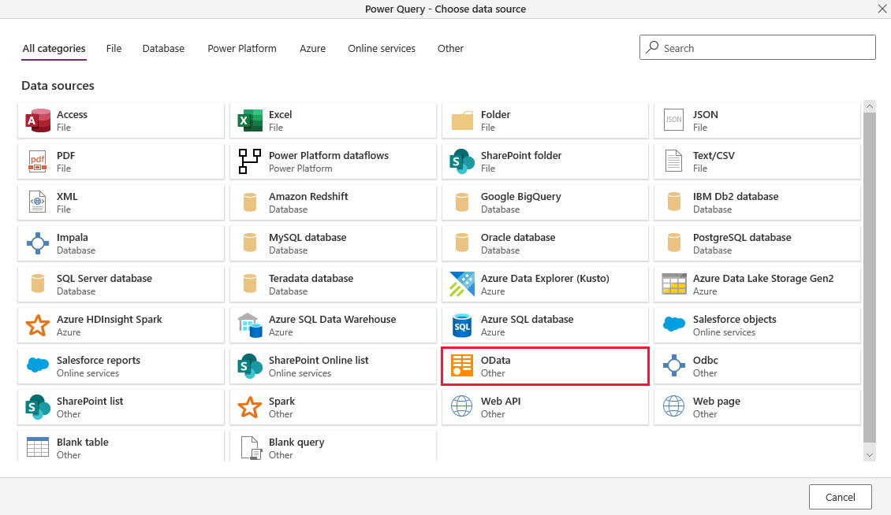
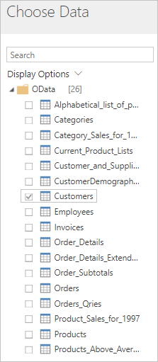
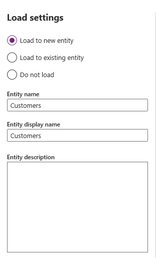
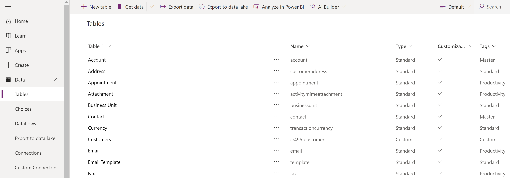
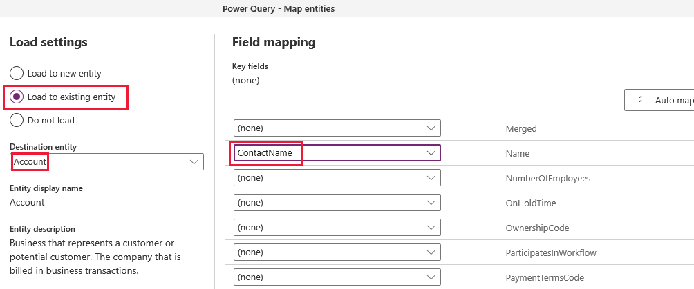

# Add data to a table in Microsoft Dataverse by using Power Query
[!INCLUDE[cc-data-platform-banner](../../includes/cc-data-platform-banner.md)]

In this procedure, you'll create a table in [Dataverse](data-platform-intro.md) and fill that table with data from an OData feed by using Power Query. You can use the same techniques to integrate data from these online and on-premises sources, among others:

* SQL Server
* Salesforce
* IBM DB2
* Access
* Excel
* Web APIs
* OData feeds
* Text files

You can also filter, transform, and combine data before you load it into a new or existing table.

If you don't have a license for Power Apps, you can [sign up for free](../signup-for-powerapps.md).

## Prerequisites
Before you start to follow this topic:
- Switch to an [environment](/power-platform/admin/working-with-environments) in which you can create tables.
- You must have a Power Apps per user plan or Power Apps per app plan.

## Specify the source data

1. Sign in to [Power Apps](https://make.powerapps.com/?utm_source=padocs&utm_medium=linkinadoc&utm_campaign=referralsfromdoc).

1. In the navigation pane, select **Data** to expand it, and then select **Tables**. 

    > [!div class="mx-imgBorder"] 
    > 

1. In the command menu, select **Get data**.

1. In the list of data sources, select **OData**.

    > [!div class="mx-imgBorder"] 
    > 

1. Under **Connection settings**, type or paste this URL, and then select **Next**: 
`https://services.odata.org/V4/Northwind/Northwind.svc/`

1. In the list of tables, select the **Customers** check box, and then select **Transform data**.

    > [!div class="mx-imgBorder"] 
    > 

1. (optional) Modify the schema to suit your needs by choosing which columns to include, transforming the table in one or more ways, adding an index or conditional column, or making other changes.

1. In the lower-right corner, select **Next**.

## Specify the target table
1. Under **Load settings**, select **Load to new table**.

    > [!div class="mx-imgBorder"] 
    > 

    You can give the new table a different name or display name, but leave the default values to follow this tutorial exactly.

1. In the **Unique primary name column** list, select **ContactName**, and then select **Next**.

    You can specify a different primary-name column, map a different column in the source table to each column in the table that you're creating, or both. You can also specify whether Text columns in your query output should be created as either Multiline Text or Single-Line Text in the Dataverse. To follow this tutorial exactly, leave the default column mapping.

1. Select **Refresh manually** for Power Query - Refresh Settings, and then select **Create**.

1. Under **Data** (near the left edge), select **Tables** to show the list of tables in your database.

    The **Customers** table that you created from an OData feed appears as a custom table.

    > [!div class="mx-imgBorder"] 
    > 

> [!WARNING]
> If you use Power Query to add data to an existing table, all data in that table will be overwritten.

If you select **Load to existing table**, you can specify a table into which you add data from the **Customers** table. You could, for example, add the data to the **Account** table with which the Dataverse ships. Under **Column mapping**, you can further specify that data in the **ContactName** column from the **Customers** table should be added to the **Name** column in the **Account** table.

  > [!div class="mx-imgBorder"] 
  > 

We're excited about this functionality and eager to hear your feedback. Please [send us your suggestions and feedback](https://powerusers.microsoft.com/t5/PowerApps-Community/ct-p/PowerApps1) about this feature!

If an [error message about permissions](troubleshoot-power-query-issues.md) appears, contact your administrator.

[!INCLUDE[footer-include](../../includes/footer-banner.md)]