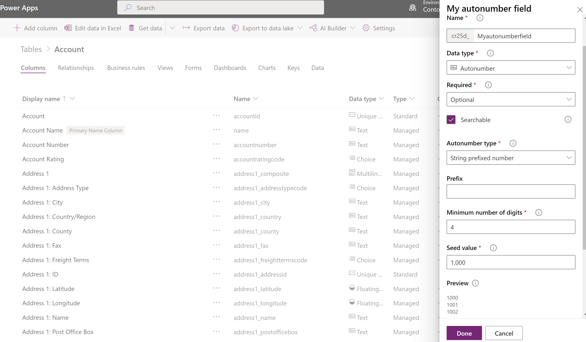

# Autonumber columns

[!INCLUDE[cc-data-platform-banner](../../includes/cc-data-platform-banner.md)]

Autonumber columns are columns that automatically generate alphanumeric strings whenever they are created. Makers can customize the format of these columns to their liking, and then rely on the system to generate matching values that automatically fill them in at runtime.

While autonumber columns are formally just text columns with additional functionality built on top of them, [Power Apps](https://make.powerapps.com/?utm_source=padocs&utm_medium=linkinadoc&utm_campaign=referralsfromdoc) simplifies this concept by simply exposing **Autonumber** as a distinct data type under the **Text** category. It is important to note that the classic solution explorer doesn't support creating or managing autonumber columns.

To create an autonumber column, follow the same steps to [create a column](create-edit-field-portal.md#create-a-column) and simply select **Autonumber** from the **Data type** drop-down list box. 

You may also activate autonumber functionality on an existing text column by opening the column and selecting **Autonumber** from the **Data type** drop-down list box. Similarly, autonumber functionality can also be disabled at any time by opening the column and selecting a different option in the **Data type** drop-down list box.

> [!NOTE]
>Autonumber values are preselected by the database when the row is started. If a row is started but cancelled, the number it was assigned is not used. If, during this time, another row is completed with the next sequential number, gaps will be present in the autonumbering of rows.

## Autonumber types

In order to make the creation of autonumber columns easier, there are a few pre-defined default autonumber types to capture the most common scenarios. 

### String prefixed number

The most common autonumber format is a simple string prefixed number. When this type is selected, the autonumber will consist of an automatically incrementing number with an optional string constant prefix. 
For example, a string prefixed number with the prefix *Contoso* would generate rows such as *Contoso-1000*, *Contoso-1001*, *Contoso-1002*, and so on.

### Date prefixed number

Another common autonumber format is a date prefixed number. When this type is selected, the autonumber will consist of an automatically incrementing number with a formatted date prefix. The date portion of the row will reflect the current date and time at which the row was created in UTC time. We have provided a number of various date formats to choose from.
For example, a date prefixed number would generate rows such as *2019-26-02-1000*, *2019-27-02-1000*, *2019-28-02-1000*, and so on, depending on the current date and selected date format.

### Custom

For more advanced makers with specific use cases, we provide the option to fully customize the desired format of an autonumber column. The format may consist of string constants, automatically incrementing numbers, formatted dates, or random alphanumeric sequences.
For detailed information about how to define custom formats, see [AutoNumberFormat options](/dynamics365/customer-engagement/developer/create-auto-number-attributes#autonumberformat-options).

## Seed values

The seed value of an autonumber column is the starting number that is used for the number portion of the format. 
For example, if you want an autonumber column to generate rows such as *Contoso-1000*, *Contoso-1001*, *Contoso-1002*, and so on, then the desired seed value is 1000, because that is the value that your number sequence starts with. 
Autonumber columns have a default seed value of 1000, but you may set a custom seed value if you wish. 

> [!IMPORTANT]
> Setting the seed only changes the current number value for the specified attribute in the current environment. The seed value is not included in a solution when it's imported in a different environment. 

## Create an autonumber column
  
1.  Sign in to the [Power Apps portal](https://make.powerapps.com/?utm_source=padocs&utm_medium=linkinadoc&utm_campaign=referralsfromdoc).
  
2.  On the left pane expand **Dataverse** and select **Tables**.
  
3.  Select the table that you would like to add an autonumber column to and then select the **Columns** tab.
  
4.  On the toolbar, select **Add** column.  
  
5.  On the right pane, enter a **Display name** and select **Autonumber** for the **Data type**.

    > [!div class="mx-imgBorder"] 
    > 
  
6. Set optional columns as needed. More information: [Create and edit columns](create-edit-field-portal.md#create-a-column)

7. Select an autonumber type or keep the default **String prefixed number** option.

8. Customize a seed value or keep the default value of **1000**.

9. Select **Done**.

## See also
 [Create and edit columns for Microsoft Dataverse using Power Apps portal](create-edit-field-portal.md)

[!INCLUDE[footer-include](../../includes/footer-banner.md)]