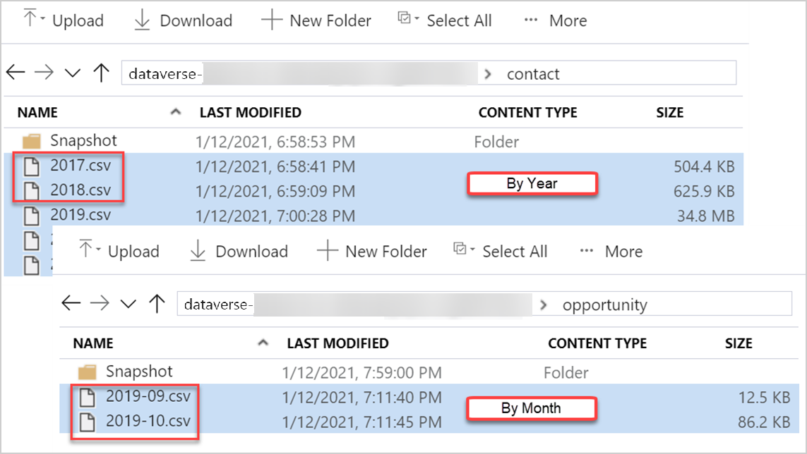

# Advanced Configuration Options in Azure Synapse Link

[!INCLUDE[cc-data-platform-banner](../../includes/cc-data-platform-banner.md)]

Azure Synapse Link offers multiple ways to write and read your data to fit various analytical scenarios. 

> [!NOTE]
> Azure Synapse Link for Dataverse was formerly known as Export to data lake. The service was renamed effective May 2021 and will continue to export data to Azure Data Lake as well as Azure Synapse Analytics.

This article covers:

1. In-place updates vs. append-only writes
2. User-specified partition strategy
3. Transporting the Azure Synapse Link for Dataverse configuration across environments

## In-place updates vs. append-only writes

While writing Dataverse table data to the Azure data lake, based on the `createdOn` value, which is the date and time when the record was created, there are two different settings to choose from. They are, **In place update** and **Append only**.

The default setting (for tables where `createdOn` is available) is to do an in-place update or upsert (update or insert) of the incremental data in the destination. If the change is new and a corresponding row does not exist in the lake, in the case of a create, the destination files are scanned, and the changes are inserted into the corresponding file partition in the lake. If the change is an update and a row exists in the lake, the corresponding file in the lake is updated, rather than inserted, with the incremental data. In other words, the default setting for all CUD changes in Dataverse tables, where `createdOn` is available, is to do an in place update in the destination, in Azure data lake.

You can switch the default behavior of an in place update by using an optional setting called **Append only**. Rather than an **In place update**, in **Append only** mode, incremental data from Dataverse tables are appended to the corresponding file partition in the lake. This is a per table setting and available as a checkbox under **Advanced** > **Show advanced configuration settings**. For Dataverse tables with **Append only** turned on, all the CUD changes are incrementally appended to the corresponding destination files in the lake. When you choose this option, the partition strategy defaults to **Year** and when data is written to the data lake, it is partitioned by yearly basis. **Append only** is also the default setting for Dataverse tables that do not have `createdOn` value.

The table below describes how rows are handled in the lake against CUD events for each of the data write options.

|Event  |In place update  |Append only  |
|---------|---------|---------|
|Create     |  The row is inserted in the partition file and is based on the `createdOn` value on the row.       | The row is added to the end of the partition file and is based on the `createdOn` value of the record.    |
|Update     | If the row exists in the partition file, then it is replaced or updated with updated data. If it doesn't exist, it's inserted in the file.    |  The row, along with the updated version, is added to the end of the partition file.   |
|Delete     |  If the row exists in the partition file, it's removed from the file.    | The row is added to the end of the partition file with `isDeleted column = True`.    |

> [!NOTE]
> For Dataverse tables where **Append only** is enabled, deleting a row in the source will not delete or remove the row in the lake. Instead, the deleted row is appended as a as a new row in the lake and the `isDeleted` column is set to True.

Here are some additional details on when to use either of the options.

- **In place update**: This is the default setting and recommended only if you want to connect directly to the data in lake and need the current state (not history or incremental changes). The file contains the full data set and can be utilized via Power BI or by copying the entire dataset for ETL (Extract, Transfer, Load) pipelines.
- **Append only**: Select this option if you aren't directly connecting to data in the lake and want to incrementally copy data to another target using ETL pipelines. This option provides a history of changes to enable AI and ML scenarios.

You can toggle the **Show advanced configuration settings** under **Advanced** in Azure Synapse Link for Dataverse to customize your data partition strategy and select options to write to the Azure data lake.

## Data Partition Strategy

When you Dataverse table data to Azure data lake storage using Azure Synapse Link, the tables are partitioned (instead of a single file) in the lake based on the `createdOn` value on each row in the source. The default partition strategy is by year and data is partitioned in Azure data lake by yearly basis.

Based on the Dataverse table volume and data distribution, you can choose a more granular partition strategy to partition your data by month. With this option, when Dataverse table data is written to the Azure data lake, it will be partitioned by monthly basis based on the `createdOn` value on each row in the source. This is a per table setting and is available as a checkbox under **Advanced** > **Show advanced configuration settings**.

Additional details with examples of how data is handled in the lake with yearly or monthly partition strategy:

## Transporting the Azure Synapse Link configuration across environments

In Power Apps, solutions are used to transport apps and components from one environment to another, or to apply a set of customizations to existing apps. To make the Azure Synapse Link configurations solution-aware, import the Azure Synapse Link solution into the environment. This enables basic application lifecycle management (ALM) abilities such as distribution, and backup and restore of the Azure Synapse Link configuration.

### Import the solution

1. From the Power Apps maker portal, select the environment where you want to distribute the Azure Synapse Link for Dataverse configuration.
2. On the leftmost navigation pane, select **Solutions**, select **Open AppSource**, search for the solution named **Export to Data Lake Core**, and then import the solution.
3. Repeat above steps in the destination environment. You need the **Export to Data Lake Core** solution in both, the source and destination environments.

### Add an Azure Synapse Link configuration to a solution

> [!IMPORTANT]
> Before you can add an Azure Synapse Link for Dataverse configuration, you must install the Export to Data Lake Core solution described earlier.

1. From the Power Apps maker portal, select the environment where you want to distribute the Azure Synapse Link for Dataverse configuration, and then on the leftmost navigation pane, select **Solutions**.
2. Select **New solution**, provide a name, select a publisher, and then specify a version number.  
3. Open the solution you created in the previous step, select **Add existing** > **Other** > **Export to data lake config**.
4. Select the link configurations that you want, and then select **Add**.
5. In the **Solutions** area, select the solution, and then on the command bar, select **Export**.
6. In the **Before you export** pane, select **Publish** to publish all changes before you export, and then select **Next**.

### Import the solution that contains the Azure Synapse Link configuration

In the environment where you want to import your solution, in the Power Apps maker portal **Solutions** area, import the solution.

#### Verify the Azure Synapse Link configuration

From the Power Apps maker portal in the environment where you imported the Export to Data Lake configuration, verify that you can see your linked data lake in addition to the tables that you transported from your other environment.

### See also

[Azure Synapse Link for Dataverse](./export-to-data-lake.md)

[!INCLUDE[footer-include](../../includes/footer-banner.md)]
