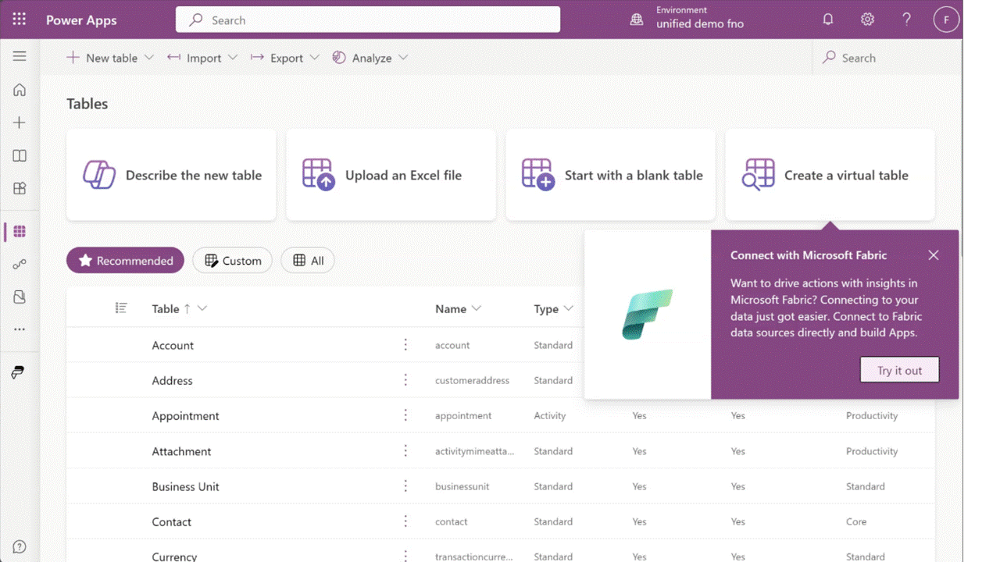

# Build apps and automations, drive action with insights from Microsoft Fabric (preview)

[!INCLUDE [cc-beta-prerelease-disclaimer](../../includes/cc-beta-prerelease-disclaimer.md)]

Link to Microsoft Fabric feature in Dataverse enables extending your data and insights in Dynamics 365 and Power Apps in Microsoft Fabric. Bring your own data into Fabric and combine, reshape, and aggregate data with data from Dataverse. Use Fabric tools such as SQL, Spark, and dataflows to work with your data within Fabric. For example:

- Combine financial data from Dynamics 365 with financial data from other systems to derive consolidated insights.
- Merge historical data ingested into OneLake from legacy systems with current business data from Dynamics 365 and Dataverse.
- Combine weblogs and telemetry data from your website with product and order details from Dynamics 365.
- Apply machine learning and detect anomalies and exceptions within your data.

<!-- Is this in public preview now? If so, it needs the proper indicators as per below-->
> [!IMPORTANT]
>
> - This is a preview feature.
> - [!INCLUDE [cc-preview-features-definition](../../includes/cc-preview-features-definition.md)]

Insights aren't complete unless you can drive action and business processes. Bring insights you found in Fabric to build apps, drive business processes with Power Automate without data copy, no-ETL or third-party integration tools.

With Dataverse virtual tables sourced with Fabric, your low-code app builders connect to data in Microsoft OneLake and build Power Apps and drive business actions. Additionally, with Power Pages, low-code makers can build external facing websites and drive action from OneLake insights with partners, suppliers, and customers

## Prerequisites

- An existing Dataverse environment or you can create a new developer environment. More information: [Create a developer environment](/power-platform/developer/create-developer-environment)
- Contributor or administrator access to a Fabric workspace with data.

If you don’t have Power BI premium license or Fabric capacity, you can sign up for a free [Fabric trial capacity](/fabric/get-started/fabric-trial)

If you don't have a workspace with data, create a workspace with sample data using the [lakehouse tutorial here](/fabric/data-engineering/tutorial-build-lakehouse)

## Create a virtual table with Fabric data

Follow these steps to create a virtual table using Fabric data.

> [!NOTE]
>
> This feature is enabled by default with all environments. Admins can disable this feature in the Power Platform admin center in the environment feature settings.

1. Sign into [Power Apps](https://make.powerapps.com), and then select **Tables** on the left navigation pane.
2. On the command bar, select **New table** > **Create a virtual table**.
3. Select **Microsoft Fabric** as the connection, and then select **Next**.
4. Select a **Microsoft Fabric workspace** from the available list of workspaces. All workspace where you have access are available in the list.
5. You can also choose a **Microsoft Fabric Lakehouse** from the drop-down list. All Lakehouses and data warehouses within the workspace selected previously are available to choose. <!-- Is this an option or is the selection required? -->
6. On the **Data** page, select a table from the list of tables shown from the Lakehouse. Select the **Configure table and column names that will be used in Dataverse** checkbox if you want to rename any of the fields or tables in Dataverse or to specify additional properties available for you in Dataverse. Select **Next**.
7. If you selected the **Configure table and column names that will be used in Dataverse** checkbox, you are shown the table and column properties and you can modify them here. When you're done modifying them select **Next**.
8. Review the information shown, and then select **Finish**.

A new Dataverse virtual table is created with data from Fabric.

## Building Apps and taking action with insights

Build apps with the virtual table sourced with Fabric data in Power Apps (make.powerapps.com) by selecting the **Create an app** option from the **Tables** area. Select the virtual table that contains data from Fabric to get started. <!-- There is no Create an app option from the Tables area in the maker portal. Did you mean select the virtual table you created from the Tables area ? -->