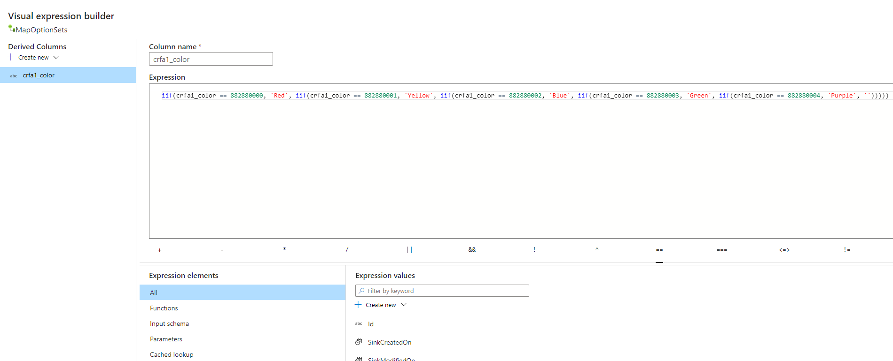

# Access Dataverse choices (option sets) with Azure Data Factory

[!INCLUDE[cc-data-platform-banner](../../includes/cc-data-platform-banner.md)]

For columns that use Dataverse [Choices](/powerapps/maker/data-platform/create-edit-global-option-sets), choice values are written as an integer label and not a text label to maintain consistency during edits. The integer-to-text label mappingis stored in the *Microsoft.Athena.TrickleFeedService/table-EntityMetadata.json* file. This article covers how to access the integer-to-text label mapping using Azure Data Factory.

> [!NOTE]
> Azure Synapse Link for Dataverse was formerly known as Export to data lake. The service was renamed effective May 2021 and will continue to export data to Azure Data Lake as well as Azure Synapse Analytics.

## Prerequisites

This section describes the prerequisites necessary to access Dataverse choices with Azure Data Factory after using the Azure Synapse Link for Dataverse service.

- **Azure Synapse Link for Dataverse.** This guide assumes that you have already exported data from Dataverse by using the [Azure Synapse Link for Dataverse](export-to-data-lake.md).

- **Storage Account Access.** You must be granted one of the following roles for the storage account: Storage Blob Data Reader, Storage Blob Data Contributor, or Storage Blob Data Owner.

## Consuming Dataverse choices with Azure Data Factory

To add a column containing the text label of the Dataverse choice using Azure Data Factory, complete the following steps:

1. Launch Azure Data Factory.

2. Create a new Data flow and set the Source as the Azure Data Lake Storage Gen2 with your Dataverse data.

3. Add a **Derived Column** transformation step and provide a new name for the column.

4. **Open expression builder** and build an expression with a series of *iff* functions to map the integer choice label to the text choice label that is found in the *Microsoft.Athena.TrickleFeedService/table-EntityMetadata.json* file.

5. Add a sink to the data flow and run the pipeline.

### See also

[Azure Synapse Link for Dataverse](./export-to-data-lake.md)

[!INCLUDE[footer-include](../../includes/footer-banner.md)]
