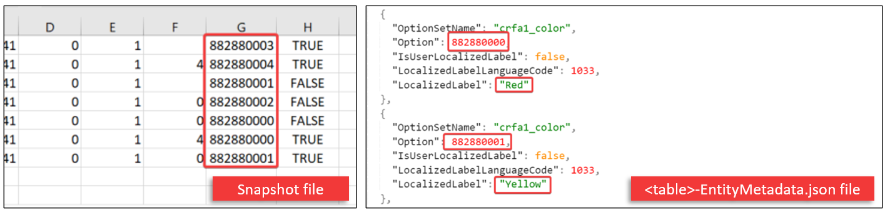

# Access Dataverse choices (option sets) with Azure Data Factory

[!INCLUDE[cc-data-platform-banner](../../includes/cc-data-platform-banner.md)]

> [!NOTE]
> Azure Synapse Link for Dataverse was formerly known as Export to data lake. The service was renamed effective May 2021 and will continue to export data to Azure Data Lake as well as Azure Synapse Analytics.

For columns that use Dataverse [Choices](/powerapps/maker/data-platform/create-edit-global-option-sets), choice values are written as an integer label and not a text label to maintain consistency during edits. The integer-to-text label mappingis stored in the *Microsoft.Athena.TrickleFeedService/,table-EntityMetadata.json* file. This article covers how to access the integer-to-text label mapping using Azure Data Factory.

## Prerequisites

This section describes the prerequisites necessary to access Dataverse choices with Azure Data Factory after using the Azure Synapse Link for Dataverse service.

- **Azure Synapse Link for Dataverse:** This guide assumes that you have already exported data from Dataverse by using the [Azure Synapse Link for Dataverse](export-to-data-lake.md).

- **Storage Account Access.** You must be granted one of the following roles for the storage account: Storage Blob Data Reader, Storage Blob Data Contributor, or Storage Blob Data Owner.



## Consuming Dataverse choices with Power BI

1. Open Power BI Desktop.

2. Select **Get Data** > **Blank query** and then open the **Advanced Editor**.

3. Paste the following query and replace **\<STORAGE\>** with the storage account name, **\<CONTAINER\>** with the name of the container, and **\<TABLE\>** with the name of the Dataverse Table that contains the Choices you want to access.

```Power Query M
  let
    Source = AzureStorage.DataLake("https://<STORAGE>.dfs.core.windows.net/<CONTAINER>/Microsoft.Athena.TrickleFeedService/<TABLE>-EntityMetadata.json"),
    #"https://<STORAGE> dfs core windows net/<CONTAINER>/Microsoft Athena TrickleFeedService/_<TABLE>-EntityMetadata json" = Source{[#"Folder Path"="https://<STORAGE>.dfs.core.windows.net/<CONTAINER>/Microsoft.Athena.TrickleFeedService/",Name="<TABLE>-EntityMetadata.json"]}[Content],
    #"Imported JSON" = Json.Document(#"https://<STORAGE> dfs core windows net/<CONTAINER>/Microsoft Athena TrickleFeedService/_<TABLE>-EntityMetadata json",1252),
    OptionSetMetadata = #"Imported JSON"[OptionSetMetadata],
    #"Converted to Table" = Table.FromList(OptionSetMetadata, Splitter.SplitByNothing(), null, null, ExtraValues.Error),
    #"Expanded Column1" = Table.ExpandRecordColumn(#"Converted to Table", "Column1", {"EntityName", "OptionSetName", "Option", "IsUserLocalizedLabel", "LocalizedLabelLanguageCode", "LocalizedLabel"}, {"Column1.EntityName", "Column1.OptionSetName", "Column1.Option", "Column1.IsUserLocalizedLabel", "Column1.LocalizedLabelLanguageCode", "Column1.LocalizedLabel"})
  in
    #"Expanded Column1"
```

4. This will populate a dataset with the choices and various metadata for that choice that you can join with your Dataverse Table data to display the text label for the choice.

### See also

[Azure Synapse Link for Dataverse](./export-to-data-lake.md)

[!INCLUDE[footer-include](../../includes/footer-banner.md)]
