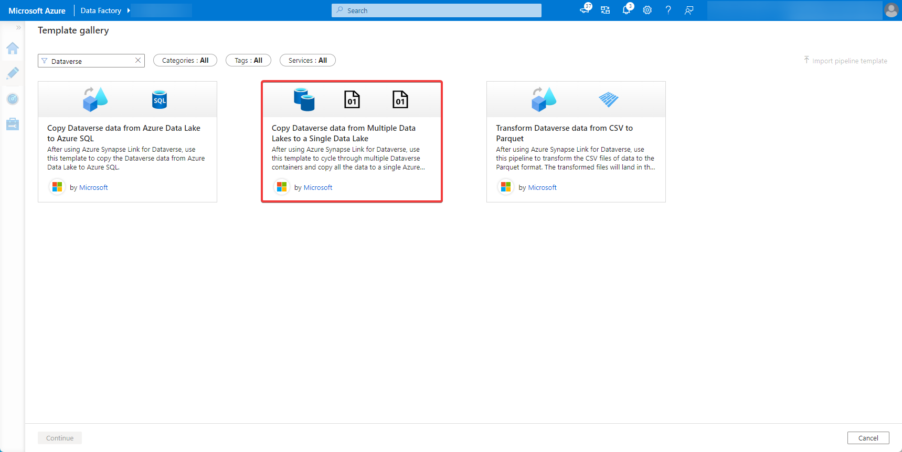
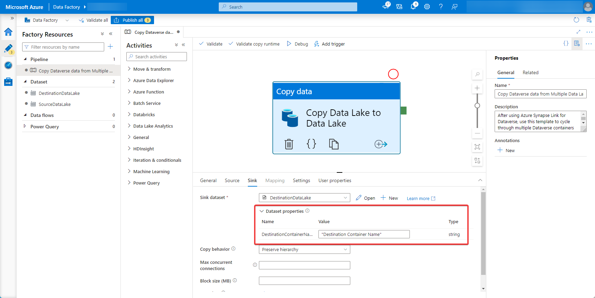

# Copy Dataverse data from multiple data Lakes to a single data lake

[!INCLUDE[cc-data-platform-banner](../../includes/cc-data-platform-banner.md)]

After exporting data from Microsoft Dataverse to Azure Data Lake Storage Gen2 with Azure Synapse Link for Dataverse, you can use Azure Data Factory to create a pipeline that copies data from multiple data lakes to a single data lake.

> [!NOTE]
> Azure Synapse Link for Dataverse was formerly known as Export to data lake. The service was renamed effective May 2021 and will continue to export data to Azure Data Lake as well as Azure Synapse Analytics.

This article shows you how to perform the following tasks:

1. Create a pipeline from an official Microsoft template.

2. Configure the template.

3. Run the pipeline.

## Prerequisites

This section describes the prerequisites necessary to copy exported Dataverse data from multiple data lakes to a single data lake.

- **Azure roles.** The user account that's used to sign in to Azure must be a member of the *contributor* or *owner* role, or an *administrator* of the Azure subscription. To view the permissions that you have in the subscription, go to the [Azure portal](https://portal.azure.com/), select your username in the upper-right corner, select **...**, and then select **My permissions**. If you have access to multiple subscriptions, select the appropriate one. To create and manage child resources for Data Factory in the Azure portal&mdash;including datasets, linked services, pipelines, triggers, and integration runtimes&mdash;you must belong to the *Data Factory Contributor* role at the resource group level or above.

- **Azure Synapse Link for Dataverse.** This guide assumes that you've already exported Dataverse data to multiple data lakes by using [Azure Synapse Link for Dataverse](export-to-data-lake.md).

- **Azure Data Factory.** This guide assumes that you've already created a data factory under the same subscription and resource group as the storage account containing the exported Dataverse data.

## Copy Dataverse data to a single data lake

1. Open [Azure Data Factory](https://ms-adf.azure.com/datafactories) and select the data factory that is on the same subscription and resource group as the storage accounts containing your exported Dataverse data. Then select **Author** from the left panel.

2. Select **+** > **Pipeline** > **Template gallery**.

3. Search for and select the **Copy Dataverse data from Multiple Data Lakes to a Single Data Lake** template created by Microsoft.

    

4. Select a **Linked service** for the *SourceDataLake* and the *DestinationDataLake*. Parameterize the *SourceDataLake* **Linked Service** to iterate through multiple data lakes. More information [Parameterize linked services in Azure Data Factory and Azure Synapse Analytics](/azure/data-factory/parameterize-linked-services?tabs=data-factory).

5. Select **Use this template**.

6. Under the **Source** tab, replace the *SourceContainerName* with the source Dataverse data lake.

    

7. On the **Sink** tab, replace the *DestinationContainerName* with the destination container name for your copied Dataverse data.

    

8. To run the pipeline, select **Debug** from the top bar and optionally **Add trigger** to copy data on a schedule.

### See also

[Azure Synapse Link for Dataverse](./export-to-data-lake.md)

[!INCLUDE[footer-include](../../includes/footer-banner.md)]
