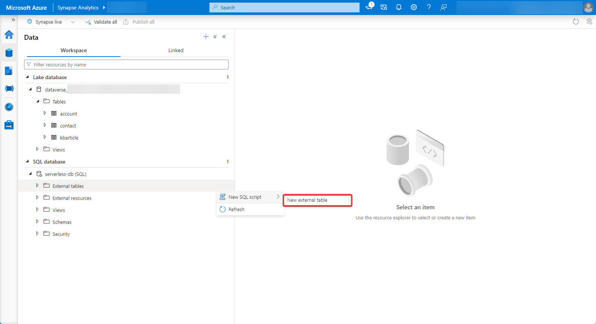
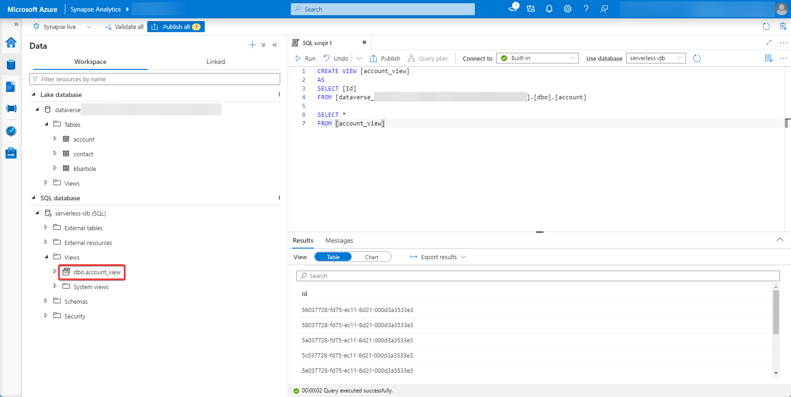

# Create a view of your Azure Synapse Link for Dataverse data

[!INCLUDE[cc-data-platform-banner](../../includes/cc-data-platform-banner.md)]

You can use the Azure Synapse Link to connect your Microsoft Dataverse data to Azure Synapse Analytics to explore your data and accelerate time to insight. This article shows you how to create a view of your Dataverse data in your Azure Synapse Analytics workspace.

> [!NOTE]
> Azure Synapse Link for Microsoft Dataverse was formerly known as Export to data lake. The service was renamed effective May 2021 and will continue to export data to Azure Data Lake as well as Azure Synapse Analytics.

## Prerequisites

This section describes the prerequisites necessary to create a view of your Dataverse data after using the Azure Synapse Link for Dataverse service.

- **Azure Synapse Link for Dataverse.** This guide assumes that you have already exported data from Dataverse by using the [Azure Synapse Link for Dataverse](export-to-data-lake.md).

- **Storage Account Access.** You must be granted one of the following roles for the storage account: Storage Blob Data Reader, Storage Blob Data Contributor, or Storage Blob Data Owner.

- **Synapse administrator.** You must be granted the **Synapse Administrator** role access within Synapse studio.

- **SQL Database.** This guide assumes you have created an additional SQL database (Serverless Pool or Dedicated Pool) in your Azure Synapse Analytics workspace to save the view.

## Create a view your Dataverse data

1. In Power Apps, select your desired Azure Synapse Link from the list, and then select **Go to Azure Synapse workspace**.

    

2. Expand **SQL database**, and select the **...** next to the database where you will store your view. The select **New SQL script** > **Empty script**.

    

3. Run a create view script by specifying a view name, the column names, Dataverse database name, and the exported table name.

```sql
CREATE VIEW [VIEW NAME] 
AS
SELECT [COLUMN NAMES]
FROM [DATAVERSE DATABASE NAME].[dbo].[TABLE NAME]

```

4. Find the new view under the **Views** directory in the SQL Database.

    

### See also

[Blog: Announcing Azure Synapse Link for Dataverse](https://aka.ms/synapse-dataverse)

[!INCLUDE[footer-include](../../includes/footer-banner.md)]
