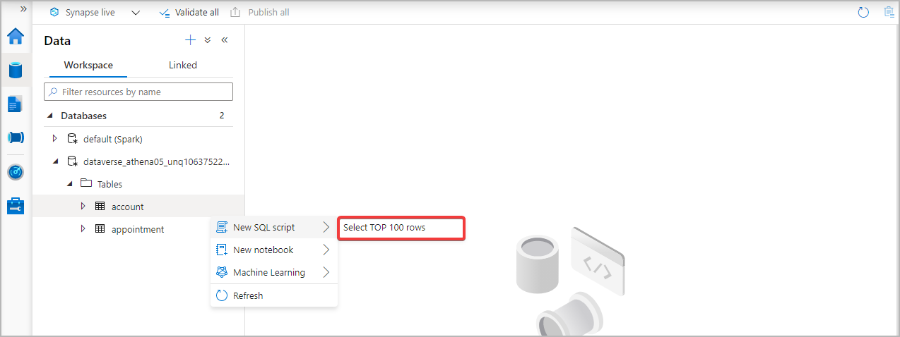

# Create a view of your Azure Synapse Link for Dataverse data

[!INCLUDE[cc-data-platform-banner](../../includes/cc-data-platform-banner.md)]

You can use the Azure Synapse Link to connect your Microsoft Dataverse data to Azure Synapse Analytics to explore your data and accelerate time to insight. This article shows you how to create a view of your Dataverse data in your Azure Synapse Analytics workspace.

> [!NOTE]
> Azure Synapse Link for Microsoft Dataverse was formerly known as Export to data lake. The service was renamed effective May 2021 and will continue to export data to Azure Data Lake as well as Azure Synapse Analytics.

## Prerequisites

This section describes the prerequisites necessary to create a view of your Dataverse data after using the Azure Synapse Link for Dataverse service.

- **Azure Synapse Link for Dataverse.** This guide assumes that you have already exported data from Dataverse by using the [Azure Synapse Link for Dataverse](export-to-data-lake.md).

- **Storage Account Access.** You must be granted one of the following roles for the storage account: Storage Blob Data Reader, Storage Blob Data Contributor, or Storage Blob Data Owner.

- **Synapse administrator.** You must be granted the **Synapse Administrator** role access within Synapse studio.

- **SQL Database.** This guide assumes you have created an additional SQL database (Serverless or Dedicated) in your Azure Synapse Analytics workspace to save the view.

## Create a view your Dataverse data

1. In Power Apps, select your desired Azure Synapse Link from the list, and then select **Go to Azure Synapse workspace**.

    

2. Expand **Databases**, select your Dataverse container. Your exported tables are displayed under the **Tables** directory on the left sidebar.

    

3. Right-click the desired table and select **New SQL script** > **Select TOP 100 rows**.

    

4. Select **Run**. Your query results are displayed on the **Results** tab. Alternatively, you can edit the script to your needs.

    

## Query multiple Dataverse databases with serverless SQL pool

> [!NOTE]
> Querying multiple Dataverse databases requires that both Dataverse environments are in the same region.

1. Add another Azure Data Lake Storage Gen2 account as a Linked service to the same Azure Synapse Analytics workspace where the current link resides.

2. Follow the configuration steps to create a new Azure Synapse Link with the new Azure Synapse Analytics and Azure Data Lake combination.

3. Navigate to the shared Synapse workspace and expand **Databases**. Select one of the Dataverse containers. Your exported tables are displayed under the **Tables** directory on the left sidebar.

4. Right-click a table, and then select **New SQL script** > **Select TOP 100 rows**.

5. Edit the query to combine the two datasets. For instance, you can join the datasets based on a unique ID value.

6. Select **Run**. Your query results are displayed on the **Results** tab.

### See also

[Blog: Announcing Azure Synapse Link for Dataverse](https://aka.ms/synapse-dataverse)

[!INCLUDE[footer-include](../../includes/footer-banner.md)]
