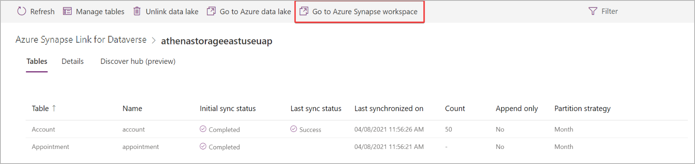

# Create a view of your Azure Synapse Link for Dataverse data

[!INCLUDE[cc-data-platform-banner](../../includes/cc-data-platform-banner.md)]

Use the Azure Synapse Link to connect your Microsoft Dataverse data to Azure Synapse Analytics to explore your data and accelerate time to insight. This article shows you how to create a view of your Dataverse data in your Azure Synapse Analytics workspace.

> [!NOTE]
> Azure Synapse Link for Microsoft Dataverse was formerly known as Export to data lake. The service was renamed effective May 2021 and will continue to export data to Azure Data Lake as well as Azure Synapse Analytics.

## Prerequisites

This section describes the prerequisites necessary to create a view of your Dataverse data after using the Azure Synapse Link for Dataverse service.

- **Azure Synapse Link for Dataverse.** This guide assumes that you have already exported data from Dataverse by using the [Azure Synapse Link for Dataverse](export-to-data-lake.md).

- **Storage Account Access.** You must be granted one of the following roles for the storage account: Storage Blob Data Reader, Storage Blob Data Contributor, or Storage Blob Data Owner.

- **Synapse administrator.** You must be granted **Synapse Administrator** role access within Synapse studio.


## Create a view of your Dataverse data

1. In Power Apps, select your Azure Synapse Link from the list, and then select **Go to Azure Synapse workspace**.

    

2. Create User-defined schema within Synapse SQL

   ```sql
   CREATE SCHEMA [SCHEMA NAME] 
   GO
   ```
   
3. Run a create view script by specifying a **view name**, the **column names**, **Dataverse database name** under the new **schema**, and then exported **table name**.

   ```sql
   CREATE OR ALTER VIEW [SCHEMA NAME].[VIEW NAME] 
   AS
   SELECT [COLUMN NAMES]
   FROM [DATAVERSE DATABASE NAME].[dbo].[TABLE NAME]

   ```

## Use a view of your Dataverse data

You can use views in your queries the same way you use views in SQL Server queries.
The view will be created and accessible under views folder in **SQL Server Management Studio (SSMS)** or **Azure Data Studio**

> [!IMPORTANT]
> Custom database objects created by a customer within the Azure Synapse Link database are deleted once the unlink is completed.
>
> Customers will need to implement their own version control of their custom database objects scripts to ensure they have a backup.

### See also

[Blog: Announcing Azure Synapse Link for Dataverse](https://aka.ms/synapse-dataverse)

[!INCLUDE[footer-include](../../includes/footer-banner.md)]
