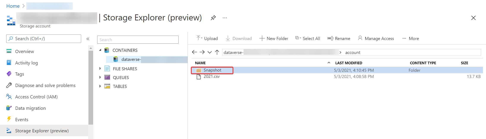
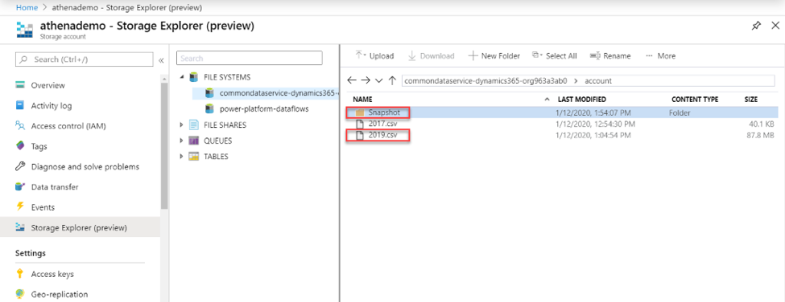
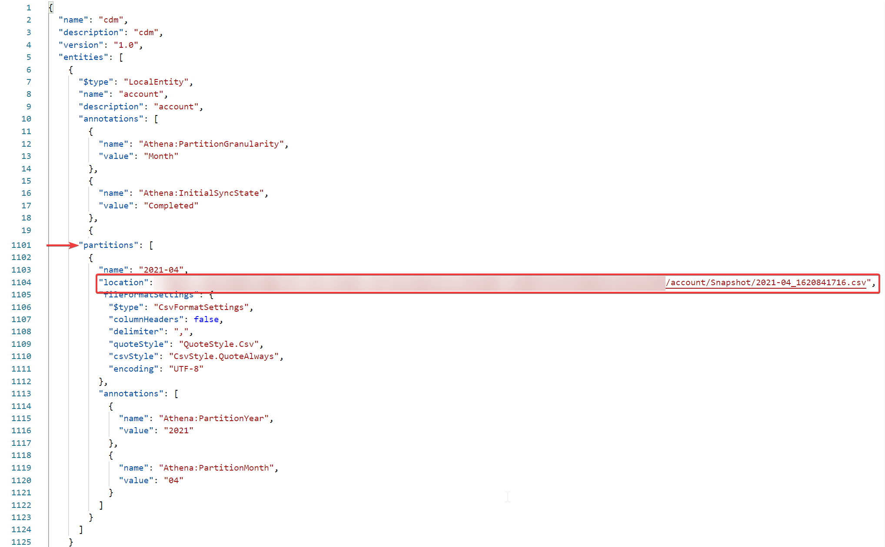

# Create an Azure Synapse Link for Dataverse with Azure Data Lake

[!INCLUDE[cc-data-platform-banner](../../includes/cc-data-platform-banner.md)]

You can use the Azure Synapse Link to connect your Microsoft Dataverse data to Azure Data Lake Storage Gen2 to enable various analytics scenarios. This article shows you how to perform the following tasks:

1. Connect your Dataverse data to your Azure Data Lake Storage Gen2 account with the Azure Synapse Link service.
2. Manage Dataverse tables included in the Azure Synapse Link.
3. Monitor your Azure Synapse Link.
4. Unlink your Azure Synapse Link.
5. Relink your Azure Synapse Link.
6. View your data in Azure Data Lake and understand the file structure.

> [!NOTE]
> Azure Synapse Link for Dataverse was formerly known as Export to data lake. The service was renamed effective May 2021 and will continue to export data to Azure Data Lake as well as Azure Synapse Analytics.

## Prerequisites

- Azure Data Lake Storage Gen2: You must have an Azure Data Lake Storage Gen2 account and **Owner** and **Storage Blob Data Contributor** role access. Your storage account must enable **Hierarchical namespace** and we recommend that replication is set to **read-access geo-redundant storage (RA-GRS)** properties")

> [!NOTE]
>
> - The storage account must be created in the same Azure Active Directory (Azure AD) tenant as your Power Apps tenant.
> - The storage account must be created in the same region as the Power Apps environment you will use the feature in.
> - You must have **Reader** role access to the resource group with the storage account.  
> - To link the Dataverse environment to Azure Data Lake Storage Gen2, you must have the Dataverse system administrator security role.
> - Only tables that have change tracking enabled can be exported.

## Connect Dataverse to Azure Data Lake Storage Gen2

1. Sign in to [Power Apps](https://make.powerapps.com/?utm_source=padocs&utm_medium=linkinadoc&utm_campaign=referralsfromdoc) and select your preferred environment.

2. On the left navigation pane, select **Data**, select **Azure Synapse Link**, and then on the command bar, select **+ New link to data lake**.

    

3. Select the **Subscription**, **Resource group**, and **Storage account**. Ensure that storage account meets the requirements specified in the [Prerequisites](#prerequisites) section. Select **Next**.

    > [!NOTE]
    > As part of linking the Dataverse environment to a data lake, you grant the Azure Synapse Link service access to your storage account. Ensure that you followed the [prerequisites](#prerequisites) of creating and configuring the Azure data lake storage account, and granting yourself an owner role on the storage account. Additionally, you grant the Power Platform Dataflows service access to your storage account. More information: [Self-service data prep with dataflows](self-service-data-prep-with-dataflows.md).  

4. Add the tables you want to export, and then select **Save**. Only tables with change tracking enabled can be exported. More information: [Enable change tracking](/dynamics365/customer-engagement/admin/enable-change-tracking-control-data-synchronization).

   

You can follow the steps above to create a link from one Dataverse environment to multiple Azure data lakes in your Azure subscription. Similarly, you could create a link from multiple Dataverse environments to the same Azure Data Lake, all within the same tenant.

> [!NOTE]
> The data exported by Azure Synapse Link service is encrypted at rest in Azure Data Lake Storage Gen2. Additionally, transient data in the blob storage is also encrypted at rest. Encryption in Azure Data Lake Storage Gen2 helps you protect your data, implement enterprise security policies, and meet regulatory compliance requirements. More information: [Azure Data Encryption-at-Rest]( /azure/security/fundamentals/encryption-atrest)
>
> Currently, you can't provide public IPs for the Azure Synapse Link for Dataverse service that can be used in **Azure Data Lake firewall settings**. Public IP network rules have no effect on requests originating from the same Azure region as the storage account. Services deployed in the same region as the storage account use private Azure IP addresses for communication. Thus, you can't restrict access to specific Azure services based on their public outbound IP address range.
More information: [Configure Azure Storage firewalls and virtual networks]( /azure/storage/common/storage-network-security)

## Manage table data to the data lake

After you have set up the Azure Synapse Link, you can manage the tables that are exported in one of two ways:

- On the Power Apps maker portal **Azure Synapse Link** area, select **Manage tables** on the command bar to add or remove one or more linked tables.
- On the Power Apps maker portal **Tables** area, select **…** next to a table, and then select the linked data lake where you want to export table data.

   

## Monitor your Azure Synapse Link

After you have set up the Azure Synapse Link, you can monitor the Azure Synapse Link under the **Tables** tab.

- There will be a list of tables that are a part of the selected Azure Synapse Link.
- There are different stages the sync status will circulate through. **NotStarted** indicates that the table is waiting to be synced. Once the table initial sync has been **Completed**, there will be a post processing stage where incremental updates will not take place. This may take several hours depending on the size of your data. As the incremental updates start taking place, the date for the last sync will be regularly updated.
- The **Count** column shows the number rows written. When **Append only** is set to **No**, this is the total number of records. When **Append Only** is set to **Yes**, this is the total number of changes.
- The  **Append only** and **Partition strategy** columns show the usage of different advanced configurations.

## Unlinking an Azure Synapse Link

1. Select the desired Azure Synapse Link to unlink.

2. Select **Unlink data lake** from the command bar.

3. To delete both the data lake file system, select **Delete data lake file system**.

4. Select **Yes**, and allow a few minutes for everything to be unlinked and deleted.

## Relinking an Azure Synapse Link

If you deleted the file system when unlinking, follow the steps above to relink the same data lake. If you did not delete the file system when unlinking, you must clear the data to relink:

1. Go to the Azure Data Lake.

2. Delete the Dataverse container.

3. Go to Power Apps, and relink the data lake.

## View your data in Azure Data Lake Storage Gen2

1. Select the desired Azure Synapse Link, and then select **Go to Azure data lake** from the top panel.

2. Expand **File Systems**, and then select dataverse-*environmentName*-*organizationUniqueName*.

The model.json file, along with its name and version, provides a list of tables that have been exported to the data lake. The model.json file also includes the initial sync status and sync completion time.

A folder that includes snapshot comma-delimited (CSV format) files is displayed for each table exported to the data lake.
   

### Continuous snapshot updates

Microsoft Dataverse data can continuously change through create, update, and delete transactions. Snapshots provide a read-only copy of data that's updated at regular intervals, in this case every hour. This ensures that at any given point, a data analytics consumer can reliably consume data in the lake.

When tables are added as part of the initial export, the table data is written to the table.csv files under the corresponding folders in the data lake. This is the T1 interval, where a snapshot read-only file named *table*-T1.csv&mdash;for example, Account-T1.csv or Contacts-T1.csv&mdash;is created. Additionally, the model.json file is updated to point to these snapshot files. Opening model.json, you can view the snapshot details.

Here's an example of an Account.csv partitioned file and snapshot folder in the data lake.

Changes in Dataverse are continuously pushed to the corresponding CSV files by using the trickle feed engine. This is the T2 interval, where another snapshot is taken. *table*-T2.csv&mdash;for example, Accounts-T2.csv or Contacts-T2.csv (assuming there are changes for the table) &mdash;and model.json are updated to the new snapshot files. Any new person who views snapshot data from T2 onward is directed to the newer snapshot files. This way, the original snapshot viewer can continue to work on the older snapshot T1 files while newer viewers can read the latest updates. This is useful in scenarios that have longer-running downstream processes.

Here's an example of the model.json file, which always points to the latest time-stamped account snapshot file.

### What's next?

After successfully using the Azure Synapse Link for Dataverse service, discover how you can analyze and consume your data with **Discover Hub**. To access **Discover Hub**, go to **Power Apps** > **Azure Synapse Link**. Select your linked service and then select the **Discover Hub** tab. Here you can find recommended tools and curated documentation to help you get the most value out of your data.

### See also

[Analyze Dataverse data in the data lake with Power BI](./export-to-data-lake-data-powerbi.md)

[Ingest Dataverse data in the data lake with Azure Data Factory](./export-to-data-lake-data-adf.md)

[Azure Synapse Link for Dataverse Advanced Configuration](./azure-synapse-link-advanced-configuration.md)

[Azure Synapse Link FAQ](export-data-lake-faq.yml)

[!INCLUDE[footer-include](../../includes/footer-banner.md)]
