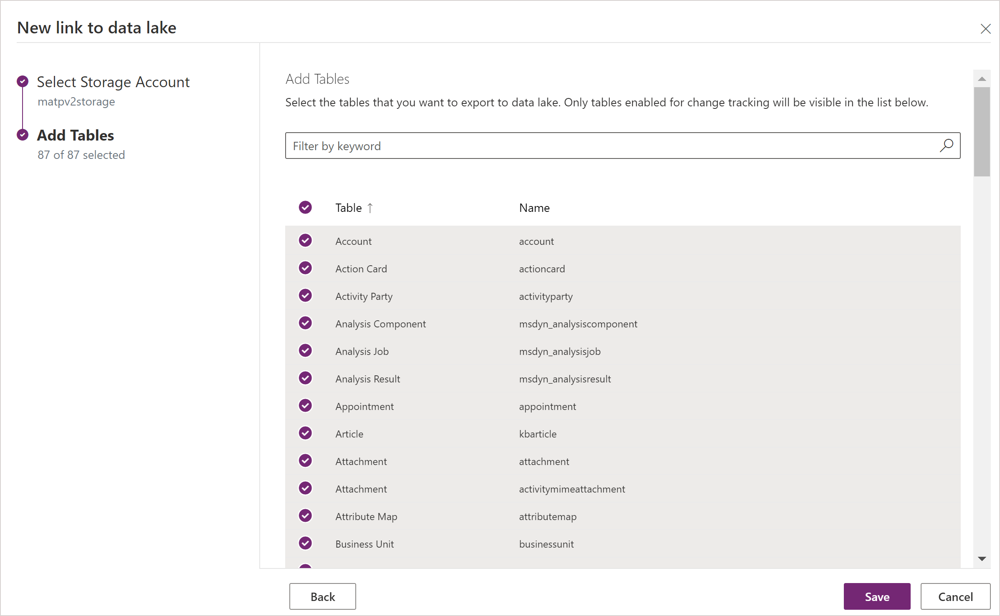

# Export table data to Azure Synapse Analytics and Azure Data Lake Storage Gen2

[!INCLUDE[cc-data-platform-banner](../../includes/cc-data-platform-banner.md)]

> [!NOTE]
> Azure Synapse Link for Dataverse was formerly known as Export to data lake. The service was renamed effective June 2021 and will continue to export to data to the data lake as well as Azure Synapse Analytics.

## Prerequisites

Before you can export Dataverse data to a data lake, you must create and configure an Azure Storage v2 (general-purpose v2) storage account. 

Follow the steps in the [Create an Azure Storage account](/azure/storage/blobs/data-lake-storage-quickstart-create-account) article, and note these requirements: 

- You must be granted an owner role on the storage account. 
- Set your storage type as **Storagev2 (general purpose v2)**. 
- The storage account must have the **Hierarchical namespace** feature enabled. 

 We recommend that you set replication to read-access geo-redundant storage (RA-GRS). More information: [Read-access geo-redundant storage](/azure/storage/common/storage-redundancy-grs#read-access-geo-redundant-storage)

>   

> [!NOTE]
> - The storage account must be created in the same Azure Active Directory (Azure AD) tenant as your Power Apps tenant.  
> - The storage account must be created in the same region as the Power Apps environment you'll use the feature in.
> - You must have **Reader** role access to the resource group with the storage account.  
> - To link the Dataverse environment to Azure Data Lake Storage Gen2, you must be a Dataverse administrator. 
> - Only tables that have change tracking enabled can be exported. 

## Select and export Dataverse table data to Azure Data Lake Storage Gen2

1. Sign in to [Power Apps](https://make.powerapps.com/?utm_source=padocs&utm_medium=linkinadoc&utm_campaign=referralsfromdoc), expand **Data**, and then select **Tables**. 
2. On the command bar, select **Export to data lake**, and then on the **Export to data lake** page, select **New link to data lake**. 
3. Select each of the following settings, and then select **Next**: 
   - **Subscription**. Select your Azure subscription. 
   - **Resource group**. Select the resource group that contains the Storage v2 (general-purpose v2) storage account.
   - **Storage account**. Select the Storage v2 (general-purpose v2) storage account to use for the export. 

    > [!NOTE]
    > As part of linking the Dataverse environment to a data lake, you grant the Export to Data Lake service access to your storage account. Ensure that you followed the [prerequisites](#prerequisites) of creating and configuring the Azure data lake storage account, and granting yourself an owner role on the storage account. Additionally, you grant the Power Platform Dataflows service access to your storage account. More information: [Self-service data prep with dataflows](self-service-data-prep-with-dataflows.md).  

4. Select the tables that you want to export to the data lake, and then select **Save**. Only tables with change tracking enabled can be exported. More information: [Enable change tracking](/dynamics365/customer-engagement/admin/enable-change-tracking-control-data-synchronization)

   > [!div class="mx-imgBorder"] 
   > 

Your Dataverse environment is linked to the Azure Data Lake Storage Gen2 account. The file system in the Azure storage account is created with a folder for each table selected to be replicated to the data lake. 

You can follow the steps above to create a link from one Dataverse environment to multiple Azure data lakes in your Azure subscription. Similarly, you could create a link from multiple Dataverse environments to the same Azure Data Lake, all within the same tenant.

> [!NOTE]
> The data exported by Export to data lake service is encrypted at rest in Azure Data Lake Storage Gen2. Additionally, transient data in the blob storage is also encrypted at rest. Encryption in Azure Data Lake Storage Gen2 helps you protect your data, implement enterprise security policies, and meet regulatory compliance requirements. More information: [Azure Data Encryption-at-Rest]( /azure/security/fundamentals/encryption-atrest)  
> Currently, you can't provide public IPs for Export to data lake service that can be used in **Azure Data Lake firewall settings**. Public IP network rules have no effect on requests originating from the same Azure region as the storage account. Services deployed in the same region as the storage account use private Azure IP addresses for communication. Thus, you can't restrict access to specific Azure services based on their public outbound IP address range. 
More information: [Configure Azure Storage firewalls and virtual networks]( /azure/storage/common/storage-network-security)

## Manage table data to the data lake

After you've set up data export to Azure Data Lake Storage Gen2 in your subscription, you can manage the export of table data to the data lake in one of two ways: 

- On the Power Apps maker portal **Export to data lake** area, select **Manage tables** on the command bar to add or remove one or more linked tables.
- On the Power Apps maker portal **Tables** area, select **…** next to a table, and then select the linked data lake where you want to export table data. 

   

To unlink all linked tables, on the Power Apps maker portal **Export to data lake** area, select **Unlink data lake**.

## View your data in Azure Data Lake Storage Gen2

1. Sign in to [Azure](https://portal.azure.com), select the storage account, and then in the leftmost navigation pane, select **Storage Explorer**. 
2. Expand **File Systems**, and then select commondataservice-*environmentName*-org-*Id*. 

The model.json file, along with its name and version, provides a list of tables that have been exported to the data lake. The model.json file also includes the initial sync status and sync completion time. 

A folder that includes snapshot comma-delimited (CSV format) files is displayed for each table exported to the data lake.
   > [!div class="mx-imgBorder"] 
   >  

### What's next?
After successfully using the Export to Data Lake service, discover how you can analyze and consume your data with **Discover Hub**. To access **Discover Hub**, go to **Power Apps** > **Export to data lake**. Select your linked service and then select the **Discover Hub** tab. Here you can find recommended tools and curated documentation to help you get the most value out of your data.

### See also

[Analyze exported data with Power BI](./export-to-data-lake-data-powerbi.md)

[Ingest exported data with Azure Data Factory](./export-to-data-lake-data-adf.md)

[Export to data lake FAQ](export-data-lake-faq.yml)

[Blog: Exporting CDS data to Azure Data Lake](https://powerapps.microsoft.com/blog/exporting-cds-data-to-azure-data-lake-preview/)

[!INCLUDE[footer-include](../../includes/footer-banner.md)]
