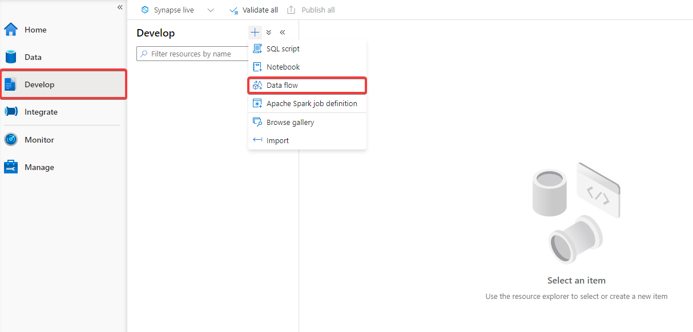
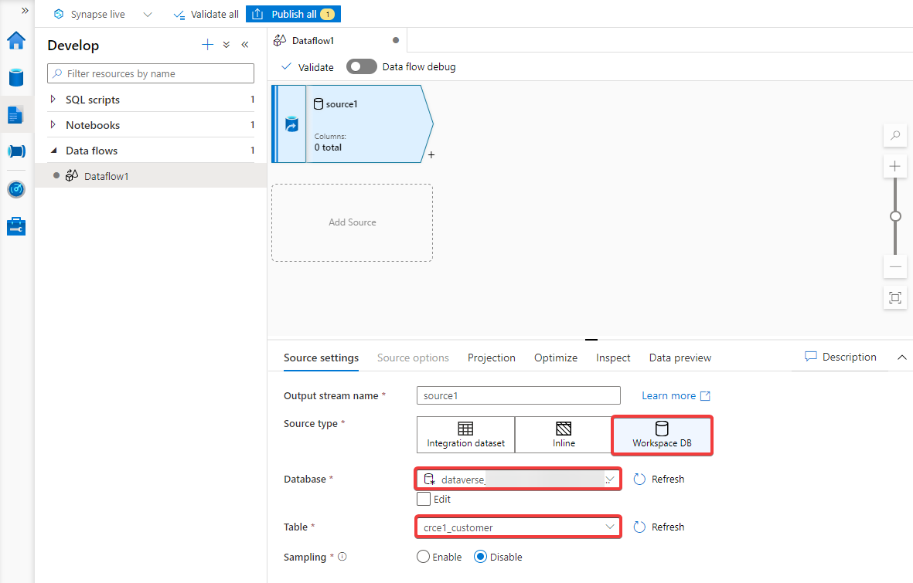
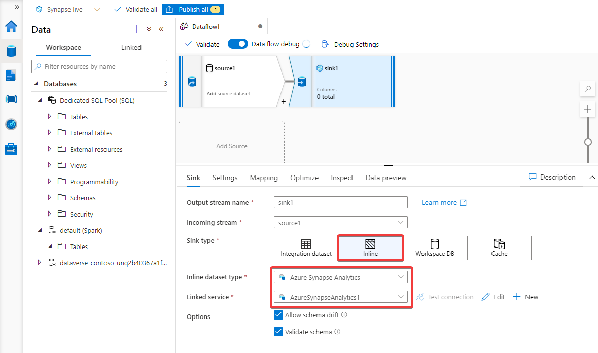

# Copy exported Dataverse data to Dedicated SQL

[!INCLUDE[cc-data-platform-banner](../../includes/cc-data-platform-banner.md)]

> [!NOTE]
>
> - Azure Synapse Link for Microsoft Dataverse was formerly known as Export to data lake. The service was renamed effective May 2021 and will continue to export data to Azure Data Lake as well as Azure Synapse Analytics.
> - This feature is still in preview and preview features are are not complete, but are made available on a “preview” basis so customers can get early access and provide feedback. Preview features may have limited or restricted functionality, are not meant for production use, and may be available only in selected geographic areas.

After creating a continuous pipeline of data from Dataverse to your Synapse workspace with Azure Synapse Link for Dataverse, you can copy the data to Dedicated SQL with Synapse Pipelines.

> [!NOTE]
> Azure Synapse Link for Dataverse was formerly known as Export to data lake. The service was renamed effective May 2021 and will continue to export data to Azure Data Lake as well as Azure Synapse Analytics.

## Prerequisites

This section describes the prerequisites necessary to ingest exported Dataverse data with Data Factory.

### Azure Synapse Link for Dataverse

This guide assumes that you've already exported Dataverse data by using [Azure Synapse Link for Dataverse](export-to-data-lake.md).

### Dedicated SQL Pool

This guide assumes that you've already created a Dedicated SQL Pool. You can create a Dedicated SQL pool under the **Manage** tab in your Synapse workspace.

## Copy the exported Dataverse data to Dedicated SQL

1. Navigate to your Azure Synapse Analytics workspace.

2. Open the **Develop** tab and create a new **Data flow**. Turn on **data flow debug**. This can take several minutes to complete.

    

3. Create a **Source** and specify the **Source type** as **Workspace DB** and select the **Database** that contains the Dataverse data and **Table** you want to copy.

    

4. Create a **Sink** and specify the **Sink type** as **Inline** and **Inline dataset type** as **Azure Synapse Analytics**. Select your Dedicated SQL Pool as the **Linked service**. If the Dedicated SQL Pool is not already a linked service, create a new connection.

    

5. Under the **Settings** tab, **Refresh** the **Schema Name**. Select *sys* and for the **Table name** select *all_columns*. Optionally, configure the other settings.

6. Navigate to the **Integrate** tab of the Synapse workspace and create a new **Pipeline**.

7. Expand the **Move & Transform** activity and drag and drop **Data flow** into the workspace.

8. Open the **Settings** and ensure that you have selected the data flow created in the previous steps.

9. Run your pipeline. OPtionally, **Add trigger** to specify a time for the pipeline to run.

### See also

[Azure Synapse Link for Dataverse](./export-to-data-lake.md)

[!INCLUDE[footer-include](../../includes/footer-banner.md)]
