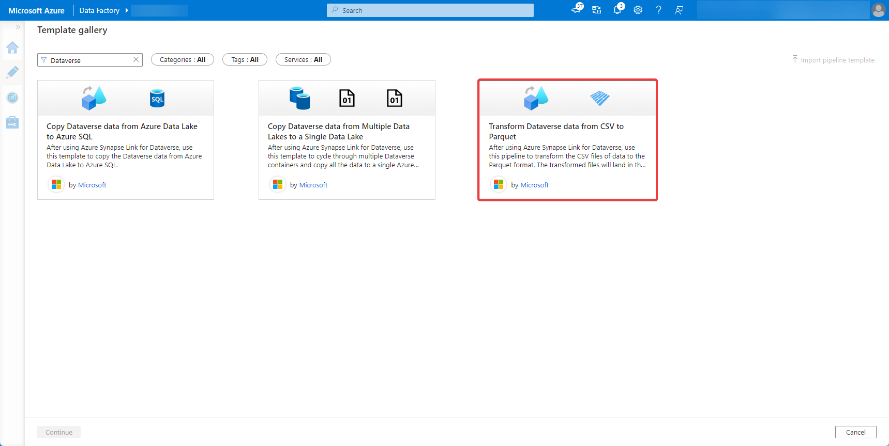
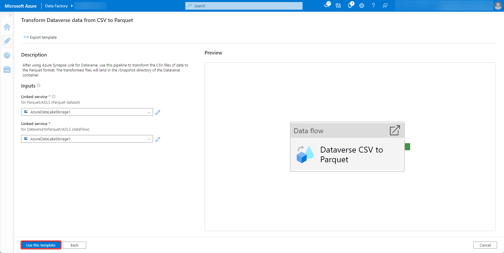
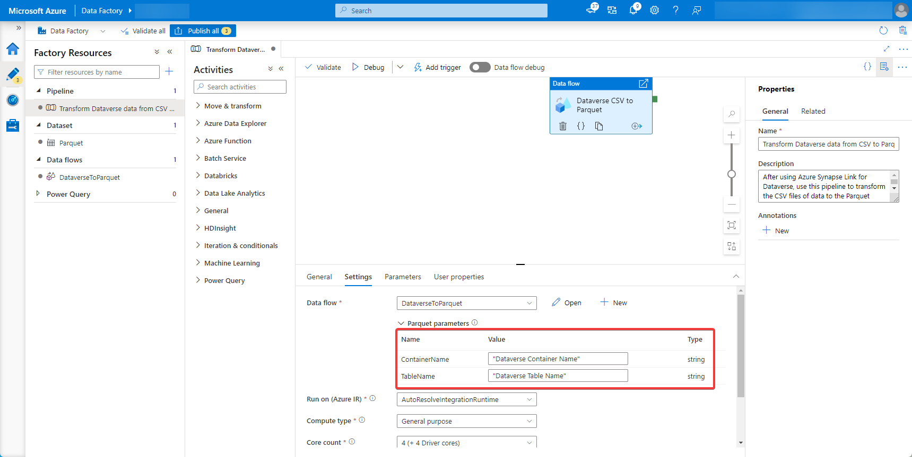
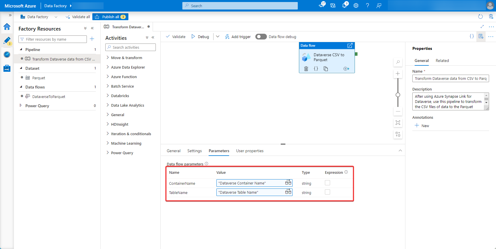

# Transform Dataverse data from CSV to Parquet with a pipeline template

[!INCLUDE[cc-data-platform-banner](../../includes/cc-data-platform-banner.md)]

After exporting data from Microsoft Dataverse to Azure Data Lake Storage Gen2 with Azure Synapse Link for Dataverse, you can use Azure Data Factory to create a pipeline that copies data from the data lake to Azure SQL.

> [!NOTE]
> Azure Synapse Link for Dataverse was formerly known as Export to data lake. The service was renamed effective May 2021 and will continue to export data to Azure Data Lake as well as Azure Synapse Analytics.

This article shows you how to perform the following tasks:

1. Create a pipeline from a Microsoft template.

2. Configure the template.

3. Run the pipeline.

## Prerequisites

This section describes the prerequisites necessary to transform Dataverse data to from CSV to Parquet.

- **Azure roles.** The user account that's used to sign in to Azure must be a member of the *contributor* or *owner* role, or an *administrator* of the Azure subscription. To view the permissions that you have in the subscription, go to the [Azure portal](https://portal.azure.com/), select your username in the upper-right corner, select **...**, and then select **My permissions**. If you have access to multiple subscriptions, select the appropriate one. To create and manage child resources for Data Factory in the Azure portal&mdash;including datasets, linked services, pipelines, triggers, and integration runtimes&mdash;you must belong to the *Data Factory Contributor* role at the resource group level or above.

- **Azure Synapse Link for Dataverse.** This guide assumes that you've already exported Dataverse data by using [Azure Synapse Link for Dataverse](export-to-data-lake.md). In this example, the account table data is exported to the data lake.

- **Azure Data Factory.** This guide assumes that you've already created a data factory under the same subscription and resource group as the storage account containing the exported Dataverse data.

## Transform Dataverse data from CSV to Parquet with a Pipeline Template

1. Open [Azure Data Factory](https://ms-adf.azure.com/datafactories) and select the data factory that is on the same subscription and resource group as the storage account containing your exported Dataverse data. Then select **Author** from the left panel.

2. Select **+** >  **Pipeline** > **Template gallery**.

3. Search for and select the **Transform Dataverse data from CSV to Parquet** template created by Microsoft.

    

4. Input the Azure Data Lake Storage Gen2 account containing the exported Dataverse data for the first entry and the destination Azure Data Lake Storage Gen2 account where the parquet files will be created for the second entry. Select **Use this template**.

    

5. Select the data flow **Settings** tab and replace the values for *ContainerName* and *TableName*.

    

6. Select the data flow **Parameters** tab and replace the values for *ContainerName* and *TableName*.

    

7. Navigate to the pipeline and run it. Optionally, **Add trigger** to transform the data at specific time intervals.

### See also

[Azure Synapse Link for Dataverse](./export-to-data-lake.md)

[!INCLUDE[footer-include](../../includes/footer-banner.md)]
