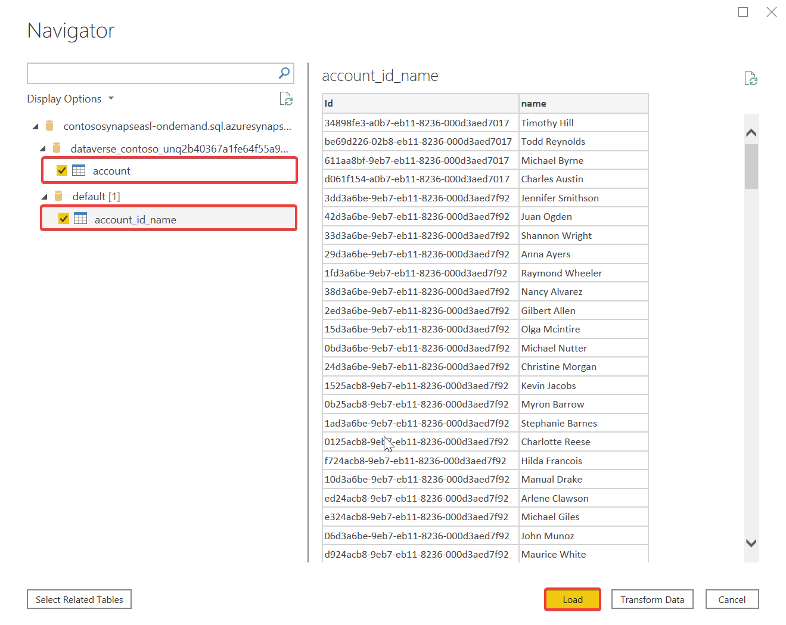

# Visualize Azure Synapse Link for Dataverse data with Power BI

[!INCLUDE[cc-data-platform-banner](../../includes/cc-data-platform-banner.md)]

You can use the Azure Synapse Link to connect your Microsoft Dataverse data to Azure Synapse Analytics to explore your data and accelerate time to insight. This article shows you how to generate a Power BI report by connecting to the serverless SQL endpoint from your Azure Synapse Analytics workspace.

> [!NOTE]
> Azure Synapse Link for Microsoft Dataverse was formerly known as Export to data lake. The service was renamed effective May 2021 and will continue to export data to Azure Data Lake as well as Azure Synapse Analytics.

## Prerequisites

This section describes the prerequisites necessary to access Dataverse choices with Power BI after using the Azure Synapse Link for Dataverse service.

- **Power BI Desktop**. [Get it now](https://powerbi.microsoft.com/downloads/)

- **Azure Synapse Link for Dataverse.** This guide assumes that you have already exported data from Dataverse by using the [Azure Synapse Link for Dataverse](export-to-data-lake.md).

- **Storage Account Access.** You must be granted one of the following roles for the storage account: Storage Blob Data Reader, Storage Blob Data Contributor, or Storage Blob Data Owner.

## Connect to your Azure Synapse Analytics workspace to Power BI

1. Open Power BI Desktop.

2. Select **Get data** > **More...**.

3. Select **Azure** > **Azure Synapse Analytics (SQL DW)** > **Connect**.

4. Go to your Azure Synapse Analytics workspace and copy the **Serverless SQL endpoint**.

    

5. Paste the endpoint for the **Server**. Select **DirectQuery** for the **Data Connectivity mode**. Select **OK**.

    

6. If prompted, sign in with your Microsoft Account.

7. Select the container and the preferred table from the Navigator, and then select **Load**. Optionally, expand *default* to access tables created with an Apache Spark notebook.

    

> [!NOTE]
> If you receive a credentials error, go to **File** > **Options and settings** > **Data source settings** and clear the permissions for the serverless SQL endpoint. Repeat the above steps.

8. Select fields from the **Fields** pane to create a simple table or create other visualizations.

    

### See also

[Blog: Announcing Azure Synapse Link for Dataverse](https://aka.ms/synapse-dataverse)

[!INCLUDE[footer-include](../../includes/footer-banner.md)]
