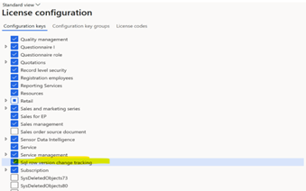

# Choose finance and operations data in Azure Synapse Link for Dataverse

Microsoft Azure Synapse Link for Dataverse lets you choose data from finance and operations apps. Use Azure Synapse Link to continuously export data from finance and operations apps into Azure Synapse Analytics and Azure Data Lake Storage Gen2.

Azure Synapse Link for Dataverse is a service that's designed for enterprise big data analytics. It provides scalable high availability together with disaster recovery capabilities. Data is stored in the Common Data Model format, which provides semantic consistency across apps and deployments.

Azure Synapse Link for Dataverse offers the following features that you can use with finance and operations data:

- You can choose both standard and custom finance and operations entities and tables.
- Continuous replication of entity and table data is supported. Create, update, and delete (CUD) transactions are also supported.
- You can link or unlink the environment to Azure Synapse Analytics and/or Data Lake Storage Gen2 in your Azure subscription. You don't have to go to the Azure portal or Microsoft Dynamics Lifecycle Services for system configuration.
- You can choose data and explore by using Azure Synapse. You don't have to run external tools to configure Synapse Analytics workspaces.
- All features of Azure Synapse Link for Dataverse are supported. These features include availability in all regions, saving as Parquet Delta files, and restricted storage accounts.
- The table limits in the Export to Data Lake service aren't applicable in Azure Synapse Link for Dataverse.
- By default, saving in Parquet Delta Lake format is enabled for finance and operations data, so that query response times are faster.

> [!NOTE]
> This is a preview feature.
>
> The Export to Data Lake feature in finance and operations apps will eventually be combined with Azure Synapse Link for Dataverse. We also plan to retire the Export to Data Lake service and transition existing customers to Azure Synapse Link for Dataverse.
>
> If you're planning to adopt the Export to Data Lake feature in finance and operations apps, you should consider adopting Azure Synapse Link with finance and operations data support instead. We will provide a path for existing customers to transition to Azure Synapse Link for Dataverse. If you're currently using the Export to Data Lake feature in finance and operations apps, you can continue to use both services in parallel until the transition.

## Prerequisites

- You must have a finance and operations sandbox (Tier-2) environment that's version update 10.0.34 (PU 58) or later. You can use a finance and operations Tier-1 environment (also known as a cloud-hosted environment) for validation. Your cloud-hosted environment must be version update 10.0.36 (PU 60) or later.
- The finance and operations apps environment must be linked with Microsoft Power Platform.
- You must have an Azure subscription that has owner access. (You can also add finance and operations data to an existing storage account that's configured with Azure Synapse Link.)

    - Storage account
    - Azure Synapse Analytics workspace
    - Azure Synapse Spark pool that has version 3.1 or later (for Delta Lake conversion)

## Microsoft Power Platform integration

You can enable the preview in an existing finance and operations apps environment if the environment is updated to **version 10.0.34 (PU 58) or later**. You can validate the feature by provisioning a new Tier-1 (cloud-hosted) environment that's **version 10.0.36 (PU 60) or later**.

You must enable Microsoft Power Platform integration. You can link with Microsoft Power Platform when you deploy the new environment. For more information about Microsoft Power Platform integration, see [Enable the Microsoft Power Platform integration](/dynamics365/fin-ops-core/dev-itpro/power-platform/enable-power-platform-integration#enable-during-deploy).

To confirm that the finance and operations apps environment is linked with Microsoft Power Platform, review the **Environment** page in Lifecycle Services.

> [!NOTE]
> Dual-write setup isn't required to enable finance and operations data in Azure Synapse Link.

## Add configurations in a finance and operations apps environment

During the preview, you must enable the **Sql row version change tracking** configuration key. To enable this configuration key, you must turn on maintenance mode. For more information about how to use maintenance mode, see [Turn maintenance mode on and off in DevTest/Demo environments hosted in Customer's subscription](/dynamics365/fin-ops-core/dev-itpro/sysadmin/maintenance-mode#turn-maintenance-mode-on-and-off-in-devtestdemo-environments-hosted-in-customers-subscription).

> [!NOTE]
> If you use a Tier-1 (cloud-hosted) environment, you must do a full database synchronization (DBSync) and use Visual Studio to complete the maintenance mode.

After row version change tracking is enabled, a system event that's triggered in your environment might cause reinitialization of tables in Export to Data Lake. If you have downstream consumption pipelines, you might have to reinitialize the pipelines. For more information, see [Some tables have been "initialized" without user action](/dynamics365/fin-ops-core/dev-itpro/data-entities/finance-data-azure-data-lake#some-tables-have-been-initialized-without-user-action).

## Enable finance and operations apps tables in Azure Synapse Link

You can enable both finance and operations entities and finance and operations apps tables in Azure Synapse Link for Dataverse. This section is focused on finance and operations apps tables.

Finance and operations apps tables are allowed only in Azure Synapse Link. Makers can't currently use them to build apps. **You don't have to define finance and operations apps tables as virtual entities, and you don't have to enable change tracking for each table**.

To enable this feature during the preview, you must use the following URL to open the maker portal. Replace `<environment ID>` with the ID of your environment.

`https://make.powerapps.com/environments/<environment ID>/exporttodatalake?athena.enableFnOTables=true`

> [!NOTE]
> Selection of the Delta Lake feature is mandatory for finance and operations apps Tables preview.

### Known limitations

The preview has several limitations that will be addressed in future releases. To learn more about the upcoming roadmap and stay in touch with product team, join the [preview Yammer group](https://aka.ms/SynapseLinkforDynamics).

- You must create a new Azure Synapse Link profile. You can't add finance and operations apps tables to existing Azure Synapse Link profiles.
- The following Microsoft-provided finance and operations apps tables aren't currently enabled in Azure Synapse Link. However, they will be enabled in a future release.
    - Tables that don't have a unique index on the `Rec ID` column. An example is the `REQPLAN` table.
    All other finance and operations apps tables that Microsoft provides are already enabled in Azure Synapse Link.

- To enable custom tables, you must enable change tracking in them. For more information about how to enable change tracking, see [Enable row version change tracking for tables](/dynamics365/fin-ops-core/dev-itpro/data-entities/rowversion-change-track#enable-row-version-change-tracking-for-tables).
- When you work with finance and operations data, you must select Delta Lake format as the default format. To enable Delta Lake format, follow the steps in [Export Microsoft Dataverse data in Delta Lake format](azure-synapse-link-delta-lake.md).
- The initial data export of finance and operations apps tables in Delta Lake format might take up to an hour. However, performance of the initial export will be improved in future updates.
- You can choose a maximum of 1,000 tables in a single Azure Synapse Link profile.

## Enable finance and operations data entities in Azure Synapse Link

You can enable both finance and operations entities and finance and operations apps tables in Azure Synapse Link for Dataverse. This section is focused on finance and operations data entities.

The process of enabling finance and operations entities has the following steps. Each step is explained in the following subsections.

1. **Enable finance and operations virtual entities in the Power Apps maker portal.** This step lets you use finance and operations entities in the Power Apps maker portal to build apps. You can also use them with Azure Synapse Link.
2. **Enable change tracking for finance and operations entities.** You must complete this step to enable Azure Synapse Link to use finance and operations entities.

After you've completed both steps, you can select finance and operations entities in Azure Synapse Link. To create Synapse Link for Dataverse in Delta Lake format, follow the steps in [Export Dataverse data in Delta Lake format](/power-apps/maker/data-platform/azure-synapse-link-delta-lake).

> [!NOTE]
> Finance and operations entities start with the prefix **mserp\_**.

### Enable finance and operations virtual entities in the Power Apps maker portal

You must enable finance and operations entities as **virtual entities** in Dataverse. Makers can then use the chosen finance and operations entities to build apps, and the entities can also be used with Azure Synapse Link.

To enable finance and operations entities as virtual entities, follow the steps in [Enable Microsoft Dataverse virtual entities](/dynamics365/fin-ops-core/dev-itpro/power-platform/enable-virtual-entities).

> [!TIP]
> To validate Azure Synapse Link features, you can use a few of the sample entities from the following list:
>
> - **MainAccountBiEntity** – This entity contains a list of ledger accounts.
> - **ExchangeRateBiEntity** – This entity contains exchange rates in the system.
> - **InventTableBiEntity** – This entity contains a list of inventory items.

### Enable change tracking for finance and operations entities

When you enable finance and operations entities as virtual entities in Dataverse, they appear in the maker portal. Finance and operations entities start with the prefix **mserp\_**.

To enable change tracking, follow these steps.

1. In Dataverse, select the table.
2. Select **Properties \> Advance Options**.
3. Select the **Track changes** checkbox. If the checkbox is unavailable, see [The chosen entity doesn't pass the validation rules that are required to enable change tracking](#entity-fails-val-rules) later in this article.

### Troubleshooting

This section explains how to troubleshoot issues that might occur when you enable change tracking.

#### The chosen entity doesn't pass the validation rules that are required to enable change tracking.

Currently, change tracking can't be enabled for all finance and operations entities. The **Track changes** checkbox is unavailable for entities that fail validation rules. For more information about entity validation rules and how you can fix them, see [Enable row version change tracking for data entities](/dynamics365/fin-ops-core/dev-itpro/data-entities/rowversion-change-track#enable-row-version-change-tracking-for-data-entities). You might require developer assistance to complete the steps.

> [!NOTE]
> For a list of ready-made entities that pass validation rules, see [SupportedEntitiesLink](https://www.yammer.com/dynamicsaxfeedbackprograms/uploaded_files/1647660802048). You must be a member of the preview Yammer group to access this list. To join, visit [https://aka.ms/SynapseLinkforDynamics](https://aka.ms/SynapseLinkforDynamics).
