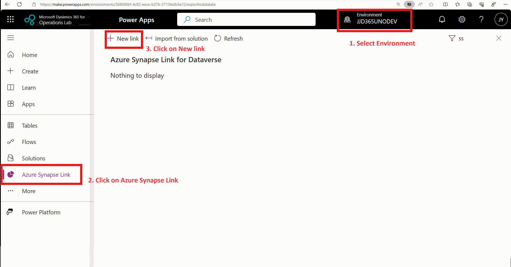

# Choose finance and operations data in Azure Synapse Link for Dataverse

Microsoft Azure Synapse Link for Dataverse lets you choose data from Dynamics 365 finance and operations apps. Use Azure Synapse Link to continuously export data from finance and operations apps into Azure Synapse Analytics and Azure Data Lake Storage Gen2.

Azure Synapse Link for Dataverse is a service that's designed for enterprise big data analytics. It provides scalable high availability together with disaster recovery capabilities. Data is stored in the Common Data Model format, which provides semantic consistency across apps and deployments.

Azure Synapse Link for Dataverse offers the following features that you can use with finance and operations data:

- You can choose both standard and custom finance and operations entities and tables.
- Continuous replication of entity and table data is supported. Create, update, and delete (CUD) transactions are also supported.
- You can link or unlink the environment to Azure Synapse Analytics and/or Data Lake Storage Gen2 in your Azure subscription. You don't have to go to the Azure portal or Microsoft Dynamics Lifecycle Services for system configuration.
- You can choose data and explore by using Azure Synapse. You don't have to run external tools to configure Synapse Analytics workspaces.
- All features of Azure Synapse Link for Dataverse are supported. These features include availability in all regions, saving as Parquet Delta files, and restricted storage accounts.
- The table limits in the Export to Data Lake service aren't applicable in Azure Synapse Link for Dataverse.
- By default, saving in Parquet Delta Lake format is enabled for finance and operations data, so that query response times are faster.

> [!NOTE]
> 
> This feature is generally available with finance and operations application versions shown in the following list. If you haven't yet applied these application versions, install the latest cumulative update to use this feature.
> 
> - 10.0.38 (PU62) cumulative update 7.0.7120.59 or later
> - 10.0.37 (PU61) cumulative update 7.0.7068.109 or later.
> - 10.0.36 (PU60) cumulative update 7.0.7036.133 or later.
>
> You might need to apply additional updates for recent fixes. More information: [Known limitations with finance and operations tables]
>
> If you're planning to adopt the export to data lake feature in finance and operations apps, consider adopting Azure Synapse Link with finance and operations data support instead. Go to the software lifecycle announcements related to [export to data lake feature](/dynamics365/fin-ops-core/dev-itpro/data-entities/azure-data-lake-ga-version-overview) for more details. For guidance and tools to upgrade from export to data lake to Azure Synapse Link go to [transition from legacy data generation services](azure-synapse-link-transition-from-FnO.md) as well as [TechTalk Series: Synapse Link for Dataverse: Transitioning from Export to Azure Data Lake to Synapse Link](https://aka.ms/TransitiontoSynapseLinkVideos)

## Prerequisites

- You must have a finance and operations sandbox (Tier-2) or higher environment. You can also use an environment provisioned with an ERP-based template.
  
   > [!NOTE]
   > With the availability of [Power Platform environment provisioned with ERP-based templates](/power-platform/admin/unified-experience/tutorial-deploy-new-environment-with-erp-template?tabs=PPAC), also known as *unified environments*, Microsoft offers limited support for cloud hosted environments (CHE) as of June 1, 2024. If you're using cloud hosted environments, consider moving to [Power Platform environment provisioned with ERP based templates](/power-platform/admin/unified-experience/tutorial-deploy-new-environment-with-erp-template?tabs=PPAC).

- You can't add finance and operations data to an existing storage account that's configured with Azure Synapse Link. You must have access to an Azure subscription so that you can create a new Synapse Link profile. 
- Depending on how you plan to consume finance and operations data, there are additional prerequisites as shown here.

| How you plan to consume data  |  Azure Synapse Link feature you use | Prerequisites and Azure resources needed |
|-------------------------------|------------------------------------|------------------------------------------|
| **Access finance and operations tables via Microsoft Fabric**     No need to bring your own storage, Synapse workspace, or Spark pool because the system uses Dataverse storage and compute resources| [Link to Fabric](azure-synapse-link-view-in-fabric.md)  | Microsoft Fabric workspace |
| **Access finance and operations tables via Synapse query**    Finance and operations tables are saved in delta parquet format enabling better read performance. You can't choose finance and operations tables to be saved in CSV format. | Go to [Add finance and operations tables in Azure Synapse Link](#add-finance-and-operations-tables-in-azure-synapse-link)  |  Azure Data lake   Azure Synapse workspace   Azure Synapse Spark pool  | 
| **Load incremental data changes into your own downstream data warehouse**    The system saves incremental changes into files in CSV format. No need to bring Synapse workspace or Spark pool because your data is saved in CSV format.  | Go to [Access incremental data changes from finance and operations](#access-incremental-data-changes-from-finance-and-operations)    Also go to [Azure Synapse Link - incremental update](/power-apps/maker/data-platform/azure-synapse-incremental-updates)) | Azure data lake  |

## Add finance and operations tables in Azure Synapse Link

You can enable both finance and operations tables and finance and operations entities in Azure Synapse Link for Dataverse. This section is focused on finance and operations tables.

1. Sign in to Power Apps and select the environment you want.
2. On the left navigation pane, select **Azure Synapse Link**.
3. On the command bar of the **Synapse Link** page, select **+ New link to data lake**.
4. Select **Connect to your Azure Synapse Analytics workspace**, and then select the **Subscription**, **Resource group**, and **Workspace name**.
5. Select **Use Spark pool for processing**, and then select the precreated Spark pool and storage account.
6. Select **Next**.
7. Add the tables you want to export. You can choose finance and operations tables provided the [prerequisites](#prerequisites) are met.
8. Select **Advanced**, select **Show advanced configuration settings** and enter the time interval, in minutes, for how often the incremental updates should be captured. The options **Append only** and **Partition** available at the table level are ignored for finance and operations tables because the system determines the partitioning strategy.
9. Select **Save**. Tables selected are initialized and ready for reporting.

> [!NOTE]
>
> - Finance and operations apps tables are allowed only in Azure Synapse Link. Makers can't see them in the **Tables** area in Power Apps (make.powerapps.com).
> - You don't have to define finance and operations apps tables as virtual tables, and you don't have to enable change tracking for each table.
>
> - You can't add finance and operations tables into an existing Synapse Link profile that contained Dataverse tables. You need to create a new profile. Once you create a new profile, you can add tables from both finance and operations as well as Dataverse.
> 
> - To include finance and operations tables in Synapse Link, you must enable the [Delta lake feature](/power-apps/maker/data-platform/azure-synapse-link-delta-lake) in your Synapse Link profile. Finance and operations table selection isn't visible if your Synapse Link profile isn't configured for Delta lake.
>
> - Delta lake conversion time interval determines how often table data is updated in delta format. For near real time updates, enter 5, 15 or 60 minutes as the desired updated time interval. Choose 1440 for daily time interval if near real-time updates aren't required. Delta conversion consumes compute resources from the Spark pool you have provided in the configuration of the Synapse Link profile. The lower the time interval, the more compute resources are consumed and you can incur more cost. You can monitor the Spark pool cost in Azure portal to see the compute cost.
>
> - The time interval chosen for Spark conversion might not reflect the actual data freshness you observe in the lake. By entering 15 minutes as the time interval, you request Delta conversion jobs to be triggered every 15 minutes in case there are data changes. Depending on the size of the Spark compute pool and the amount of incremental data available for processing, the actual data refresh observed in the lake could be more than 15 minutes. You can increase the size of the Spark pool to achieve better data refresh times. More information: [Recommended spark pool configuration](/power-apps/maker/data-platform/azure-synapse-link-delta-lake#recommended-spark-pool-configuration)
>
> - In the event that the system ran into an error during initial sync or updates, you receive an error and a link to trouble-shooting documents that can be used to diagnose and resolve the error.

### Known limitations and changes to behavior

If you are transitioning from export to data lake feature in finance and operations, you might find a few changes to the behavior as described here. To learn more about the upcoming roadmap and stay in touch with the product team, join the [preview Viva Engage group](https://aka.ms/SynapseLinkforDynamics/). 

- **Don't see all tables?** Microsoft continues to enable all actively used finance and operations apps tables in Azure Synapse Link with application updates. If you have a previous version of finance and operations apps, not all required tables are enabled by default. You can enable more tables yourself by extending table properties and enabling the change tracking feature. For more information about how to enable change tracking, go to [Enable row version change tracking for tables](/dynamics365/fin-ops-core/dev-itpro/data-entities/rowversion-change-track#enable-row-version-change-tracking-for-tables).
- **Don't see your custom tables?** You must enable change tracking for them. More information: [Enable row version change tracking for tables](/dynamics365/fin-ops-core/dev-itpro/data-entities/rowversion-change-track#enable-row-version-change-tracking-for-tables). If you're using a cloud hosted environment (CHE), you must perform a database sync operation to reflect the changes.
- **Special fields** such as `TimeZoneID` (TZID), binary fields in finance and operations tables aren't enabled in Azure SynapseL Link.
- **Synapse Link retains deleted rows** from finance and operations tables. You can identify and filter out deleted rows using the `isDelete` field. Go to [Working with data and metadata](#working-with-data-and-metadata) for more information.
- **Staging tables, temporary tables, and deprecated tables**, where names begin with `del_` in finance and operations apps, aren't allowed in Azure Synapse Link.
- The following tables, known as *kernel* tables in finance and operations apps, are supported by Fabric and Synapse Link. These tables are special, and you don't need to enable change tracking. Also, they're updated every 24 hours and not updated near-real time as the data doesn't change frequently: `DATAAREA`, `USERINFO`, `SECURITYROLE`, `SECURITYUSERROLE`, `SQLDICTIONARY`, `PARTITIONS`, `SECURITYPRIVILEGE`, `TIMEZONESLIST`, `SECURITYDUTY`, `SECURITYSUBROLE`, `SECURITYUSERROLECONDITION`, `DATABASELOG`, `SECURITYROLERUNTIME`, `SECURITYROLEPRIVILEGEEXPLODEDGRAPH`, `SECURITYROLEDUTYEXPLODEDGRAPH`, `TIMEZONESRULESDATA`, `SECURITYROLEEXPLODEDGRAPH`, `USERDATAAREAFILTER`, `SYSINHERITANCERELATIONS`. 
- [**Master company data sharing**](/dynamics365/fin-ops-core/dev-itpro/sysadmin/srs-overview#when-to-consider-duplicate-record-versus-master-company-sharing-preview) is a preview feature in finance and operations apps. Tables that participate in the master company data sharing feature are supported with Synapse Link or Fabric link features. Data exported from these tables are keyed by all company records, not only the master company. This is done to enable simpler reporting so you don't need to use master company data sharing logic to expand data. However, if you're transitioning from previous data export solutions, you might need to filter out data from non-master companies.
- [**Table inheritance and derived tables**](/dynamicsax-2012/developer/table-inheritance-overview) are concepts in finance and operations apps. When choosing a derived table from finance and operations apps, fields from the corresponding base table currently aren't included. For example, if you choose the `DirPerson` table, a table derived from `DirPartyTable` also known as the base table, exported data contains fields from the base table `DirPartyTable` You need to select the base table in addition to the derived table if you need access to these fields. You can use [this FastTrack solution](https://github.com/microsoft/Dynamics-365-FastTrack-Implementation-Assets/tree/master/Analytics/DataverseLink/DataIntegration#derived-tables) provided on GitHub. This solution creates views, which include columns from base tables.
- **Memo fields and long descriptions of type `nVarchar(Max)`** are included in Synapse Link. However, the field size is truncated to 2,000 characters.
- **ID fields from finance and operations tables are renamed to FnO_Id** to avoid field name conflicts with Dataverse tables.
- **Fields with SQL reserved words** are renamed by attaching a trailing character. Ex. `Level` becomes `Level_` and `Resource` becomes `Resource_`. 

### Recent fixes applicable to finance and operations tables

If you are on a previous version of finance and operations, you need to update to the latest version to apply fixes to several issues. These issues and fixes are mentioned here for reference purposes only. When you update to the latest version, all fixes are applied.

- **AOS Authorized fields**: If the table selected contains data columns that are secured via **AOS Authorization**, those columns are ignored and the exported data doesn't contain the column. For example in a custom table named *CustTable*, the column *TaxLicenseNum* has the metadata property **AOS Authorization** set to **Yes**. This column is ignored when *CustTable* data is exported with Azure Synapse Link.
   > [!NOTE]
   > Update your finance and operations environment to these versions or later to enable AOS authorized fields:
   > - PU 63:7.0.7198.105
   > - PU 62:7.0.7120.159
   > 
   > With this update, AOS authorization fields are added to tables:
   > - Incremental updates include this column.
   > - Modified records show these columns and value.
   > - Full refresh includes these fields and all values.

- **Extensible Data security**: When a finance and operations table added to Azure Synapse Link is secured via [extensible data security policies](/dynamics365/fin-ops-core/dev-itpro/sysadmin/extensible-data-security-policies), the system might not export data. This issue is fixed in the latest application update.
  > [!NOTE]
  > Available updates to finance and operations tables with Azure Synapse Link for Dataverse:
  > - Version 10.0.39 (PU63) cumulative update 10.0.1860.50
  > - Version 10.0.38 (PU62) cumulative update 10.0.1777.135
  > - Version 10.0.37 (PU61) cumulative update 10.0.1725.175
  >
  > You'll need to apply a quality build where the system applies a bypass for extensible data security policies for the Azure Synapse Link service.

- **Tables with valid time stamp behavior**: If there are finance and operations app tables that exhibit [valid time stamp behavior](/dynamicsax-2012/developer/valid-time-state-tables-and-date-effective-data), only the data rows that are currently valid are exported with Azure Synapse Link. For example, the **ExchangeRate** table contains both current and previous exchange rates. Only currently valid exchange rates are exported in Azure Synapse Link. This issue is fixed in the latest application update shown here.
   > [!NOTE]
  > Available updates to finance and operations tables with Azure Synapse Link for Dataverse:
  > - Version 10.0.40 (PU64) platform update 7.0.7120.179
  > - Version 10.0.39 (PU63) platform update 7.0.7198.143
  > - Version 10.0.38 (PU62) platform update 7.0.7279.58  
  >
  > With this update, expired data rows are added to tables. You need to perform a full refresh to include previous rows.

- **Fields of Array type**: If the table selected contains data columns that are of **Array** type, those columns are ignored and the exported data doesn't contain the column. For example, in a custom table named *WHSInventTable*, columns **FilterCode** and **FilterGroup** are of type array. These columns aren't exported with Azure Synapse Link. This issue is fixed in the latest application update shown here.
   > [!NOTE]
  > Available updates to finance and operations tables with Azure Synapse Link for Dataverse:
  > - Version 10.0.41 (PU65) platform update 7.0.7367.153 or later
  > - Version 10.0.42 (PU66) platform update 7.0.7452.84 or later
  > - Version 10.0.43 (PU67) platform update 7.0.7521.153 or later
  >
  > With this update, Array type fields are added to tables. You need to perform a full refresh to include previous rows.
  > Above updates also contain the fix for Array fields of Enumerated data types.

- [**Extended invoice length**](/dynamics365/finance/accounts-payable/vendor-invoices-overview#extend-invoice-number-length) is a feature enabled with finance and operations version 10.0.40 and later.
  > [!NOTE]
  > Extended vendor invoice number feature is enabled with updates to finance and operations tables with Azure Synapse Link for Dataverse:
  > - Version 10.0.41 (PU65) platform update 7.0.7367.134 or later
  > - Version 10.0.42 (PU66) platform update 7.0.7452.72 or later
  > - Version 10.0.43 (PU67) platform update 7.0.7521.0 or later

- **Deleted rows missing from derived tables** issue is addressed in updates mentioned below. When choosing a derived table from finance and operations apps. For example, if you choose the `DirPerson` table, a table derived from `DirPartyTable` also known as the base table, deleted markers from derived and base tables are missing in exported data.
  > [!NOTE]
  > Deleted rows missing from derived tables is enabled with updates to finance and operations tables with Azure Synapse Link for Dataverse:
  > - Version 10.0.40 (PU64) platform update 7.0.7279.199 or later
  > - Version 10.0.41 (PU65) platform update 7.0.7367.136 or later
  > - Version 10.0.42 (PU66) platform update 7.0.7452.75 or later

- **NULL values in finance and operations fields** aren't reflected as empty strings in exported data and might cause export failures. While NULL values are not expected to be present in finance and operations data, there might be NULL values inserted via data integration. 
     > [!NOTE]
  > Null value handling support for exported data for finance and operations tables is enabled with:
  > - Version 10.0.41 (PU65) platform update 7.0.7367.149 or later
  > - Version 10.0.42 (PU66) platform update 7.0.7452.88 or later
  > - Version 10.0.43 (PU67) platform update 7.0.7497.0 or later

- Finance and operations apps tables added to an Azure Synapse Link profile might be removed when a back-up is restored in Dataverse. You can copy and paste a comma separated list of tables into the search box within the manage tables option to select a list of tables at once.
- When a finance and operations apps database is restored, tables added to an Azure Synapse Link profile need to be reinitialized. Before reinitializing finance and operations tables, you must also restore the Dataverse database. After restoring the database, you must add finance and operations tables into the profile. You can copy and paste a comma separated list of tables into the search box within the manage tables option to select a list of tables at once.
- Finance and operations apps tables included in an Azure Synapse Link profile can't be migrated to a different environment using the import and export profile feature in Azure Synapse Link.

## Access incremental data changes from finance and operations

To load incremental data changes from finance and operations into your own downstream data warehouse, create an Azure Synapse Link profile that provides only incremental data. Azure Synapse Link provides an initial export of all data rows and then provides you with access to data that changed periodically. The data is provided in CSV files stored in time stamped folders and you can easily consume the data using Azure Data factory or other data tools. More information:  [Azure Synapse Link - incremental update](azure-synapse-link-incremental.md)

To create an Azure Synapse Link profile with incremental data:

1. Sign in to Power Apps and select the environment you want.
2. On the left navigation pane, select **Azure Synapse Link**.
3. On the **Azure Synapse Link for Dataverse** page, select **+ New link** on the command bar.
4. Select **Subscription**, **Resource group** and a **Storage account**. You don't need to provide a Synapse workspace or a Spark pool.
4. Select **Next**. The option to choose tables appears.
5. Select **Advanced**, select **Show advanced configuration settings**, and then enable the option **Enable incremental update folder structure**
6. In the **Time interval** field, choose the desired frequency for reading incremental data. Using this frequency, the system partitions data into time stamped folders such that you can read the data without being impacted by ongoing write operations.  
7. Select the Dataverse tables you want. You can also select finance and operations tables. The options **Append only** and **Partition** available at a table level are ignored. Data files are always appended and data is partitioned yearly.
8. Select **Save**. Tables selected are initialized and you see incremental data in the storage account.

> [!NOTE]
>
> If you're upgrading from the export to data lake feature, enabling the incremental data changes option provides similar change data as the [Change feeds feature](/dynamics365/fin-ops-core/dev-itpro/data-entities/azure-data-lake-change-feeds)
>
> We recommend that you create separate Azure Synapse Link profiles for incremental data and tables for ease of management.
>
> When you choose tables and enable incremental data changes, the row count shown in the Azure Synapse Link details page for each table reflects the total number of changes, not the number of records in the table.
>
> Data rows that contain deleted records from Finance and Operations tables contain the `uniqueidentifier` (ID) field. They don't contain the body of the record. Your downstream data pipeline might need to look up the corresponding fields using the ID field.
> 
> The finance and operations table limitations are also applicable to incremental data from tables. More information:[Known limitations with finance and operations entities](#known-limitations-with-finance-and-operations-entities)

## Working with data and metadata  

Enumerated fields are coded data fields in finance and operations apps. For example, the **AssetTrans** table contains a field called **TransType**, which is an **Enumerated** field. Table fields contain numeric codes like 110, 120, or 131, which represent detailed descriptions like "Depreciation," "Lease" or "Major repairs." You can access these detailed descriptions by using the **GlobalOptionsMetadata** table that's automatically exported when you choose a table that contains enumerated fields. Enumerated fields are also called choice labels or, formerly, option sets. More information: [Choice labels](/power-apps/maker/data-platform/azure-synapse-link-choice-labels)

If there are metadata changes to finance and operations tables, for example, a new field is added to a table, and the data exported in Azure Synapse Link reflects the latest metadata inclusive of the change. More information: [Azure Synapse Link FAQ](/power-apps/maker/data-platform/export-data-lake-faq#what-happens-when-i-add-a-column). If you're using Azure Synapse Link to query the data, you see the updated metadata reflected in Azure Synapse Link. If you consume incremental data changes, you can locate updated metadata within the incremental data folder with the latest date stamp. More information: [Incremental folder structure](/power-apps/maker/data-platform/azure-synapse-incremental-updates#view-incremental-folder-at-microsoft-azure-storage)

You'll also notice additional metadata fields appended by the system for each data row. Explanation of these fields is shown here.

| Metadata field  |  What this field contains | Equivalent field or feature in export to data lake |
|-------------------------------|------------------------------------|------------------------------------------|
| `createdon` | Indicates the date and time the record was created | Derived from `Created Date` time field in each finance and operations records. |
| `Createdtransactionid` | Not used  | Not used |
| `Id`  | Record ID is used by the system to uniquely identify records | Contains the `RecID` field of the record from finance and operations. This value is converted from an integer to a GUID. |
| `IsDelete` | If True this record is deleted from Dataverse or finance and operations | In  case of a delete at source, export to data lake deletes the row from the destination data lake immediately. Azure Synapse Link performs a "soft delete" for table data in Delta format such that you can identify deleted rows without consuming change feeds.  If you want to read active records, you can filter records where `isDelete` is True.   In case of table data in Delta files, soft deleted rows are purged after 28 days.  `IsDelete` field is also available in incremental updates and can be used to identify rows that are deleted. The body of the records with `isDelete` true are empty. Use system fields such as **Id** field to determine values of other fields. For example, you can look up the latest row for incremental update where `isDelete` is False, with the latest version number and sync modified on date for a given ID.|
| `modifiedon` |  Indicates the date and time the record was last modified | This field is populated from modified date time field in finance and operations tables. |
| `modifiedtransactionid` |  Used internally | Because `modifiedtransactionid` is used internally, don't use this field. |
| `SinkCreatedOn` | Indicates the date the record was written to the data lake.  If there's a CSV change data (incremental update), data, and time data was written to lake is shown. For table data in Delta format, indicates the date and time of Delta Lake conversion.  | You can use this date similar to the data lake modified date time field in the export to data lake feature. |
| `SinkModifiedOn` | Indicates the date the record was modified. In case of tables in Delta format files as well as incremental CSV files, contains the same date time as `SinkCreatedOn`. | You can use this date similar to the data lake modified date time field in export to data lake feature. |
| `sysdatastatecode` | If 1, this record is archived using the long term data retention feature. If 0 this is a live record. | You can use this field to identify finance and operations records that have been archived (and deleted from live data). The same field is available for for CSV change data (incremental update). |
| `sysrowversion` | Version number maintained in each finance and operations apps record that determines whether changes have been made to data. This field is used by the system to determine incremental or delta changes to process. | `sysrowversion` is used internally. You can use this field as a *watermark* to determine the last version of record that was updated. This field might be empty for Dynamics 365 customer engagement apps tables. |
| `tableid` |  Contains a unique ID of each table | Contains the table ID from finance and operations. |
| `versionnumber` | Used internally - contains the last version of the row that has been synced to the data lake. | Similar to the `sysrowversion` this field contains the last processed version for Dynamics customer engagement apps tables. In case of Dynamics finance and operations apps tables, this field contains the same value as `sysrowversion`. |

## Reacting to system events and generating audit reports

Azure Synapse Link generates events when data transfer activities are completed or an issue is encountered. These events are recorded in Dataverse tables. You can create automated actions and audit reports using these Dataverse tables. For example, if you have an automated data pipeline that continuously copies changed data rows from your data lake to another location, special actions might be required when a table is inactivated or reactivated, or when table metadata is updated. Creating events enables you to automate these tasks.

If you used [business events generated by the export to data lake feature](/dynamics365/fin-ops-core/dev-itpro/data-entities/azure-data-lake-generates-biz-events) in finance and operations to react to system events, you can continue to get alerted via Azure Synapse Link service. Synapse Link service contains additional configuration data that you can use to generate audit reports and Power Apps to monitor specific data of interest. For more information about receiving and consuming events from Synapse Link [go to this article](/power-apps/maker/data-platform/azure-synapse-link-notifications). 

This table summarizes events form export to data lake and discusses how you can improve with Synapse Link configuration data.

| Export to data lake event  |  Scenario  | How you can use configuration data in Synapse Link |
|----------------------------|----------------------------|------------------------------------------|
| **Initialize complete**   |  When you select a table, the system makes an initial copy of the data. This event indicates that initialization for a selected table has been completed. If multiple tables are enabled in the environment, you receive multiple events as initialization is completed for each table. | You can monitor Dataverse tables **Synapse Link Profile Entity State**  and **Synapse Link external table state**.    **InitialSyncProcessCompletedTime** and **InitialSyncState** return the initial sync completion status, which includes both metadata and data. The initial sync state is updated as **Completed** once the initial sync completes. You can also get additional information such as record counts for each table.   Synapse Link doesn't delete previous change data in CSV files (incremental update) when you reinitialize a table. |
| **Metadata changed** | This event indicates that table metadata has changed. For example, a new column has been added to the table, or, in rarer cases, a column has been deleted. You receive multiple events for each table, one for each metadata change. If you have downstream data pipelines that can't react to metadata changes (a situation that is known as schema drift), you can detect changes by using these events and modify downstream pipelines. | The **Last Synced Metadata Time** field in the **Synapse Link Profile Entity State** table is updated when metadata changes are detected. Use this field to force metadata changes to downstream pipelines using metadata stored in the lake. |
| **Deactivated**  | This event indicates that a previously active table has been deactivated. When a table is deactivated, data that is changed in finance and operations apps isn't updated in the data lake | There's no "deactivate" option in Synapse Link. You can however, delete a table from a Synapse Link profile. You can find deleted tables in the Dataverse table  **Synapse Link Profile Entity State**. |
| **Activated** |  This event indicates that a previously inactivated table has been reactivated. When a table is reactivated, the system reinitializes data in the data lake. You might later receive an **Initialize complete** event. | There's no deactivate or activate option in Synapse Link. You can delete a table and readd the table into a Synapse Link profile. A new record is added in the **Synapse Link Profile Entity State** table when a table is added. You can monitor the status of the table during initialize stage using the Dataverse tables **Synapse Link Profile Entity State**  and **Synapse Link external table state**. |
| **Error** | This event indicates that the data sync process has paused due to an error. | **Synapse Link Profile Entity State** status field indicates the status of tables. |
| **Lake switch** | This event indicates that the system administrator has modified the destination of the data lake. | This event isn't applicable. Changing a data lake associated with a Synapse Link profile as well as changing configuration options isn't supported. However, Synapse Link supports multiple profiles. This means, an administrator can create multiple Synapse Link profiles with tables (the same table can be added to multiple profiles). Read the Dataverse table **Synapse Link profile** to find configuration data on all profiles including deleted profiles. |  

## Enable finance and operations data entities in Azure Synapse Link

You can enable both finance and operations entities and finance and operations apps tables in Azure Synapse Link for Dataverse. This section is focused on finance and operations data entities.

The process of enabling finance and operations entities has the following steps. Each step is explained in the following subsections.

1. [Enable finance and operations virtual entities in the Power Apps maker portal](#enable-finance-and-operations-virtual-entities-in-power-apps). This step lets you use finance and operations entities in Power Apps (make.powerapps.com) to build apps. You can also use them with Azure Synapse Link.
2. [Enable row version change tracking for Entities](/dynamics365/fin-ops-core/dev-itpro/data-entities/rowversion-change-track#enable-row-version-change-tracking-for-data-entities). You must complete this step to enable Azure Synapse Link to use finance and operations entities.

After you complete both steps, you can select finance and operations entities in Azure Synapse Link under **Dataverse tables**. To create Azure Synapse Link for Dataverse in Delta Lake format, follow the steps in [Export Dataverse data in Delta Lake format](/power-apps/maker/data-platform/azure-synapse-link-delta-lake).

> [!NOTE]
> Finance and operations entities start with the prefix **mserp\_**.

### Enable finance and operations virtual entities in Power Apps

You must enable finance and operations entities as [virtual tables](create-edit-virtual-entities.md) in Dataverse. Makers can then use the chosen finance and operations entities to build apps, and the entities can also be used with Azure Synapse Link.

To enable finance and operations entities, follow the steps in [Enable Microsoft Dataverse virtual entities](/dynamics365/fin-ops-core/dev-itpro/power-platform/enable-virtual-entities).

> [!TIP]
> To validate Azure Synapse Link features, use a few of the sample entities from the following list. They appear under the **Dataverse tables** section in Azure Synapse Link.
>
> - **MainAccountBiEntity** – This entity contains a list of ledger accounts.
> - **ExchangeRateBiEntity** – This entity contains exchange rates in the system.
> - **InventTableBiEntity** – This entity contains a list of inventory items.

### Enable change tracking for finance and operations entities

When you enable change tracking for finance and operations entities, they appear under Dataverse tables in Azure Synapse Link. Finance and operations entities start with the prefix **mserp\_**.

To enable change tracking, follow these steps.

1. In Power Apps, select **Tables** on the left navigation pane, and then select the table you want.
1. Select **Properties** >  **Advanced options**.
1. Select the **Track changes** option, and then select **Save**. If the option is unavailable, go to [Known limitations with finance and operations entities](#known-limitations-with-finance-and-operations-entities)).

### Known limitations with finance and operations entities

Currently, there are several limitations with finance and operations entities and Azure Synapse Link. To learn more about the upcoming roadmap and stay in touch with product team, join the [preview Viva Engage group aka.ms/SynapseLinkforDynamics](https://aka.ms/SynapseLinkforDynamics/).

- Enabling change tracking might fail with the error message "chosen entity doesn't pass the validation rules..." or the **Track changes** checkbox might be  disabled for some tables that are virtual tables. Currently, change tracking can't be enabled for all finance and operations entities. The **Track changes** checkbox is unavailable for entities created in finance and operations in the past for data migration.

   > [!NOTE]
   > For a list of finance and operations entities that pass validation rules, run the **Data entity row version change tracking validation report** available in finance and operations apps at path **System administration/Setup/Row version change tracking/Data entity row version change tracking validation report.** This report shows entities that pass and fail validation rules. You can also use this report to enable row version change tracking for entities that pass data validation rules. To enable change tracking for an entity, choose **Row version Change Tracking** from the  menu, and then choose **Enable change tracking**. 
   >
   > For more information about entity validation rules and how you can fix them, go to [Enable row version change tracking for data entities](/dynamics365/fin-ops-core/dev-itpro/data-entities/rowversion-change-track#enable-row-version-change-tracking-for-data-entities). You might need developer assistance to complete the steps.
   > 
   > If the chosen entity is unavailable because of the change tracking limitation, you might be able to choose the tables that comprise the data from that entity. You can use [EntityUtil solution provided by the FastTrack team](https://github.com/microsoft/Dynamics-365-FastTrack-Implementation-Assets/tree/master/Analytics/DataverseLink/DataIntegration/EntityUtil) to create entity shapes using tables.
   > 

- In case of a database restore operation in Dataverse, finance and operations entities enabled in Azure Synapse Link are removed. To re-enable entities, you need to re-enable corresponding virtual tables for all selected entities, re-enable change tracking, and reselect the tables in Azure Synapse Link. 
