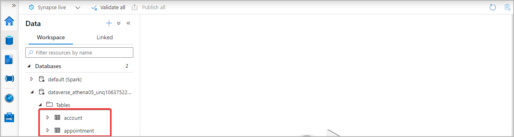

# Visualize Azure Synapse Link for Dataverse data with Power BI

[!INCLUDE[cc-data-platform-banner](../../includes/cc-data-platform-banner.md)]

You can use the Azure Synapse Link to connect your Microsoft Dataverse data to Azure Synapse Analytics to explore your data and accelerate time to insight. This article shows you how to generate a Power BI report by connecting to the serverless SQL endpoint from your Azure Synapse Analytics workspace.

> [!NOTE]
>
> - Azure Synapse Link for Microsoft Dataverse was formerly known as Export to data lake. The service was renamed effective May 2021 and will continue to export data to Azure Data Lake as well as Azure Synapse Analytics.
> - This feature is still in preview and preview features are are not complete, but are made available on a “preview” basis so customers can get early access and provide feedback. Preview features may have limited or restricted functionality, are not meant for production use, and may be available only in selected geographic areas.

## Prerequisites

This section describes the prerequisites necessary to access Dataverse choices with Power BI after using the Azure Synapse Link for Dataverse service.

- **Power BI Desktop**. [Get it now](https://powerbi.microsoft.com/downloads/)

- **Azure Synapse Link for Dataverse:** This guide assumes that you have already exported data from Dataverse by using the [Azure Synapse Link for Dataverse](export-to-data-lake.md).

- **Storage Account Access.** You must be granted one of the following roles for the storage account: Storage Blob Data Reader, Storage Blob Data Contributor, or Storage Blob Data Owner.

## Query your Dataverse data with serverless SQL pool

> [!NOTE]
> Azure Synapse Link for Dataverse does not support the use of dedicated SQL pools at this time.

1. Select your storage account name from the list, and then select **Go to Azure Synapse workspace**.

    

2. Expand **Databases**, select your Dataverse container. Your exported tables are displayed under the **Tables** directory on the left sidebar.

    

3. Right-click the desired table and select **New SQL script** > **Select TOP 100 rows**.

    

4. Select **Run**. Your query results are displayed on the **Results** tab. Alternatively, you can edit the script to your needs.

    

## Query multiple Dataverse databases with serverless SQL pool

> [!NOTE]
>
> - Azure Synapse Link for Dataverse does not support the use of dedicated SQL pools at this time.
> - Querying multiple Dataverse databases requires that both Dataverse environments are in the same region.

1. Follow the steps above to connect another Dataverse organization to same Azure Synapse Analytics workspace. You must use the same storage account for both connections.

2. Expand **Databases**, select one of the Dataverse containers. Your exported tables are displayed under the **Tables** directory on the left sidebar.

3. Right-click the a table and select **New SQL script** > **Select TOP 100 rows**.

4. Edit the query to combine the two datasets. For instance, you can join the datasets based on a unique ID value.

5. Select **Run**. Your query results are displayed on the **Results** tab.

### See also

[Blog: Announcing Azure Synapse Link for Dataverse](https://aka.ms/synapse-dataverse)

[!INCLUDE[footer-include](../../includes/footer-banner.md)]
