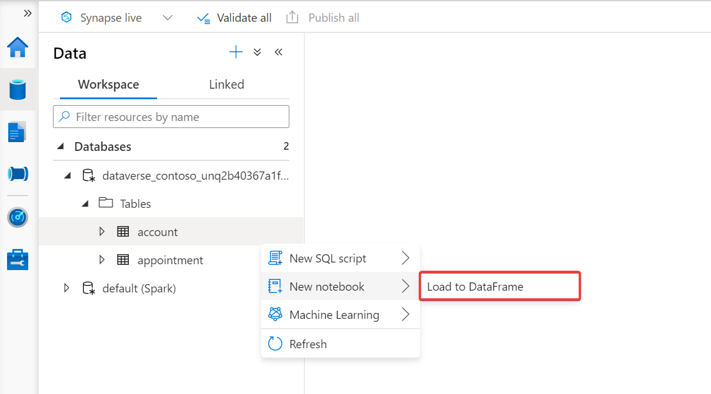
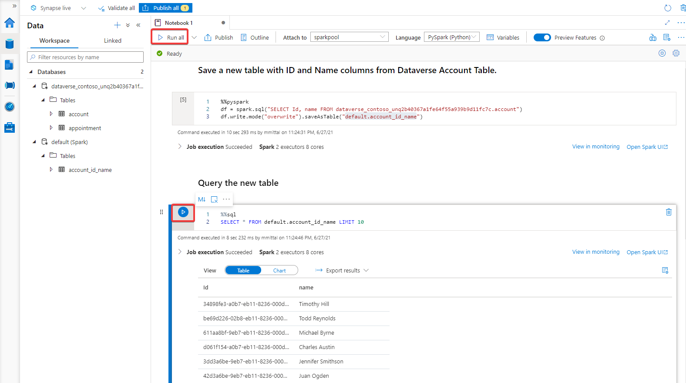

# Transform Azure Synapse Link for Dataverse data with Apache Spark

[!INCLUDE[cc-data-platform-banner](../../includes/cc-data-platform-banner.md)]

You can use the Azure Synapse Link to connect your Microsoft Dataverse data to Azure Synapse Analytics to explore your data and accelerate time to insight. This article shows you how to transform your Dataverse data using the Apache Spark engine available in your Synapse workspace.

> [!NOTE]
>
> - Azure Synapse Link for Microsoft Dataverse was formerly known as Export to data lake. The service was renamed effective May 2021 and will continue to export data to Azure Data Lake as well as Azure Synapse Analytics.
> - This feature is still in preview and preview features are are not complete, but are made available on a “preview” basis so customers can get early access and provide feedback. Preview features may have limited or restricted functionality, are not meant for production use, and may be available only in selected geographic areas.

## Prerequisites

This section describes the prerequisites necessary to transform Dataverse data with Apache Spark after using the Azure Synapse Link for Dataverse service.

- **Azure Synapse Link for Dataverse:** This guide assumes that you have already exported data from Dataverse by using the [Azure Synapse Link for Dataverse](export-to-data-lake.md).

- **Storage Account Access.** You must be granted one of the following roles for the storage account: Storage Blob Data Reader, Storage Blob Data Contributor, or Storage Blob Data Owner.

- **Synapse administrator.** You must be granted the **Synapse Administrator** role access within Synapse studio.

## Transform your data with an Apache Spark notebook

1. In Power Apps, select your desired Azure Synapse Link from the list, and then select **Go to Azure Synapse workspace**.

    

2. Expand **Databases**, select your Dataverse container. Your exported tables are displayed under the **Tables** directory on the left sidebar.

    

3. Right-click the desired table and select **New notebook** > **Load to DataFrame**.

    

4. Attach the notebook to an Apache Spark pool by selecting a pool from the drop down menu. If you do not have an Apache Spark pool, select **Manage pools** to create one.

    

5. Add code cells to transform your data. Run individual cells by selecting the play button at the left of each cell or run all the cells in succession by selecting **Run all** from the top bar.

    

### See also

[Blog: Announcing Azure Synapse Link for Dataverse](https://aka.ms/synapse-dataverse)

[!INCLUDE[footer-include](../../includes/footer-banner.md)]
