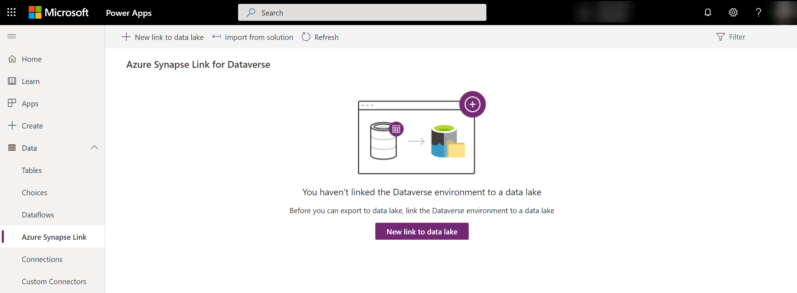
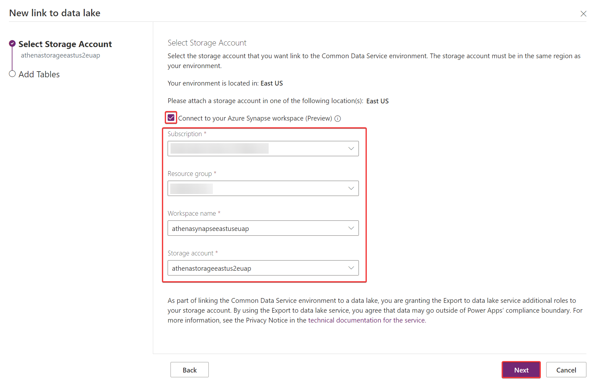
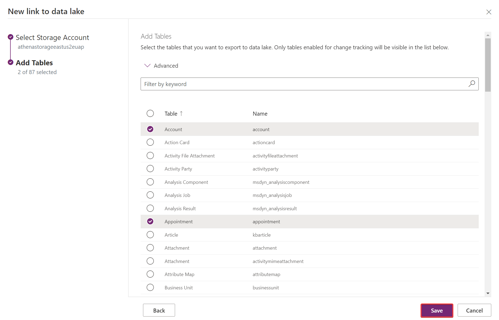
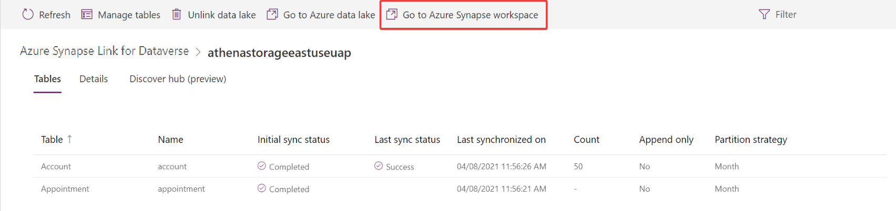
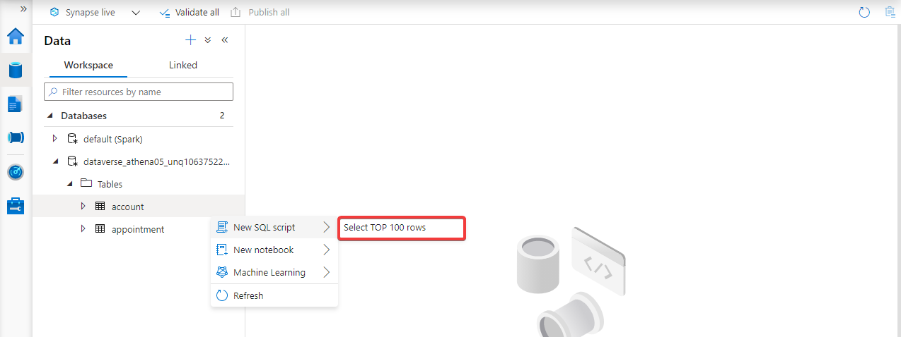
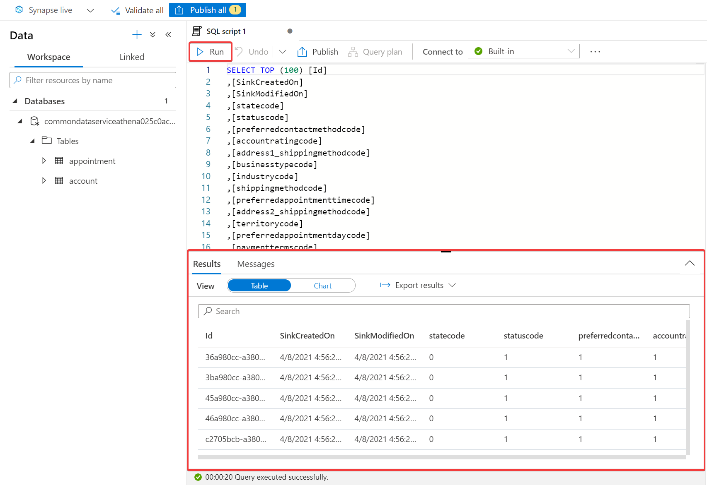
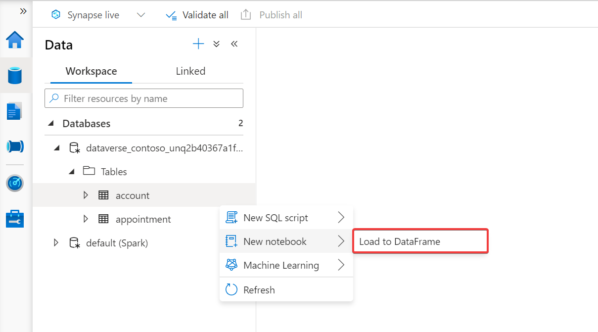
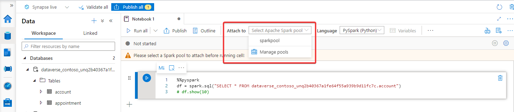
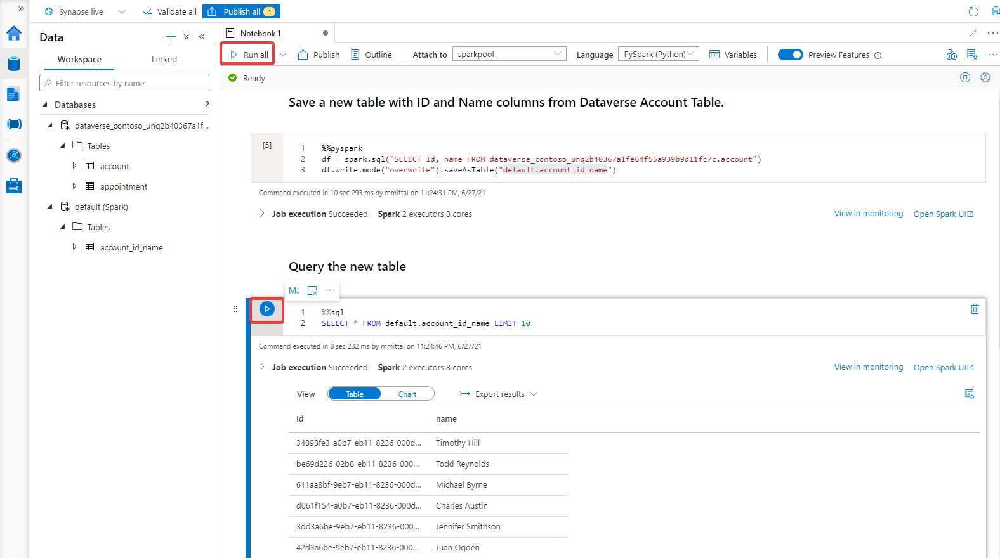

# Configure Azure Synapse Link for Dataverse with your Azure Synapse Workspace (Preview)

[!INCLUDE[cc-data-platform-banner](../../includes/cc-data-platform-banner.md)]

You can use the Azure Synapse Link to connect your Microsoft Dataverse data to Azure Synapse Analytics to explore your data and accelerate time to insight. This article shows you how to perform the following tasks:

1. Connect your Dataverse data to your Azure Synapse Analytics workspace with the Azure Synapse Link service.
2. Query your data in Azure Synapse Analytics workspace with the built-in serverless SQL pool.
3. Query multiple Dataverse databases with the built-in serverless SQL pool.
4. Transform your data with an Apache Spark notebook.
5. Generate a Power BI report by connecting to the serverless SQL endpoint from your Azure Synapse Analytics workspace.
6. Unlink your Azure Synapse Link.

> [!NOTE]
>
> - Azure Synapse Link for Microsoft Dataverse was formerly known as Export to data lake. The service was renamed effective May 2021 and will continue to export data to Azure Data Lake as well as Azure Synapse Analytics.
> - This feature is still in preview and preview features are are not complete, but are made available on a “preview” basis so customers can get early access and provide feedback. Preview features may have limited or restricted functionality, are not meant for production use, and may be available only in selected geographic areas.

## Prerequisites

- Azure Data Lake Storage Gen2: You must have an Azure Data Lake Storage Gen2 account and **Owner** and **Storage Blob Data Contributor** role access. Your storage account must enable **Hierarchical namespace** and it is recommended that replication is set to **read-access geo-redundant storage (RA-GRS)**.

- Synapse workspace: You must have a Synapse workspace and the **Synapse Administrator** role access within the Synapse Studio. The Synapse workspace must be in the same region as your Azure Data Lake Storage Gen2 account. The storage account must be added as a linked service within the Synapse Studio. To create a Synapse workspace, go to [Creating a Synapse workspace](/azure/synapse-analytics/get-started-create-workspace).

> [!NOTE]
> When you add multiple users to the synapse workspace, they must have the **Synapse Administrator** role access within the Synapse Studio and the **Storage Blob Data Contributor** role on the Azure Data Lake Storage Gen2 account.

## Connect Dataverse to Synapse workspace

1. Sign in to [Power Apps](https://make.powerapps.com/?utm_source=padocs&utm_medium=linkinadoc&utm_campaign=referralsfromdoc) and select your preferred environment.

2. On the left navigation pane, select **Data**, select **Azure Synapse Link**, and then on the command bar, select **+ New link to data lake**.

    

3. Select the the **Connect to your Azure Synapse workspace (Preview)** option.

4. Select the **Subscription**, **Resource group**, **Workspace name**, and **Storage account**. Ensure that the Synapse workspace and storage account meet the requirements specified in the [Prerequisites](#prerequisites) section. Select **Next**.

    

5. Add the tables you want to export, and then select **Save**.

    

## Query your Dataverse data with serverless SQL pool

> [!NOTE]
> Azure Synapse Link for Dataverse does not support the use of dedicated SQL pools at this time.

1. Select your storage account name from the list, and then select **Go to Azure Synapse workspace**.

    

2. Expand **Databases**, select your Dataverse container. Your exported tables are displayed under the **Tables** directory on the left sidebar.

    

3. Right-click the desired table and select **New SQL script** > **Select TOP 100 rows**.

    

4. Select **Run**. Your query results are displayed on the **Results** tab. Alternatively, you can edit the script to your needs.

    

## Query multiple Dataverse databases with serverless SQL pool

> [!NOTE]
>
> - Azure Synapse Link for Dataverse does not support the use of dedicated SQL pools at this time.
> - Querying multiple Dataverse databases requires that both Dataverse environments are in the same region.

1. Follow the steps above to connect another Dataverse organization to same Azure Synapse Analytics workspace. You must use the same storage account for both connections.

2. Expand **Databases**, select one of the Dataverse containers. Your exported tables are displayed under the **Tables** directory on the left sidebar.

3. Right-click the a table and select **New SQL script** > **Select TOP 100 rows**.

4. Edit the query to combine the two datasets. For instance, you can join the datasets based on a unique ID value.

5. Select **Run**. Your query results are displayed on the **Results** tab.

## Transform your data with an Apache Spark notebook

1. In your Synapse workspace, expand **Databases**, select your Dataverse container. Your exported tables are displayed under the **Tables** directory on the left sidebar.

2. Right-click the desired table and select **New notebook** > **Load to DataFrame**.

    

3. Attach the notebook to an Apache Spark pool by selecting a pool from the drop down menu. If you do not have an Apache Spark pool, select **Manage pools** to create one.

    

4. Add code cells to transform your data. Run individual cells by selecting the play button at the left of each cell or run all the cells in succession by selecting **Run all** from the top bar.

    

## Connect to your Azure Synapse Analytics workspace to Power BI

1. Open Power BI Desktop.

2. Select **Get data** > **More...**.

3. Select **Azure** > **Azure Synapse Analytics (SQL DW)** > **Connect**.

4. Go to your Azure Synapse Analytics workspace and copy the **Serverless SQL endpoint**.

    

5. Paste the endpoint for the **Server**. Select **DirectQuery** for the **Data Connectivity mode**. Select **OK**.

    

6. If prompted, sign in with your Microsoft Account.

7. Select the container and the preferred table from the Navigator, and then select **Load**. Optionally, expand *default* to access tables created with an Apache Spark notebook.

    

> [!NOTE]
> If you receive a credentials error, go to **File** > **Options and settings** > **Data source settings** and clear the permissions for the serverless SQL endpoint. Repeat the above steps.

8. Select fields from the **Fields** pane to create a simple table or create other visualizations.

    

## Unlinking an Azure Synapse Link

1. Sign in to [Power Apps](https://make.powerapps.com/?utm_source=padocs&utm_medium=linkinadoc&utm_campaign=referralsfromdoc) and select your preferred environment.

2. On the left navigation pane, select **Data**, select **Azure Synapse Link**, select the desired Azure Synapse Link to unlink, and then select **Unlink data lake** from the command bar.

3. To delete both the Data Lake file system as well as the Synapse Database, select **Delete data lake file system**.

4. Select **Yes**, and allow a few minutes for everything to be unlinked and deleted.

### See also

[Configure Azure Synapse Link for Dataverse with your Azure Data Lake](./azure-synapse-link-data-lake.md)

[Azure Synapse Link for Dataverse Advanced Configuration](./azure-synapse-link-advanced-configuration.md)

[Azure Synapse Link FAQ](export-data-lake-faq.yml)

[Blog: Announcing Azure Synapse Link for Dataverse](https://aka.ms/synapse-dataverse)

[!INCLUDE[footer-include](../../includes/footer-banner.md)]
