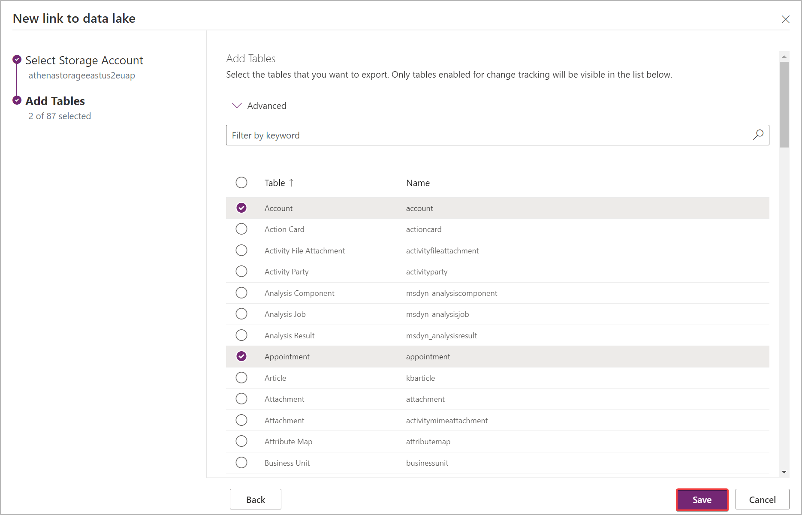

# Create an Azure Synapse Link for Dataverse with your Azure Synapse Workspace

You can use the Azure Synapse Link to connect your Microsoft Dataverse data to Azure Synapse Analytics to explore your data and accelerate time to insight. This article shows you how to perform the following tasks:

1. Connect your Dataverse data to your Azure Synapse Analytics workspace with the Azure Synapse Link service.
2. Manage Dataverse tables included in the Azure Synapse Link.
3. Monitor your Azure Synapse Link.
4. Unlink your Azure Synapse Link.
5. Relink your Azure Synapse Link.
6. View your data in Azure Synapse Analytics.

> [!NOTE]
> Azure Synapse Link for Microsoft Dataverse was formerly known as Export to data lake. The service was renamed effective May 2021 and will continue to export data to Azure Data Lake as well as Azure Synapse Analytics.

## Prerequisites

- Dataverse: You must have the Dataverse **system administrator** security role. Additionally, tables you want to export via Synapse Link must have the **Track changes** property enabled. More information: [Advanced options](create-edit-entities-portal.md#advanced-options)

- Azure Data Lake Storage Gen2: You must have an Azure Data Lake Storage Gen2 account and **Owner** and **Storage Blob Data Contributor** role access. Your storage account must enable **Hierarchical namespace** for both initial setup and delta sync. **Allow storage account key access** is required only for the initial setup.  

- Synapse workspace: You must have a Synapse workspace and the **Synapse Administrator** role access within the Synapse Studio. The Synapse workspace must be in the same region as your Azure Data Lake Storage Gen2 account with **allowAll** IP addresses access rule. The storage account must be added as a linked service within the Synapse Studio. To create a Synapse workspace, go to [Creating a Synapse workspace](/azure/synapse-analytics/get-started-create-workspace).

> [!NOTE]
>
> - The storage account and Synapse workspace must be created in the same Azure Active Directory (Azure AD) tenant as your Power Apps tenant.
> - The storage account and Synapse workspace must be created in the same region as the Power Apps environment you will use the feature in and the same resource group.
> - By default, you must enable **public network access** for Azure resources for both initial setup and delta sync. To set **Enabled from selected virtual networks and IP addresses** for linked storage account and workspace to grant access only from selected virtual networks and IP addresses or to use private endpoints, you must create a Synapse Link with managed identities.[Use managed identities for Azure with your Azure data lake storage](./azure-synapse-link-msi.md)
> - You must have **Reader** role access to the resource group with the storage account and Synapse workspace.  
> - When you add multiple users to the synapse workspace, they must have the **Synapse Administrator** role access within the Synapse Studio and the **Storage Blob Data Contributor** role on the Azure Data Lake Storage Gen2 account.
> - The creation of Synapse Link profiles under a single DV environment is limited to a maximum of 10.

## Connect Dataverse to Synapse workspace

1. Sign in to [Power Apps](https://make.powerapps.com/?utm_source=padocs&utm_medium=linkinadoc&utm_campaign=referralsfromdoc) and select your preferred environment.
1. On the left navigation pane, select **Azure Synapse Link**. [!INCLUDE [left-navigation-pane](../../includes/left-navigation-pane.md)]
1. On the command bar, select **+ New link**.
1. Select the **Connect to your Azure Synapse workspace** option.
1. Select the **Subscription**, **Resource group**, **Workspace name**, and **Storage account**. Ensure that the Synapse workspace and storage account meet the requirements specified in the [Prerequisites](#prerequisites) section. Select **Next**.

    

    > [!NOTE]
    > As part of linking the environment to a data lake, you grant the Azure Synapse Link service access to your storage account. Ensure that you followed the [prerequisites](#prerequisites) of creating and configuring the Azure data lake storage account, and granting yourself an owner role on the storage account. Additionally, you grant the Power Platform Dataflows service access to your storage account. More information: [Self-service data prep with dataflows](self-service-data-prep-with-dataflows.md).  

1. Add the tables you want to export, and then select **Save**. Only tables with change tracking enabled can be exported. More information: [Enable change tracking](/dynamics365/customer-engagement/admin/enable-change-tracking-control-data-synchronization).

    

You can follow the steps above to create a link from one environment to multiple Azure Synapse Analytics workspaces and Azure data lakes in your Azure subscription by adding an Azure data lake as a linked service on a Synapse workspace. Similarly, you could create a link from multiple environments to the same Azure Synapse Analytics workspace and Azure data lake, all within the same tenant.

> [!NOTE]
> The data exported by Azure Synapse Link service is encrypted at transit using Transport Layer Security(TLS) 1.2 or higher and encrypted at rest in Azure Data Lake Storage Gen2. Additionally, transient data in the blob storage is also encrypted at rest. Encryption in Azure Data Lake Storage Gen2 helps you protect your data, implement enterprise security policies, and meet regulatory compliance requirements. More information: [Azure Data Encryption-at-Rest]( /azure/security/fundamentals/encryption-atrest)
>
> Currently, you can't provide public IP addresses for the Azure Synapse Link for Dataverse service that can be used in **Azure Data Lake firewall settings**. Public IP network rules have no effect on requests originating from the same Azure region as the storage account. Services deployed in the same region as the storage account use private Azure IP addresses for communication. Thus, you can't restrict access to specific Azure services based on their public outbound IP address range.
More information: [Configure Azure Storage firewalls and virtual networks]( /azure/storage/common/storage-network-security)

## Manage table data to the Synapse workspace

After you have set up the Azure Synapse Link, you can manage the tables that are exported in one of two ways:

- In the Power Apps (make.powerapps.com) **Azure Synapse Link** area, select **Manage tables** on the command bar to add or remove one or more linked tables.
- On the Power Apps maker portal **Tables** area, select **…** next to a table, and then select the linked data lake where you want to export table data.

   

## Monitor your Azure Synapse Link

After you have set up the Azure Synapse Link, you can monitor the Azure Synapse Link under the **Tables** tab.

   

- There will be a list of tables that are a part of the selected Azure Synapse Link.
- There are different stages the sync status will circulate through. **NotStarted** indicates that the table is waiting to be synced. Once the table initial sync has been **Completed**, there will be a post processing stage where incremental updates will not take place. This may take several hours depending on the size of your data. As the incremental updates start taking place, the date for the last sync will be regularly updated.
- The **Count** column shows the number rows written. When **Append only** is set to **No**, this is the total number of records. When **Append Only** is set to **Yes**, this is the total number of changes.
- The  **Append only** and **Partition strategy** columns show the usage of different advanced configurations.

## Unlinking an Azure Synapse Link

1. Select the desired Azure Synapse Link to unlink.

2. Select **Unlink** from the command bar.

3. To delete both the data lake file system as well as the Synapse Database, type the link name to confirm.

4. Select **Yes**, and allow a few minutes for everything to be unlinked and deleted.

## Relinking an Azure Synapse Link

If you deleted the file system when unlinking, follow the steps above to relink the same Synapse workspace and data lake. If you did not delete the file system when unlinking, you must clear the data to relink:

1. Navigate the Azure Synapse Analytics.

2. Select the **...** for the unlinked database and select **New notebook** > **Empty notebook**.

3. Attach the notebook to an Apache Spark pool by selecting a pool from the drop down menu. If you do not have an Apache Spark pool, select **Manage pools** to create one.

4. Enter the following script, replace **\<DATABASE_NAME\>** with the name of the database to unlink, and run the notebook.

```SQL
    %%sql
    DROP DATABASE <DATABASE_NAME> CASCADE
```

5. After running the notebook, refresh the database list from the left panel. If the database still exists, try right clicking on the database and selecting **Delete**.

6. Navigate to Power Apps, and relink the Synapse workspace and data lake.

## Access near real-time data and read-only snapshot data

After creating an Azure Synapse Link, two versions of the table data will be synchronized in Azure Synapse Analytics and/or Azure Data Lake Storage Gen2 in your Azure subscription by default to ensure you can reliably consume updated data in the lake at any given time:

- Near real-time data: Provides a copy of data synchronized from Dataverse via Synapse Link in an efficient manner by detecting what data has changed since it was initially extracted or last synchronized.
- Snapshot data: Provides a read-only copy of near real-time data that is updated at regular intervals (in this case every hour).  

> [!NOTE]
> To create read-only snapshot data, ensure that the **Permitted scope for copy operations** setting is configured to **From any storage account**. More information: [Configure the permitted scope for copy operations]( /azure/storage/common/security-restrict-copy-operations?tabs=portal#configure-the-permitted-scope-for-copy-operations-preview)

1. Select the desired Azure Synapse Link, and then select the **Go to Azure Synapse Analytics workspace** from the top panel.
1. Expand **Lake Databases** from the left panel, select **dataverse**-*environmentName*-*organizationUniqueName*, and then expand **Tables**.

All **Near Real-Time Data Tables** are listed and available for analysis with the naming convention *DataverseTableName*. All **Snapshot Data Tables** are listed and available for analysis with the naming convention *DataverseTableName*_partitioned.

:::image type="content" source="media/near-realtime-snapshot-data.png" alt-text="Near real-time and snapshot tables":::

> [!IMPORTANT]
> Make sure that your serverless SQL pool in Azure Synapse Analytics workspace can access the Azure Data Lake storage account if you want to use snapshot data. Without managed identity access, the snapshot data table won't be accessible using the serverless SQL pool.

### What's next?

After successfully using the Azure Synapse Link for Dataverse service, discover how you can analyze and consume your data with **Discover Hub**. To access **Discover Hub**, go to **Power Apps** > **Azure Synapse Link**. Select your linked service and then select the **Discover Hub** tab. Here you can find recommended tools and curated documentation to help you get the most value out of your data.


### See also

[Configure Azure Synapse Link for Dataverse with your Azure Data Lake](./azure-synapse-link-data-lake.md)

[Azure Synapse Link for Dataverse Advanced Configuration](./azure-synapse-link-advanced-configuration.md)

[Azure Synapse Link FAQ](export-data-lake-faq.yml)

[Blog: Announcing Azure Synapse Link for Dataverse](https://aka.ms/synapse-dataverse)

[!INCLUDE[footer-include](../../includes/footer-banner.md)]
