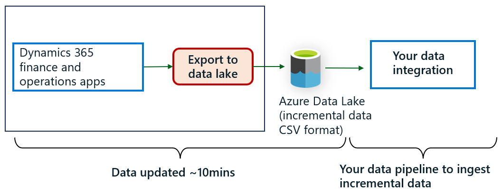
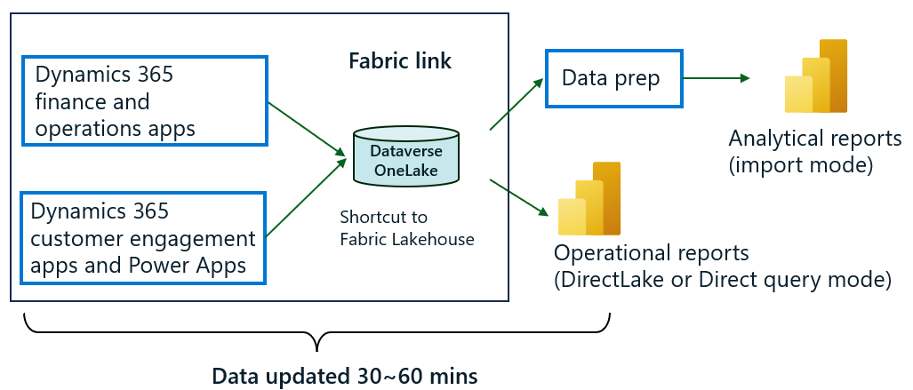

# Transition from legacy data integration services

Data export service, [bring your own database (BYOD)](/dynamics365/fin-ops-core/dev-itpro/analytics/export-entities-to-your-own-database), and [Export to Data Lake](/dynamics365/fin-ops-core/dev-itpro/data-entities/azure-data-lake-ga-version-overview) were features introduced in Dynamics 365 apps to export data for analytics and data integration scenarios. These services enabled IT admins and specialists to export data into external databases or data lakes and build data integration pipelines. While we improved these services over the years with updates as part of unification of Dynamics 365 with the power platform, we rearchitected the same capabilities of these disparate services into simpler, unified experiences built into Power Apps (make.powerapps.com). With a transition to Microsoft Fabric link or upgrade to Azure Synapse Link, the rearchitected services provide you with an easy ramp to benefit from AI and Copilot investments in Microsoft Dataverse and Fabric.

If you're a customer using any of the previous generation services, this article provides guidance on upgrading to the new experiences, benefiting from innovations, as well as reducing end-to-end expenses and effort.

Based on preview customer surveys, we also compiled a high level cost and benefits estimate to help you with the transition. Links to more information and videos, links to join forums and weekly office hour sessions to engage with the product team, Microsoft specialists, and fellow users are also provided here. We strive to enhance these services with community participation.

## Before transition 

If you're a customer using legacy services BYOD, data export service, or Export to Data lake, you might have a data integration architecture similar to the one shown here. The highlighted box indicates the data pipelines your organization might have built to leverage the data exported from Dynamics 365 and Dataverse. You can use a selection of tools from Microsoft, as well as others, to copy and integrate Dynamics data with your own data. You can also transform and aggregate data by copying into multiple stores – shown in the data prep box of the diagram. You can use Power BI or another tool to visualize data and create actionable insights. You might have pipelines built to export data to an on-premises system and other clouds.

:::image type="content" source="media/Fabric/before-transition.png" alt-text="Data integration solution with Export to Data Lake" lightbox="media/Fabric/before-transition.png":::

## After transition

There are two data integration patterns enabled in Power Apps:

-	Azure Synapse Link enables continuous export of data similar to BYOD, Export to Data Lake, or data export service. This option is enabled for IT admins and data integration specialists.
- Link to Fabric feature provides a no-copy, no-extract, transform, and load (ETL), fully managed software as a service (SaaS) integration.

These options are complementary. Here's a detailed comparison of the data integration services.

If you're a finance and operations apps customer currently using BYOD or Export to Data Lake features, by upgrading to Azure Synapse Link or Fabric link, you can benefit from a simplified data integration architecture resulting in reduced operational costs:

- Easy to configure and maintain via Power Apps (make.powerapps.com). Built-in integration with Azure Synapse and Fabric.
- Azure Synapse Link and Fabric link are fully managed services. Each requires minimal ongoing management overhead.
- New services offer the same data shapes as previous services. Your existing downstream integration pipelines can remain as-is.
- Minimal impact to operational workloads, you don’t need to manage workloads and schedule data exports.

Secure, end-to-end data integration pipelines:

-	With Fabric link, your data doesn’t leave the Dataverse governance boundary while authorized Fabric users can securely access data that resides within Dataverse.
-	Azure Synapse Link service enables you to restrict access to your storage accounts with firewalls while enabling Dataverse to export data with managed identities for Azure, a security feature built into Microsoft Entra.

If you're a Dynamics 365 customer engagement customer using data export service or classic Azure Synapse Link with data exports in CSV format, you can benefit from efficient reporting enabled with the industry standard Delta or Parquet data format:

- Built-in Delta Lake or Parquet conversion option reduces the need to build your own pipelines for analytics and operational reporting.
- Delta Lake or Parquet format enables faster, more responsive queries & reports and scales to larger datasets of any size.
- Data in lake is compressed to 1/3 to 1/8 the original size, resulting in smaller files that reduce data query and carrying costs.

| Link to Fabric  |  Azure Synapse Link |
|-------------------------------|------------------------------------|
| No copy, no ETL direct integration with Fabric. | Export data to your own storage account and integrate with Azure Synapse, Fabric, and other tools. |
| Data stays in Dataverse. Users get secure access in Microsoft Fabric. | Data stays in your own storage. You manage access to users.|
| All tables chosen by default.| System administrators can choose required tables. |
| Consumes additional Dataverse storage.| Consumes your own storage and other compute and integration tools.|

## Which option should I use?

If your organization is already using Fabric or planning to transition in the coming months, we recommend using the Fabric link feature. You can continue to use the Azure Synapse Link service if your immediate focus is to upgrade from your current services.

### Simplification with Fabric link

If you're already consuming data using Power BI, using a data warehouse, or using dataflows and notebooks to transform data, the link to Fabric feature provides immediate value. You can simplify your data integration architecture by removing the need to have your own storage account or Synapse services for Dataverse data. Instead of paying for Azure resources like storage and compute, you pay for the increase in Dataverse storage. Compute charges such as near real-time data updates and management overhead is also factored into Dataverse storage. Fabric link option is like having a near real time read-only replica of your data optimized for insights.

:::image type="content" source="media/Fabric/After-transition-fabric.png" alt-text="Data integration solution smplified with Fabric link" lightbox="media/Fabric/After-transition-fabric.png":::

Query this replica using T-SQL, Apache Spark, Python as well as other workloads in Fabric. You can also access this data using any tool that can consume T-SQL or can consume data from Azure Data Lake Storage.

As a Dynamics or Power Apps customer, you get a Dataverse storage quota based on the number of licenses you purchased. The Fabric link feature uses this database quota. You can buy more storage add-ons if the data volume exceeds your quota.

You can continue to retain Azure platform as a service (PaaS) services, like Databricks and SQL Database, in your own subscription. Recently announced Fabric features like data mirroring and shortcuts can help you further simplify your data integration.

Examples of cost reductions achieved with the simplicity derived from Fabric integration feature are described here.

### Upgrading to Azure Synapse Link

By upgrading to Azure Synapse Link and enabling Delta or Parquet conversion, you can eliminate Dataverse data prep pipelines in your solution. Azure Synapse Link service exports the same data shapes into your storage account in a more performant Delta or Parquet format. You can continue to use existing tools and Azure services like storage and Azure Synapse Analytics query with minimal disruptions to your production environments.

:::image type="content" source="media/Fabric/After-transition-synapse-link.png" alt-text="Data integration solution after upgrade to Azure Synapse Link" lightbox="media/Fabric/After-transition-synapse-link.png":::

## Understanding benefits and cost reductions

Simplicity achieved with Fabric link and Azure Synapse Link yields reductions in end-to-end costs. Consider the following examples that are based on preview customer experiences.

### Example 1: Transition from BYOD or Export to Data Lake to Fabric link

Consider the case where you transition to Fabric link from Export to Data Lake.

:::image type="content" source="media/Fabric/before-after-fabric-link.png" alt-text="Before and after solutions with link to Fabric" lightbox="media/Fabric/before-after-fabric-link.png":::

As indicated in the before and after diagrams in this article, customer retired export to data lake service (1) as well as staging data stores (2) with Fabric link. For operational insights, (4), they consumed data in OneLake directly in Power BI. Some of the insights require data merge, transformation, and aggregation (3). Instead of using disparate Azure services, they standardized on the same tools built into Fabric.

Innovations in Dataverse and Fabric enable simplifications and cost reductions:

- Dataverse comes with a built-in OneLake store. Operational data from Dynamics 365 and Power Apps are replicated to built-in lake store near real-time (to avoid influence to operational workloads) and linked securely to Fabric via shortcuts. There's no need to bring Azure storage and secure data that’s exported out. Your data doesn’t leave the Dataverse governance boundary and authorized users in Fabric can work with data using all Fabric workloads.
- Export to data lake and data export service exports data in CSV format. CSV files aren't suitable for direct consumption due to poor query performance as well as occasional read/write contention issues. The [before transition](#before-transition) solution uses Azure Data Factory to periodically ingest and convert raw data into an Azure SQL Database or an Azure data warehouse. This layer isn't needed in the [after transition](#after-transition) solution since Dataverse built-in OneLake data is maintained in Delta or Parquet format – the same open format that is native to Microsoft Fabric. Delta or Parquet format, along with optimizations in Fabric removes the need to maintain additional data stores for caching and improving query performance while eliminating read/ write contention. You can create Power BI reports using Direct Lake over data in OneLake without any additional data stages.
-	While operational insights can be performed using the data already available in OneLake, you might have additional data from other systems. This data might need to be combined, reshaped, and aggregated with Dataverse data. Fabric provides an integrated environment, which provides best of breed tools like dataflows, Azure Data Factory, and Spark. Use these tools as opposed to configuring and provisioning tools standalone, where you adopt the tools of your choice. Integrated billing, source control, and security enable simpler management and governance.
- While you can continue to use Power BI service for reporting purposes, Fabric introduces Direct Lake mode reporting, which leverages the in-memory indexes built into Delta or Parquet format therefore removing the need to use Power BI import mode reports.

These innovations yield end-to-end cost savings in addition to the benefits discussed earlier. The tables here outline the line items of costs along with a comparison of before and after solutions. You can use this table as a guideline to estimate expected cost savings.

| Cost savings line item  |  Before cost - export to data lake | After cost - Fabric link |
|-------------------------------|------------------------------------|------------------------------------------|
| Set-up and configuration | 	Need to use multiple tools.   - Pay for multiple software licenses and subscriptions.   - System configuration efforts.  - Effort to build and validate data pipelines.   - Continued governance, management, and monitoring.   - Training of users. |	Simpler configuration experience in Power Platform.    Purchase Fabric capacity and pay for use for all services. You only pay for what you use. In some cases, you're billed by the second.    No ETL pipelines needed for Dataverse data. |
| Data staging (1, 2) | Cost incurred for Azure services.   -	Azure storage cost including cost of IO.   -	Synapse Analytics (SQL serverless query).   -	Azure Data Factory jobs to copy data.   -	Staging data stores, such as Azure SQL Database.	| Cost increase in Dataverse storage    For example, if you sync 500 GB of data from Dynamics 365, Dataverse storage could increase by around 100 GB (assuming five to eight times data compression). |
| Operating Costs - data prep (3) | - Azure storage staging area.   - Data pipelines.  - Data ingestion into Azure SQL or data warehouse.   - Development of maintenance data. | Spending shifts to Fabric where you pay for consumption with a shared capacity. |
| Operating costs – reporting (4)   - Power BI datasets.   - Reporting. |	Synapse analytics (SQL query).   Power BI capacity and storage for import mode reports.	| As your data is compressed (for example 1/3 to 1/6 original size), your reporting and query costs reduce accordingly.    New features, like Direct Lake reporting, reduce consumption of Power BI storage consumption.|

 > [!NOTE]
 > These estimates are provided to enable estimating the spend after transition. While these estimates are based on experience from preview customers, actual costs incurred in your environment as well as data compression can vary depending on volume and composition of data.

### Example 2: Upgrade to Azure Synapse Link

Upgrading to Azure Synapse Link is an option to consider if you're not currently using Fabric – or not planning to transition in the coming months.

As indicated in the before and after diagrams here, customer retired Export to Data Lake service (1) as well as staging data stores (2) with Azure Synapse Link. Data stores used for data staging, such as intermediate Azure SQL Databases, are retired as Dataverse data is saved in Delta or Parquet format – a more performant and compressed data format. Downstream pipelines used for data merge, transformation, and aggregation, (3), as well as presentation tools (4), such as Power BI, remain unchanged.  

:::image type="content" source="media/Fabric/before-after-synapse-link.png" alt-text="Before and after upgrade to Azure Synapse Link" lightbox="media/Fabric/before-after-synapse-link.png":::

Azure Synapse Link provides an easy upgrade path for customers looking to extend their existing investments with minimal changes. As we discuss here, innovations in Dataverse enable easy transition from finance and operations apps services like Export to Data Lake and BYOD.

1. Azure Synapse Link enables easy configuration of Azure storage and Synapse services within the Power Apps (make.powerapps.com). Several limitations of Export to Data Lake are removed:

   1. A uniform experience enables choosing data from all Dynamics 365 apps including both finance and operations and customer engagement apps. You can maintain a single service to export data from all Dynamics 365 and Power Apps.
   1. Table limitations present with Export to Data Lake go away. You can choose up to 1,000 tables for each Azure Synapse Link profile within a single storage account. You can create multiple profiles (export pipelines) each with up to 1,000 tables.
   1. Azure Synapse Link provides built-in support for using firewall restricted storage accounts to export data.
   1. No need to configure Azure resources. Azure Synapse Link provisions and configures Azure resources on your behalf.
   1. Azure Synapse Link exports data in the same format as Export to Data Lake or BYOD enabling you to retain existing pipelines.

1. Both Export to Data Lake and data export service export data in CSV format. CSV files aren't suited for direct consumption due to poor query performance as well as occasional read/write contention issues. [Before transition](#before-transition) uses Azure Data Factory to periodically ingest and convert raw data into a SQL Azure Database or an Azure data warehouse. This layer isn't needed in the '[after transition](#after-transition) since Azure Synapse Link exports data in Delta or Parquet, which removes the need to maintain additional data stores for caching and improving query performance while eliminating read/write contention.
1. Continue to use your existing data pipelines for combining, reshaping, and aggregating additional data from other systems.
1. Continue to use Power BI service for reporting purposes. Fabric introduces Direct Lake mode reporting that leverages the in-memory indexes built into Delta or Parquet format, which removes the need to use Power BI import mode reports.

These innovations yield end-to-end cost savings in addition to the benefits discussed earlier. The tables here outline the line items of costs along with a comparison of before and after solutions. Use the table as a guideline to estimate expected cost savings.

| Cost savings line item | Before cost - Export to Data Lake | After cost - Azure Synapse Link |
|--------------------------|---------------------------------------|--------------------------------|
| Set-up and configuration   | Must use multiple tools.   -  Pay for multiple software licenses and subscriptions.  - System configuration efforts.   - Effort to build and validate data pipelines.   - Continued governance, management, and monitoring.   - Training of users. | Simpler configuration experience in Power Platform.   No ETL pipelines needed for Dataverse data. | 
| Data staging (1, 2) | Cost incurred for Azure services.   - Azure storage cost including cost of IO.   - Synapse Analytics (SQL serverless query).   - Azure Data Factory jobs to copy data.   - Staging data stores, such as Azure SQL Database. | Azure Synapse Link requires you to provide a Spark pool to convert data to Parquet format.    Depending on the frequency of data sync, as well as the volume of data changes, Spark pool costs can vary.    Small to medium data changes (per month):   - $600 to $2,000 for hourly refresh.   - $1,200 to $4,100 for 15-minute refresh.     Medium to large data changes (per month):   - $1,200 to $2,500 for hourly refresh.   - $2,500 to $8,300 for 15-minute refresh. |
| Operating costs - data prep (3) | - Azure storage staging area.   - Data pipelines.   - Data ingestion into Azure SQL Database or data warehouse.   - Development and maintenance data. | Same costs as indicated above, however, you might not need to aggregate Dataverse data due to Parquet conversion. |
| Operating costs - reporting (4):   - Power BI datasets.   - Reporting. | Synapse Analytics (SQL query).   Power BI capacity. | As your data is compressed, for example 1/3 to 1/6 original size, your reporting and query costs reduce accordingly. |

 > [!IMPORTANT]
 > These estimates are provided to enable estimating the spend after transition. While these estimates are based on experience from preview customers, actual costs incurred in your environment as well as data compression can vary depending on volume and composition of data.

### Example 3: Incrementally ingesting data to a data warehouse

If you're currently consuming incremental data from Export to Data Lake feature to populate a downstream data pipeline, you can continue to use the same pipeline. As shown here, Azure Synapse Link service can export incremental data changes in the same format as changes feed into Export to Data Lake.

:::image type="content" source="media/Fabric/before-after-incremental.png" alt-text="Before and after incremental data export to Azure Synapse Link" lightbox="media/Fabric/before-after-incremental.png":::

Azure Synapse Link service provides several enhancements over Export to Data Lake for incremental data changes:

- Initial data load is included within change folders. This makes it easy for the same pipeline to consume both the initial load as well as incremental updates.
- Change data isn't deleted in case of a reinitialization of a table.
- System creates a time-stamped folder structure and metadata that helps you read the changes in chronological order. Change data once written, is never updated. This approach is better suited to process changes using big data ingestion tools like Azure Data Factory.
- You can configure how often you want the change feeds updated in folders with Azure Synapse Link, as low as  five minutes.

When you transition to Fabric or Azure Synapse Link, the change in cost is minimal for incremental data changes.

## Understanding benefits – more real-time reporting

Fabric not only simplifies your data integration architecture, but also reduces the need to copy or replicate data. The underlying data format in Fabric, the industry standard Delta or Parquet format, can be directly consumed by Power BI, dataflows, notebooks, and other workloads eliminating the need for caching and staging areas.

If you upgrade to Azure Synapse Link and continue to export data, your data is saved in Delta or Parquet format, which can reduce the steps in your own data pipelines for operational reporting.

Consider the time taken to refresh an operational report, such as inventory analysis or month-end financial analysis. These reports might require data aggregation of millions of rows of data from multiple tables in Dynamics 365 Finance. Using Export to Data Lake service, CSV data is exported within 10 minutes. This data might need to be imported into a Power BI report to provide better response times. Power BI refresh can be performed up to 24 times a day (every 30 minutes). Depending on how the report is designed, refresh can take several minutes to complete refresh. Using this approach, users can see data within 60 minutes of an update.

Operational reports that source data using Fabric link can leverage Direct Lake mode or DirectQuery mode in Fabric, which leverages the in-memory index built into Delta or Parquet files. In these modes, you don’t need to schedule refresh of Power BI reports as the report always shows latest Dataverse data updated in Fabric.

The Fabric link service updates data in Dataverse OneLake within the hour as of this point in time. Dataverse triggers data update jobs every 15 minutes and depending on the volume of data changes, you might see updated Parquet files within 15 to 45 minutes. 

If you're consuming incremental data feeds from Dynamics 365 with Export to Data Lake service for near-real time data integration scenarios (example 3). Upgrade to Azure Synapse Link enables you to run the same data pipelines.

## Limitations and changes to behavior 
You may find a few changes in table formats introduced to avoid conflicts described in the [document here](./azure-synapse-link-select-FnO-data.md#known-limitations-and-changes-to-behavior)

Also verify that you have the [latest updates which addresses some of the known issues](./azure-synapse-link-select-FnO-data.md#recent-fixes-applicable-to-finance-and-operations-tables) To learn more about the upcoming roadmap and stay in touch with the product team, join the preview [Viva Engage group](https://aka.ms/synapselinkfordynamics).

## Frequently asked questions
Questions? you can refer to the [FAQ document published here](./azure-synapse-link-transition-FAQ.md#frequently-asked-questions-when-transitioning-from-legacy-data-integration-services). You can also join weekly office hrs, stay in touch with the product team and the customer forum by joining [Viva Engage group](https://aka.ms/synapselinkfordynamics).

## See also

[What is Azure Synapse Link for Dataverse?](export-to-data-lake.md)

[Link your Dataverse environment to Microsoft Fabric and unlock deep insights](azure-synapse-link-view-in-fabric.md)
