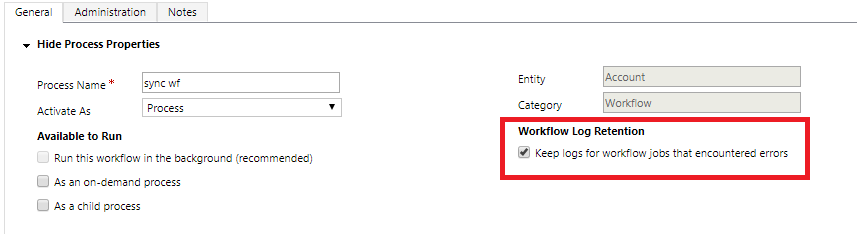

# Best practices for real-time workflow processes

[!INCLUDE[cc-data-platform-banner](../../includes/cc-data-platform-banner.md)]

This article contains best practices for creating and managing real-time workflow processes.  

   
## Avoid infinite loops  
It’s possible to create logic in a real-time workflow that initiates an infinite loop, which consumes server resources and affects performance. The typical situation where an infinite loop might occur is when you have a real-time workflow configured to start when a column is updated and then updates that column in the logic of the workflow. The update action triggers the same real-time workflow that updates the record and triggers the real-time workflow again and again.  
  
The workflows you create include logic to detect and stop infinite loops. If a real-time workflow process is run more than a certain number of times on a specific record in a short period of time, the process fails with the following error: **This workflow job was canceled because the workflow that started it included an infinite loop. Correct the workflow logic and try again**. The limit of times is 16.  
  
   
## Use real-time workflow templates  
If you have workflows that are similar and you anticipate creating more workflows that follow the same pattern, save your real-time workflow as a workflow template. This way, the next time you need to create a similar workflow, you can create the real-time workflow using the template and avoid entering all the conditions and actions from scratch.  
  
In the **Create Process** dialog, choose **New process from an existing template (select from list)**.  
  
   
## Use child workflows  
If you apply the same logic in different workflows or in conditional branches, define that logic as a child real-time workflow so you don’t have to replicate that logic manually in each real-time workflow or conditional branch. This helps make your workflows easier to maintain. Instead of examining many workflows that might apply the same logic, you can just update one workflow.  
  
   
## Keep logs for real-time workflow jobs that encountered errors  
For workflows that don't run in the background (synchronous), we recommend selecting the **Keep logs for workflow jobs that encountered errors** option in the real-time workflow definition. Selecting this option allows logs from failed real-time workflow executions to be saved for troubleshooting. Logs from successful synchronous workflow executions will always be deleted to save space.   

## Limit the number of workflows that update the same table
Running more than one real-time workflow that updates the same table can cause resource lock issues. Imagine several workflows running where every opportunity update triggers an update to the associated account. Multiple instances of these workflows running and attempting to update the same account record at the same time can result in resource locking issues. Real-time workflow failures occur and an error message, such as **SQL Timeout: Cannot obtain lock on resource _resource name_**, is recorded. 

   
## Use Notes to keep track of changes  
When you edit workflows you should use the Notes tab and type what you did and why. This allows someone else to understand the changes you made.  
  
## Next steps  

[Configure real-time workflow processes](configure-workflow-steps.md)   
[Monitor and manage real-time workflow processes](monitor-manage-processes.md)

[!INCLUDE[footer-include](../../includes/footer-banner.md)]