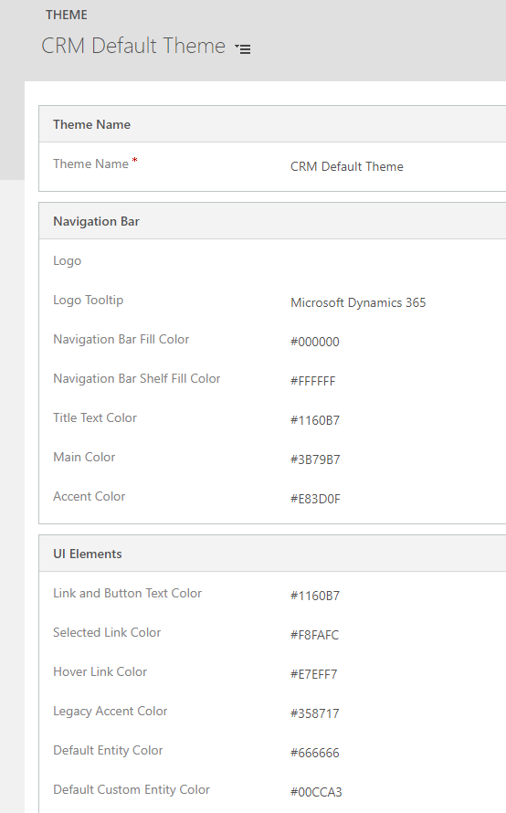
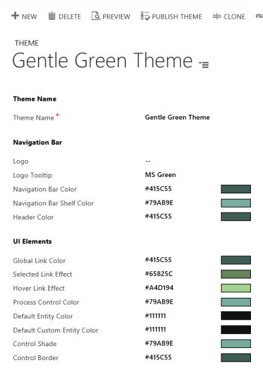
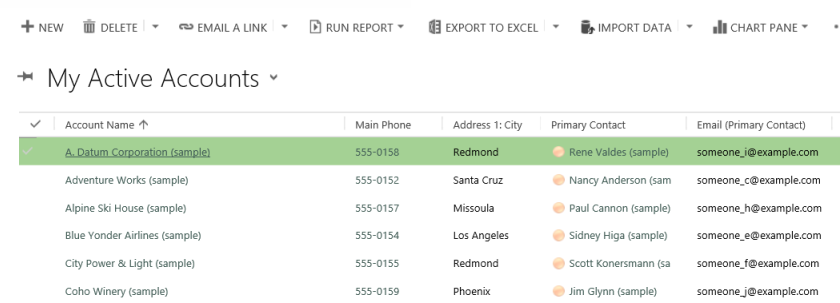
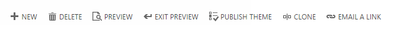

# Create a theme

[!INCLUDE[cc-data-platform-banner](../../includes/cc-data-platform-banner.md)]

You can create a custom look and feel (a theme), for your app by making changes to the default colors and visual elements provided in the uncustomized system. For example, you can create your personal product branding by adding a company logo and providing table-specific coloring. A theme is created by using the customization tools in the user interface, without requiring a developer to write code. You can create, change or delete themes that are used in your organization. The theme customization is supported in the Web forms in Dynamics 365 for Outlook. You can define multiple themes, but only one can be set and published as the default theme.  
  
   
## Use themes to enhance the user interface and create your product branding  
 Theming is used to enhance the app user interface, not drastically alter it. The theme colors are applied globally throughout the application. For example, you can enhance the following visual elements in the UI:  
  
-   Change product logos and navigation colors to create product branding  
  
-   Adjust accent colors, such as hover or selection colors  
  
-   Provide table-specific coloring  
    
-   Logo  
  
-   Logo tooltip  
  
-   Navigation bar color  
  
-   Navigation bar shelf color

-   Main command bar color on Unified Interface
  
-   Header color  
  
-   Global link color  
  
-   Selected link effect  
  
-   Hover link effect  
  
-   Process control color  
  
-   Default table color  
  
-   Default custom table color  
  
-   Control shade  
  
-   Control border  
  
   
## Solution awareness  
 The theme is not solution aware. The changes made for an organization's theme aren’t included in  solutions exported from the organization. The data is stored in the theme table that can be exported and re-imported in other environment. The imported theme must be published to take effect.  
  
   
## Copy and alter the existing theme  
 The easiest and quickest way to create a new theme is to clone and alter an existing theme, then save it, preview and publish. 
 
1.	Sign in to [Power Apps](https://make.powerapps.com/?utm_source=padocs&utm_medium=linkinadoc&utm_campaign=referralsfromdoc).

2.	Select **Model-driven** (lower left). 

3.	Select  (upper right) > **Advanced customizations**. 

4. Under **Themes** select **All themes**. 

5. Select **CRM Default Theme**. 

The following screenshot shows a portion of the default theme setup.  

> [!div class="mx-imgBorder"] 
>  
  
 We cloned the default theme and changed the colors. The following screenshots show the new colors for navigation and highlighting. You can also choose a new logo for product.  
  
 The following screenshot shows the new navigation color.  
 
 > [!div class="mx-imgBorder"] 
 >   
  
 The following screenshot shows the account table grid with the new highlight color.  
 
 > [!div class="mx-imgBorder"] 
 >   
  
   
## Preview and publish a theme  
 To preview and publish a theme, do the following steps:  
  
-   Create a new theme from scratch or clone an existing one.  
  
-   Preview the new theme by choosing **Preview** on the command bar. To exit the Preview mode, choose **Exit Preview** on the command bar, next to the **Preview** button.  
  
-   Publish a theme. Choose **Publish Theme** on the command bar.  
  
 The following screenshot shows the buttons on the command bar for preview and publishing.  
  
   
  
   
## Best practices  
 Following are the recommendations for designing theme contrasts and choosing colors.  
  
### Theme contrast  
 We recommend the following approach to providing contrast colors:  
  
-   Carefully choose the contrasting colors. The Microsoft Dataverse out-of-the-box default theme has the correct contrast ratios to ensure optimal usability. Use similar rations for your new themes.  
  
-   For high contrast mode, use the default color settings.  
  
### Theme colors  
 We recommend that you don’t use a large number of different colors. Although you can set a different color for every table, we recommend one of two patterns:  
  
-   Make all tables in neutral colors and highlight the key tables.  
  
-   Use the same color for similar tables or related tables, such as queue and queue item, or product catalog tables. Keep the total number of groups low.  
  
   
## Custom theme considerations  
 You should consider the following when planning on using custom themes:  
  
-   Most updated user interface (UI) areas will be displayed in the custom theme colors.  
  
-   Even though the theme colors are applied globally throughout the application, some legacy UI areas, such as gradient buttons, will retain the default colors.  
  
-   Certain areas must use dark or light colors to contrast with the default icon colors. The icon color isn’t customizable.  
  
-   A table can’t be displayed in different colors under different Sitemap nodes.  
  
-   The Sitemap nodes colors aren’t customizable.  
  
## See also  
         
 [Video: Themes](https://go.microsoft.com/fwlink/p/?LinkId=529568)
 [Query and edit an organization theme](/dynamics365/customer-engagement/developer/customize-dev/query-and-edit-an-organization-theme)

[!INCLUDE[footer-include](../../includes/footer-banner.md)]