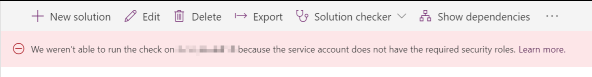
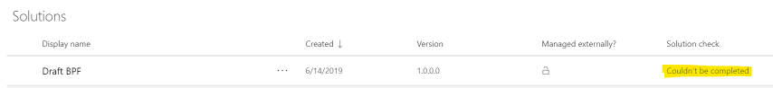
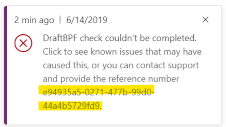
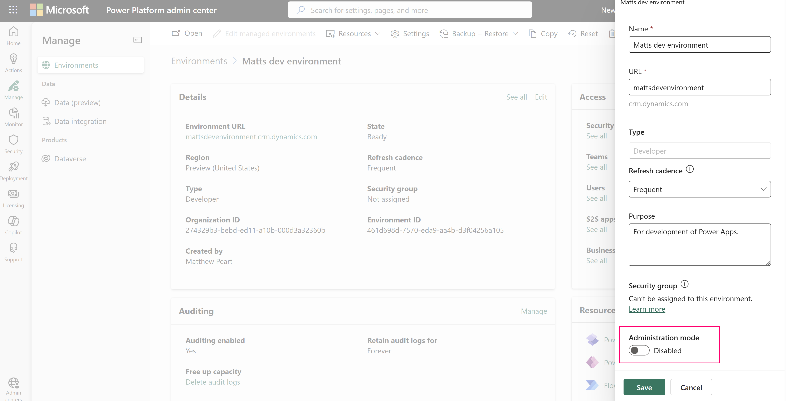
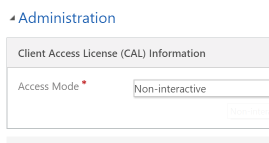
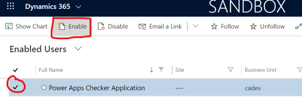
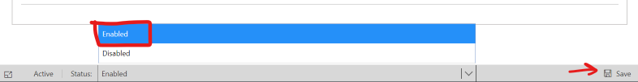
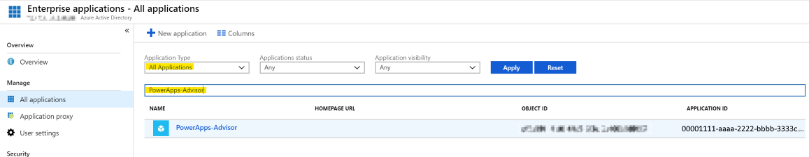
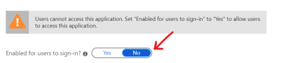
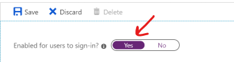

# Common issues and resolutions for solution checker

[!INCLUDE[cc-data-platform-banner](../../includes/cc-data-platform-banner.md)]

This article lists some common issues that you might encounter while using solution checker. Where applicable, workarounds are provided.

## You're unable to use solution checker to run analysis or download results

Shortly after submitting a solution checker request to run an analysis or download results the operation doesn't complete and an error message is displayed, such as:

> *"We weren't able to run the check on **[Solution Name]** solution. Try running it again."*

Whenever possible, solution checker attempts to return a specific error message with a link to details about the potential cause and resolution steps. Select **'Learn more'** for details.

Failures that occur during background processing of the analysis will fail with **'Couldn't be completed'** status and return an error message in the Power Apps portal as well as send email notification to the requestor.

Selecting the portal notification will link to this page of common issues for further troubleshooting. If one of the provided common issues does not resolve the problem, a reference number is also returned. Provide this reference number to Microsoft Support for further investigation.

## Solution Checker fails to check Default solution

Solution checker exports the solution from the Microsoft Dataverse environment for analysis. Exporting the Default Solution is not supported and the check may not complete successfully. More information: [Solution Checker fails to export large solutions](#solution-checker-fails-to-export-large-solutions).

## Solution checker fails due to unsupported version of Power Apps Checker

Solution checker is a feature enabled by the Power Apps Checker app.  If you have installed a Power Apps Checker app version earlier than version **1.0.0.47**, solution checker runs may fail to complete successfully. You should upgrade your Power Apps Checker version from the [!INCLUDE [pn-dyn-365-admin-center](../../includes/pn-dyn-365-admin-center.md)].

However, if you have a Power Apps Checker version earlier than version **1.0.0.45** installed, we recommend that you delete the solution and install it again. Due to recent schema changes, upgrade of Power Apps Checker from versions earlier than version **1.0.0.45** may fail.

If you want to keep the past results from solution checker, export the results from a previous run or export all solution checker data using [Export data to Excel](../../user/export-data-excel.md) to export the data from the following tables:

- Analysis Component
- Analysis Job
- Analysis Result
- Analysis Result Detail

### How to uninstall Power Apps Checker

To uninstall the Power Apps Checker solution:

1. As a System Administrator or as a System Customizer, open the Power Apps portal by going to https://make.powerapps.com/environments.
2. Select **Solutions**.
3. Select **Power Apps Checker**, and then on the solutions toolbar select **Delete**.

### How to install Power Apps Checker

To install Power Apps Checker back into your Dataverse environment:

1. As a System Administrator or as a System Customizer, open up your Power Apps portal by going to https://make.powerapps.com/environments.
2. Select **Solutions**.
3. On the solution toolbar select **Solution checker**, and then select **Install**.

## Solution checker can't access environments in Administration Mode

Environments that have been placed into [Administration Mode](/dynamics365/customer-engagement/admin/manage-sandbox-instances#administration-mode) purposely restrict access to only users with System Administrator and System Customizer roles. Because the Power Apps Checker application identity has neither of these roles assigned by default, it can't access organizations operating in this mode.

In order to use solution checker in this organization, Administration Mode must be disabled.

### How to disable administration mode

To disable administration mode for an organization instance:

1. Sign in to the [Power Platform admin center](https://admin.powerplatform.microsoft.com/environments/).
2. Open the environment that has issues running solution checker, and then select **Edit**. 

3. Set **Administration mode** to disabled, and then select **Save**.

    

4. Run solution checker again.

## Solution checker fails due to missing security roles

The application user for Solution Checker requires two security roles assigned in order to provide the necessary privileges to communicate with the Dataverse organization. If either of these roles are not assigned to the user **'Power Apps Checker'**,  attempts to run analysis, download results, and run cancelation will fail. This occurs most often when customers have automation in place that removes security roles from unexpected users. The following security roles contain minimum required permissions:

- Export Customizations
- Solution Checker

### How to assign missing security roles

To assign missing security roles to the Power Apps Checker user:

1. Open your Dataverse organization and navigate to **Settings** > **Security** > **Users**.
2. Select the **'Power Apps Checker'** user from the list of users.
3. Select **MANAGE ROLES** on the command bar.
4. Select **'Export Customizations'** and **'Solution Checker'** role checkboxes, and then select **OK**.

5. Run solution checker again.

## Solution checker fails due to restricted access mode

The application user for solution checker requires an access mode of **'Non-Interactive'** or **'Read-Write'** in order to communicate with the Dataverse organization. If the access mode has been changed to another value such as **'Administrative'**, then attempts to run analysis, download results, and run cancelation will fail.

To resolve this issue, you must update the **'Power Apps Checker'** application user with 'Non-interactive' access mode.

### How to update user access mode

To update the access mode for the Power Apps Checker user:

1. Open your Dataverse organization and navigate to **Settings** > **Security** > **Users**.
2. Select the **'Power Apps Checker'** user from the list of users and double-click to open the user form.
3. Scroll to the **'Administration'** > **'Client Access License (CAL) Information'** section of the form.
4. Select **'Non-interactive'** in the **Access Mode** drop-down control.

5. Save and close the user form.
6. Run solution checker again.

## Solution Checker fails due to disabled application user

The Power Apps Checker application user in the Dataverse organization containing solutions to be analyzed must be enabled. If the application user becomes disabled, requests to analyze solutions in the same organization will fail. If receiving this error message, first verify that the Power Apps Checker application user is indeed disabled. Then follow the mitigation steps provided below.

### How to enable the Power Apps Checker application user

1. In the Power Platform Admin center, select the environment and go to **Settings** > **User's + Permissions**  > **Users**.
2. In the **Application Users** view, select the checkmark next to the Power Apps Checker Application user.
3. On the Actions toolbar, select **Enable**

4. In the **Confirm User Activation** message, select **Activate**.
5. An alternative approach is to open the application user form and select **Enabled** status in the form footer. **Save** the change.

## Common plugin conditions that cause solution checker to fail

When solution checker receives and processes analysis requests, it must call the Dataverse endpoint to retrieve/update relevant job data and export the selected solution(s). Each interaction made by the solution checker service with the Dataverse could potentially trigger one or more plugin steps that have been registered on message submitted in the request. These plugins may in turn introduce conditions that prevent the message from being handled as expected by the Dataverse and interrupt the ability of solution checker to process the requested analysis job. Similar situations can occur when downloading solution checker job results or canceling an in-progress analysis job.

Typical Dataverse operations requested by solution checker:

- Retrieve solution, systemuser, and organization table data
- Create, update, and retrieve analysis job, analysis component, and analysis result table data
- Export solutions

### Plugin step registered to execute in context of an unlicensed user

When solution checker fails due to an "unlicensed user" exception, it is often caused by a triggered plugin step configured to execute in the context of a specific system user that is currently unlicensed. Ensure that any plugin steps that could be triggered by solution checker execute in context of a licensed user.

>[!IMPORTANT]
>It is highly recommended that plugin steps be configured to execute in context of the calling user rather than specific users which are subject to assigned license being revoked.

### Plugin step performs operations that require privileges not granted to Power Apps Checker application user

When solution checker fails due to Dataverse denying access based on a missing privilege, it is often caused by a triggered plugin step that performs operations that require privileges not currently granted to the Power Apps Checker application user. Either reconfigure the plugin step to not execute on the operation invoked by solution checker or grant the Power Apps Checker application user the necessary privileges to execute the custom plugin step.

### Plugin step unexpectedly interrupts execution by throwing InvalidPluginExecutionException

Solution checker may fail due to the errors "ISV code aborted the operation" or "An unexpected error occurred from ISV code". When this occurs, it indicates a plugin step was triggered that explicitly interrupted execution by throwing an InvalidPluginExcecutionException or that an error was not caught properly in plugin code. Either reconfigure the plugin step to not execute on the operation invoked by solution checker or adjust the plugin implementation not to interrupt execution based on the conditions presented by solution checker.

Common operations invoked by solution checker include Create and Update. These operations can occur on the following tables: Analysis Job, Analysis Component, or Analysis Result.

## Solution checker fails due to disabled first-party application in Azure Active Directory

The first-party enterprise application identity used by solution checker (PowerApps-Advisor) should not be disabled in Azure Active Directory (AAD). If disabled, the identity cannot authenticate when requesting bearer tokens for Dataverse and other required resource providers on-behalf of the requesting user.

Follow the below steps to verify that the application identity hasn't been disabled in AAD and if necessary enable the application.

### How to verify and/or modify application enabled status

To verify and/or modify the enabled status of the PowerApps-Advisor enterprise application identity

1. Access your tenant in the [Azure Active Directory (AAD) Portal](https://aad.portal.azure.com/).
2. Navigate to **Enterprise Applications**.
3. Select **All Application** and search for **'PowerApps-Advisor'**.

4. Select **'PowerApps-Advisor'** to view the app details.
5. Select **Properties**.
6. Check the state of **Enabled for users to sign in**. If **'No'**, then the application has been disabled.

7. Select the radio control to switch the value to **'Yes'**. This enables the application.

8. Select **Save**. The application is now enabled. You may need to wait a few minutes for change to propagate.
9. Run solution checker again.

> [!IMPORTANT]
> You must have administrator privileges in Azure Active Directory (AAD) in order to edit enterprise applications.

## Solution checker fails to export solutions with draft Business Process Flow components

If a solution contains a business process flow component in draft state that has never been previously activated, then Solution Checker will fail to export the solution for analysis. This error is not unique to Solution Checker and is caused by the business process flow having a dependency on a backing (custom) table component that doesn't get created until the business process flow is activated for the first time. This issue can also occur if a business process flow is activated from within Solution Explorer.

Reference [KB Article #4337537: Invalid Export - Business Process table Missing](https://support.microsoft.com/en-hk/help/4337537/invalid-export-business-process-table-missing) for details about the issue and steps to resolve.

## Solution checker fails to export solutions with model-driven app components

If a solution contains a model-driven app, Solution Checker might fail to export the solution for analysis. This error is caused by role-based security for sharing of apps. If the Power Apps Checker application user does not have appropriate access to model-driven apps, any solutions containing them will fail to export with solution checker.

To resolve this issue, grant the **Environment Maker** security role to the Power Apps Checker application user.

## Solution checker fails to export patched solutions

If a solution has had a [patch](/power-platform/alm/create-patches-simplify-solution-updates) applied, Solution Checker will fail to export the solution for analysis. When a solution has had a patch applied, the original solution becomes locked and it can't be changed or exported as long as there are dependent patches that exist in the organization that identify the solution as the parent solution.

To resolve this issue, clone the solution so that all patches related to the solution are rolled into the newly created solution. This unlocks the solution and allows the solution to be exported from the system.  For more information, see  [Clone a Solution](/power-platform/alm/update-solutions-alm#clone-a-solution).

## Solution checker will not analyze empty solutions

If Solution Checker exports a solution that contains no components to analyze, it will terminate further processing and consider the run a failure. Ensure that the selected solution submitted for a Solution Checker analysis contains at least one component.

## Solution Checker fails to export large solutions

The primary scenario for failure to export a large solution from the Dataverse environment involves a timeout exception on the export request. This will occur if the request exceeds 20 minutes. Large solutions, such as the Default Solution, may fail to get exported within this time frame, and the check will not complete successfully. If solution checker encounters a timeout during export, it will retry three times before it fails to process the job, so it may take over an hour before you receive a failure notification.

The workaround is to create smaller solutions with fewer components to be analyzed. If the large file size of the solution is due to many plug-in assembly components, see guidance to [Optimize custom assembly development](../../developer/data-platform/best-practices/business-logic/optimize-assembly-development.md).

> [!IMPORTANT]
> To minimize false positives, ensure you add dependent customizations. When you create a solution and add these components, include the following:
> - When you add plug-ins, include the SDK Message Processing Steps for the plug-in.
> - When you add table forms, include the JavaScript web resources attached to the form events.  
> - When you add JavaScript web resources, include any dependent JavaScript web resources.
> - When you add HTML web resources, include any dependent scripts that are defined within the HTML web resource.
> - When you add custom workflows, include the assembly used within the workflow.

## Line number references for issues in HTML resources with embedded JavaScript are not correct

When HTML web resources are processed within solution checker, the HTML web resource is processed separately than the JavaScript within the HTML web resource. Due to this, the line number of the violation found within `<script>` of the HTML web resource will not be correct.

## Web-avoid-eval error for Power Apps component framework code components

If a web-avoid-eval error is reported for a Power Apps component framework code component created using CLI tooling, package your control with `msbuild /p:configuration=Release` or `npm run build -- --buildMode production` to produce a release build that does not include 'eval' usage.

## Web-unsupported-syntax issue for web resources

Solution checker supports global variables for ECMAScript 2015 (ES6) and up to ECMAScript 2018 (ES9) syntax. When solution checker analyzes JavaScript using global variables later than ES6, or syntax later than ES9, a web-unsupported-syntax issue for the web resource is reported.  

## Multiple violations reported for plug-ins and workflow activities based on call scope

For plug-in and workflow activity rules where the issue is only relevant in the calling context, the solution checker tool starts its analysis at the IPlugin interface implementation and traverses a call graph to detect issues within the scope of that implementation.  In some cases, many call paths may arrive at the same location where the issue is detected.  Since the issue is relevant to the call scope, the tool may report based on that scope to provide a better picture of impact rather than on distinct locations. As a result, multiple issues may reference a single location that should be fixed.

## app-formula-issues-high may show different number of errors than those shown in design mode

The solution checker will list the number of the errors found in the app, *including those from tests*. The app checker in design mode only shows errors from screen controls and components. If the error count shown in the app checker in design mode is smaller, open the [Test Studio](../canvas-apps/test-studio.md) and search for the errors in the expressions used in tests.

## Multiple violations reported for PCF control

Solution Checker is confugired to validate production ready code, thus PCF controls must be build using proper flags:
`npm run build -- --buildMode production` or `msbuild /p:configuration=Release` depending on your building system. More information: [Create and build a code component](https://docs.microsoft.com/en-us/powerapps/developer/component-framework/create-custom-controls-using-pcf#build-your-component).

## See also

[Best practices and guidance for the Dataverse](../../developer/data-platform/best-practices/index.md)

[Best practices and guidance for model-driven apps](../../developer/model-driven-apps/best-practices/index.md)

[!INCLUDE[footer-include](../../includes/footer-banner.md)]
