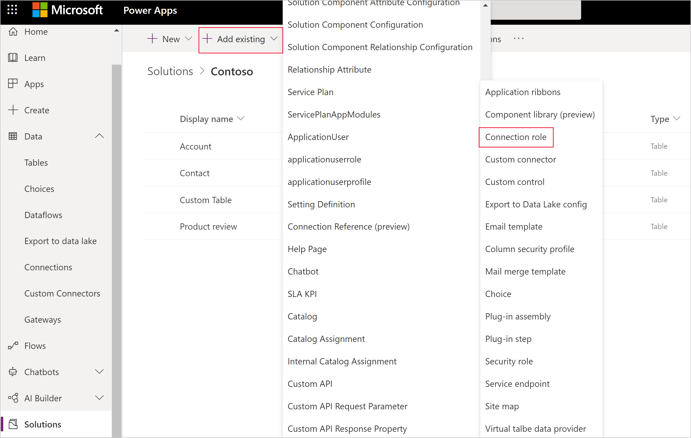
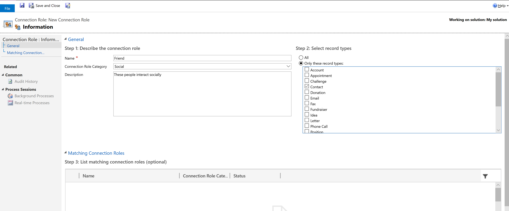

# Configure connection roles

With Microsoft Dataverse, you can define **connections** between table rows without creating a table relationship. In model-driven apps people can establish a named link between rows to establish less a formal relationship, which doesn't justify creating an actual table relationship. Some examples include *friend*, *sibling*, *spouse*, *attendee*, and *stakeholder*. Some connections can also be reciprocal, such as *child* and *parent*, *husband* and *wife*, or *doctor* and *patient*.

When people set a connection between two rows, they can also add a description and additional information such as start and end dates for the relationship. More information: [Add a connection role to link rows to each other](/powerapps/user/add-connection-role)

Anyone with write access to the **Connection Role** table can establish which connections are available for people to use.

> [!IMPORTANT]
> For a table to be available as a row type for a new or existing connection role, the **Can have connections** property must be enabled for the table.

## Enable connection roles for a table

1. Sign in to [Power Apps](https://make.powerapps.com/?utm_source=padocs&utm_medium=linkinadoc&utm_campaign=referralsfromdoc). 
1. Open the table you want or create a new one. More information: [Edit a table](edit-entities.md)
1. Select **Properties**, and then in the right properties pane, select **Can have connections**.
    :::image type="content" source="media/enable-connections.png" alt-text="Enable connections setting" lightbox="media/enable-connections.png":::

1. Select **Save**.

## View connection roles

There are a number of standard connection roles already configured in Dataverse.  

1. Sign in to [Power Apps](https://make.powerapps.com/?utm_source=padocs&utm_medium=linkinadoc&utm_campaign=referralsfromdoc), and then on the left pane, select  **Solutions**. [!INCLUDE [left-navigation-pane](../../includes/left-navigation-pane.md)]
2. Open the unmanaged solution you want.
3. On the command bar, select **Add existing** > **Connection Role**.
   The list of available connection roles are displayed. 
4. Select **Cancel** to close the **Add existing connection Roles** pane without adding a connection role to the solution.

> [!NOTE]
> - If you want to distribute connection roles with a solution, make sure they are included in the solution you want to distribute. More information: [Add connection roles to a solution](#add-connection-roles-to-a-solution)

## Add connection roles to a solution

Because connection roles are *solution aware*, which means that they can be included in a solution, you can also add connection roles to a solution you distribute.

Generally we don't recommended you edit components in the internal **Default Solution**. Within the solution you've created to work in, you can use the **Add Existing** command in the **Solutions** area to bring any of the active connection roles into your solution.

> [!div class="mx-imgBorder"] 
> 

Once you add the connection role to your solution, you can edit it wherever it's visible.

> [!NOTE]
> The connection role status is not included with the connection role when it is exported from a solution. Therefore, when the solution is imported into a target environment, the status will be set to active by default. 

## Create a connection role

> [!IMPORTANT]
> If you intend to distribute a solution that includes new connection roles or changes to the existing connection roles you must add them to the solution you will distribute. Editing or adding new connection roles in the **Default Solution** will not include them in a solution you can distribute. More information [Add connection roles to a solution](#add-connection-roles-to-a-solution)

1. Sign in to [Power Apps](https://make.powerapps.com/?utm_source=padocs&utm_medium=linkinadoc&utm_campaign=referralsfromdoc) and then on the left pane select **Solutions**. [!INCLUDE [left-navigation-pane](../../includes/left-navigation-pane.md)]
2. Open the unmanaged solution your want, and then on the command bar select **New** > **Other** > **Connection role**. 
3. Complete the three steps on the form to [Describe the connection role](#describe-the-connection-role).

   > [!div class="mx-imgBorder"] 
   > 

### Describe the connection role

Set the following columns:

|Column|Description|
|--|--|
|**Name**|(Required) The text describing the connection.|
|**Connection Role Category**|A group describing the category of the connection. More information: [Connection Role Category values](#connection-role-category-values)|
|**Description**|Provide a definition for the role.|

#### Connection Role Category values

The default **Connection Role Category** values are:
- Business
- Family
- Social
- Sales
- Other
- Stakeholder
- Sales Team
- Service

You can add new categories or modify existing ones by editing the **Category** global choice. More information: [Create and edit global choices for Dataverse (picklists)](create-edit-global-option-sets.md)

#### Select row types

Select which row types should be available to connect.

> [!NOTE]
> Although **All** is selected by default, make sure you consider which types are appropriate for the connection role you are adding.

#### Matching connection roles

In this optional step, you can define any roles that be applied in a reciprocal manner. It isn't required, but connections are more meaningful if these are defined.

For example, people can set that Glen is a *Friend* to Mary, but does this mean that Mary is a *Friend* to Glen? We hope so. But if Glen is the *Father* of Mary it doesn't mean that Mary is the *Father* of Glen. Establishing correct reciprocity requires this extra step.

When people set a connection role that doesn't have a matching connection role, the role will only be displayed when viewing the connection from the row that the connection was applied to. When viewed from the connected row, the role will be empty unless a matching role is set.

For role definitions like *Friend*, *Spouse*, *Colleague*, or *Sibling*, it's best to assign the matching role to itself. If a single matching connection role is configured, the single matching connection role will be applied in both directions.

> [!IMPORTANT]
> You will need to save a new connection role without this matching connection role before you can set the matching connection role to itself.

You'll find that some connection roles are already configured with matching connection roles. *Former Employee* is matched with *Former Employer* and vice versa. This kind of one-to-one matching connection role is most common.

You can configure multiple matching connection roles to describe complex relationships. If you create a connection role such as *Father*, you could configure two more roles such as Daughter,* and *Son* and apply both of them as matching connection roles to *Father*. In turn, both the *Daughter* and *Son* connection roles should be matched to *Father*. Of course, then you should set up an equivalent role for *Mother* that is similarly matched with *Daughter* and *Son*.

> [!TIP]
> Before you create a complex set of connection roles, consider if a more simple set of roles will be enough. For example, rather than creating a complex set of connection roles like *Father*, *Mother*, *Son*, and *Daughter* - consider if simply using *Parent* and *Child* will work for you.

If more than one matching connection role is configured, those connection roles represent the only valid reciprocal roles. The first one will be applied automatically as the default value. If the default value isn't correct, people need to manually edit the connection and choose between valid options defined in the configuration.

### See also

[Create connections to define and view relationships between rows (classic)](/dynamics365/customer-engagement/basics/create-connections-view-relationships-between-records) 
[Create and edit global choices for Dataverse (picklists)](create-edit-global-option-sets.md) 
[Create and edit relationships between tables](create-edit-entity-relationships.md)

[!INCLUDE[footer-include](../../includes/footer-banner.md)]
