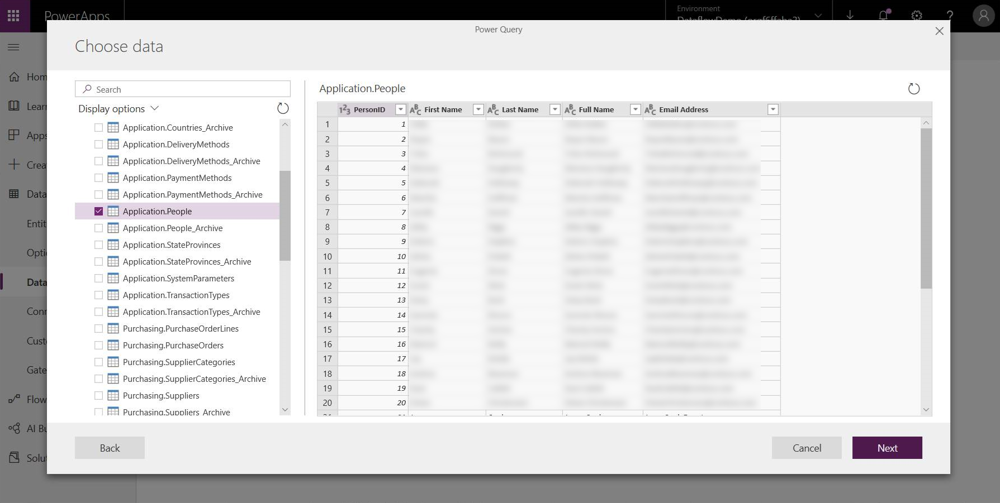

# Create and use dataflows in Power Apps

[!INCLUDE[cc-data-platform-banner](../../includes/cc-data-platform-banner.md)]

With advanced data preparation available in Power Apps, you can create a
collection of data called a dataflow, which you can then use to connect with
business data from various sources, clean the data, transform it, and then load
it to Microsoft Dataverse or your organization’s Azure Data Lake Gen2 storage
account.

A dataflow is a collection of tables that are created and managed in environments in the Power Apps service. You can add and edit tables in your dataflow, as well as manage data refresh
schedules, directly from the environment in which your dataflow was created.

Once you create a dataflow in the Power Apps portal, you can get data from it
using the Common Data Service connector or Power BI Desktop Dataflow connector, depending on
which destination you chose when creating the dataflow.

There are three primary steps to using a dataflow:

1.  Author the dataflow in the Power Apps portal. You select the destination
    to load the output data to, the source to get the data from, and the Power
    Query steps to transform the data using Microsoft tools that are
    designed to make doing so straightforward.

2.  Schedule dataflow runs. This is the frequency in which the Power Platform
    Dataflow should refresh the data that your dataflow will load and transform.

3.  Use the data you loaded to the destination storage. You can build apps,
    flows, Power BI reports, and dashboards or connect directly to the dataflow’s
    Common Data Model folder in your organization’s lake using Azure data services like Azure
    Data Factory, Azure Databricks or any other service that supports the Common Data Model
    folder standard.

The following sections look at each of these steps so you can become familiar
with the tools provided to complete each step. 

## Create a dataflow
Dataflows are created in one environment. Therefore, you will only be able to see
and manage them from that environment. In addition, individuals who want to get
data from your dataflow must have access to the environment in which you created
it.

> [!NOTE]
> Creating dataflows is currently not available with Power Apps Developer Plan licenses.

1.  Sign in to Power Apps, and verify which environment you're in, find the environment switcher near the right side of the command bar.

    

2.  On the left navigation pane, select the down arrow next to **Dataverse**.

    

3.  In the **Dataverse** list, select **Dataflows**, select **New dataflow**, and then select **Start from blank**.

    

4.  On the **New Dataflow** page enter a **Name** for the dataflow. By default, dataflows store tables in Dataverse. Select **Analytical entities only** if you want tables to be stored in your organization's Azure Data Lake storage account. Select **Create**. 

     > [!IMPORTANT]
     > There is only one owner of any dataflow—the person who created it. Only the owner can edit the dataflow. Authorization
     > and access to data created by the dataflow depend on the destination you loaded
     > data to. Data loaded into Dataverse will be available via the Dataverse
     > Connector and requires the person accessing the data to be authorized to Dataverse.
     > Data loaded into your organization’s Azure Data Lake Gen2 storage account is
     > accessible via the Power Platform Dataflow connector and access to it requires
     > membership within the environment it was created in.

5. On the **Choose data source** page, select the data source where the tables are stored. The selection of data sources displayed allows you to create dataflow tables. 

    

6. After you select a data source, you’re prompted to provide the connection
settings, including the account to use when connecting to the data source. Select **Next**.

    

7. Once connected, you select the data to use for your table. When you
choose data and a source, the Power Platform Dataflow service will subsequently
reconnect to the data source in order to keep the data in your dataflow
refreshed, at the frequency you select later in the setup process.

    

Now that you've selected the data to use in the table, you can use the dataflow editor to
shape or transform that data into the format necessary for use in your dataflow.

## Use the dataflow editor to shape or transform data
You can shape your data selection into a form that works best for your table using a
Power Query editing experience, similar to the Power Query Editor in Power BI
Desktop. To learn more about Power Query, see [Query overview in Power BI Desktop](/power-bi/desktop-query-overview).

If you want to see the code that Query Editor is creating with each step, or
if you want to create your own shaping code, you can use the advanced editor.

## Dataflows and the Common Data Model 
Dataflows tables include new tools to easily map your business data to the
Common Data Model, enrich it with Microsoft and third-party data, and gain simplified access to machine learning. These new capabilities can be leveraged to provide intelligent and actionable insights
into your business data. Once you’ve completed any transformations in the edit
queries step described below, you can map columns from your data source tables to standard
table columns as defined by the Common Data Model. Standard tables have a
known schema defined by the Common Data Model.

For more information about this approach, and about the Common Data Model, see [The Common Data Model](/common-data-model/).

To leverage the Common Data Model with your dataflow, select the **Map to Standard** transformation in the **Edit Queries** dialog. In the **Map tables** screen that appears, select the standard table that you want to map.

When you map a source column to a standard column, the following occurs:

1.  The source column takes on the standard column name (the column is renamed if
    the names are different). 

2.  The source column gets the standard column data type. 

To keep the Common Data Model standard table, all standard columns that are not
mapped get *Null* values.

All source columns that are not mapped remain as is to ensure that the result
of the mapping is a standard table with custom columns.

Once you’ve completed your selections and your table and its data settings are
complete, you’re ready for the next step, which is selecting the refresh frequency of your
dataflow.

## Set the refresh frequency
Once your tables have been defined, you’ll want to schedule the refresh
frequency for each of your connected data sources.

1. Dataflows use a data refresh process to keep data up to date. In the **Power Platform Dataflow authoring tool**, you can choose to refresh your dataflow manually or automatically on a scheduled
interval of your choice. To schedule a refresh automatically, select **Refresh automatically**.

   

2. Enter the dataflow refresh frequency, start date, and time, in UTC.

3. Select **Create.**
<!-- 
## Connect to your dataflow in Power BI Desktop
Once you’ve created your dataflow and you have scheduled the refresh frequency
for each data source that will populate the model, you’re ready for the final task, which is connecting to your dataflow from within Power BI Desktop.

To connect to the dataflow, in Power BI Desktop select **Get Data** > **Power Platform** > **Power Platform dataflows** > **Connect**.

Navigate to the environment where you saved your dataflow, select
the dataflow, and then select the tables that you created from the list.

You can also use the search bar, near the top of the window, to quickly find the
name of your dataflow or tables from among many dataflow tables.

When you select the table and then select the **Load** button, the tables
appear in the **Columns** pane in Power BI Desktop, and appear and behave just
like tables from any other dataset. -->

## Using dataflows stored in Azure Data Lake Storage Gen2
Some organizations might want to use their own storage for creation and management
of dataflows. You can integrate dataflows with Azure Data Lake Storage Gen2 if
you follow the requirements to set up the storage account properly. More information: [Connect Azure Data Lake Storage Gen2 for dataflow storage](/power-query/dataflows/connect-azure-data-lake-storage-for-dataflow) 

## Troubleshooting data connections
There might be occasions when connecting to data sources for dataflows runs into
issues. This section provides troubleshooting tips when issues occur.

-   **Salesforce connector.** Using a trial account for Salesforce with
    dataflows results in a connection failure with no information provided. To
    resolve this, use a production Salesforce account or a developer account for
    testing.

-   **SharePoint connector.** Make sure you supply the root address of the
    SharePoint site, without any subfolders or documents. For example, use a link
    similar to *https://microsoft.sharepoint.com/teams/ObjectModel*.

-   **JSON File connector.** Currently you can connect to a JSON file using
    basic authentication only. For example, a URL similar to *https://XXXXX.blob.core.windows.net/path/file.json?sv=2019-01-01&si=something&sr=c&sig=123456abcdefg* is currently not supported.

-   **Azure SQL Data Warehouse.** Dataflows do not currently support Azure
    Active Directory authentication for Azure SQL Data Warehouse. Use
    basic authentication for this scenario.

## Next steps
The following articles are useful for further information and scenarios when using dataflows:

-   [Add data to a table in Dataverse](/power-query/dataflows/add-data-power-query)

-   [Using an on-premises data gateway in Power Platform dataflows](/power-query/dataflows/using-dataflows-with-on-premises-data)

-   [Connect Azure Data Lake Storage Gen2 for dataflow storage](/power-query/dataflows/connect-azure-data-lake-storage-for-dataflow)

For more information about the Common Data Model:

-   [Common Data Model - overview](/common-data-model/)

-   [Learn more about the Common Data Model schema and tables on GitHub](https://github.com/Microsoft/CDM)

[!INCLUDE[footer-include](../../includes/footer-banner.md)]