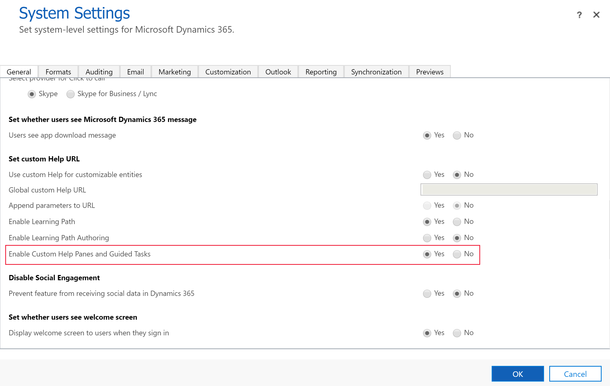
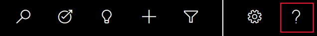
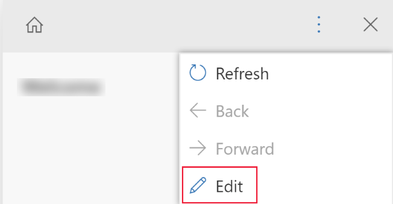

# Create guided help for your Unified Interface app

[!INCLUDE[cc-data-platform-banner](../../includes/cc-data-platform-banner.md)]

[!INCLUDE [cc-beta-prerelease-disclaimer](../../includes/cc-beta-prerelease-disclaimer.md)]

Use custom help panes and guided tasks to give your Unified Interface application a custom in-product help experience that is tailored to your organization. Use custom help panes to provide table, form, and language-specific help and guidance that includes rich text, content links, images, and video links. 

> [!IMPORTANT]
> - Custom help panes replace the previous learning path guided learning feature used with legacy web client apps.
> - Custom help panes don’t work with Unified Interface apps running on a mobile device, such as Android and iOS tablets and smartphones.

## Custom help panes and learning path
The new guided help implementation of custom help panes differs from the previous learning path guided help feature. Both features let you create custom help for your application. However, custom help panes are optimized for the most common guided help scenarios.   

Custom help panes provide the following key features that are not available with learning path: 
- Free-form rich text, including bullets and numbering.
- Visibly linked coach marks and help balloons.
- More options for video sources, including private sources.
- Storage of help content in Microsoft Dataverse as part of your solution. 

Custom help panes don't provide the following key features that are available with learning path: 
- Sequential help balloons.
- Help pages per role.
- Help pages for per-device form factor, such as smartphones. 

## Prerequisites

To use the custom help panes feature, you environment needs the following: 
- Be version 9.1.0.10300 or later.
- [Must have custom help panes enabled.](#enable-custom-help-panes-for-your-environment) 

### Enable custom help panes for your environment
1. Open a model-driven app, and then on the command bar select **Settings**  > **Advanced  Settings**.
2. Go to **Settings** > **System** > **Administration**.  
3. On the **Administration** page, select **System Settings**.
4. On the **General** tab, under **Set custom Help URL**, select **Yes** for **Enable Custom Help Panes and Guided Tasks**, and then select **OK**.

    > [!div class="mx-imgBorder"] 
    > 

> [!IMPORTANT]
> - You can enable custom help panes or customizable help, but not both at the same time. Confirm that **Use custom Help for customizable tables** and **Append parameters to URL** are both set to **No**.  
> - Some environments may require that you also set **Enable Learning Path** to **Yes**.

## Privileges required

- To author help panes, app makers need global create, read, write, delete, append, and append to privileges on the **Help Page** table. By default, System Administrator and System Customizer security roles both have this privilege.
- To view help panes in an app, users need read privilege on the **Help Page** table. By default, the Help Page Consumer security role has this privilege. By default, the Basic User security role doesn’t have any privileges on the Help Page table.

More information: [Security roles and privileges](/power-platform/admin/security-roles-privileges)

## Context-sensitive custom help
Each help pane is unique for these contexts: 
- Application 
- Table
- Form 
- Language   

## Help pane navigation
By default, a help pane stays open and on the help content you first opened it with even when you navigate to a different form. This allows for the help content to remain intact as you direct users to different parts of the app. 

### To author help pane content
1.	To view the help pane, open a model-driven app, and then on the command bar select **Help**. 

       
2.	On the Help pane, select the vertical ellipsis, and then select **Edit**. 

    
    
    The help pane is now in edit mode and the cursor is positioned on the help pane title.
3.	From the edit pane you can perform  the following tasks: 
    - Enter text by typing directly in the help pane area. 
    - Format text by using the rich text commands, such as bold, italic, strikethrough, and create lists. 
    - Select the **Insert** tab to add sections, video, images, links, coach marks, and balloon help. 
4.	To save your changes, select **Save**.  

### Free-form text
Text can be placed anywhere within the help pane. Enter free-form text before, in, or after sections. Text supports bold, italic, underline, and strikeout font formats. Cut, copy, and paste can be used as well as multilevel undo. 

### Bullets and numbered lists
Selecting the bullet or number icon toggles the current line to become bulleted or numbered. If you have selected multiple lines in a list, each line becomes bulleted or numbered. Tabbing and indenting subnumbers a line within the list.  

### Sections
A section is a collapsible text box.  You can put links or free-form text in it. Use a section to group similar items. A section can be either open or collapsed by default. 

### Video and static images
You can insert videos and static images into your help pane. Videos and images are links to content on the internet. Custom help panes do not store the video and image files in your help pane. When the help pane is opened, custom help panes bring the content in from the link to display it. You can use a link to a Microsoft Stream video if you want to reference corporate private content. 

> [!TIP]
> Remember to copy the link URL for the video or image you want so you can paste it into your help pane. 

Custom help panes support the following video sources:
- Microsoft Stream (use for private content) 
- YouTube
- Facebook
- Vimeo


### Links
Links can be to websites and open in the same window (the default) or open in a separate window. The ability to link to an existing help page is not yet enabled.   

### Balloons and coach marks
Balloons and coach marks can be used to point to specific UI elements. A balloon can have text in it. A coach mark simply highlights an element with a coach pointer. A way to illustrate several UI elements sequentially is to simply collect links in a list that the user can select. For instance:

1. Link to first UI element with instructions or comments.
2. Link to second UI element with instructions or comments.
3. Link to third UI element with instructions or comments.

A user can either select an element in order or go back to a specific one and highlight it.

## Solutions and custom help pane content
All help content is stored in a help page component in Dataverse as part of your solution. When you move your solution from one environment to another, such as from test to production, you can define that your help rows are exported so that they are included in the solution. This enables you to keep your help content in sync with features in your solution as it moves to different environments. As a part of your solution, custom help panes support all standard solution application lifecycle management (ALM) features.

### Moving content via solutions
By default, all new help pages appear in the default solution. If you want to move your content to another environment, first add your existing help pages into an unmanaged solution before you export them. To add a help page to an unmanaged solution, follow these steps:

1. Sign into [Power Apps](https://make.powerapps.com/?utm_source=padocs&utm_medium=linkinadoc&utm_campaign=referralsfromdoc).
2. On the left navigation pane, select **Solutions** and then open the unmanaged solution you want.
3. Select **Add Existing** on the command bar, and then select **Help Page**.
4. Select the help pages that you want to add, and then select **Add**. More information: [Export solutions](export-solutions.md)

## Help page documentation automation
You might want to back up or store your content in a source code control system. You might also like to use documentation automation tools, such as translation tools or checkers, on help pane content. The custom help pane data is stored directly in Dataverse and can be exported and imported for this purpose.  

Custom help panes support a custom XML format. This format is documented below. More information: [Custom help XML definition](#custom-help-xml-definition)  

When exported, each help page is exported as a separate file.   

## Frequently asked questions
This section discusses frequently asked questions about custom help pages. 

### Are custom help pages the same as customizable help?

Custom help panes and guided tasks are an option in the **Set custom help URL** section of system settings. Custom help panes and guided tasks enable a customizable help pane that shows up right next to the user’s form.  The other options in this system settings set custom help section comprise the customizable help features. They allow you to override the default apps help and point users in your organization to a different URL for help. Alternatively, you can override the help for a highly customized table so that you can better describe your workflow.

For more information about customizable help, see [Enable and use customizable help](../model-driven-apps/use-customizable-help.md).


### How do I migrate my data from learning path to custom help pages? 
Learning path has two types of help: help panes and sequential help balloons. The sequential help balloon locations are deeply integrated with the legacy web client UI and are not transferrable to the new custom help panes.  

Depending on how much text you have in your guided help it might be easiest to simply copy the information directly from the learning path user interface to the new custom help pane user interface. However, you can also export your learning path help content.  The simplest way to do this is to export your content using the **Learning Path** > **Content Library** > **Localize** > **Export** feature. Select the rows you want and then export them. This creates an XLIFF file for each help pane and guided task.  Then, use a publicly available XLIFF editor or XLIFF to HTML converter to retrieve your content. 

## Custom help XML definition
This section describes the custom help XML definition. 

### PPHML

```
<pphml>
    <h1>FAQ</h1>
    <collapsible title="What is PPHML?">
        <p>PPHML is a domain specific language for help content. It is used to create help content that includes elements such as images, videos, balloons, coach marks, etc.</p>
    </collapsible>
    <collapsible title="What does PPHML stand for?">
        <p>PPHML stands for Power Platform Help Markup Language</p>
    </collapsible>
</pphml>
```

#### Definition and usage

The `<pphml>` element tells the help browser that this is a PPHML document.

The `<pphml>` element represents the root of a PPHML document.

The `<pphml>` element is the container for all other PPHML elements.

### Title
Presents a title in a help page.

```
<h1>This will be displayed at the top of the help page</h1>
```

#### Definition and Usage
The **`<h1>`** element defines the title of a help page.

`<h1>` This must be the first element inside `<pphml>`.

### Image
Presents an image in a help page.

```

```

#### Definition and usage
The **``** element embeds an image in a help page.

#### Attributes
- `src`: Specifies the URL of an image. This attribute is required.

- `title`: Specifies a title to show along with the image, typically as a hover tooltip.

- `alt`: Specifies an alternate text for an image. This text is used by screen readers.

### Video
Presents a video in a help page.

```
<video src="https://www.youtube.com/watch?v=WSWmn7WM3i4" />
```

#### Definition and usage

The **`<video>`** element embeds a video, such as a tutorial or training movie, in a help page.

##### Supported sources

- Microsoft Stream
- YouTube
- Facebook
- Vimeo

#### Attributes
- `src`: Specifies the URL of the video. This attribute is required.

- `allowFullScreen`: Specifies whether the user can switch the video to full screen. Possible values are "true" or "false". This attribute is not supported for all video sources.

- `autoplay`: Specifies that the video will start playing as soon as the help page loads. Possible values are "true" or "false". This attribute is not supported for all video sources.

- `startTime`: Specifies, in seconds, from which point to start playing the video.

### Paragraph
Presents a paragraph in a help page.

```
<p>This is some text in a paragraph.</p>
```

#### Definition and usage
The **`<p>`** element defines a paragraph.

Text inside a paragraph can be decorated in the following ways:
- Bold, with `<strong>` element
- Italic, with `<em>` element
- Strikethrough, with `<del>` element
- Underline, with `<u>` element

These decorations can be combined. For example, make a fragment of text that is both bold and underlined.

### Bulleted list
Presents a bulleted list in a help page.

```
<ul>
    <li>Coffee</li>
    <li>Tea</li>
    <li>Milk</li>
</ul>
```

#### Definition and usage
The **`<ul>`** element defines a bulleted list.

Use the `<ul>` element together with the `<li>` element to create bulleted lists.

### Numbered list
Presents a numbered list in a help page.

```
<ol>
    <li>First step</li>
    <li>Second step</li>
    <li>Third step</li>
</ol>
```

#### Definition and usage
The **`<ol>`** element defines an ordered (numbered) list.
Use the `<ol>` tag together with the `<li>` element to create numbered lists.

### Collapsible
Presents a collapsible section in a help page.

```
<collapsible title="This is a Section">
    <p>This is a paragraph inside a section</p>
    
</collapsible>
```

#### Definition and usage
The **`<collapsible>`** element defines a section of content that the user can view or hide on demand.

#### Attributes
- `collapsed`: Specifies whether the section is collapsed or expanded initially. Possible values are "true" (collapsed) or "false" (expanded).

### Link
Presents a link in a help page.

Link to a website that opens in a new browser window:

```
<a href="https://www.microsoft.com" target="_blank">Microsoft Home Page</a>
```

Link to another help page:

```
<a href="./LearnMore">Learn More</a>
```

#### Definition and usage
The `<a>` tag defines a link, which allows the user to navigate from a help page to a website, or to another help page.

#### Attributes

- `href`: Specifies the URL of the website or help page to which to navigate. This attribute is  required.
- `target`: Specifies where to open the linked URL.
   - If not present or `_self`, the link is assumed to be to another help page and it's opened in the help browser.
   - If `_blank`, the link is opened in a new browser window.
   - If `_top`, the link is opened in the current browser window.
   - If the value is the name of an `iframe`, the link is opened in that iframe.

### Coach mark
Presents a coach mark in a help page.

```
<coachmark target="#my-html-button">Click to highlight the HTML element with id [my-html-button]</coachmark>
```

#### Definition and usage
A coach mark is an interactive element that can be used to draw the user's attention to a specific point in the UI of the application hosting the help browser.

#### Attributes

- `target`: [CSS selector](https://www.w3schools.com/cssref/css_selectors.asp) that specifies the HTML element over which the coach mark will be shown. This attribute is required.

### Balloon
Presents a balloon in a help page.

```
<balloon target="#my-html-button" title="This button submits the form" details="Please click this button to continue and submit the form">Click to show a balloon over the HTML element with id [my-html-button]</balloon>
```

#### Definition and usage
A balloon is an interactive element that can be used to help the user perform an action in the UI of the application hosting the help browser.

#### Attributes
- `target`: CSS selector that specifies the HTML element over which the balloon link will appear. This attribute is required.
- `title`: Specifies the title of the balloon.
- `details`: Specifies the content to show inside the balloon.


[!INCLUDE[footer-include](../../includes/footer-banner.md)]