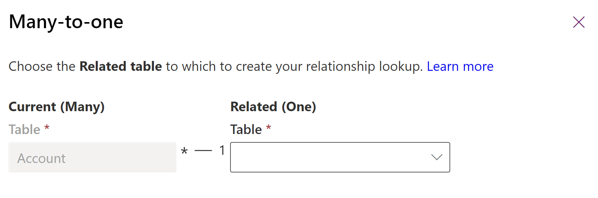
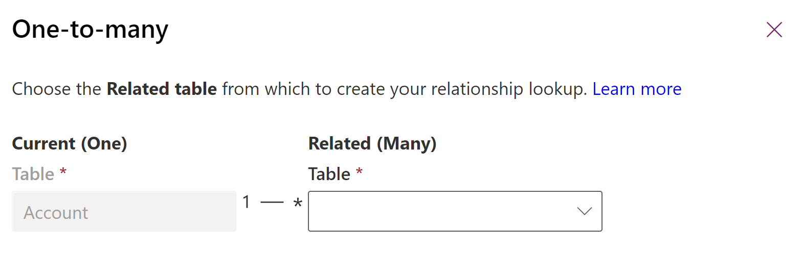
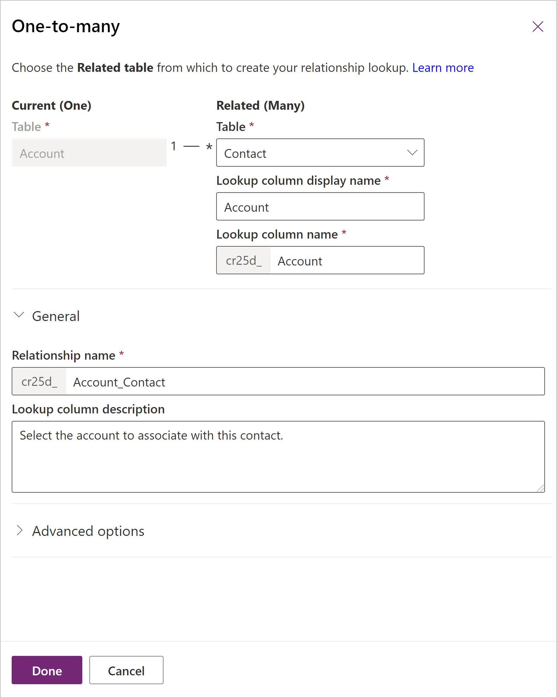

# Create and edit one-to-many or many-to-one table relationships using Power Apps

In Microsoft Dataverse a one-to-many (1:N) or many-to-one (N:1) relationship defines how two tables are related to each other.

Power Apps provides an easy way to create and edit one-to-many (1:N) or many-to-one (N:1) relationships for  Microsoft Dataverse. For more information about these kinds of relationships, go to [Create one-to-many or many-to-one table relationships overview](create-edit-1n-relationships.md).

## View table relationships

1. Sign in to [Power Apps](https://make.powerapps.com/?utm_source=padocs&utm_medium=linkinadoc&utm_campaign=referralsfromdoc), and open the environment you want.
1. Select **Solutions** on the left navigation pane, and then open the solution you want.
1. Select **Tables** and open the table that has the relationships you want to view. [!INCLUDE [left-navigation-pane](../../includes/left-navigation-pane.md)]
1. Select the **Relationships** area to view all relationships configured for the table.
   :::image type="content" source="media/view-account-relationships-portal.png" alt-text="Account table relationships" lightbox="media/view-account-relationships-portal.png":::

## Create a relationship

While [viewing table relationships](#view-table-relationships), on the command bar, select **New relationship**, and then select either **Many-to-one** or **One-to-many**.

> [!NOTE]
> For information about **Many-to-many** relationships see [Create N:N (many-to-many) relationships](create-edit-nn-relationships.md)

Depending on your choice the following is displayed:

|Type|Panel|
|--|--|
|**Many-to-one**| |
|**One-to-many**||

Choose the **Related** table for the relationship you want to create between the two tables.

> [!NOTE]
> With either choice, a lookup column is created on the **Current** table. For more information about look columns, go to [Use the lookup column on a row](../../user/lookup-field.md).

Once you select the related table, you can edit the details of the relationship. In this example, multiple contact table rows can be associated with a single account.

You can edit the default values provided before you save. Select **General** to view the **Relationship name** and **Lookup column description** values.

|Field|Description|
|--|--|
|**Lookup column display name**|The localizable text for the lookup column that will be created on the related table. This can be edited later.|
|**Lookup column name**|The name for the Lookup column that will be created on the related table.|
| **Lookup column requirement**  | **Optional**. Column value doesn’t have to be selected to save the record.   **Business Recommended**. Should be selected indicator but column value doesn’t have to be selected to save the record.   **Business Required**. Column value must be specified in order to save the record.   |
| **Searchable**  | Clear if you want to hide the relationship from **Advanced Find** in model-driven apps.  |
|**Relationship name**|The name for the relationship that will be created.|
|**Lookup column description**|The description for the lookup column. In model-driven apps this appears as a tooltip when people hover their mouse over the column.  This can be edited later.|

You can continue editing the table. Select **Save table** to create the relationship you have configured.

## Advanced options

For both the **Current table display settings** and the **Related table display settings**, you can edit the display option columns, which control how the related tables are displayed for model-driven apps. More information: [Advanced options](create-edit-nn-relationships-portal.md#advanced-options)

### Relationship behavior

Relationship behavior determines how records are handled as the action cascades down the hierarchy of related tables. For example, it might be desirable to delete the related tests and homework of a student if a student is removed from the system. This type of behavior is called a parental relationship. For more information about how to configure relationship behavior, go to [Add advanced relationship behavior](data-platform-entity-lookup.md#add-advanced-relationship-behavior).

## Edit relationships

While [viewing table relationships](#view-table-relationships), open the relationship you want to edit to display the properties pane.

The only columns you can edit are **Lookup column display name** and **Lookup column description**. These can also be edited in the properties of the lookup column in the related table. More information: [Edit a column](create-edit-field-portal.md#edit-a-column)

> [!NOTE]
> Each relationship can be found within the primary table or the related table as a **Many-to-one** or **One-to-many** relationship. Although it can be edited in either place, it is the same relationship.
>
> The publisher of a managed solution can prevent some customizations of relationships that are part of their solution.

## Delete relationships

Deleting a one-to-many relationship deletes the lookup column on the related table.

> [!NOTE]
> You can't delete a relationship that has dependencies. For example, if you have added the lookup column to a form for the related table, you must remove the column from the form before you delete the relationship.

While [viewing table relationships](#view-table-relationships), select the relationship you want to remove or delete, choose from the following relationship types:

- Custom relationships in a single solution. On the command bar, select **Remove** >  **Delete from this environment**.
- Custom relationships in multiple solutions, system, or standard table relationships. On the command bar, select **Remove** > **Remove from this solution**.

### See also

[Create and edit relationships between tables](create-edit-entity-relationships.md) 
[Create and edit 1:N (one-to-many) or N:1 (many-to-one) relationships](create-edit-1n-relationships.md) 
[Create and edit 1:N (one-to-many) or N:1 (many-to-one) table relationships using solution explorer](create-edit-1n-relationships-solution-explorer.md) 
[Edit a column](create-edit-field-portal.md#edit-a-column)

[!INCLUDE[footer-include](../../includes/footer-banner.md)]
