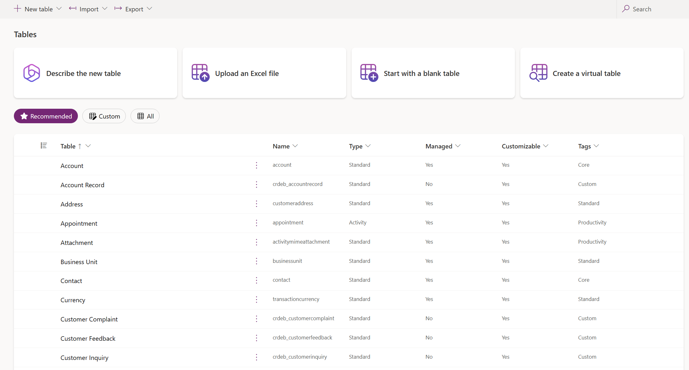

# Create and edit tables using Power Apps portal

[!INCLUDE[cc-data-platform-banner](../../includes/cc-data-platform-banner.md)]

The [Power Apps portal](https://make.powerapps.com/?utm_source=padocs&utm_medium=linkinadoc&utm_campaign=referralsfromdoc) provides an easy way to create and edit tables for  Microsoft Dataverse.

The portal enables configuring the most common options, but certain options can only be set using solution explorer. More information: 
- [Create and edit tables in Dataverse](./data-platform-create-entity.md)
- [Create and edit tables using solution explorer](create-edit-entities-solution-explorer.md)

## View tables

1. From the [Power Apps portal](https://make.powerapps.com/?utm_source=padocs&utm_medium=linkinadoc&utm_campaign=referralsfromdoc), select **Data** > **Tables**.

    > [!div class="mx-imgBorder"] 
    > 

   You can filter the tables you see using the following views in a list: 

   > [!div class="mx-imgBorder"] 
	 >  

 |View|Description|
 |--|--|
 |**All**| Shows all the tables|
 |**Managed**| Shows only managed and standard tables|
 |**Custom**|Shows only custom tables|
 |**Default**|Shows only the standard tables |

You can also select **Group** to group tables by the **Tags** applied to them.

## Create a table

While [viewing tables](#view-tables), in the menu bar select **New table**. This will open the New table panel.

> [!div class="mx-imgBorder"] 
> 

Enter data for the following columns

|Field|Description|
|--|--|
|**Display name**|This is the singular name for the table that will be shown in the app. This can be changed later.|
|**Plural display name**|This is the plural name for the table that will be shown in the app. This can be changed later.|
|**Name**|This column is pre-populated based on the **Display name** you enter. It includes the customization prefix for the Dataverse solution publisher. You cannot change this after the table is saved.|
|**Primary Name**|This is the only column visible at this point.| Edit it if you want to change the **Display Name**or **Name** of the column.
|**Display name**|This is the main user-friendly text identifier for your row (typically a name or a number). The value of this column is shown to users when they need to select from a list of rows.
|**Name**|This column is pre-populated based on the **Display name** you enter. It includes the customization prefix for the Dataverse solution publisher. You cannot change this after the table is saved.|

Select **Enable Attachments** to append notes and files to rows for this table.

Select **More settings**. These settings are optional for a table.

|Field|Description|
|--|--|
|**Description**|Provide a meaningful description of the purpose of the table.|
|**table type and ownership**|Switch the table type to Activity table to create tables that can manage tasks. The type of **Ownership** defines who can perform operations on a row.|
|**Collaboration**|Enable features to help users to more easily work together on this table.|
|**Create and Update Settings**|You can enable quick create forms, giving your app a streamlined data entry experience. Duplicate detection lets you set duplicate detection policies and create duplicate detection rules. Change tracking provides a way to keep data synchronized in a performant way.|
|**Dynamics 365 for Outlook**|Configure how this table appears in Outlook.|

Select **Create** to continue, this will close the **New table** panel and display the list of columns.

The **Primary Name** column of the table is displayed in the list of columns. Select the **Primary Name** column to edit it if you want to change the **Display Name**or **Name** of the column. The default values are shown below:

> [!div class="mx-imgBorder"] 
> 

## Edit a table

While [viewing tables](#view-tables), select the table you want to edit.

Select **Settings** from the menu if you want to edit the **Display name**, **Plural display name** or **Description** for the table.

> [!div class="mx-imgBorder"] 
> 

For other items choose from the tabs.

### Fields

See [Create and edit columns](create-edit-fields.md)

### Relationships

See [Create and edit relationships between tables](create-edit-entity-relationships.md)

### Business rules

See [Create business rules and recommendations to apply logic in a form](../model-driven-apps/create-business-rules-recommendations-apply-logic-form.md)

### Views

See [Create or edit a view](../model-driven-apps/create-edit-views.md)

### Forms

See [Create and design forms](../model-driven-apps/create-design-forms.md)

### Dashboards

See [Create or edit dashboards](../model-driven-apps/create-edit-dashboards.md)

### Charts

See [Create a system chart](../model-driven-apps/create-edit-system-chart.md)

### Keys

See [Define alternate keys to reference rows](define-alternate-keys-reference-records.md)

### Data

View the data in the table.
Use the **Select view** menu to choose from available views for the table or to show all columns.

> [!div class="mx-imgBorder"] 
> 

Use the **Next Page** and **Previous Page** commands at the bottom of the form to see more data.

## Delete a table

As someone with the system administrator security role, you can delete custom tables that aren’t part of a managed solution.  
  
> [!IMPORTANT]
>  When you delete a custom table, the database tables that store data for that table are deleted and all data they contain is lost. Any associated rows that have a parental relationship to the custom table are also deleted. For more information about parental relationships, see [Create and edit relationships between tables](create-edit-entity-relationships.md).  
  
> [!NOTE]
> The only way to recover data from a table that was deleted is to restore the database from a point before the table was deleted. More information: [Backup and restore instances](/dynamics365/customer-engagement/admin/backup-restore-instances)

While [viewing tables](#view-tables), select the table and select **Delete table** from the menu.

> [!div class="mx-imgBorder"] 
> 

If the table has dependencies that prevent it from being deleted you will see an error message. To identify and remove any dependencies, you will need to use the solution explorer. More information [Identify table dependencies](create-edit-entities-solution-explorer.md#identify-table-dependencies)

### See also

[Create and edit tables in Dataverse](./data-platform-create-entity.md) 
[Create and edit tables using solution explorer](create-edit-entities-solution-explorer.md)

[!INCLUDE[footer-include](../../includes/footer-banner.md)]