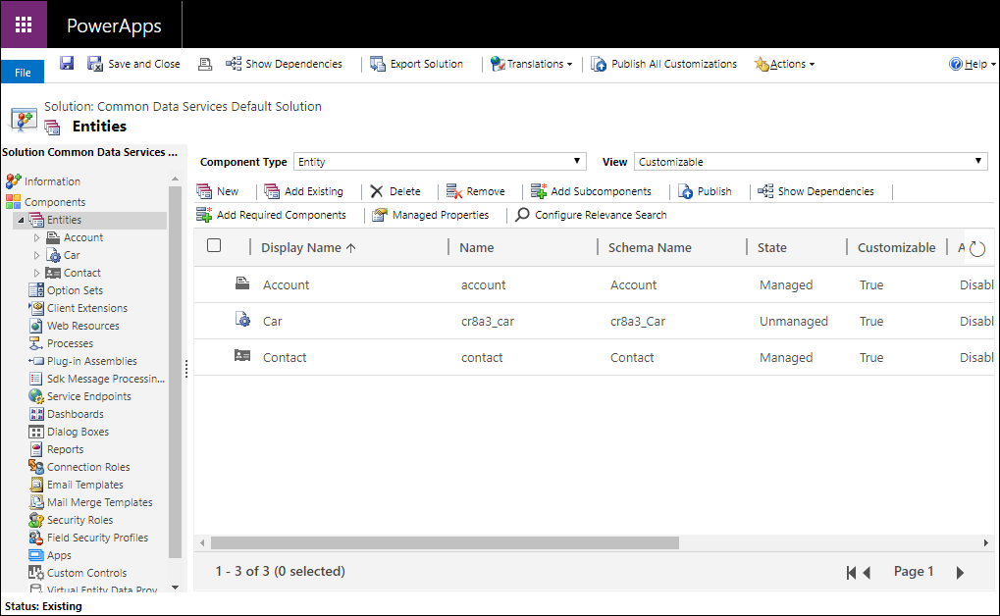
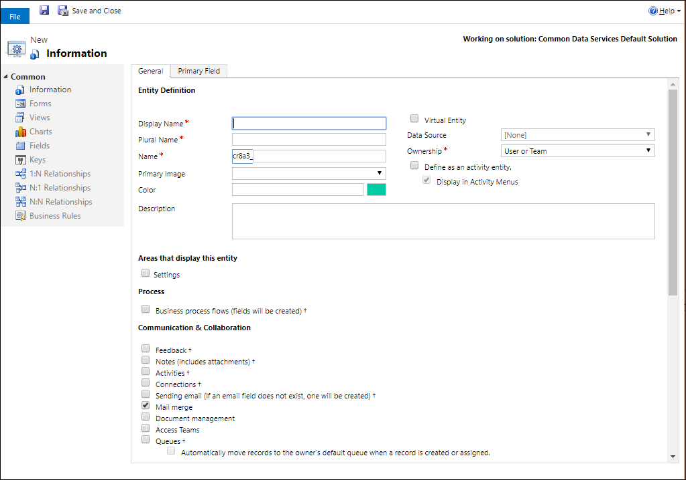
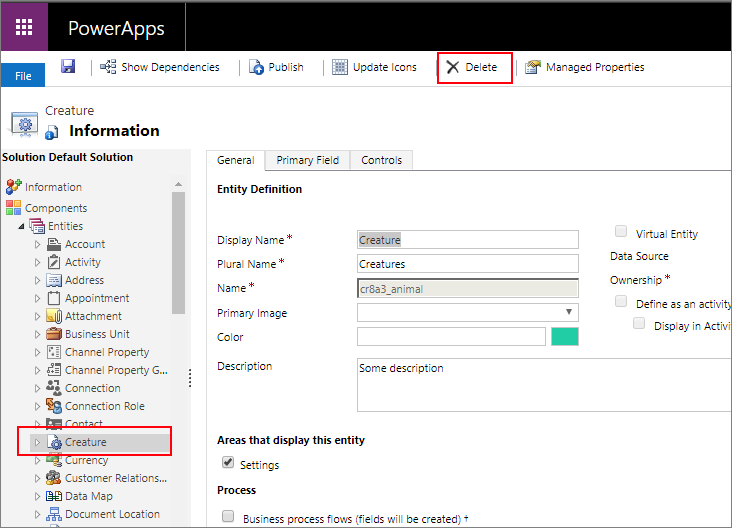
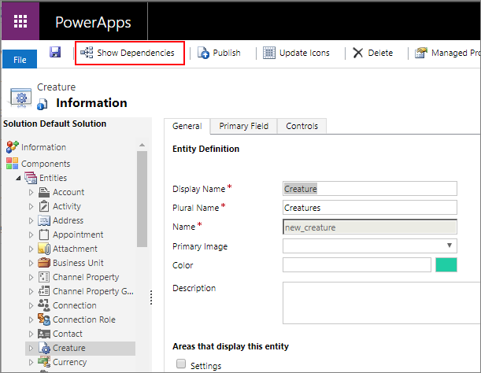
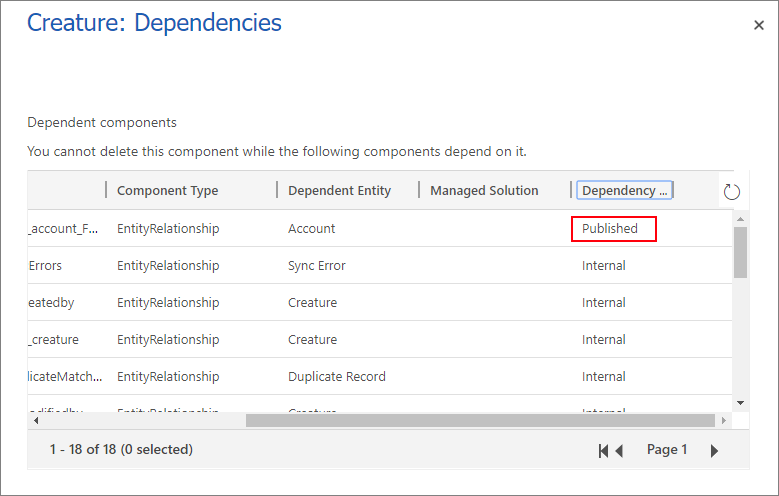
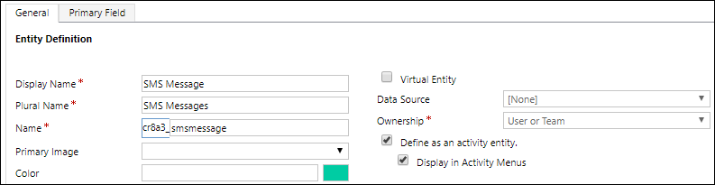

# Create and edit tables using solution explorer

[!INCLUDE[cc-data-platform-banner](../../includes/cc-data-platform-banner.md)]

You can easily create a table using Power Apps ([make.powerapps.com](https://make.powerapps.com) for most common situations, but not all capabilities are implemented there. When you need to meet the requirements described in [Create and edit tables in Microsoft Dataverse](./data-platform-create-entity.md), you can achieve them by creating or editing tables using the Solution Explorer.

## Open solution explorer

The customization prefix is part of the name of any table you create. This is set based on the solution publisher for the solution you’re working in. If you care about the customization prefix, make sure that you are working in an unmanaged solution where the customization prefix is the one you want for this table. More information: [Change the solution publisher prefix](create-solution.md#solution-publisher) 

[!INCLUDE [cc_navigate-solution-from-powerapps-portal](../../includes/cc_navigate-solution-from-powerapps-portal.md)]

## View tables

In the solution explorer **Components** node, select the **Entities** node.

## Create a table

While [viewing tables](#view-tables), select **New** to open the form to create tables.

The form has two tabs. The **General** tab is for entity options. The **Primary Field** tab is for options about the special single line of text column that each table has that defines the text shown when there is a link to open the table in a lookup column.

For information about each section see the following:
- [Configure the primary column](#configure-the-primary-column)
- [Configure required columns](#configure-required-columns)

> [!NOTE]
> You can also make the table a custom activity. This choice changes some of the default option values. More information: [Create a custom activity table](#create-custom-activity-table)

After you have set the required options for the table, click  to create the custom table.

### Configure the primary column

In the **Primary Field** tab you can usually accept the default values for the primary column, but you have the following options:

|Field   |Description  |
|---------|---------|
|**Display Name**|Enter the localizable label that will be displayed for this column in forms and lists. The default value is **Name**.|
|**Name**|Set the name used in the system for this column. The default value is `<customization prefix>_name`|
|**Maximum Length**|Enter the maximum length for the column values. The default is 100.|

> [!NOTE]
> These options do not apply if the table is an activity table. More information:  [Create a custom activity table](#create-custom-activity-table)

### Configure required columns

In the **General** tab, some of the options are required before you can save the table.

|Field   |Description  |
|---------|---------|
|**Display Name**|This is the singular name for the table that will be shown in the app. This can be changed later.|
|**Plural Name**|This is the plural name for the table that will be shown in the app. This can be changed later.|
|**Name**|This column is pre-populated based on the display name you enter. It includes the solution publisher customization prefix.|
|**Ownership**|You can choose either user or team-owned or organization owned. More information: [Table ownership](types-of-entities.md#table-ownership)|

## Edit a table

While [viewing tables](#view-tables), select the table you want to edit, or continue editing a new table you have just saved.

> [!NOTE]
> Standard tables or custom tables that are part of a managed solution may have limitations on changes you can apply. If the option is not available or is disabled, you are not allowed to make the change.

#### Set once options

The following options can be set once and cannot be changed after you set them. Take care to only set these options when you need them.

[!INCLUDE [cc_entity-set-once-options-table](../../includes/cc_entity-set-once-options-table.md)]

#### Options that you can change

The following properties can be changed at any time.

[!INCLUDE [cc_entity-changeable-options-table](../../includes/cc_entity-changeable-options-table.md)]

You can also make the following changes:
- [Create and edit columns for Dataverse](create-edit-fields.md)
- [Create and edit relationships between tables](create-edit-entity-relationships.md)
- [Create and design forms](../model-driven-apps/create-design-forms.md)
- [Create a business process flow to standardize processes](/flow/create-business-process-flow)

## Delete a table

As someone with the system administrator security role, you can delete custom tables that aren’t part of a managed solution.  
  
> [!IMPORTANT]
> - When you delete a custom table, the database tables that store data for that table are deleted and all data they contain is lost. Any associated rows that have a parental relationship to the custom table are also deleted. For more information about parental relationships, see [Create and edit relationships between tables](create-edit-entity-relationships.md).
> - The only way to recover data from a table that was deleted is to restore the database from a point before the table was deleted. More information: [Backup and restore environments](/power-platform/admin/backup-restore-environments)

While [viewing tables](#view-tables), select the  command on the toolbar.

While viewing a table use the delete command on the menu bar.

> [!WARNING]
> Deleting a table that contains data will remove all the data. This data can only be retrieved by backup of the database.

> [!NOTE]
> If there are any table dependencies you will get a **Cannot Delete Component** error with a **Details** link you can use to discover information about why the table cannot be deleted. In most cases, this will be because of a dependency that has to be removed. 
>
> There may be more than one dependency blocking the deletion of a table. This error message may only show the first one. For an alternate way to discover dependencies, see [Identify table dependencies](#identify-table-dependencies)

### Identify table dependencies

You can identify dependencies that will prevent a table from being deleted before you try to delete it. 

1. In the solution explorer with the table selected, click **Show Dependencies** in the command bar.

2. In the dialog window that opens, scroll the list to the right to view the **Dependency Type** column.

**Published** dependencies will block deleting a table. **Internal** dependencies should be resolved by the system.  

3. Remove these published dependencies and you should be able to delete the table.

 > [!NOTE]
 > A very common dependency is that another table form has a lookup column for the table you are deleting. Removing the lookup column from the form will resolve the dependency.

## Create custom activity table

To create the table as an activity table, use the same steps described in this topic except select **Define as an activity table**.

An activity table is a special kind of table that tracks actions for which an entry can be made on a calendar. More information: [Activity tables](types-of-entities.md#activity-tables).

When you set this option some table properties are not compatible. An activity table has to conform to standard behaviors that all activity tables use.

The primary column **Name** and **Display Name** will be set to **Subject** and you cannot change this.

The following options are set by default and cannot be changed:

 - **Feedback**
 - **Notes (includes attachments)**
 - **Connections**
 - **Queues**
 - **Offline capability for Dynamics 365 for Outlook**

The following options cannot be set:

- **Areas that display this table**
- **Activities**
- **Sending email**
- **Mail Merge**
- **Single row auditing**
- **Multiple row auditing**

## Create a virtual table

Some options are only used when creating a virtual table.

|Option   |Description  |
|---------|---------|
|**Virtual Entity**|Whether the table is a virtual table.|
|**Data Source**|The data source for the table.|

More information: [Create and edit virtual tables that contain data from an external data source](create-edit-virtual-entities.md)

### See also
[Create and edit tables in Dataverse](./data-platform-create-entity.md) 
[Tutorial: Create a custom table that has components in Power Apps](./create-custom-entity.md) 
[Create a solution](create-solution.md)

[!INCLUDE[footer-include](../../includes/footer-banner.md)]