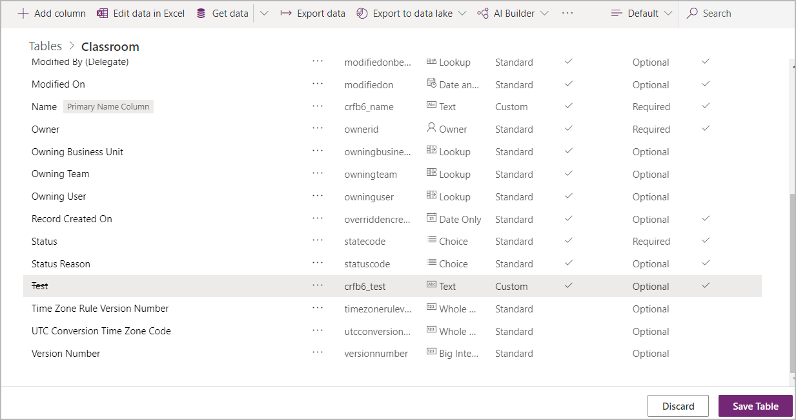

# Create and edit columns in Dataverse using Power Apps

Creating and editing table columns in Microsoft Dataverse using Power Apps is a straightforward process that allows you to customize your data tables to meet your specific needs. This guide walks you through the steps to view, create, and edit columns, as well as provide detailed information on the various data types and properties you can configure. Whether you're adding new columns or modifying existing ones, Power Apps offers a user-friendly interface to manage your Dataverse tables efficiently.

## View columns

1. From [Power Apps](https://make.powerapps.com/?utm_source=padocs&utm_medium=linkinadoc&utm_campaign=referralsfromdoc), select **Tables**, and then open the table that has the columns you want to view. [!INCLUDE [left-navigation-pane](../../includes/left-navigation-pane.md)]
2. Select the **Columns** area, where all columns for the table are displayed.

## Create a column

While viewing columns, on the command bar, select **New column** which displays the **Column properties** panel.

Several column properties are available:

 |Property|Description|
 |--|--|
 |**Display Name**|The text to be displayed for the column in the user interface.|
 |**Name**|The unique name across your environment. A name is generated for you based on the display name that you've entered, but you can edit it before saving. Once a column is created, the name can't be changed as it might be referenced in your applications or code. The name has the customization prefix for your **Dataverse Default Publisher** prepended to it.|
 |**Data type**|Controls how values are stored as well as how they're formatted in some applications. Once a column is saved, you can't change the data type except for converting text columns to autonumber columns.|
 |**Format**|Depending on the Data type selected, you can select the format for the column data type. For example, whole number can have the format duration, language code, time zone, or none.|
 |**Behavior**| By default Simple is selected. Some data types support extended behavior such as [calculated or rollup](#calculated-or-rollup). |
 |**Required**| A record can't be saved without data in this column. Required columns on a hidden tab or section don't block saving the record unless the same column is also in a visible tab or section on the same form. More information: [Saving rows programmatically for required columns](#saving-rows-programmatically-for-required-columns) |
 |**Searchable**| This column appears in Advanced Find and is available when customizing views. |
| **Allow form fill assistance (preview)**  | This is a preview feature. When enabled, users receive suggestions generated by AI for columns that support form fill assistance in main and quick create forms. You can disable for columns that might contain sensitive information, such as email address. Requires at least one [**AI form fill assistance** environment setting](/power-platform/admin/settings-features#ai-form-fill-assistance) enabled. For more information about AI form fill assistance, go to: [Use Copilot's form fill assistance feature in model-driven apps](../../user/form-filling-assistance.md) Notice that configuring this setting creates a dependency on the AI Skill Config table (used with AI Builder) in the default solution.  When a maker disables the **Allow form fill assistance** property on a table column, a record is created in the AI Skill Config table to store that configuration. This record creates a dependency on the AI Skill Config table for the column. More information: [Delete a column with an AI Skill Config table dependency in Power Apps](ai-skill-config-table.md)|
 |**Advanced Options**| Enter the schema name, [specify a maximum length](#max-length), [IME mode](#ime-mode), column security, auditing, can appear in dashboards, and whether the column data is sortable. |

You can set other options depending on your choice of **Data type**.

## Column data types

There are many different types of columns, but you can only create some of them. For more information about all types of columns, see [Types of columns and column data types](types-of-fields.md).

When you create a column, **Data type** provides the following choices:

### Text 

Standard text columns can store up to 4,000 characters. The default [Max Length](#max-length) option is set to a lower value you can adjust.

|Data type|Description|
|--|--|
|**Text**|A text value intended to be displayed in a single-line textbox.|
|**Text Area**|A text value intended to be displayed in a multi-line textbox. If you require more than 4,000 characters, use a [Multiline Text](#multi-line-column) data type.|
|**Email**|A text value validated as an e-mail address and rendered as a mailto link in the column. |
|**URL**|A text value validated as a URL and rendered as a link to open the URL.|
|**Ticker Symbol**|A text value for a ticker symbol that displays a link that opens to show a quote for the stock ticker symbol. |
|**Phone**|A text value validated as a phone number rendered as link to initiate a phone call by using Skype. |
|**Autonumber**|A customizable combination of numbers and letters that is automatically generated by the server whenever the row is created. More information: [Autonumber columns](autonumber-fields.md) |

#### Max Length

Columns that store text have an absolute maximum depending on the type. The **Max Length** choices a value lower than the maximum specific to your environment. You can increase this max length but you shouldn't lower it if you have data in the system that exceeds the lower value.

### Whole Number

These columns store data as a number but include different presentation and validation options.

|Format|Description|
|--|--|
|**Duration**|A number value presented as a drop-down list that contains time intervals. A user can select a predefined value from the list or type an integer value using the format: "x minutes," "x hours" or "x days." Hours and days can be entered using decimals, for example, "1.2 hours" or "1.5 days." Minute values entered must be expressible in whole minutes. Entering a decimal to represent sub-minute values are rounded to the nearest minute.   |
|**Timezone**|A number value presented as a drop-down list that contains a list of time zones.|
|**Language code**|A number value presented as a drop-down list that contains a list of languages that have been enabled for the environment. If no other languages have been enabled, the base language will be the only option. The value saved is the Locale Identifier (LCID) value for the language.|
| **None** | No special formatting will be applied for the whole number column. This is the default format. |

### Date Time

Use these columns to store time values. You can store values as early as 1/1/1753 12:00 AM.

|Data type|Description|
|--|--|
|**Date and Time**|A date and time value.|
|**Date Only**|A date and time value that only displays a date. The time value is stored as 12:00 AM (00:00:00) in the system.|

You can also set specific **Behavior** for Date Time columns in the **Advanced options**.

- **User local** : Displays values converted to in the current user's local time zone. This is the default for new columns.
- **Date only**: This behavior is available for the **Date Only** type. Displays values without time zone conversion. Use this for data like birthdays and anniversaries.
- **Time zone independent**:  Displays values without time zone conversion.

More information: [Behavior and format of the Date and Time column](behavior-format-date-time-field.md)

### Other Data types

|Data type|Description|
|--|--|
|**Currency**|A money value for any currencies configured for the environment. You can set a level of precision or choose to base the precision on a specific currency or a single standard precision used by the organization. More information: [Using currency columns](types-of-fields.md#using-currency-columns)|
|**Decimal Number**| A decimal value with up to 10 points of precision. More information: [Using the right type of number](types-of-fields.md#using-the-right-type-of-number)|
|**File**| For storing binary data.|
|**Floating Point Number**|A floating point number with up to 5 points of precision. More information: [Using the right type of number](types-of-fields.md#using-the-right-type-of-number)|
|**Image**|Displays a single image per row in the application. Each table can have one image column. The **Name** you enter when creating an image column is ignored. Image columns are always named 'tableImage'. |
|**Lookup**| Creates a reference to a single row for a single target row type.|
|**Multi Select Choice**|Displays a list of options where more than one can be selected.|
| **Multiline Text**|A text value intended to be displayed in a multi-line textbox. Limited to a maximum of 1,048,576 characters. You can also set a lower [Max Length](#max-length). |
|**Choice**|Displays a list of options where only one can be selected.|
|**Yes/No**|Displays Yes/No where only one can be selected. You choose which labels are displayed for each option. The default values are **Yes** and **No**.|
| **Formula**   |  Built on Power Fx, use a formula column to perform operations that return values during fetch operations. Formula columns use the Power Fx syntax that's similar to Office Excel. More information: [Work with formula columns (preview)](formula-columns.md)  |
| **Prompt**  | Prompt columns allow AI prompts to be defined and the generative AI results are stored in the table column. More information: [Prompt columns](prompt-column.md) |

## Save new column

Once you set the **Display Name**, **Name** and **Data type** properties you can select **Done** to close the **Column properties** panel. 

You can continue to edit the table and add more columns or return and continue editing this column. The columns aren't created until you select **Save Table** to save all the changes to the table.

You can also select **Discard** to discard the changes you made.

## Edit a column

While viewing columns, select the column, you want to edit. You can modify the **Display Name** but you can't change the **Name** and **Data type** if you saved changes to the table to add the column.

### General properties

Every column has the following properties you can change:

|Property|Description|
|--|--|
|**Required**|A record can't be saved without data in this column. Note that required columns on a hidden tab or section don't block saving the record unless the same column is also in a visible tab or section on the same form. More information: [Saving rows programmatically for required columns](#saving-rows-programmatically-for-required-columns) |
|**Searchable**|De-select this for columns for the table that you don't use. When a column is searchable, it appears in **Advanced Find** and is available when customizing views. Deselecting this reduces the number of options shown to people using advanced find.|
|**Description**|Found within **Advanced Options**. Enter instructions to the user about what the column is for. These descriptions appear as tooltips for the user in model-driven apps when they hover their mouse over the label of the column.|

> [!NOTE]
>**Making columns required**: Be careful when you make columns required. People resist using the application if they can't save rows because they lack the correct information to enter into a required column. People might enter incorrect data simply to save the row and get on with their work.
>
>**Set requirement dynamically**: In model-driven apps you can use business rules or form scripts to change the requirement level as the data in the row changes as people work on it. More information: [Create business rules and recommendations to apply logic in a form](../model-driven-apps/create-business-rules-recommendations-apply-logic-form.md)
>
>**Advanced Find availability**: Advanced Find is currently only available for model-driven apps using the Web Client. Advanced find isn't currently available in Unified Interface clients.

## Searching and sorting columns

For information about columns that can't be enabled for searching or sorting, go to [Searching and sorting columns](types-of-fields.md#searching-and-sorting-columns).

### Saving rows programmatically for required columns

When a row is saved programmatically using web services, only the `SystemRequired` columns are enforced. Failure to set a value for `SystemRequired` columns return an error. You can't set the `SystemRequired` level of requirement. 

Setting a column to Business Required means that the default behavior of a model-driven or canvas app enforce this requirement in the app. The request isn't sent to the service if the column has no value. The app user is shown an error and prompted to add data to the required column before they can save the row. There are options within the app to override this behavior and allow operation to proceed if needed.

## Calculated or Rollup

You can set a custom column to be a **Calculated** or a **Rollup** column. Columns that aren't calculated or rollup columns are sometimes referred to as *simple* columns.

### Calculated

With a calculated column, you can enter a formula to assign a value to the column. 
These data types can be set to calculated columns: **Currency**, **Date and Time**, **Date Only**, **Decimal Number**, **Duration**, **Email**, **Language**, **Multi Select Option Set**, **Choice**, **Text**, **Text Area**, **Ticker Symbol**, **Timezone**, **Two Options**, **URL**, and **Whole Number**.

More information: [Define calculated columns to automate manual calculations](define-calculated-fields.md)

### Rollup

With a rollup column, you can set aggregation functions that run periodically to set a number value for the column. These data types can be set to calculated columns: **Currency**, **Date and Time**, **Date Only**, **Decimal Number**, **Duration**, **Language**, **Timezone**, and **Whole Number**.

More information: [Define rollup columns that aggregate values](define-rollup-fields.md)

## Number column options

Each type of number column has absolute minimum and maximum values. You can set appropriate **Minimum value** and **Maximum value** within these absolute values. Do this to have Dataverse validate the values for the data you want to store in the column.

For **Floating Point Number** and **Decimal Number** data types, you can specify a number of  **Decimal places**.

## Choice column options

Columns that provide a set of options can include their own set of *local* options or refer to a common set of *global* options that can be used by multiple columns.

Using a global choice  is valuable when you find yourself creating the same set of options for multiple columns. With a global choice, you only need to maintain the set of options in one place. 

When you choose **Multi Select Choice** or **Choice** data type the designer lists a set of available global choices for you to choose from and provides the option to create a **New choice**.

If you choose **New choice**, the default behavior is to create a new global choice.

> [!NOTE]
> While you're editing options for a new global choice, the **Display name** and **Name** values are for the global choice rather than for the column. The default values match the column values, but you can edit them while you edit the global choice  to be different from the column you're currently creating.

If you want to create a local choice, you must select **View more** and choose **Local choice**.

> [!NOTE]
> If you define every choice as a global choice, your list of global choices grows and could be difficult to manage. If you know that the set of options will only be used in one place, use a local choice.

[!INCLUDE [cc_remove-option-warning](../../includes/cc_remove-option-warning.md)]

## Delete a column

With the system administrator security role, you can delete any custom columns that aren't part of a managed solution. When you delete a column, any data stored in the column is lost. The only way to recover data from a column that was deleted is to restore the database from a point before the column was deleted.

> [!NOTE]
> Before you can delete a custom column, you must remove any dependencies that might exist in other solution components. 

While [viewing columns](#view-columns), if you select a custom column that can be deleted in the list, the **Delete column** command appears and is enabled.

Use the **Delete column** command to delete the column. After deleting the column, you must save the changes to the table.

> [!NOTE]
> If you get an error related to dependencies, you must use solution explorer to detect dependencies. More information: [Check column dependencies](create-edit-field-solution-explorer.md#check-column-dependencies)

## IME Mode

IME (input method editor) mode specifies how a physical keyboard can be used to enter characters for text columns. IMEs are tools provided by the operating system for composing text. They're commonly used to enter Chinese, Japanese, and Korean words. 
IME mode doesn't restrict the characters that users can enter. For example, when IME mode is disabled, users can still enter Japanese characters by pasting in a text input.
> [!IMPORTANT]
> IME Mode is used for backward compatibility with the legacy web client and the IME Mode settings described here don't apply to Unified Interface apps. Additionally, IME mode is supported only in Internet Explorer and partially supported in Firefox.
-   **Active**: This value activates the IME initially. You can deactivate it later if desired. This is the default IME setting. 
-   **Auto**: When IME mode is auto, Power Apps won't interfere with the IME. 
-   **Disabled**: Disable IME mode to bypass the IME. This can be useful for entering alphanumeric characters in certain languages. 
-   **Inactive**: Power Apps will deactivate the IME initially. You can activate it later if desired.

### See also  
[Create and edit columns for Dataverse](create-edit-fields.md) 
[Create and edit columns for Dataverse using Power Apps solution explorer](create-edit-field-solution-explorer.md) 
[Types of columns and column data types](types-of-fields.md) 
[Define calculated columns to automate manual calculations](define-calculated-fields.md) 
[Define rollup columns that aggregate values](define-rollup-fields.md) 
[Behavior and format of the Date and Time column](behavior-format-date-time-field.md)

[!INCLUDE[footer-include](../../includes/footer-banner.md)]
