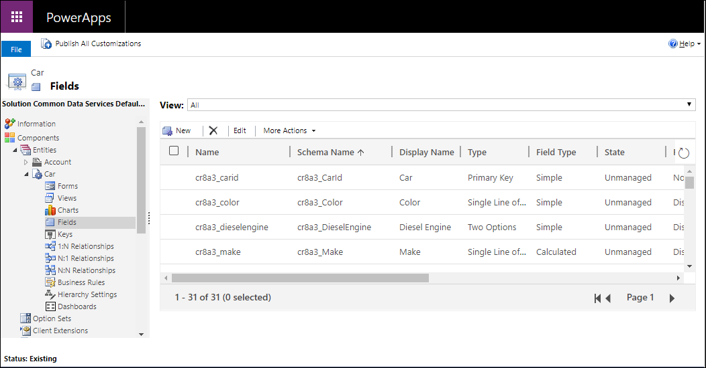
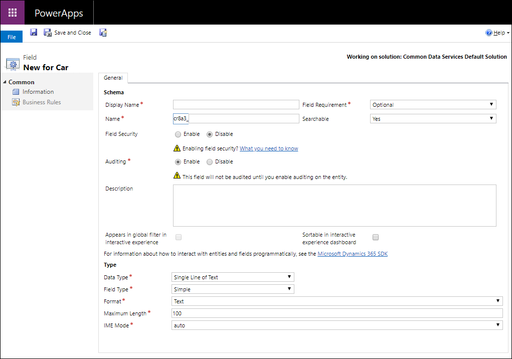
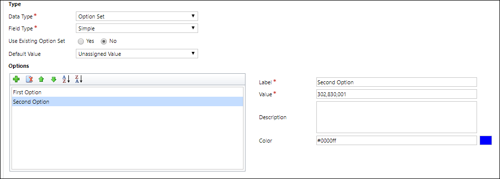
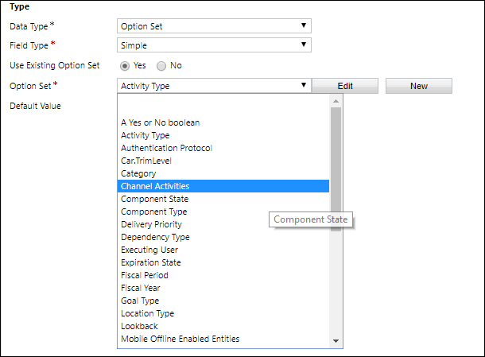
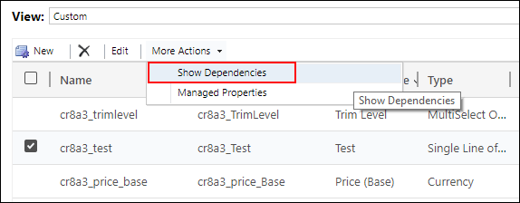

# Create and edit columns for Microsoft Dataverse using Power Apps solution explorer

[!INCLUDE[cc-data-platform-banner](../../includes/cc-data-platform-banner.md)]

Solution explorer provides one way to create and edit columns for Dataverse.

The [Power Apps portal](https://make.powerapps.com/?utm_source=padocs&utm_medium=linkinadoc&utm_campaign=referralsfromdoc) enables configuring the most common options, but certain options can only be set using solution explorer.  More information: 
- [Create and edit columns for Dataverse](create-edit-fields.md)
- [Create and edit columns for Dataverse using Power Apps portal](create-edit-field-portal.md)
  
## Open solution explorer

Part of the name of any custom column you create is the customization prefix. This is set based on the solution publisher for the solution you’re working in. If you care about the customization prefix, make sure that you are working in an unmanaged solution where the customization prefix is the one you want for this table. More information: [Change the solution publisher prefix](create-solution.md#solution-publisher) 

[!INCLUDE [cc_navigate-solution-from-powerapps-portal](../../includes/cc_navigate-solution-from-powerapps-portal.md)]

## View columns

With solution explorer open, under **Components** expand **Tables** and select the table where you want to create or edit the column.

You can select the following views: 

 |View|Description|
 |--|--|
 |**All**| Shows all the columns for the table|
 |**Custom**|Shows only custom columns for the table|
 |**Customizable**|Shows only the columns that can be edited|

## Create a column

While viewing columns, in the command bar, click **New** which will open the new column form.  Some standard tables or custom tables that are included in a managed solution might not allow you to add new columns.

> [!NOTE]
> For model-driven apps you can also create a new column from the form editor. In the form editor, below the **Column Explorer** click **New Column** to create a new column. More information: [Add, configure, move, or delete columns on a form](../model-driven-apps/add-move-or-delete-fields-on-form.md)

You must enter data and confirm default values set for the following properties before you save.

|Property|Description|
|--|--|
|**Display Name**|The text to be displayed for the column in the user interface. You can change this after you save, but the value you enter will generate a value for the **Name** column.|
|**Column Requirement**|Whether data is required in the column to save the row. More information: [Column Requirement options](#column-requirement-options)|
|**Name**|The unique name across your environment. A name will be generated for you based on the display name that you've entered, but you can edit it before saving. Once a column is created the name cannot be changed as it may be referenced in your applications or code. The name will have the customization prefix for the current solution's publisher prepended to it.|
|**Searchable**|Set this to **No** for columns for the table that you don’t use.  When a column is searchable it appears in **Advanced Find** in model-driven apps and is available when customizing views. De-selecting this will reduce the number of options shown to people using advanced find.|
|**Column Security**|Whether the data in the column is secured at a higher level than the table. More information: [Column level security to control access](/dynamics365/customer-engagement/admin/field-level-security)|
|**Auditing**|Whether data for this column will be audited when the table is enabled for auditing. More information: [Audit data and user activity for security and compliance](/customer-engagement/admin/audit-data-user-activity)|
|**Description**|Enter instructions to the user about what the column is for. These descriptions appear as tooltips for the user in model-driven apps when they hover their mouse over the label of the column.|
|**Appears in global filter in interactive experience**|More information: [Configure interactive experience dashboards](/dynamics365/customer-engagement/customize/configure-interactive-experience-dashboards) |
|**Sortable in interactive experience dashboard**|More information: [Configure interactive experience dashboards](/dynamics365/customer-engagement/customize/configure-interactive-experience-dashboards)|
|**Data type**|Controls how values are stored as well as how they are formatted in some applications. Once a column is saved, you cannot change the data type as it may impact the data in your table. More information: [Column Data types](#column-data-types)|
|**Column type**|Whether the column is **Simple**, **Calculated**, or **Rollup**. More information: [Column Type](#column-type)|
|**Format**|How the column will be formatted. The available formatting options depend on the **Data type**.|

You can set additional options depending on your choice of **Data type**. More information: [Column Data types](#column-data-types)

## Column Requirement options

There are three column requirement options:
- **Optional**: The row can be saved even if there is no data in this column.
- **Business Recommended**: The row can be saved even if there is no data in this column. However, a blue symbol appears next to the column to indicate it is important.
- **Business Required**: The row can’t be saved if there is no data in this column. 

> [!NOTE]
> - When a row is saved programmatically using web services, only the SystemRequired columns are enforced. Failure to set a value for SystemRequired columns will return an error.  You can’t set the SystemRequired level of requirement.  Setting a column to Business Required means that the default behavior of a model-driven or canvas app will enforce this requirement in the app. The request will not be sent to the service if the column has no value. The app user is shown an error and prompted to add data to the required column before they can save the row. There are options within the app to override this behavior and allow operation to proceed if needed.
> - Be careful when you make columns business required. People will resist using the application if they can’t save rows because they lack the correct information to enter into a required column. People may enter incorrect data simply to save the row and get on with their work. You can use business rules or form scripts to change the requirement level as the data in the row changes as people work on it. More information  [Create business rules and recommendations to apply logic in a form](../model-driven-apps/create-business-rules-recommendations-apply-logic-form.md)

## Column Data types

There are many different types of columns, but you can only create some of them. For more information about all types of columns, see [Types of columns and column data types](types-of-fields.md).

When creating a column, **Data type** provides the following choices:

|Option|Description|
|--|--|
|**Single Line of Text**|This column can contain up to 4,000 text characters. You can set a maximum length to be less than this. This column has several format options that will change the presentation of the text.  More information: [Single line of text options](#single-line-of-text-options)|
|**Choice**|Displays a list of options where one can be selected. More information: [Choice column options](#choice-column-options)|
|**MultiSelect Choice**|Displays a list of options where more than one can be selected. More information: [Choice column options](#choice-column-options)|
|**Yes/No**|Displays a list of options where one of two can be selected.   Yes/No columns don’t provide format options at the column level. But when you add one to the form you can choose to display them as radio buttons, a check box, or a select list.|
|**Image**|Displays a single image per row in the application. Each table can have one image column. Image columns are always named `tableImage`.|
|**Whole Number**|Integers with a value between -2,147,483,648 and 2,147,483,647 can be in this column.  This column has options that change depending on how the column is presented. More information: [Whole number options](#whole-number-choices)|
|**Floating Point Number**|Up to 5 decimal points of precision can be used for values between -100,000,000,000 and -100,000,000,000 can be in this column. You can specify the level of precision and the maximum and minimum values. More information: [Using the right type of number](types-of-fields.md#using-the-right-type-of-number)|
|**Decimal Number**|Up to 10 decimal points of precision can be used for values between -100,000,000,000 and -100,000,000,000 can be in this column. You can specify the level of precision and the maximum and minimum values. More information: [Using the right type of number](types-of-fields.md#using-the-right-type-of-number)|
|**Currency**|Monetary values between -922,337,203,685,477 and 922,337,203,685,477 can be in this column. You can set a level of precision or choose to base the precision on a specific currency or a single standard precision used by the organization. More information: [Using currency columns](types-of-fields.md#using-currency-columns)|
|**Multiple Lines of Text**|This column can contain up to 1,048,576 text characters. You can set the maximum length to be less than this. When you add this column to a model-driven app form, you can specify the dimensions of the column.|
|**Date and Time**|Use these columns to store time values. You can store values as early as 1/1/1753 12:00 AM. More information: [Date and Time options](#date-and-time-options)|
|**Lookup**|A column that allows setting a reference to a single row of a specific type of table. Some system lookup columns behave differently. More information: [Different types of lookups](types-of-fields.md#different-types-of-lookups)|
|**Customer**|A lookup column that you can use to specify a customer, which can be an account or contact.  More information: [Different types of lookups](types-of-fields.md#different-types-of-lookups)|

### Single line of text options

The single line of text data type has the following format options:

|Format|Description|
|--|--|
|**Text**|A text value intended to be displayed in a single-line textbox.|
|**Text Area**|A text value intended to be displayed in a multi-line textbox. If you require more than 4,000 characters, use a **Multiple Lines of Text** data type.|
|**Email**|A text value validated as an e-mail address and rendered as a mailto link in the column. |
|**URL**|A text value validated as a URL and rendered as a link to open the URL.|
|**Ticker Symbol**|A text value for a ticker symbol that will display a link that will open to show a quote for the stock ticker symbol. |
|**Phone**|A text value validated as a phone number rendered as link to initiate a phone call by using Skype. |

You can also set a **Maximum length** to so that the system will not allow text values longer than you specify.

### Choice column options

Columns that provide a set of options can include their own set of *local* options or refer to a common set of *global* options that can be used by multiple columns.

Using a global choice  is valuable when you find yourself creating the same set of options for multiple columns. With a global choice, you only need to maintain the set of options in one place. 

When you choose **Multi Select Choice** or **Choice** data type the solution explorer designer will provide the option for a local choice by default.

#### Configure local choices

[!INCLUDE [cc_configure-option-set-options-solution-explorer](../../includes/cc_configure-option-set-options-solution-explorer.md)]

#### Use Existing Choice

If you to choose **Use Existing Option Set** the designer will display a list of existing *global choices* and include an **Edit** and **New** buttons to configure the global choices that this column should use.

You can also configure global choices separately. More information: [Create and edit global choices for Dataverse (picklists)](create-edit-global-option-sets.md)

> [!NOTE]
> If you define every choice  as a global choice  your list of global choices will grow and could be difficult to manage. If you know that the set of options will only be used in one place, use a local choice.

### Whole number choices

Whole number columns have the following format choices:

|Format|Description|
|--|--|
|**None**|A number value presented in a text box.|
|**Duration**|A number value presented as a drop-down list that contains time intervals. A user can select a value from the list or type an integer value that represents the number of minutes.|
|**Timezone**|A number value presented as a drop-down list that contains a list of time zones.|
|**Language**|A number value presented as a drop-down list that contains a list of languages that have been enabled for the environment. If no other languages have been enabled, the base language will be the only option. The value saved is the Locale Identifier (LCID) value for the language.|

You can also restrict the maximum or minimum allowed values.

### Date and Time options

Date and Time columns have the following options:

|Format |Description|
|--|--|
|**Date and Time**|A date and time value.|
|**Date Only**|A date and time value that only displays a date. The time value is stored as 12:00 AM (00:00:00) in the system.|

You can also set specific **Behavior** for Date Time columns in the **Advanced options**.

- **User local** : Displays values converted to in the current user’s local time zone. This is the default for new columns.
- **Date only**: This behavior is available for the **Date Only** type. Displays values without time zone conversion. Use this for data like birthdays and anniversaries.
- **Time zone independent**:  Displays values without time zone conversion.

More information: [Behavior and format of the Date and Time column](behavior-format-date-time-field.md)

## Column type

You can set a custom column **Field Type** to be a **Simple**, **Calculated**, or a **Rollup** column. 

### Simple

Simple means that the column is not a calculated or rollup column.

### Calculated

With a calculated column you can enter a formula to assign a value to the column. 
These data types can be set to calculated columns: **Currency**, **Date and Time**,  **Decimal Number**,  **Multi Select Choice**, **Choice**, **Single line of text**, **Yes/No**, and **Whole Number**.

More information: [Define calculated columns to automate manual calculations](define-calculated-fields.md)

### Rollup

With a rollup column you can set aggregation functions that will run periodically to set a number value for the column. These data types can be set to calculated columns: **Currency**, **Date and Time**, **Decimal Number**, and **Whole Number**.

More information: [Define rollup columns that aggregate values](define-rollup-fields.md)

## Save new column

Once you have configured the column, use one of three commands in the command bar:

|Command|Description|
|--|--|
|**Save**|Save the column definition and leave the form window open.|
|**Save and Close**|Save the column definition and close the window.|
|**Save Create New**|Save the column definition and open a new form to create a new column.|

## Edit a column 

While [viewing columns](#view-columns), select the column you want to edit. Some standard columns or custom columns that are included in a managed solution might not allow you to edit them.

> [!NOTE]
> When editing a form, for any column already added to the form you can double-click the column to display the **Column Properties**. On the **Details** tab, click **Edit**. More information: [Add, configure, move, or delete columns on a form](../model-driven-apps/add-move-or-delete-fields-on-form.md) 

After you make changes to a column, you must publish customizations. 

- To publish your changes for one table, under **Components**, select **Tables**, and then select the table that you made changes to. On the **Actions** toolbar, select **Publish**.  
  
- To publish all changes you have made to multiple tables or components, on the **Actions** toolbar, select **Publish All Customizations**.  
  
> [!NOTE]
>  Installing a solution or publishing customizations can interfere with normal system operation. We recommend that you schedule a solution to be published when it’s least disruptive to users.  

### Edit multiple columns

To edit one or more columns, select the column or columns (using the Shift key) you want to modify and then on the **Actions** toolbar, select **Edit**. 
  
When you select multiple columns to edit, the **Edit Multiple Columns** dialog box appears. You can edit **Column Requirement**, **Searchable**, and **Auditing**. 

## Delete a column

With the system administrator security role, you can delete any custom columns that aren’t part of a managed solution. When you delete a column, any data stored in the column is lost. The only way to recover data from a column that was deleted is to restore the database from a point before the column was deleted.

> [!NOTE]
> Before you can delete a custom column, you must remove any dependencies that may exist in other solution components. 

1. While [viewing columns](#view-columns), select a custom column that can be deleted in the list and click the  button in the command bar.
2. In the **Confirm Deletion** dialog, select **Delete**.

> [!TIP]
> You can select multiple custom columns to be deleted in one operation.

### Check column dependencies 

Select the column in the list. In the **More Actions** menu, select **Show Dependencies**.

Dependencies are any related use of the column that would prevent it from being deleted. For example, if the column is used in a form or view, you must first remove references to the column in those solution components.  
  
If you delete a lookup column, the 1:N table relationship for it will automatically be deleted.  

## IME Mode

IME (input method editor) mode specifies how a physical keyboard can be used to enter characters for text columns. IMEs are tools provided by the operating system for composing text. They are commonly used to enter Chinese, Japanese, and Korean words. 
IME mode does not restrict the characters that users can enter. For example, when IME mode is disabled, users can still enter Japanese characters by pasting in a text input.
> [!IMPORTANT]
> IME Mode is used for backward compatibility with the legacy web client and the IME Mode settings described here don’t apply to Unified Interface apps. Additionally, IME mode is supported only in Internet Explorer and partially supported in Firefox.
-	**Active**: This value will activate the IME initially. You can deactivate it later if desired. This is the default IME setting. 
-	**Auto**: When IME mode is auto, Power Apps will not interfere with the IME. 
-	**Disabled**: Disable IME mode to bypass the IME. This can be useful for entering alphanumeric characters in certain languages. 
-	**Inactive**: Power Apps will deactivate the IME initially. You can activate it later if desired.

### See also  
[Create and edit columns for Dataverse](create-edit-fields.md) 
[Create and edit columns for Dataverse using Power Apps portal](create-edit-field-portal.md) 
[Types of columns and column data types](types-of-fields.md) 
[Define calculated columns to automate manual calculations](define-calculated-fields.md) 
[Define rollup columns that aggregate values](define-rollup-fields.md) 
[Behavior and format of the Date and Time column](behavior-format-date-time-field.md)

[!INCLUDE[footer-include](../../includes/footer-banner.md)]