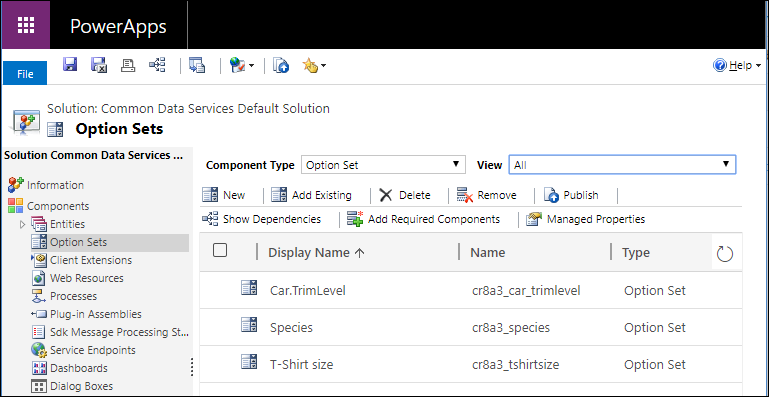
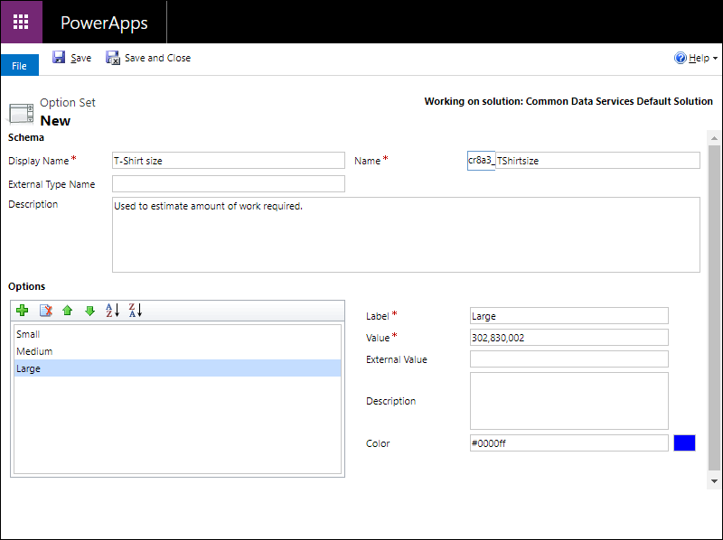

# Create and edit global choices for Microsoft Dataverse using solution explorer

[!INCLUDE[cc-data-platform-banner](../../includes/cc-data-platform-banner.md)]

Solution explorer provides one way to Create and edit global choices for Dataverse.

The [Power Apps portal](https://make.powerapps.com/?utm_source=padocs&utm_medium=linkinadoc&utm_campaign=referralsfromdoc) enables configuring the most common options, but certain options can only be set using solution explorer.  More information: 
- [Create and edit global choices for Dataverse](create-edit-global-option-sets.md)
- [Create a choice ](custom-picklists.md)

## Open solution explorer

Part of the name of any global choice  you create is the customization prefix. This is set based on the solution publisher for the solution you’re working in. If you care about the customization prefix, make sure that you are working in an unmanaged solution where the customization prefix is the one you want for this global choice . More information: [Change the solution publisher prefix](create-solution.md#solution-publisher) 

[!INCLUDE [cc_navigate-solution-from-powerapps-portal](../../includes/cc_navigate-solution-from-powerapps-portal.md)]

## View global choices

With solution explorer open, under **Components** select **Option Sets**.

> [!NOTE]
> Some system global choices are not customizable. These options may change with updates or new versions so we recommend you don’t use them unless you are certain that your requirements align with the way that Dataverse uses these values.

## Create a global choice 

> [!NOTE]
> You do not need to create a global choice  before you use it within a custom column. When you create a new choice  column you have the option to create a new global choice  or use an existing one. See [Choice column options](create-edit-field-solution-explorer.md#choice-column-options)

While viewing global choices, click **New** to open a form to define the global choice .

Type a **Display name** that will be visible to people with the system administrator or customizer role who will choose this global choice  when defining new columns that use it. This name will not be visible to people using your apps.

A **Name** column value will be generated for you based on the **Display name** you enter. It will include the customization prefix for the Solution publisher in the context of the solution you are working in. You can change the generated portion of the **Name** column value before you save.

Type a **Description** for the global choice . 

> [!TIP]
> Use the **Description** to explain the purpose of this global choice . This value is not visible to users of the application, it is for other people with the system administrator or customizer role who may want to know why this particular global choice  was created.

### Configure options

[!INCLUDE [cc_configure-option-set-options-solution-explorer](../../includes/cc_configure-option-set-options-solution-explorer.md)]

## Edit a global choice 

While viewing global choices, select the choice  you want to edit to open the panel to edit it.

Except for changing the **Name** column value or the number **Value** assigned to an option, you can make any of the changes you can when creating the global choice .

> [!NOTE]
> You cannot edit a choice  if it is part of a managed solution. To edit managed solution choices, you will have to contact the solution owner.

[!INCLUDE [cc_remove-option-warning](../../includes/cc_remove-option-warning.md)]

## Delete a global choice 

To delete a global choice , while viewing the list select the  command in the command bar.

> [!IMPORTANT]
> If the global choice  has been used by a column, you will not be able to delete it until that column is deleted.
  
### See also
 
[Create and edit global choices for Dataverse](create-edit-global-option-sets.md) 
[Create a choice ](custom-picklists.md) 
[Create and edit columns](create-edit-fields.md) 
[Developer documentation: Customize global choices](/dynamics365/customer-engagement/developer/org-service/customize-global-option-sets)

[!INCLUDE[footer-include](../../includes/footer-banner.md)]