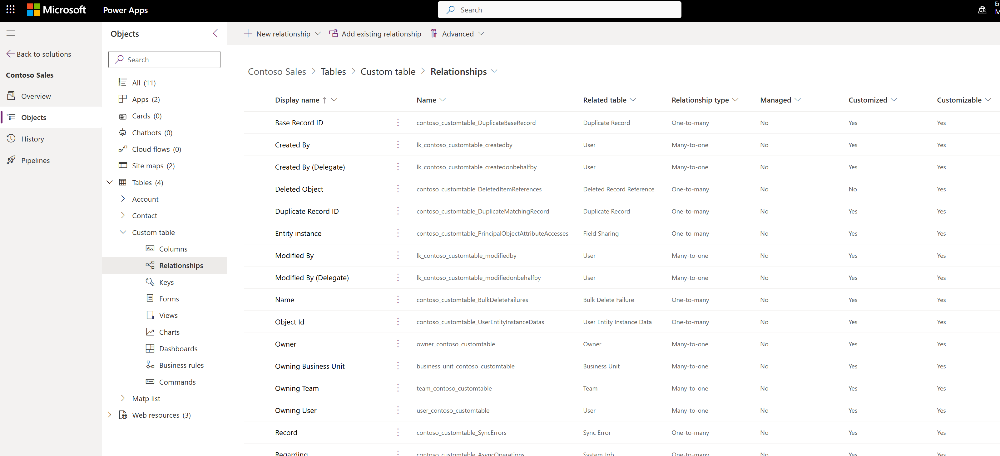
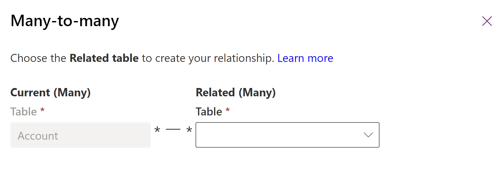
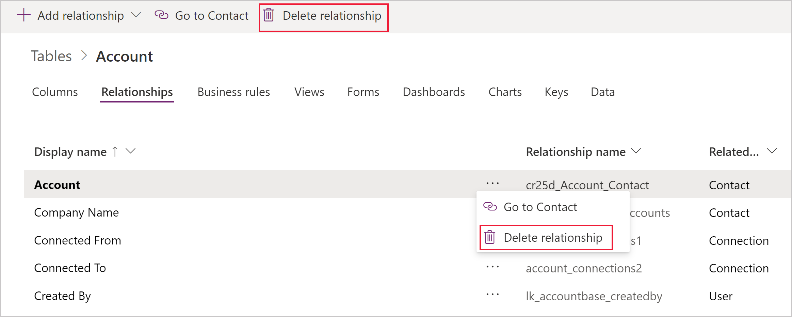

# Create Many-to-many table relationships in Microsoft Dataverse using Power Apps portal

[!INCLUDE[cc-data-platform-banner](../../includes/cc-data-platform-banner.md)]

The [Power Apps portal](https://make.powerapps.com/?utm_source=padocs&utm_medium=linkinadoc&utm_campaign=referralsfromdoc) provides an easy way to create and edit Many-to-many table relationships for Dataverse.

The portal enables configuring the most common options, but certain options can only be set using solution explorer. More information: 
- [Create N:N (many-to-many) table relationships](create-edit-nn-relationships.md)
- [Create N:N (many-to-many) table relationships in Dataverse using solution explorer](create-edit-nn-relationships-solution-explorer.md)

## View Many-to-many table relationships

1. From the [Power Apps portal](https://make.powerapps.com/?utm_source=padocs&utm_medium=linkinadoc&utm_campaign=referralsfromdoc), select either **Model-driven** or **Canvas** design mode.
2. Select **Data** > **Tables** and select the table that has the relationships you want to view.
3. With the **Relationships** tab selected, you can select the following views: 

 |View|Description|
 |--|--|
 |**All**| Shows all the relationships for the table|
 |**Custom**|Shows only custom relationships for the table|
 |**Default**|Shows only the standard relationships for the table|

Many-to-many relationships will have a **Relationship type** of **Many-to-many**.

> [!NOTE]
> The table you view may have no **Many-to-many** relationships.

## Create relationships

While [viewing table relationships](#view-many-to-many-table-relationships), in the command bar, select **Add relationship** and choose **Many-to-many**.

In the **Many-to-many** panel, choose the table you want related to the current table.

> [!div class="mx-imgBorder"] 
> 

Select **More Options** to view the **Relationship Name** and **Relationship table name** columns.

> [!div class="mx-imgBorder"] 
> 

The values for these columns are generated for you based on the tables chosen.

> [!NOTE]
> If you create more than one **Many-to-many** relationship with the same two tables, you will need to edit the generated **Relationship Name** and **Relationship table name** columns so that they will be unique.

Select **OK** to close the **Many-to-many** panel. The relationship will be created when you save changes to the table. 

Once saved, there nothing that can be changed using [Power Apps portal](https://make.powerapps.com/?utm_source=padocs&utm_medium=linkinadoc&utm_campaign=referralsfromdoc). To edit properties of the relationship for model-driven apps use [solution explorer](create-edit-nn-relationships-solution-explorer.md).

## Delete relationships

While [viewing table relationships](#view-many-to-many-table-relationships), select the relationship you want to delete.

You can use the **Delete relationship** command from the command bar or from the row context menu when you select the ellipses (**...**).

Deleting the Many-to-Many relationship will delete the relationship table created. All data connecting tables using the relationship will be lost.

### See also

[Create N:N (many-to-many) table relationships](create-edit-nn-relationships.md) 
[Create N:N (many-to-many) table relationships in Dataverse using solution explorer](create-edit-nn-relationships-solution-explorer.md)

[!INCLUDE[footer-include](../../includes/footer-banner.md)]