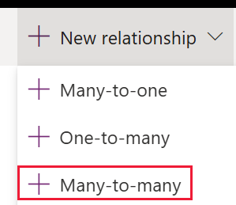
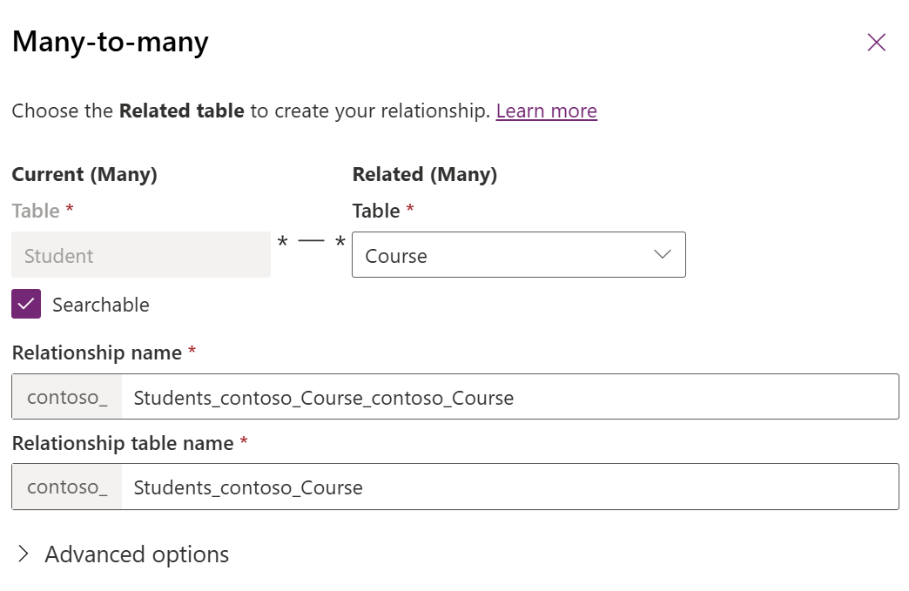

# Create many-to-many table relationships using Power Apps

[Power Apps](https://make.powerapps.com/?utm_source=padocs&utm_medium=linkinadoc&utm_campaign=referralsfromdoc) provides an easy way to create and edit many-to-many relationships for Microsoft Dataverse tables. A many-to-many relationship defines the type of connection between two tables where multiple records in one table can be associated with multiple records in another table. For example, in a school scenario, a single student can enroll in multiple courses, and each course can have multiple students. This type of relationship allows for more complex data associations and is managed using Power Apps in Dataverse. For more information about many-to-many table relationships, go to [Create many-to-many table relationships overview](create-edit-nn-relationships.md).

## View many-to-many table relationships

1. From [Power Apps](https://make.powerapps.com/?utm_source=padocs&utm_medium=linkinadoc&utm_campaign=referralsfromdoc), select **Solutions** on the left navigation pane, and open the solution you want.
1. Open the table that has the relationships you want to view.
1. Select the **Relationships** area to view all relationships configured for the table.

:::image type="content" source="media/view-account-relationships-portal.png" alt-text="Relationships for the account table" lightbox="media/view-account-relationships-portal.png" :::

Many-to-many relationships have a **Relationship type** of **Many-to-many**.

> [!NOTE]
> The table you view might have no **Many-to-many** relationships.

## Create relationships

While [viewing table relationships](#view-many-to-many-table-relationships), on the command bar, select **New relationship**, and then select **Many-to-many**.

The **Many-to-many relationship** editor is displayed.

In the **Related (Many)** dropdown list, choose the table you want to relate to the current table. In this example, a many-to-many relationship with the student and course tables is created.

> [!div class="mx-imgBorder"] 
> 

The values for these columns are generated for you based on the tables chosen.

Clear **Searchable**, if you want to hide the relationship from **Advanced Find** in model-driven apps.

If you want to edit the display settings for the relationship, expand **Advanced options** and make the changes you want. More information: [Advanced options](#advanced-options)

> [!NOTE]
> If you create more than one **Many-to-many** relationship with the same two tables, you must edit the generated **Relationship Name** and **Relationship table name** columns so that they are unique.

Select **Done** to close the **Many-to-many** panel. The relationship is created when you save changes to the table.

### Advanced options

For both the **Current table display settings** and the **Related table display settings**, you can edit the display option columns, which control how the related tables are displayed for model-driven apps.

|Field|Description|
|--|--|
|**Display option**|How the related table list should be displayed. More information: [Display Options](#display-options)|
|**Custom label**|Specify the localizable text to be used instead of the plural name when you select **Use Custom label** as the **Display option** .|
|**Display area**|Select one of the available groupings to display this list. The available options are: **Details** (for the *Common* group), **Marketing**, **Sales**, and **Service**. |
|**Display order**|Controls where the navigation item will be included within the selected display area. The range of allowed numbers begins with 10,000. Navigation pane items with a lower value appear above other relationships with a higher value.|

#### Display Options

These are the available display options:

|Option|Description|
|--|--|
|**Do not Display**|Do not display the related tables for this relationship.|
|**Use custom label**|When this option is chosen the **Custom label** column is enabled so that you can specify the localizable text to be used instead of the plural name.|
|**Use plural name**|Use the plural display name defined for the related table.|

## Create a many-to-many relationship with the same table (self-referential relationship)

There might be times when you need to create a many-to-many relationship that references the same table. For example, account records might have multiple parent account records. However, if the self-referential relationship doesn’t have custom labels configured, distinguishing the two related record types that appear in the app isn't apparent to users. This is because the related records appear twice in the app by using the same table name.

To create a self-referential relationship, use custom labels.

1. Open or create a solution and then create a new custom table. In this example, the table is named *Custom table*.
1. Open the custom table, select the **New** > **Relationship** > **New relationship** > **Many-to-many relationship**.
1. Under **Related (Many)** select the same table, in the example *Custom table*, that's also the **Current (Many)** table.
1. Expand **Advanced options** and complete the relationship definition as follows. Add custom labels to both the current and the related table’s relationship:

   **Current table display settings** section
   - **Display option**: **Use custom label**
   - **Custom label**: *Primary Custom Table Relationship*

   **Related table display settings** section
   - **Display option**: **Use custom label**
   - **Custom label**: *Secondary Custom Table Relationship*
   :::image type="content" source="media/self-referencing-table-example.png" alt-text="Self-referential table relationship configuration.":::
1. Select **Done** to save the relationship, and then publish the customization.

Because the related record types use the custom labels defined for the self-referential relationship instead of the table name, users running the app can distinguish between the two related record types that exist.

:::image type="content" source="media/related-record-labels.png" alt-text="App with related records using relationship custom labels.":::

## Delete relationships

Deleting a many-to-many relationship deletes the relationship table created. All data connecting tables using the relationship are lost.

While [viewing table relationships](#view-many-to-many-table-relationships), select the relationship you want to delete, and then on the command bar select **Remove** > **Delete from this environment**.

### See also

[Create N:N (many-to-many) table relationships overview](create-edit-nn-relationships.md) 

[!INCLUDE[footer-include](../../includes/footer-banner.md)]
