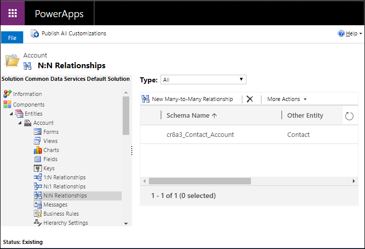
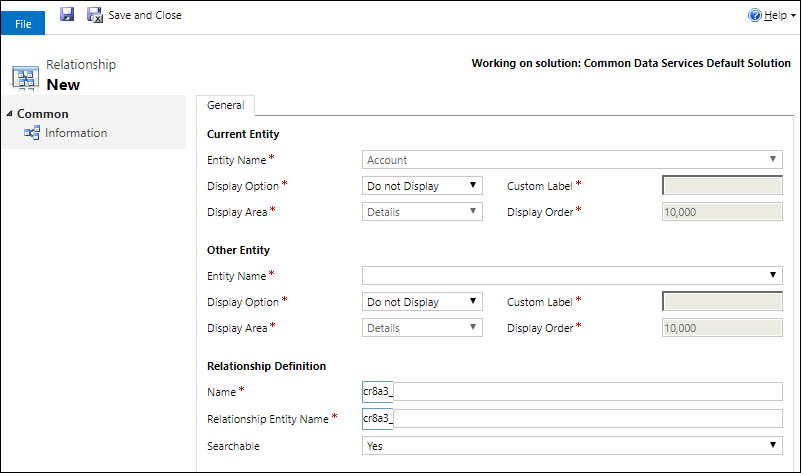

# Create N:N (many-to-many) table relationships in Microsoft Dataverse using solution explorer

[!INCLUDE[cc-data-platform-banner](../../includes/cc-data-platform-banner.md)]

Solution explorer provides one way to create and edit N:N (many-to-many) for Dataverse.

The [Power Apps portal](https://make.powerapps.com/?utm_source=padocs&utm_medium=linkinadoc&utm_campaign=referralsfromdoc) enables configuring the most common options, but certain options can only be set using solution explorer. More information:
- [Create Many-to-many (N:N) table relationships](create-edit-nn-relationships.md)
- [Create Many-to-many table relationships in Dataverse using Power Apps portal](create-edit-nn-relationships-portal.md)

  
## Open solution explorer

Part of the name of any custom relationship you create is the customization prefix. This is set based on the solution publisher for the solution you’re working in. If you care about the customization prefix, make sure that you are working in an unmanaged solution where the customization prefix is the one you want for this table. More information: [Change the solution publisher prefix](create-solution.md#solution-publisher) 

[!INCLUDE [cc_navigate-solution-from-powerapps-portal](../../includes/cc_navigate-solution-from-powerapps-portal.md)]

## View table relationships

In solution explorer, expand **Tables** an select a table. Within that table, select  **N:N Relationships**.

## Create relationships

While [viewing table relationships](#view-table-relationships), select **New Many-to-Many Relationship** from the command bar.

> [!NOTE]
> If the command is not available, the table is not eligible to create a custom relationship.

In the **Other table** group, in the **table Name** column, choose the table that you want to create the relationship with. This will populate the **Name** and **Relationship table Name** columns in the **Relationship Definition** group.

You can click  to save the table and continue editing. More information: [Edit relationships](#edit-relationships)

> [!NOTE]
> If either the **Name** or **Relationship table Name** values already exist in the system you will get an error when you save. Edit the values so that they are unique and try again.

## Edit relationships

While [viewing table relationships](#view-table-relationships), select the table you want to edit. 

> [!NOTE]
> The publisher of a managed solution can prevent customizations of relationships that are part of their solution.

The following table relationship properties can be edited after the relationship is created.

> [!IMPORTANT]
> After you edit these properties you must publish customizations before they will take effect in model-driven apps.

### Edit Display options

For both the **Current table** and the **Other table**, you can edit the display option columns which control how the related tables are displayed for model-driven apps.

|Field|Description|
|--|--|
|**Display Option**|How the related table list should be displayed. More information: [Display Options](#display-options)|
|**Custom Label**|Specify the localizable text to be used instead of the plural name when you select **Use Custom Label** as the **Display Option** .|
|**Display Area**|Select one of the available groupings to display this list. The available options are: **Details** (for the *Common* group), **Marketing**, **Sales**, and **Service**. |
|**Display Order**|Controls where the navigation item will be included within the selected display area. The range of allowed numbers begins with 10,000. Navigation pane items with a lower value appear above other relationships with a higher value.|

<!-- TODO: Not sure whether Display Area or Display Order are still used anymore. Might only be used in the Outlook client?-->

#### Display Options

These are the available display options:

|Option|Description|
|--|--|
|**Do not Display**|Do not display the related tables for this relationship.|
|**Use Custom Label**|When this option is chosen, the **Custom Label** column is enabled so that you can specify the localizable text to be used instead of the plural name.|
|**Use Plural Name**|Use the plural display name defined for the related table.|

### Searchable

You can hide the relationship from **Advanced Find** in model-driven apps by setting the **Searchable** column to **No**.

## Delete relationships

While [viewing table relationships](#view-table-relationships), select the table relationship you want to delete and click the  command.

Deleting the relationship will delete the relationship table created. All data connecting tables using the relationship will be lost.

### See also

[Create Many-to-many (N:N) table relationships](create-edit-nn-relationships.md) 
[Create Many-to-many table relationships in Dataverse using Power Apps portal](create-edit-nn-relationships-portal.md) 
[Create and edit 1:N (one-to-many) or N:1 (many-to-one) table relationships](create-edit-1n-relationships.md)

[!INCLUDE[footer-include](../../includes/footer-banner.md)]