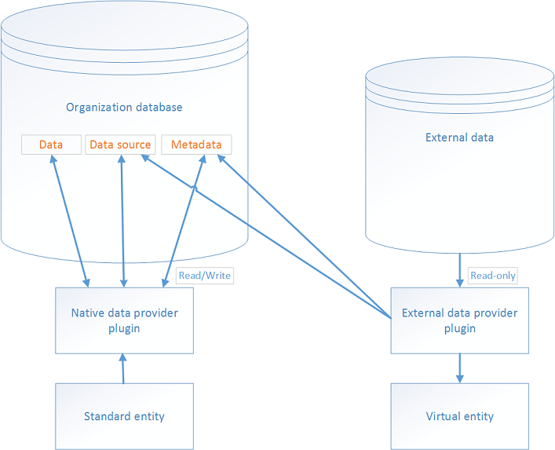
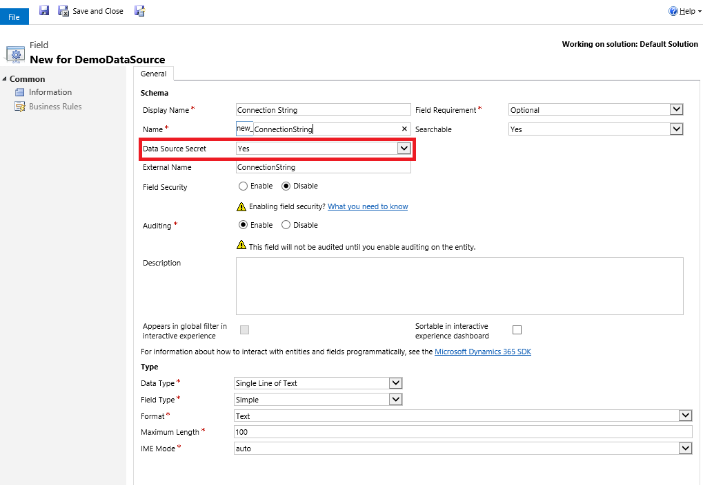
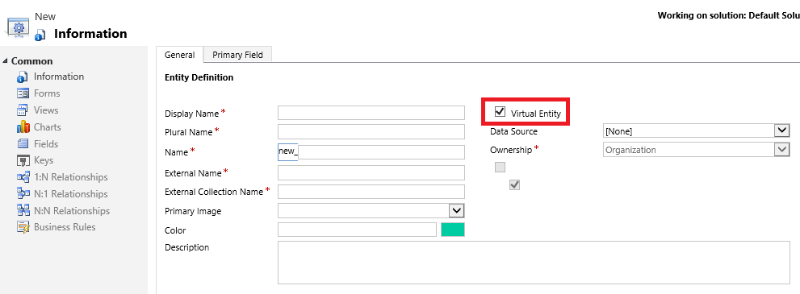
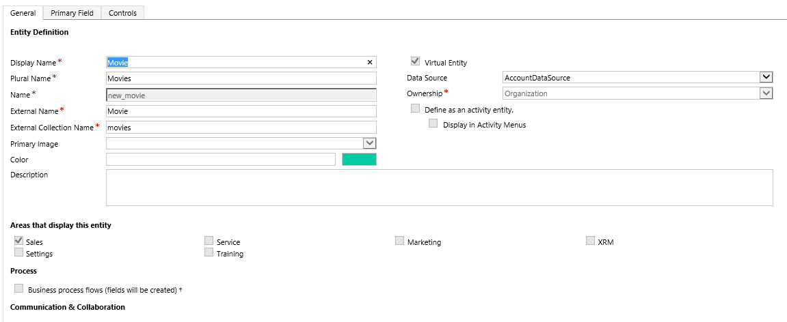

# Create and edit virtual tables that contain data from an external data source

[!INCLUDE[cc-data-platform-banner](../../includes/cc-data-platform-banner.md)]

A virtual table is a custom table in Microsoft Dataverse that has columns containing data from an external data source. Virtual tables appear in your app to users as regular table rows, but contain data that is sourced from an external database, such as an  Azure SQL Database. Rows based on virtual tables are available in all clients including custom clients developed using the Dataverse web services.  
  
In the past, to integrate the disparate data sources you would need to create a connector to move data or develop a custom plug-in, either client or server-side. However, with virtual tables you can connect directly with an external data source  at runtime so that specific data from the external data source is available in an environment, without the need for data replication.  

Virtual tables are made up of three main components, a *data provider*, a *data source* row, and a *virtual table*. The data provider consists of plug-ins and a data source table. The data source is a table row in Dataverse, which includes metadata that represents the schema of the connection parameters. Each virtual table references a data source in the table definition.  
  
Dataverse includes an OData Data Provider that you can use to connect with an OData v4 web service that accesses the external data. 
  
Alternatively, developers can build their own data providers. Data providers are installed in an environment as a solution. More Information: [Developer Documentation: Get started with virtual tables](../../developer/data-platform/virtual-entities/get-started-ve.md)
  
 <!--   -->
  
 
  
## Virtual table benefits  
  
- Developers can implement plugins to read, update or delete external data using the Dataverse web services and Plug-in Registration tool.  
- System customizers use Power Apps solution explorer to configure the data source row and create virtual tables that are used to access external data without writing any code.  
- End users work with the rows created by the virtual table to view the data in columns, grids, search results, and Fetch XML-based reports and dashboards.  
  
 
  
## Add a data source to use for virtual tables 
 
 Developers create a custom plug-in to use as the data provider for a virtual table. Alternatively, you can use the provided OData v4 Data Provider. More information: [OData v4 Data Provider configuration, requirements, and best practices](virtual-entity-odata-provider-requirements.md)  
  
1. Sign in to Power Apps, and then select **Settings** > **Advanced settings**. 
1. Go to **[Settings](../model-driven-apps/advanced-navigation.md#settings)** > **Administration** > **Virtual Entity Data Sources**.  
1. On the actions toolbar, select **New**.  
1. On the **Select  Data Provider** dialog box, select from the following data sources, and then select **OK**.
 
    |Data Provider|Description|
    |--|--|
    |*Custom data provider*|If you've imported a data  provider plug-in, the data provider will appear here. More Information [Developer Documentation: Get started with virtual tables](/dynamics365/customer-engagement/developer/virtual-tables/get-started-ve)|
    |**OData v4 Data Provider**|Dataverse includes an OData Data Provider that can be used with OData v4 web services. More Information [OData v4 Data Provider configuration, requirements, and best practices](virtual-entity-odata-provider-requirements.md)|

  
### Add a secured column to a Data Source

You create columns for a Data Source in the same way as any other table. For data that is encrypted or sensitive, enable the Data Source Secret attribute on the custom column of the Data Source. For example, to secure a column that contains a database connection string. 

> [!NOTE]
> The Data Source Secret attribute is only available with columns added to a Data Source form.

> [!div class="mx-imgBorder"] 
> 
  
 
  
## Create a virtual table
  
You create a virtual table just like any other table in Dataverse with the addition of a few extra attributes described here. Virtual tables must be created using solution explorer.

> [!NOTE]
>  Although you can create a virtual table by selecting **None** as the data source, to acquire data a virtual table requires a data source. More Information [Add a data source to use for virtual tables](#AddDataSource)

### Open solution explorer

Part of the name of any virtual table you create is the customization prefix. This is set based on the solution publisher for the solution you’re working in. If you care about the customization prefix, make sure that you are working in an unmanaged solution where the customization prefix is the one you want for this virtual table. More information: [Change the solution publisher prefix](create-solution.md#solution-publisher) 

[!INCLUDE [cc_navigate-solution-from-powerapps-portal](../../includes/cc_navigate-solution-from-powerapps-portal.md)]

### Create a virtual table
  
1. In solution explorer, create a new table. To do this, select **Entities** in the left navigation pane, and then select **New**.  
2. On the **General** tab of the **Entity Definition**, select **Virtual Entity**, and then in the **Data Source** drop down list, select the data source that you want.  

    > [!div class="mx-imgBorder"] 
    >   
  
1. On the Entity Definition, complete the following required columns.
  
    |Field|Description|
    |--|--|
    |**External Name**|Enter the name of the table in the external data source this table maps to.|
    |**External Collection Name**|Enter the plural name of the table in the external data source this table maps to.|
      
    Here's an example of a virtual table named *Movie* that uses a Azure Cosmos DB data provider to access document files.  
      
    > [!div class="mx-imgBorder"] 
    >   
      
    > [!IMPORTANT]
    > Several options, such as Access Teams, Queues, and Quick Create,  aren't available with virtual tables. More Information [Considerations when you use virtual tables](#considerations)  
      
    Complete the additional required and optional properties, such as display and plural names, as necessary. For more information about these properties, see [Create and edit tables](./data-platform-create-entity.md).  
  
1. Create and add one or more columns for the virtual table. In addition to the standard column properties required to create a custom column, these optional properties are available for each custom column you create for a virtual table.

    |Field|Description|
    |--|--|
    |**External Name**|This is typically the unique name to identify the data  you want to display in the column.|
    |**External Type Name**|If the column type you create is OptionSet: This property maps to the external name of the set of values in the external service for the choice .  Typically, this can be an enum or name of a string value class. The External Type Name can be used when a fully qualified name is required.  For example, as the *Type Name* with OData where parameters in a query need the fully qualified name, such as [*Type Name*].[*Value*].|
    |**External Value**|If the column type you create is OptionSet: This property maps to the corresponding value in the external data source for the choice  item.  This value entered is used to determine which choice  item to display in the app.  |

    Complete the additional properties as necessary. For more information about these properties, see [Create and edit columns](create-edit-fields.md).  
  
1. Select **Save and Close** on the **Column** properties page.  
1. On the solution explorer toolbar, select **Save**.  
1. On the solution explorer toolbar, select **Publish**.  
1. Close solution explorer.  

   
## Considerations when you use virtual tables  

Virtual tables have these restrictions.  
  
- Existing tables cannot be converted to virtual tables.  
- By default, virtual tables contain only a Name and Id column.  No other system managed columns, such as Status or Created On/Modified On are supported.
- Virtual tables don't support custom columns with the Currency, Image, or Customer data types.
- Virtual tables don't support auditing.  
- Virtual table columns can't be used in rollups or calculated columns.
- A virtual table can't be an activity type of table.  
- Dashboards and charts are not supported with virtual tables.
- Many features that affect table table rows cannot be enabled with virtual tables.  Examples include queues, knowledge management, SLAs, duplicate detection, change tracking, mobile offline  capability, column security, relevance search, and Power Apps portals solutions.  
- Virtual tables are organization owned and don't support the row-level Dataverse security concepts. We recommend that you implement your own security model for the external data source.  
- Column metadata properties that validate on update don’t apply to virtual tables. For example, a Whole Number column on a virtual table column may be set to have a minimum value of zero. However, since the value is coming from an external data source, a query will return values less than zero when retrieved from a virtual table.  The minimum value property is not implied in the query.  You would still need to filter the values to be greater than 0 if that’s what is desired.
- Virtual tables don't support change tracking and cannot be synchronized by using a Dataverse feature, such as the Data Export Service.
- Virtual tables that use the included OData v4 data provider are enabled on outbound port 443.
  
### See also  

[OData v4 Data Provider requirements and best practices](virtual-entity-odata-provider-requirements.md)  
[Create and edit tables](./data-platform-create-entity.md) 
[Create and edit columns](create-edit-fields.md)

[!INCLUDE[footer-include](../../includes/footer-banner.md)]
