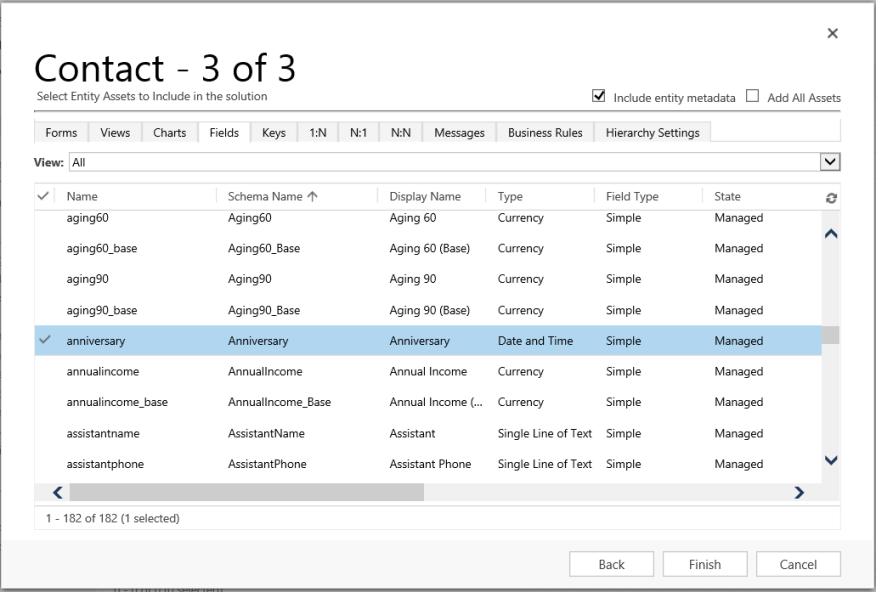

# Create a solution

To locate and work with just the components you customize, create a solution and do all your customization there. Then, always remember to work in the context of the custom solution as you add, edit, and create components. This makes it easy to export your solution so that it can be backed up or imported to another environment. 

> [!NOTE]
> Consider specifying a custom solution as you preferred solution. This way you can control where your solution components are stored when you don't specifically create them in the context of a custom solution. More information: [Set the preferred solution](preferred-solution.md).
  
To create a solution:

1. Sign in to [Power Apps](https://make.powerapps.com/?utm_source=padocs&utm_medium=linkinadoc&utm_campaign=referralsfromdoc) and select **Solutions** from the left navigation. [!INCLUDE [left-navigation-pane](../../includes/left-navigation-pane.md)]
  
2. Select **New solution** and then complete the required columns for the solution.
  
    |Field|Description|  
    |-----------|-----------------|  
    |**Display Name**|The name shown in the list of solutions. You can change this later.|  
    |**Name**|The unique name of the solution. Must only contain letters, numbers, and underscores. The name is generated from the allowed characters from the value you enter in the **Display Name** column. You can edit this before you save the solution, but after you save the solution, you can’t change it.|  
    |**Publisher**|You can select the default publisher or create a new publisher. We recommend that you create a publisher for your organization to use consistently across your environments where you'll use the solution. See [Solution publisher](#solution-publisher) later in this article. |  
    |**Version**|Enter a number for the version of your solution. This is only important if you export your solution. The version number is included in the file name when you export the solution.|
    | **Set as your preferred solution**   |  Using a preferred solution is a way you can control where your solution components are stored when you don't specifically create them in the context of a custom solution. When your preferred solution isn't set, by default, the Common Data Services Default Solution is your preferred solution. If Common Data Services Default Solution isn't available, the solution named Default Solution is used as your preferred solution. More information: [Set the preferred solution](preferred-solution.md)  |
    |**Configuration Page**|Under **More options** you can, optionally select a web resource to use as a configuration page. The configuration page is typically used by independent software vendors (ISVs) who distribute solutions. When this is set, a new **Configuration** node appears below the **Information** node to display this web resource. Developers use the web resource, which is an HTML page, to include instructions or controls to allow you to set configuration data or launch their solution.|
    |**Description**|Under **More options** you can optionally add a description of the solution. This is useful if you want to share the solution with others or if you want to remember what the solution is for.|
  
3. Select **Save**.  
  
## Add or remove solution objects

After you create your solution, it won’t contain any solution objects. You can create new objects to add to the solution or add existing objects to your new solution.

### Create objects in a solution

You can use the **New** command to create different types of objects. Selecting **New** and then selecting the object you want takes you to a different create experience depending on the object type that you choose. After you finish creating the object, it's added to the solution.

### Add an existing object to a solution

With solutions that are unmanaged and not the system default solution, you can use the **Add existing** command to bring in objects that aren’t already in the solution.

> [!NOTE]
> The list of existing objects are different depending on the version and solutions imported in your environment. 
  
Many of the customizations you want to do involve tables. Select **Tables** in the left pane to filter and display a list of all the tables in the current solution. Once you drill into a table, you can view the objects that are part of the table as shown with the account table in this screenshot.

:::image type="content" source="media/create-solution/solution-table-account.png" alt-text="Account table with objects to view":::

### Remove objects from a solution

You can remove objects from an unmanaged solution. With the solution open, select the object, and then select **Remove from this solution** on the command bar.

When the object is removed, it’s no longer part of the solution. However, the object still exists in the environment and can be added to another solution. Once the object is removed from all solutions in the environment, it can be deleted.

> [!IMPORTANT]
> Once the object is deleted it can't be recovered and all associated data, such as table records when you delete a custom table are lost. If you want to keep the object, but not have it in the solution, remove it from the solution without deleting it.

To delete an object, select it, and then select **Delete from this environment**.
  
## Publish changes 

When you make unmanaged changes in an environment, some objects, such as tables, forms, model-driven apps, site maps, and views are saved in an unpublished state. The publish action promotes these changes to an active state and makes them available to end users and for solution export.

### Publish your customizations

1. Select **Solutions** from the left navigation. [!INCLUDE [left-navigation-pane](../../includes/left-navigation-pane.md)]

2. Open the solution that you want to publish.

3. Select **Publish all customizations** on the command bar.  

> [!IMPORTANT]
> Preparing customizations might take some time. If you see a message that the browser page is unresponsive, wait for the page to become responsive, and don't close it.  

## Solution publisher

Every app you create or customization you make is part of a solution. Every solution has a publisher. You specify the publisher when you create a solution. 

The solution publisher indicates who developed the app. For this reason, you should create a solution publisher that is meaningful. You can view the solution publisher for a solution by selecting the solution, and then select **...** > **Settings** on the command bar from the **Solutions** area in Power Apps. For more information about the solution publisher, go to [Solution publisher](/power-platform/alm/solution-concepts-alm#solution-publisher) in the Power Platform ALM guide.

> [!NOTE]
> The **Common Data Services Default Solution** is associated with the **Microsoft Dataverse Default Publisher**. The default customization prefix is randomly assigned for this publisher, for example it could be `cr8a3`. This means that the name of every new item of metadata created for your organization in this solution has this prepended to the names used to uniquely identify the items.

### Create a solution publisher

1. In [Power Apps](https://make.powerapps.com/?utm_source=padocs&utm_medium=linkinadoc&utm_campaign=referralsfromdoc), select **Solutions**. [!INCLUDE [left-navigation-pane](../../includes/left-navigation-pane.md)]
2. On the command bar, select **New solution**, in the right pane select **New publisher** under **Publisher**.
3. In the **New Publisher** form, enter the required and optional information: 

   - **Display Name**. Enter the display name for the publisher. 
   - **Name**. Enter the unique name for the publisher.
   - **Description**. Optionally, you can add a description for the publisher.
   - **Prefix**. Enter the publisher prefix you want. 
   -	**Choice value prefix**. This column generates a number based on the publisher prefix. This number is used when you add options to choices and provides an indicator of which solution was used to add the option. 

4. Select **Save**.

> [!NOTE]
> Don't use _upgrade as part of the solution name. _upgrade is an internal reserved word for the solution [upgrade  process](/power-apps/maker/data-platform/update-solutions#apply-the-upgrade-or-update-in-the-target-environment). 

### Change a solution publisher

You can change a solution publisher for an *unmanaged* solution by following these steps:

1. In [Power Apps](https://make.powerapps.com/?utm_source=padocs&utm_medium=linkinadoc&utm_campaign=referralsfromdoc), select **Solutions**, select the solution you want, and then select **...** > **Settings** on the command bar. [!INCLUDE [left-navigation-pane](../../includes/left-navigation-pane.md)]
2. In the **Solution settings** pane, select a different publisher from the **Publisher** drop down list or select **New publisher** to create a new one. More information: [Create a solution publisher](#create-a-solution-publisher).
3. Select **Update**.

## Use segmented tables in a solution

Use table segmentation so that you only include table objects that are updated when you distribute solution updates. More information: [Use segmented solutions](/power-platform/alm/segmented-solutions-alm) in the Power Platform ALM guide

To create a solution with proper table segmentation, start with creating an unmanaged solution and add only the objects that you've updated.

For example, imagine that you've created a new custom table that doesn't exist in any other environment named *Custom table* and also added a new column named *Top Ten* for the account table. To create a solution with table segmentation, follow these steps.
  
1. Go to [Power Apps](https://make.powerapps.com/?utm_source=padocs&utm_medium=linkinadoc&utm_campaign=referralsfromdoc) and then select **Solutions**. [!INCLUDE [left-navigation-pane](../../includes/left-navigation-pane.md)]
  
2. Select **New solution** and create a solution. Enter information in the required columns. Select **Create**.  
  
3. Open the solution you created. On the command bar, select **Add existing**, and then select **Table**.  
  
4. In the **Add existing tables** pane, select one or more tables you want to add to the solution. For example, select **Account** and **Custom table**. Select **Next**.  

5. In the **Select tables** pane, you can choose from the assets to include: 
    - **Include all objects**. This option includes all components *and* metadata associated with the table. It can include other tables or table components such as business process flows, reports, connections, and queues. For example, if the custom table has never been imported into the target environment, select this option. In this example, custom table has never been imported into the target environment, so select this option for **Custom table**.
    - **Include table metadata**. This option includes *only* the metadata associated with the table. Metadata includes the table attributes, such as auditing, duplicate detection, or change tracking. 
    - **Edit objects**. This option lets you individually select each component that’s associated with the table, such as columns, relationships, business rules, views, forms, and charts. Notice that the account table is included in Dataverse and by design also exists in the target environment. Therefore, in our example only the *Top Ten* custom column is new to the account table so you select it after selecting **Edit objects** (in the next step).
    - **Clear all objects**. If you selected objects using the **Edit objects** option, you can clear all the selected objects and start over.
   :::image type="content" source="media/create-solution/select-add-existing-options.png" alt-text="Choose the appropriate options when adding solution objects" lightbox="media/create-solution/select-add-existing-options.png":::

   More information: [Why table segmentation in a solution is important](#why-table-segmentation-in-a-solution-is-important)
6. If you selected **Edit objects**, an object list pane opens. Here you can select the specific objects you want to include in the solution. In our example you selected the **Account** table earlier, so now you select the **Top Ten** column since that's the only new or edited component for the table, and then select **Add**.
   :::image type="content" source="media/create-solution/select-objects.png" alt-text="Select objects to include in the solution" lightbox="media/create-solution/select-objects.png":::
7. Select **Add** to add the objects to the solution. 

### Why table segmentation in a solution is important

When you add an existing system table, such as account or contact, or a custom table to a solution for a table that's already been imported into your downstream environments, the best practice is to *only add the table objects that were updated* in your solution. With solution segmentation, you export solution updates with selected table assets, such as table columns, forms, and views, rather than entire tables with all the assets. This avoids unnecessary layers that hinder other solutions from being effective and unnecessary dependencies on other solutions. The system automatically selects **Include all objects** if the table is unmanaged, and **Include table metadata** if there's an unmanaged layer on the table. The system also preselects the table assets that are unmanaged or have unmanaged customizations automatically. You can select the **Edit objects** link to review that selection before you select **Add** to complete the process.

> [!IMPORTANT]
> Don't segment tables that don't exist in the target environment. Notice that if a table has never been imported or doesn't already exist in the target environment you must select **Include all objects** when you add the table to the solution, such as when adding a new custom table that you recently created. Otherwise you receive a missing dependency error message when you try to import the solution.

### Create a solution with table segmentation using solution explorer

The following illustrations provide an example of creating a segmented solution by choosing table assets from the `Account`, `Case`, and `Contact` tables.  

> [!NOTE]
> The case table is included with some Dynamics 365 applications, such as Dynamics 365 Customer Service. 
  
Start by opening an unmanaged solution you created. Choose the **table** component.  

 > [!div class="mx-imgBorder"] 
 >   
  
 Then, select the solution components.  
  
   
  
Follow the wizard. In Step 1, starting in alphabetical order, select the assets for the first table, the `Account` table, as shown here.  
  
   
  
 Open the **Fields** tab and select the **Account Number** column.  
  
   
  
 In Step 2, for the **Case** table, add all assets.  
  
   
  
 In Step 3, add the **Anniversary** column for the **Contact** table.  
  
   
  
 As a result, the segmented solution that’s created contains three tables, `Account`, `Case`, and `Contact`. Each table contains only the assets that were chosen.  
  
 > [!div class="mx-imgBorder"] 
 > 

## Delete a solution

Because there are two different types of solutions, managed and unmanaged, the behavior for deleting each type of solution is different.

The solution you want to delete might have components that have dependencies on other components. These dependencies must be removed before you can delete the component. More information: [View dependencies for a component in Power Apps](view-component-dependencies.md)

### Delete a managed solution

Deleting a managed solution removes (uninstalls) *all* the components within the solution. Additionally, *all* associated data are also deleted.

> [!CAUTION]
> Because all components within the solution and all associated data are deleted, use caution when you delete a managed solution.

### Delete an unmanaged solution

Deleting an unmanaged solution deletes the solution container but doesn't delete any of the unmanaged components within. Any data associated also remains. Each unmanaged component must be individually deleted to remove all components within the unmanaged solution.

### Delete a managed or unmanaged solution

> [!CAUTION]
> Before you delete a solution, make sure you understand the consequences. Once a solution is deleted, it can't be restored. More information: [Delete a managed solution](#delete-a-managed-solution) and [Delete an unmanaged solution](#delete-an-unmanaged-solution)

1. Sign in to [Power Apps](https://make.powerapps.com/?utm_source=padocs&utm_medium=linkinadoc&utm_campaign=referralsfromdoc).
1. Select **Solutions** on the left navigation pane, and then select (don't open) the solution you want to delete in the **Solutions** list.
1. Select **Delete** on the command bar.

## Limitations

- Solution size is limited to 95 MB.
- Number of solutions is limited by Microsoft Dataverse capacity.
- Number of objects in a solution is limited by Dataverse capacity.

### Related articles

- [Use solutions](solutions-overview.md)
- [For developers: Create, export, or import an unmanaged solution](/power-platform/alm/solution-api#create-export-or-import-an-unmanaged-solution)
- [Power Platform ALM guide](/power-platform/alm)

[!INCLUDE[footer-include](../../includes/footer-banner.md)]
